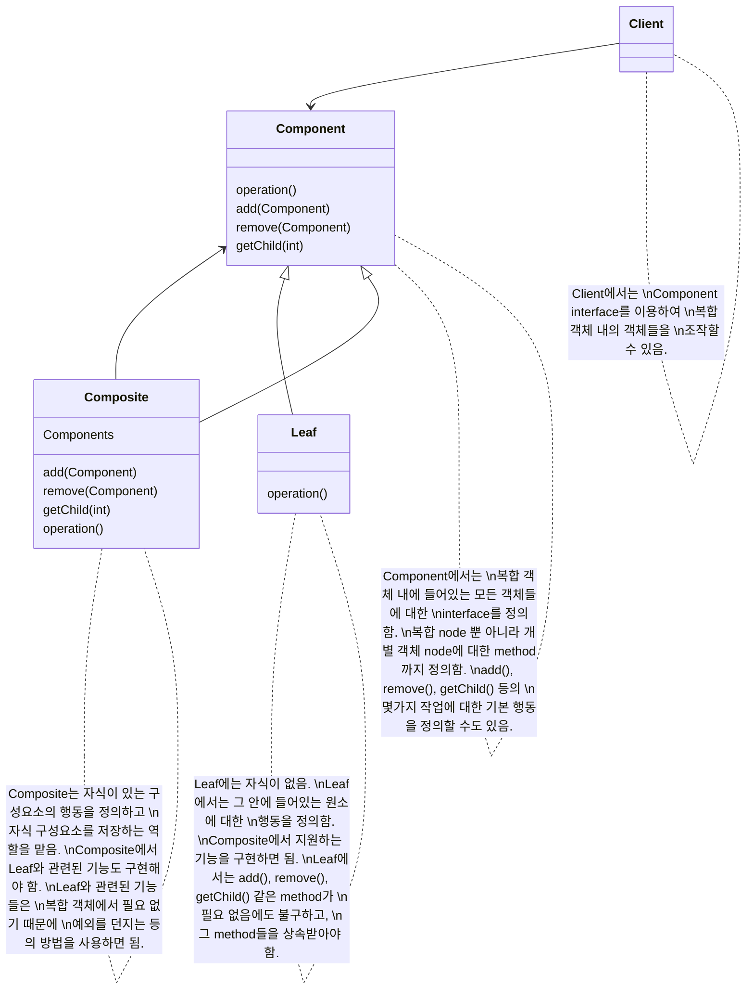
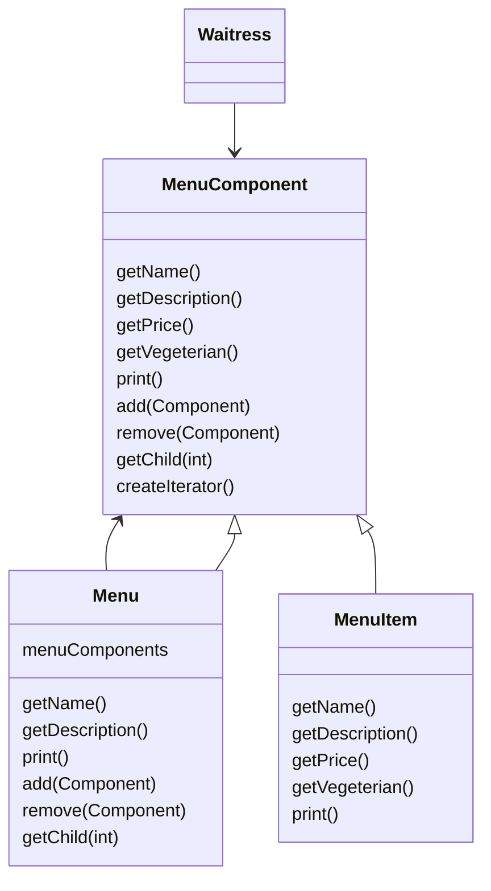

# Composite Pattern

```
Composite Pattern을 이용하면 객체들을 Tree 구조로 구현하여 부분과 전체를 나타내는 계층구조로 만들 수 있습니다.
이 pattern을 이용하면 client에서 개별 객체와 다른 객체들로 구성된 복합 객체(composite)를 똑같은 방법으로 다룰 수 있습니다.
```

- client에서 개별 객체와 복합 객체를 똑같은 방법으로 다룰 수 있음
    - 대부분의 경우에 복합 객체와 개별 객체를 구분할 필요가 없어짐

- 복합 객체에서 자식을 특별한 순서에 맞게 저장해야할 때
    - 자식을 추가하거나 제거할 때 더 복잡한 관리 방법을 사용해야 함
        - ex) stack & queue
    - 계층 구조를 돌아다닐 때 더 많은 주의를 기울여야 함


## 투명성(Transparency) 확보

- 단일 역할 원칙을 어기고 투명성을 확보함
    - Component interface에 자식들을 관리하기 위한 기능과 개별 객체으로써의 기능을 전부 집어넣음으로써 client에서 복합 객체와 개별 객체 를 똑같은 방식으로 처리할 수 있도록 함
        - client가 보기에 투명하게 작동하기 위해 복합 객체 내에 있는 모든 객체들의 interface가 같아야 함
        - 어떤 원소가 복합 객체인지 개별 객체 인지가 client 입장에서는 투명하게 느끼게 됨

- 안전성은 떨어짐
    - Component class에 두 종류의 기능이 모두 들어있기 때문
        - interface를 통일시켰기 때문에 객체에 따라 아무 의미 없는 method가 생기게 됨
            - 이 method를 사용하여 client에서 어떤 원소에 대해 무의미하거나 부적절한 작업을 처리하려고 할 수도 있음
            - 이런 method들에 대해서는 아무 일도 하지 않게 하거나, null 또는 false를 상황에 맞게 return하도록 하면 됨
                - 예외를 던질 수도 있는데, 그렇다면 client에서는 해당 예외에 대해 처리 준비가 되어 있어야 함
    - design 상의 결정 사항
        - 상황을 분석하여 투명성과 안정성 사이의 적절한 평형점을 찾아야 함


## Composite Pattern의 구성

| Object | Name | Description |
| - | - | - |
| Component | 구성 요소 | Component는 Composite와 Leaf로 나뉨 |
| Composite | 복합 객체 | 다른 Component를 포함하고 있는 Component |
| Leaf | 개별 객체 (잎 객체) | 다른 Component를 포함하지 않는 Component |


## Composite Pattern의 구조

1. Part-Whole Hierarchy 구조
    - 부분-전체 계층 구조
    - 복합 객체와 개별 객체를 같은 구조에 집어넣을 수 있음
        - 복합 객체 : group
        - 개별 객체 : group item
    - 중첩되어 있는 group과 group item을 똑같은 구조 내에서 처리함
        - group item은 또 다시 group이 될 수 있음

2. 재귀적 구조
    ```
    복합 객체
        개별 객체
        복합 객체
            개별 객체
            복합 객체
                ...
    ```
    - 재귀적 구조이기 때문에 method 하나만 호출해서 전체 구조에 대해 반복하여 작업을 처리할 수 있는 경우가 많음

3. Tree 구조
    ```mermaid
    classDiagram

    class Root
    class Leaf1
    class Leaf2
    class Leaf3
    class Leaf4
    class Leaf5
    class Branch1
    class Branch2

    Root -- Leaf1
    Root -- Branch1
    Branch1 -- Branch2
    Branch1 -- Leaf2
    Branch1 -- Leaf3
    Branch2 -- Leaf4
    Branch2 -- Leaf5
    ```


## Class Diagram




---


# Example : 복잡한 Menu

- menu 안에 menu를 넣어야 하는 상황
    - menu, sub menu, menu item 등을 모두 집어넣을 수 있는 tree 구조가 필요함
    - 각 menu에 있는 모든 항목에 대해서 돌아가면서 어떤 작업을 할 수 있는 작업을 제공해야 함
        - 반복되는 작업은 iterator 정도로 편리해야 함
    - 더 유연한 방법으로 item에 대해서 반복작업을 수행할 수 있어야 함
        - ex) 식당 menu에 껴있는 dessert menu에 대해서만 반복 작업을 한다거나, (dessert sub menu를 포함한) 식당 menu 전체에 대해서 반복 작업을 하는 것도 가능해야 함

- 모든 구성 요소에서는 MenuComponent interface를 구현해야만 함
    - 하지만 leaf(개별 객체)와 node(복합 객체)는 각각 역할이 다르기 때문에 모든 method에 대해서 각 역할에 알맞는 기본 method를 구현하는 것은 불가능함
        - 그래서 자기 역할에 맞지 않는 상황을 기준으로 예외를 던지도록 함

- 복합 객체(Menu)의 print() method에서는 재귀적인 방법으로 줄줄이 정보를 출력하도록 함
    - 각 구성 요소에서 자기 자신의 정보를 출력하는 방법을 알고 있기 때문에 쉽게 구현 가능함

- Composite Pattern 내에서 Iterator Pattern을 활용하여 채식주의자용 menu item만 출력하는 기능을 만듬
    - 이 기능은 Menu에만 필요하고 MenuItem에는 필요 없음
        - Menu의 createIterator()을 구현하는 법
            1. null을 return
            2. hasNext()가 호출되었을 때 무조건 false를 return하는 반복자를 return


## Class Diagram




## Code

### Test code

```java
public class MenuTestDrive {
    public static void main(String args[]) {
        
        MenuComponent pancakeHouseMenu = 
            new Menu("PANCAKE HOUSE MENU", "Breakfast");
        MenuComponent dinerMenu = 
            new Menu("DINER MENU", "Lunch");
        MenuComponent cafeMenu = 
            new Menu("CAFE MENU", "Dinner");
        MenuComponent dessertMenu = 
            new Menu("DESSERT MENU", "Dessert of course!");
  
        MenuComponent allMenus = new Menu("ALL MENUS", "All menus combined");
  
        allMenus.add(pancakeHouseMenu);
        allMenus.add(dinerMenu);
        allMenus.add(cafeMenu);
  
        pancakeHouseMenu.add(new MenuItem(
            "K&B's Pancake Breakfast", 
            "Pancakes with scrambled eggs and toast", 
            true,
            2.99));
        pancakeHouseMenu.add(new MenuItem(
            "Regular Pancake Breakfast", 
            "Pancakes with fried eggs, sausage", 
            false,
            2.99));
        pancakeHouseMenu.add(new MenuItem(
            "Blueberry Pancakes",
            "Pancakes made with fresh blueberries and blueberry syrup",
            true,
            3.49));
        pancakeHouseMenu.add(new MenuItem(
            "Waffles",
            "Waffles with your choice of blueberries or strawberries",
            true,
            3.59));

        dinerMenu.add(new MenuItem(
            "Vegetarian BLT",
            "(Fakin') Bacon with lettuce & tomato on whole wheat", 
            true, 
            2.99));
        dinerMenu.add(new MenuItem(
            "BLT",
            "Bacon with lettuce & tomato on whole wheat", 
            false, 
            2.99));
        dinerMenu.add(new MenuItem(
            "Soup of the day",
            "A bowl of the soup of the day, with a side of potato salad", 
            false, 
            3.29));
        dinerMenu.add(new MenuItem(
            "Hot Dog",
            "A hot dog, with saurkraut, relish, onions, topped with cheese",
            false, 
            3.05));
        dinerMenu.add(new MenuItem(
            "Steamed Veggies and Brown Rice",
            "A medly of steamed vegetables over brown rice", 
            true, 
            3.99));
 
        dinerMenu.add(new MenuItem(
            "Pasta",
            "Spaghetti with marinara sauce, and a slice of sourdough bread",
            true, 
            3.89));
   
        dinerMenu.add(dessertMenu);
  
        dessertMenu.add(new MenuItem(
            "Apple Pie",
            "Apple pie with a flakey crust, topped with vanilla icecream",
            true,
            1.59));
        dessertMenu.add(new MenuItem(
            "Cheesecake",
            "Creamy New York cheesecake, with a chocolate graham crust",
            true,
            1.99));
        dessertMenu.add(new MenuItem(
            "Sorbet",
            "A scoop of raspberry and a scoop of lime",
            true,
            1.89));

        cafeMenu.add(new MenuItem(
            "Veggie Burger and Air Fries",
            "Veggie burger on a whole wheat bun, lettuce, tomato, and fries",
            true, 
            3.99));
        cafeMenu.add(new MenuItem(
            "Soup of the day",
            "A cup of the soup of the day, with a side salad",
            false, 
            3.69));
        cafeMenu.add(new MenuItem(
            "Burrito",
            "A large burrito, with whole pinto beans, salsa, guacamole",
            true, 
            4.29));
 
        Waitress waitress = new Waitress(allMenus);
   
        waitress.printVegetarianMenu();
        //waitress.printMenu();
 
    }
}
```

### Client : Waitress

```java
import java.util.Iterator;
  
public class Waitress {
    MenuComponent allMenus;
 
    public Waitress(MenuComponent allMenus) {
        this.allMenus = allMenus;
    }
 
    public void printMenu() {
        allMenus.print();
    }
  
    public void printVegetarianMenu() {
        Iterator<MenuComponent> iterator = allMenus.createIterator();

        System.out.println("\nVEGETARIAN MENU\n----");
        while (iterator.hasNext()) {
            MenuComponent menuComponent = iterator.next();
            try {
                if (menuComponent.isVegetarian()) {
                    menuComponent.print();
                }
            } catch (UnsupportedOperationException e) {}
        }
    }
}
```

### Component : MenuComponent

```java
import java.util.*;

public abstract class MenuComponent {
   
    public void add(MenuComponent menuComponent) {
        throw new UnsupportedOperationException();
    }
    public void remove(MenuComponent menuComponent) {
        throw new UnsupportedOperationException();
    }
    public MenuComponent getChild(int i) {
        throw new UnsupportedOperationException();
    }
  
    public String getName() {
        throw new UnsupportedOperationException();
    }
    public String getDescription() {
        throw new UnsupportedOperationException();
    }
    public double getPrice() {
        throw new UnsupportedOperationException();
    }
    public boolean isVegetarian() {
        throw new UnsupportedOperationException();
    }

    public abstract Iterator<MenuComponent> createIterator();
 
    public void print() {
        throw new UnsupportedOperationException();
    }
}
```

### Compsite : Menu

```java
import java.util.Iterator;
import java.util.ArrayList;

public class Menu extends MenuComponent {
    Iterator<MenuComponent> iterator = null;
    ArrayList<MenuComponent> menuComponents = new ArrayList<MenuComponent>();
    String name;
    String description;
  
    public Menu(String name, String description) {
        this.name = name;
        this.description = description;
    }
 
    public void add(MenuComponent menuComponent) {
        menuComponents.add(menuComponent);
    }
 
    public void remove(MenuComponent menuComponent) {
        menuComponents.remove(menuComponent);
    }
 
    public MenuComponent getChild(int i) {
        return menuComponents.get(i);
    }
 
    public String getName() {
        return name;
    }
 
    public String getDescription() {
        return description;
    }

  
    public Iterator<MenuComponent> createIterator() {
        if (iterator == null) {
            iterator = new CompositeIterator(menuComponents.iterator());
        }
        return iterator;
    }
 
 
    public void print() {
        System.out.print("\n" + getName());
        System.out.println(", " + getDescription());
        System.out.println("---------------------");
  
        Iterator<MenuComponent> iterator = menuComponents.iterator();
        while (iterator.hasNext()) {
            MenuComponent menuComponent = iterator.next();
            menuComponent.print();
        }
    }
}
```

### Leaf : MenuItem

```java
import java.util.Iterator;

public class MenuItem extends MenuComponent {
 
    String name;
    String description;
    boolean vegetarian;
    double price;
    
    public MenuItem(String name, 
                    String description, 
                    boolean vegetarian, 
                    double price) 
    { 
        this.name = name;
        this.description = description;
        this.vegetarian = vegetarian;
        this.price = price;
    }
  
    public String getName() {
        return name;
    }
  
    public String getDescription() {
        return description;
    }
  
    public double getPrice() {
        return price;
    }
  
    public boolean isVegetarian() {
        return vegetarian;
    }

    public Iterator<MenuComponent> createIterator() {
        return new NullIterator();
    }
 
    public void print() {
        System.out.print("  " + getName());
        if (isVegetarian()) {
            System.out.print("(v)");
        }
        System.out.println(", " + getPrice());
        System.out.println("     -- " + getDescription());
    }

}
```

### Iterator

```java
import java.util.*;
  
public class CompositeIterator implements Iterator<MenuComponent> {
    Stack<Iterator<MenuComponent>> stack = new Stack<Iterator<MenuComponent>>();
   
    public CompositeIterator(Iterator<MenuComponent> iterator) {
        stack.push(iterator);
    }
   
    public MenuComponent next() {
        if (hasNext()) {
            Iterator<MenuComponent> iterator = stack.peek();
            MenuComponent component = iterator.next();
            stack.push(component.createIterator());
            return component;
        } else {
            return null;
        }
    }
  
    public boolean hasNext() {
        if (stack.empty()) {
            return false;
        } else {
            Iterator<MenuComponent> iterator = stack.peek();
            if (!iterator.hasNext()) {
                stack.pop();
                return hasNext();
            } else {
                return true;
            }
        }
    }
    
    /*
     * No longer needed as of Java 8
     * 
     * (non-Javadoc)
     * @see java.util.Iterator#remove()
     *
    public void remove() {
        throw new UnsupportedOperationException();
    }
    */
}
```

```java
import java.util.Iterator;
  
public class NullIterator implements Iterator<MenuComponent> {
   
    public MenuComponent next() {
        return null;
    }
  
    public boolean hasNext() {
        return false;
    }
   
    /*
     * No longer needed as of Java 8
     * 
     * (non-Javadoc)
     * @see java.util.Iterator#remove()
     * 
    public void remove() {
        throw new UnsupportedOperationException();
    }
    */
}
```


---


## Reference

- Head First Design Patterns - Eric Freeman, Elisabeth Robson, Bert Bates, Kathy Sierra
