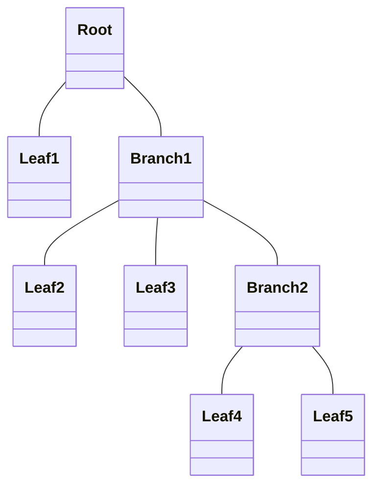
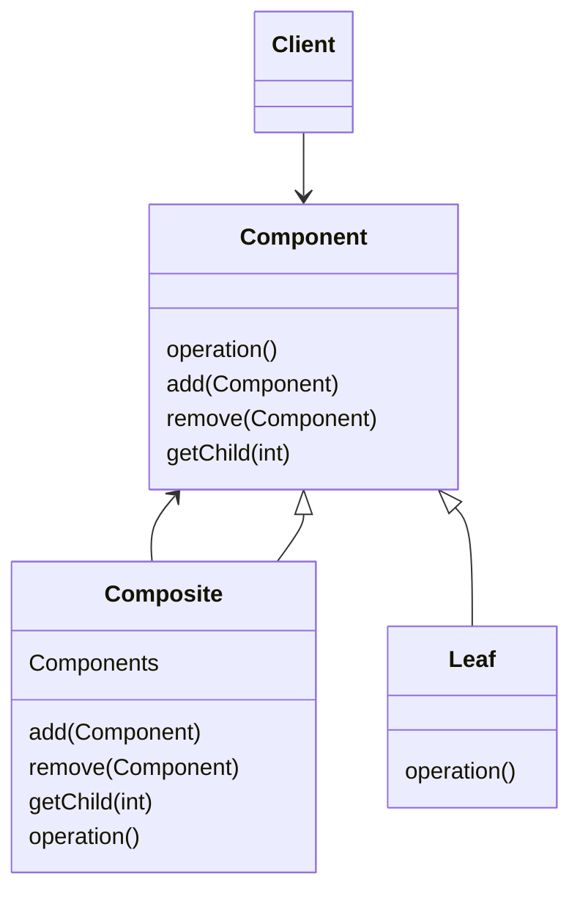
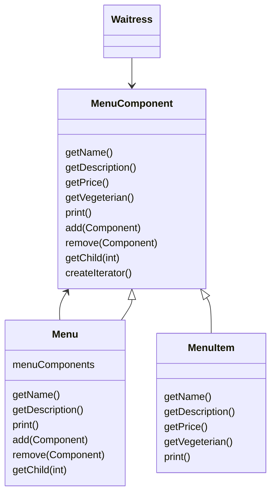

## Composite Pattern : 개별 객체와 복합 객체를 동일하게 처리하기

- Composite Pattern을 이용하면 **객체들을 tree 구조로 구성**하여 부분과 전체를 나타내는 계층 구조로 만들 수 있습니다.
    - client에서 개별 객체와 다른 객체들로 구성된 복합 객체(composite)를 똑같은 방법으로 다룹니다.
    - 대부분의 경우에 복합 객체와 개별 객체를 구분할 필요가 없어집니다.

- 복합 객체에서 자식을 특별한 순서에 맞게 저장해야 할 때는 주의가 필요합니다.
    - 자식을 추가하거나 제거할 때 더 복잡한 관리 방법을 사용해야 합니다.
    - 계층 구조를 돌아다닐 때 더 많은 주의를 기울여야 합니다.


### 투명성(Transparency) 확보

- Composite Pattern은 **단일 책임 원칙을 어기고 투명성을 확보**합니다.
    - `Component` interface에 자식들을 관리하기 위한 기능과 개별 객체로써의 기능을 전부 집어넣습니다.
    - client에서 복합 객체와 개별 객체를 똑같은 방식으로 처리할 수 있도록 합니다.
    - 어떤 원소가 복합 객체인지 개별 객체인지가 client 입장에서는 투명하게 느껴집니다.

#### 투명성과 안전성의 Trade-off

- 투명성을 확보하면 **안전성은 떨어집니다.**
    - `Component` class에 두 종류의 기능이 모두 들어있기 때문입니다.
    - interface를 통일시켰기 때문에 객체에 따라 아무 의미 없는 method가 생기게 됩니다.
    - client에서 어떤 원소에 대해 무의미하거나 부적절한 작업을 처리하려고 할 수도 있습니다.

- 지원하지 않는 method는 기본 동작을 정의하거나 예외를 던집니다.
    - 아무 일도 하지 않게 하거나, `null` 또는 `false`를 상황에 맞게 return합니다.
    - 예외를 던질 수도 있는데, 그렇다면 client에서는 해당 예외에 대해 처리 준비가 되어 있어야 합니다.

- design 상의 결정 사항으로, 상황을 분석하여 투명성과 안전성 사이의 적절한 평형점을 찾아야 합니다.


### Composite Pattern의 구성

- Composite Pattern은 **`Component`, `Composite`, `Leaf`**로 구성됩니다.
    - `Component`는 `Composite`와 `Leaf`의 공통 interface입니다.
    - `Composite`는 다른 `Component`를 포함하는 복합 객체입니다.
    - `Leaf`는 다른 `Component`를 포함하지 않는 개별 객체입니다.


---


## Composite Pattern의 구조

- Composite Pattern은 **부분-전체 계층 구조, 재귀적 구조, tree 구조**로 표현됩니다.


### Part-Whole Hierarchy 구조

- **부분-전체 계층 구조**입니다.
    - 복합 객체와 개별 객체를 같은 구조에 집어넣을 수 있습니다.
    - 복합 객체는 group, 개별 객체는 group item입니다.
    - 중첩되어 있는 group과 group item을 똑같은 구조 내에서 처리합니다.
    - group item은 또 다시 group이 될 수 있습니다.


### 재귀적 구조

- **재귀적 구조**이기 때문에 method 하나만 호출해서 전체 구조에 대해 반복하여 작업을 처리할 수 있는 경우가 많습니다.

```
복합 객체
    개별 객체
    복합 객체
        개별 객체
        복합 객체
            ...
```


### Tree 구조

- Composite Pattern은 root에서 시작하여 branch와 leaf로 뻗어나가는 tree 구조입니다.




---


## Class Diagram

- client에서는 `Component` interface를 이용하여 복합 객체 내의 객체들을 조작할 수 있습니다.

- `Component`에서는 복합 객체 내에 들어있는 모든 객체들에 대한 interface를 정의합니다.
    - 복합 node 뿐 아니라 개별 객체 node에 대한 method까지 정의합니다.
    - `add()`, `remove()`, `getChild()` 등의 몇가지 작업에 대한 기본 행동을 정의할 수도 있습니다.

- `Composite`는 자식이 있는 구성 요소의 행동을 정의하고 자식 구성 요소를 저장하는 역할을 맡습니다.
    - `Composite`에서 `Leaf`와 관련된 기능도 구현해야 합니다.
    - `Leaf`와 관련된 기능들은 복합 객체에서 필요 없기 때문에 예외를 던지는 등의 방법을 사용하면 됩니다.

- `Leaf`에는 자식이 없습니다.
    - `Leaf`에서는 그 안에 들어있는 원소에 대한 행동을 정의합니다.
    - `Composite`에서 지원하는 기능을 구현하면 됩니다.
    - `Leaf`에서는 `add()`, `remove()`, `getChild()` 같은 method가 필요 없음에도 불구하고 그 method들을 상속받아야 합니다.




---


## Example : 복잡한 Menu

- menu 안에 menu를 넣어야 하는 상황입니다.
    - menu, sub menu, menu item 등을 모두 집어넣을 수 있는 tree 구조가 필요합니다.
    - 각 menu에 있는 모든 항목에 대해서 돌아가면서 어떤 작업을 할 수 있는 방법을 제공해야 합니다.
    - 더 유연한 방법으로 item에 대해서 반복 작업을 수행할 수 있어야 합니다.

- 모든 구성 요소에서는 `MenuComponent` interface를 구현해야만 합니다.
    - 하지만 leaf(개별 객체)와 node(복합 객체)는 각각 역할이 다르기 때문에 모든 method에 대해서 각 역할에 알맞는 기본 method를 구현하는 것은 불가능합니다.
    - 그래서 자기 역할에 맞지 않는 상황을 기준으로 예외를 던지도록 합니다.

- 복합 객체(`Menu`)의 `print()` method에서는 재귀적인 방법으로 줄줄이 정보를 출력하도록 합니다.
    - 각 구성 요소에서 자기 자신의 정보를 출력하는 방법을 알고 있기 때문에 쉽게 구현 가능합니다.

- Composite Pattern 내에서 Iterator Pattern을 활용하여 채식주의자용 menu item만 출력하는 기능을 만듭니다.
    - 이 기능은 `Menu`에만 필요하고 `MenuItem`에는 필요 없습니다.
    - `Menu`의 `createIterator()`을 구현하는 방법은 두 가지입니다.
        - `null`을 return합니다.
        - `hasNext()`가 호출되었을 때 무조건 `false`를 return하는 iterator를 return합니다.


### Class Diagram

- `Waitress`는 `MenuComponent`를 통해 전체 menu를 조작합니다.




### Test Code

- `Menu`와 `MenuItem`을 조합하여 복합 menu 구조를 생성하고 검증합니다.

```java
public class MenuTestDrive {
    public static void main(String args[]) {

        MenuComponent pancakeHouseMenu =
            new Menu("PANCAKE HOUSE MENU", "Breakfast");
        MenuComponent dinerMenu =
            new Menu("DINER MENU", "Lunch");
        MenuComponent cafeMenu =
            new Menu("CAFE MENU", "Dinner");
        MenuComponent dessertMenu =
            new Menu("DESSERT MENU", "Dessert of course!");

        MenuComponent allMenus = new Menu("ALL MENUS", "All menus combined");

        allMenus.add(pancakeHouseMenu);
        allMenus.add(dinerMenu);
        allMenus.add(cafeMenu);

        pancakeHouseMenu.add(new MenuItem(
            "K&B's Pancake Breakfast",
            "Pancakes with scrambled eggs and toast",
            true,
            2.99));
        pancakeHouseMenu.add(new MenuItem(
            "Regular Pancake Breakfast",
            "Pancakes with fried eggs, sausage",
            false,
            2.99));
        pancakeHouseMenu.add(new MenuItem(
            "Blueberry Pancakes",
            "Pancakes made with fresh blueberries and blueberry syrup",
            true,
            3.49));
        pancakeHouseMenu.add(new MenuItem(
            "Waffles",
            "Waffles with your choice of blueberries or strawberries",
            true,
            3.59));

        dinerMenu.add(new MenuItem(
            "Vegetarian BLT",
            "(Fakin') Bacon with lettuce & tomato on whole wheat",
            true,
            2.99));
        dinerMenu.add(new MenuItem(
            "BLT",
            "Bacon with lettuce & tomato on whole wheat",
            false,
            2.99));
        dinerMenu.add(new MenuItem(
            "Soup of the day",
            "A bowl of the soup of the day, with a side of potato salad",
            false,
            3.29));
        dinerMenu.add(new MenuItem(
            "Hot Dog",
            "A hot dog, with saurkraut, relish, onions, topped with cheese",
            false,
            3.05));
        dinerMenu.add(new MenuItem(
            "Steamed Veggies and Brown Rice",
            "A medly of steamed vegetables over brown rice",
            true,
            3.99));

        dinerMenu.add(new MenuItem(
            "Pasta",
            "Spaghetti with marinara sauce, and a slice of sourdough bread",
            true,
            3.89));

        dinerMenu.add(dessertMenu);

        dessertMenu.add(new MenuItem(
            "Apple Pie",
            "Apple pie with a flakey crust, topped with vanilla icecream",
            true,
            1.59));
        dessertMenu.add(new MenuItem(
            "Cheesecake",
            "Creamy New York cheesecake, with a chocolate graham crust",
            true,
            1.99));
        dessertMenu.add(new MenuItem(
            "Sorbet",
            "A scoop of raspberry and a scoop of lime",
            true,
            1.89));

        cafeMenu.add(new MenuItem(
            "Veggie Burger and Air Fries",
            "Veggie burger on a whole wheat bun, lettuce, tomato, and fries",
            true,
            3.99));
        cafeMenu.add(new MenuItem(
            "Soup of the day",
            "A cup of the soup of the day, with a side salad",
            false,
            3.69));
        cafeMenu.add(new MenuItem(
            "Burrito",
            "A large burrito, with whole pinto beans, salsa, guacamole",
            true,
            4.29));

        Waitress waitress = new Waitress(allMenus);

        waitress.printVegetarianMenu();
        //waitress.printMenu();

    }
}
```


### Client : Waitress

- `Waitress`는 `MenuComponent`를 받아 menu를 출력하거나, iterator를 사용하여 채식주의자용 menu만 filtering합니다.

```java
import java.util.Iterator;

public class Waitress {
    MenuComponent allMenus;

    public Waitress(MenuComponent allMenus) {
        this.allMenus = allMenus;
    }

    public void printMenu() {
        allMenus.print();
    }

    public void printVegetarianMenu() {
        Iterator<MenuComponent> iterator = allMenus.createIterator();

        System.out.println("\nVEGETARIAN MENU\n----");
        while (iterator.hasNext()) {
            MenuComponent menuComponent = iterator.next();
            try {
                if (menuComponent.isVegetarian()) {
                    menuComponent.print();
                }
            } catch (UnsupportedOperationException e) {}
        }
    }
}
```


### Component : MenuComponent

- `MenuComponent`는 `Menu`와 `MenuItem`의 공통 abstract class로, 지원하지 않는 method는 `UnsupportedOperationException`을 던집니다.

```java
import java.util.*;

public abstract class MenuComponent {

    public void add(MenuComponent menuComponent) {
        throw new UnsupportedOperationException();
    }
    public void remove(MenuComponent menuComponent) {
        throw new UnsupportedOperationException();
    }
    public MenuComponent getChild(int i) {
        throw new UnsupportedOperationException();
    }

    public String getName() {
        throw new UnsupportedOperationException();
    }
    public String getDescription() {
        throw new UnsupportedOperationException();
    }
    public double getPrice() {
        throw new UnsupportedOperationException();
    }
    public boolean isVegetarian() {
        throw new UnsupportedOperationException();
    }

    public abstract Iterator<MenuComponent> createIterator();

    public void print() {
        throw new UnsupportedOperationException();
    }
}
```


### Composite : Menu

- `Menu`는 `ArrayList`로 자식 `MenuComponent`를 관리하며, `print()` 호출 시 재귀적으로 모든 자식을 출력합니다.

```java
import java.util.Iterator;
import java.util.ArrayList;

public class Menu extends MenuComponent {
    Iterator<MenuComponent> iterator = null;
    ArrayList<MenuComponent> menuComponents = new ArrayList<MenuComponent>();
    String name;
    String description;

    public Menu(String name, String description) {
        this.name = name;
        this.description = description;
    }

    public void add(MenuComponent menuComponent) {
        menuComponents.add(menuComponent);
    }

    public void remove(MenuComponent menuComponent) {
        menuComponents.remove(menuComponent);
    }

    public MenuComponent getChild(int i) {
        return menuComponents.get(i);
    }

    public String getName() {
        return name;
    }

    public String getDescription() {
        return description;
    }


    public Iterator<MenuComponent> createIterator() {
        if (iterator == null) {
            iterator = new CompositeIterator(menuComponents.iterator());
        }
        return iterator;
    }


    public void print() {
        System.out.print("\n" + getName());
        System.out.println(", " + getDescription());
        System.out.println("---------------------");

        Iterator<MenuComponent> iterator = menuComponents.iterator();
        while (iterator.hasNext()) {
            MenuComponent menuComponent = iterator.next();
            menuComponent.print();
        }
    }
}
```


### Leaf : MenuItem

- `MenuItem`은 이름, 설명, 가격, 채식 여부를 가지는 개별 menu 항목으로, 자식을 가지지 않습니다.

```java
import java.util.Iterator;

public class MenuItem extends MenuComponent {

    String name;
    String description;
    boolean vegetarian;
    double price;

    public MenuItem(String name,
                    String description,
                    boolean vegetarian,
                    double price)
    {
        this.name = name;
        this.description = description;
        this.vegetarian = vegetarian;
        this.price = price;
    }

    public String getName() {
        return name;
    }

    public String getDescription() {
        return description;
    }

    public double getPrice() {
        return price;
    }

    public boolean isVegetarian() {
        return vegetarian;
    }

    public Iterator<MenuComponent> createIterator() {
        return new NullIterator();
    }

    public void print() {
        System.out.print("  " + getName());
        if (isVegetarian()) {
            System.out.print("(v)");
        }
        System.out.println(", " + getPrice());
        System.out.println("     -- " + getDescription());
    }

}
```


### Iterator

- `CompositeIterator`는 복합 구조를 순회하고, `NullIterator`는 leaf node에서 빈 iterator를 반환합니다.

```java
import java.util.*;

public class CompositeIterator implements Iterator<MenuComponent> {
    Stack<Iterator<MenuComponent>> stack = new Stack<Iterator<MenuComponent>>();

    public CompositeIterator(Iterator<MenuComponent> iterator) {
        stack.push(iterator);
    }

    public MenuComponent next() {
        if (hasNext()) {
            Iterator<MenuComponent> iterator = stack.peek();
            MenuComponent component = iterator.next();
            stack.push(component.createIterator());
            return component;
        } else {
            return null;
        }
    }

    public boolean hasNext() {
        if (stack.empty()) {
            return false;
        } else {
            Iterator<MenuComponent> iterator = stack.peek();
            if (!iterator.hasNext()) {
                stack.pop();
                return hasNext();
            } else {
                return true;
            }
        }
    }
}
```

```java
import java.util.Iterator;

public class NullIterator implements Iterator<MenuComponent> {

    public MenuComponent next() {
        return null;
    }

    public boolean hasNext() {
        return false;
    }
}
```


---


## Reference

- Head First Design Patterns - Eric Freeman, Elisabeth Robson, Bert Bates, Kathy Sierra

