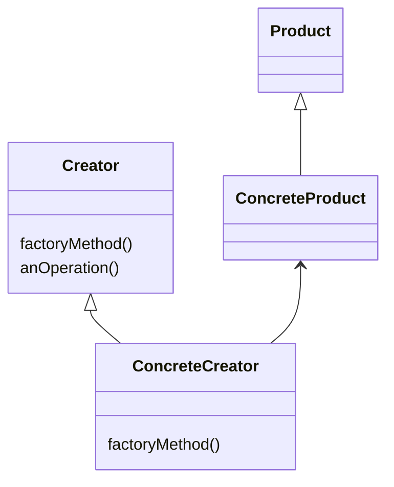
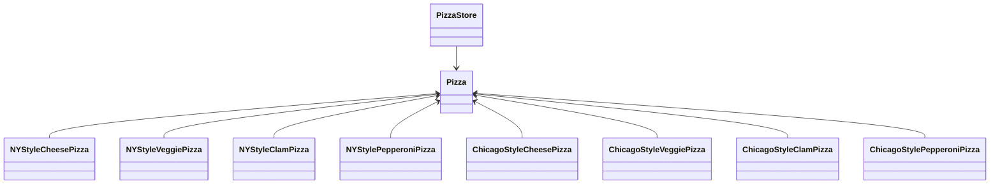
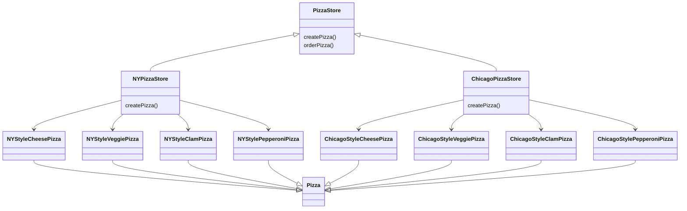
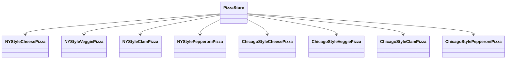

## Factory Method Pattern

- **concrete 형식의 instance 생성 작업을 캡슐화(encapsulation)**할 수 있습니다.
    - client 입장에서는 '객체 instance를 만들 때 필요한 concrete class'가 아닌 'interface'만 필요로 하게 됩니다.
    - **구현이 아닌 interface를 바탕으로 programming**을 할 수 있습니다.
    - **유연성과 확장성**이 향상됩니다.

- **상속을 활용**하여 객체 생성을 처리합니다.
    - 객체 생성이 subclass에게 위임됩니다.
    - subclass에서는 factory method를 구현하여 객체를 생산합니다.

- **상속(inheritance)을 통해서** 객체를 만드는 방식입니다.
    - subclass를 통해서 객체를 생성합니다.

- **client와 concrete 형식을 분리**시킵니다.
    - client에서는 자신이 사용할 추상 형식만 알면 되고, concrete 형식은 subclass에서 처리합니다.

- **'client code'와 'instance를 만들어야 할 concrete class'를 분리**시켜야 할 때 활용합니다.
    - 어떤 concrete class가 필요할지 미리 알 수 없는 경우에도 유용합니다.
    - subclass를 만들고 factory method를 구현하기만 하면 되기 때문입니다.



- **`Creator`** : 제품을 가지고 원하는 일을 하기 위한 모든 method들이 구현되어 있습니다.
    - 하지만 제품을 만들어 주는 factory method는 추상 method로 정의되어 있을 뿐 구현되어 있지는 않습니다.
    - `Creator`의 모든 subclass에서는 `factoryMethod()` 추상 method를 구현해야 합니다.

- **`ConcreteCreator`** : 실제로 제품을 생산하는 `factoryMethod()`를 구현해야 합니다.
    - concrete class instance를 만들어내는 일은 `ConcreteCreator`가 책임집니다.
    - **실제 제품을 만들어내는 방법을 알고 있는 class**는 `ConcreteCreator`뿐입니다.

- **`Product`, `ConcreteProduct`** : 제품 class에서는 모두 똑같은 interface를 구현해야 합니다.
    - 그래야 그 제품을 사용할 class에서 concrete class가 아닌 interface에 대한 reference를 써서 객체를 참조할 수 있습니다.


### Factory Method : 객체 생성을 캡슐화하는 추상 Method

- **factory method는 객체 생성을 처리**합니다.

- factory method를 이용하면 **객체를 생성하는 작업을 subclass에 캡슐화(encapsulation)**시킬 수 있습니다.
    - superclass에 있는 client code와 subclass에 있는 객체 생성 code를 분리시킬 수 있습니다.

```java
abstract Product factoryMethod(String type)
```

- **`abstract`** : factory method는 추상 method로 선언하여 subclass에서 객체 생성을 책임지도록 합니다.

- **`Product`** : factory method에서는 특정 제품(객체)를 return하면, 그 객체는 보통 superclass에서 정의한 method 내에서 쓰이게 됩니다.

- **`factoryMethod()`** : factory method는 client(superclass에 있는 공통 code)에서 실제로 생성되는 concrete 객체가 무엇인지 알 수 없게 만드는 역할을 합니다.

- **`String type`** : factory method를 만들 때 매개 변수를 써서 만들어낼 객체 종류를 선택할 수 있습니다.


### Simple Factory vs Factory Method Pattern

- simple factory와 factory method pattern은 **concrete class의 instance를 만들 때 차이**가 있습니다.
    - **simple factory** : 한 객체에서 전부 처리합니다.
    - **factory method pattern** : 일련의 subclass에서 처리합니다.

- **factory method pattern을 사용하면 simple factory의 문제를 해결**할 수 있습니다.
    - simple factory에서 만든 객체를 사용하긴 하나, method를 마음대로 바꿔서 사용할 수 있었습니다.
    - **일련의 method들을 사용하는 과정을 하나로 묶어줄 필요**가 있습니다.
    - factory method pattern은 **유연성을 잃지 않으면서 과정을 강제하기 위한 framework**입니다.


---


## Pizza 가게 예제를 통한 Factory Method Pattern 구현

- **simple factory로 구현된 pizza 가게를 factory method pattern으로 변경**합니다.



- **고수준 구성 요소인 PizzaStore와 저수준 구성 요소인 pizza 객체들이 모두 추상 class인 Pizza에 의존**하게 됩니다.
    - 다양한 concrete pizza 형식이 추상화된 Pizza에 의존하게 됩니다.
    - 마찬가지로 pizza 가게도 추상화된 Pizza에 의존하게 됩니다.
    - **의존성 역전 원칙(Dependency Inversion Principle)을 준수**하게 됩니다.

- **의존성 역전 원칙**의 핵심 내용은 고수준 구성 요소와 저수준 구성 요소가 모두 추상화된 것에 의존해야 한다는 것입니다.
    - 고수준 구성 요소는 저수준 구성 요소에 의존해서는 안 됩니다.
    - 고수준 구성 요소와 저수준 구성 요소 모두 추상화된 것에 의존하게 되면, 고수준 구성 요소는 저수준 구성 요소의 구체적인 형식(concrete class)에 의존하지 않게 됩니다.

- **factory method pattern은 의존성 역전 원칙을 준수하기 위해 사용할 수 있는 방법**입니다.
    - factory를 사용하지 않았을 때는 pizza 가게가 pizza에 의존했지만, factory를 사용하고 나서는 그 의존성이 뒤집힙니다.



- **`createPizza()` method를 `PizzaStore` class에 다시 집어넣고, 추상 method로 선언**합니다.
    - 각 지역의 style에 맞게 `PizzaStore`의 subclass를 만들어 과정을 강제하게 됩니다.

- `PizzaStore` class의 **`orderPizza()` method는 superclass에서 구현**합니다.
    - 주문 system 자체는 모든 분점에서 똑같이 진행되어야 합니다.
    - `orderPizza()` method는 무슨 pizza를 만드는지 알지 못합니다.
    - 어떤 subclass를 사용해서 어떤 `Pizza` 객체를 사용하느냐에 따라 다릅니다.
        - **어떤 subclass를 사용하는지**는 **factory에서 결정**합니다.
        - **어떤 `Pizza` 객체를 사용하는지**는 factory로 만들어진 **concrete subclass에서 결정**합니다.

- `PizzaStore` class의 **`createPizza()` method는 subclass에서 구현**합니다.
    - `createPizza()` method는 factory method입니다.
    - `Pizza` instance를 만드는 일을 하기 때문입니다.
    - 각 분점마다 달라질 수 있는 것은 pizza style뿐입니다.
    - **각각의 다른 점들을 `createPizza()` method에 집어넣어** 해당 style pizza를 만드는 것을 모두 책임지도록 합니다.
    - subclass에서 구현하기 때문에 **분점마다 다른 pizza 제조 과정을 강제**할 수 있게 됩니다.


### Main

```java
public class PizzaTestDrive {
 
    public static void main(String[] args) {
        PizzaStore nyStore = new NYPizzaStore();
        PizzaStore chicagoStore = new ChicagoPizzaStore();

        Pizza pizza = nyStore.orderPizza("cheese");
        System.out.println("We ordered a " + pizza.getName() + "\n");
        System.out.println(pizza);
 
        pizza = chicagoStore.orderPizza("veggie");
        System.out.println("We ordered a " + pizza.getName() + "\n");
        System.out.println(pizza);
    }
}
```


### PizzaStore

```java
public abstract class PizzaStore {
 
    abstract Pizza createPizza(String item);
 
    public Pizza orderPizza(String type) {
        Pizza pizza = createPizza(type);
        System.out.println("--- Making a " + pizza.getName() + " ---");
        pizza.prepare();
        pizza.bake();
        pizza.cut();
        pizza.box();
        return pizza;
    }
}
```


### PizzaStore Subclass

```java
public class NYPizzaStore extends PizzaStore {

    Pizza createPizza(String item) {
        if (item.equals("cheese")) {
            return new NYStyleCheesePizza();
        } else if (item.equals("veggie")) {
            return new NYStyleVeggiePizza();
        } else if (item.equals("clam")) {
            return new NYStyleClamPizza();
        } else if (item.equals("pepperoni")) {
            return new NYStylePepperoniPizza();
        } else return null;
    }
}
```

```java
public class ChicagoPizzaStore extends PizzaStore {

    Pizza createPizza(String item) {
        if (item.equals("cheese")) {
            return new ChicagoStyleCheesePizza();
        } else if (item.equals("veggie")) {
            return new ChicagoStyleVeggiePizza();
        } else if (item.equals("clam")) {
            return new ChicagoStyleClamPizza();
        } else if (item.equals("pepperoni")) {
            return new ChicagoStylePepperoniPizza();
        } else return null;
    }
}
```


### Pizza

```java
public abstract class Pizza {
    String name;
    String dough;
    String sauce;
    ArrayList<String> toppings = new ArrayList<String>();
 
    void prepare() {
        System.out.println("Prepare " + name);
        System.out.println("Tossing dough...");
        System.out.println("Adding sauce...");
        System.out.println("Adding toppings: ");
        for (String topping : toppings) {
            System.out.println("   " + topping);
        }
    }
  
    void bake() {
        System.out.println("Bake for 25 minutes at 350");
    }
 
    void cut() {
        System.out.println("Cut the pizza into diagonal slices");
    }
  
    void box() {
        System.out.println("Place pizza in official PizzaStore box");
    }
 
    public String getName() {
        return name;
    }

    public String toString() {
        StringBuffer display = new StringBuffer();
        display.append("---- " + name + " ----\n");
        display.append(dough + "\n");
        display.append(sauce + "\n");
        for (String topping : toppings) {
            display.append(topping + "\n");
        }
        return display.toString();
    }
}
```

### Pizza Subclass

```java
public class NYStyleCheesePizza extends Pizza {

    public NYStyleCheesePizza() { 
        name = "NY Style Sauce and Cheese Pizza";
        dough = "Thin Crust Dough";
        sauce = "Marinara Sauce";
 
        toppings.add("Grated Reggiano Cheese");
    }
}
```

```java
public class NYStylePepperoniPizza extends Pizza {

    public NYStylePepperoniPizza() {
        name = "NY Style Pepperoni Pizza";
        dough = "Thin Crust Dough";
        sauce = "Marinara Sauce";
 
        toppings.add("Grated Reggiano Cheese");
        toppings.add("Sliced Pepperoni");
        toppings.add("Garlic");
        toppings.add("Onion");
        toppings.add("Mushrooms");
        toppings.add("Red Pepper");
    }
}
```

```java
public class NYStyleClamPizza extends Pizza {

    public NYStyleClamPizza() {
        name = "NY Style Clam Pizza";
        dough = "Thin Crust Dough";
        sauce = "Marinara Sauce";
 
        toppings.add("Grated Reggiano Cheese");
        toppings.add("Fresh Clams from Long Island Sound");
    }
}
```

```java
public class NYStyleVeggiePizza extends Pizza {

    public NYStyleVeggiePizza() {
        name = "NY Style Veggie Pizza";
        dough = "Thin Crust Dough";
        sauce = "Marinara Sauce";
 
        toppings.add("Grated Reggiano Cheese");
        toppings.add("Garlic");
        toppings.add("Onion");
        toppings.add("Mushrooms");
        toppings.add("Red Pepper");
    }
}
```

```java
public class ChicagoStyleCheesePizza extends Pizza {

    public ChicagoStyleCheesePizza() { 
        name = "Chicago Style Deep Dish Cheese Pizza";
        dough = "Extra Thick Crust Dough";
        sauce = "Plum Tomato Sauce";
 
        toppings.add("Shredded Mozzarella Cheese");
    }
 
    void cut() {
        System.out.println("Cutting the pizza into square slices");
    }
}
```

```java
public class ChicagoStylePepperoniPizza extends Pizza {
    public ChicagoStylePepperoniPizza() {
        name = "Chicago Style Pepperoni Pizza";
        dough = "Extra Thick Crust Dough";
        sauce = "Plum Tomato Sauce";
 
        toppings.add("Shredded Mozzarella Cheese");
        toppings.add("Black Olives");
        toppings.add("Spinach");
        toppings.add("Eggplant");
        toppings.add("Sliced Pepperoni");
    }
 
    void cut() {
        System.out.println("Cutting the pizza into square slices");
    }
}
```

```java
public class ChicagoStyleClamPizza extends Pizza {
    public ChicagoStyleClamPizza() {
        name = "Chicago Style Clam Pizza";
        dough = "Extra Thick Crust Dough";
        sauce = "Plum Tomato Sauce";
 
        toppings.add("Shredded Mozzarella Cheese");
        toppings.add("Frozen Clams from Chesapeake Bay");
    }
 
    void cut() {
        System.out.println("Cutting the pizza into square slices");
    }
}
```

```java
public class ChicagoStyleVeggiePizza extends Pizza {
    public ChicagoStyleVeggiePizza() {
        name = "Chicago Deep Dish Veggie Pizza";
        dough = "Extra Thick Crust Dough";
        sauce = "Plum Tomato Sauce";
 
        toppings.add("Shredded Mozzarella Cheese");
        toppings.add("Black Olives");
        toppings.add("Spinach");
        toppings.add("Eggplant");
    }
 
    void cut() {
        System.out.println("Cutting the pizza into square slices");
    }
}
```


---


## No Factory Example : 심하게 의존적인 PizzaStore



- **`PizzaStore`가 pizza class 구현에 의존**합니다.

- **`PizzaStore`에서 모든 pizza 객체들을 직접 생성**해야 하므로, 모든 pizza 객체들에게 직접적으로 의존합니다.
    - pizza라는 개념을 추상화(pizza abstract class 사용)할 수 없기 때문에 의존성을 뒤집을 수 없습니다.

- **pizza class들의 구현이 변경되면 `PizzaStore`까지 고쳐야 할 수도** 있습니다.

- **다른 style이나 pizza 종류를 새로 추가하면 `PizzaStore`는 더 많은 concrete pizza 객체에 의존**하게 됩니다.
    - 의존해야 할 객체의 수가 계속 늘어납니다.

```java
public class DependentPizzaStore {
 
    public Pizza createPizza(String style, String type) {
        Pizza pizza = null;
        if (style.equals("NY")) {
            if (type.equals("cheese")) {
                pizza = new NYStyleCheesePizza();
            } else if (type.equals("veggie")) {
                pizza = new NYStyleVeggiePizza();
            } else if (type.equals("clam")) {
                pizza = new NYStyleClamPizza();
            } else if (type.equals("pepperoni")) {
                pizza = new NYStylePepperoniPizza();
            }
        } else if (style.equals("Chicago")) {
            if (type.equals("cheese")) {
                pizza = new ChicagoStyleCheesePizza();
            } else if (type.equals("veggie")) {
                pizza = new ChicagoStyleVeggiePizza();
            } else if (type.equals("clam")) {
                pizza = new ChicagoStyleClamPizza();
            } else if (type.equals("pepperoni")) {
                pizza = new ChicagoStylePepperoniPizza();
            }
        } else {
            System.out.println("Error: invalid type of pizza");
            return null;
        }
        pizza.prepare();
        pizza.bake();
        pizza.cut();
        pizza.box();
        return pizza;
    }
}
```


---


## Factory Method Pattern의 장점과 활용 지침

- **Factory Method Pattern**은 **객체 생성의 책임을 subclass로 위임**하여 유연성을 확보합니다.
    - 새로운 pizza style을 추가할 때 기존 code를 수정하지 않고 새로운 subclass만 추가하면 됩니다.
    - **개방-폐쇄 원칙(Open-Closed Principle)**을 잘 구현한 pattern입니다.

- **Template Method Pattern과의 유사성**을 보입니다.
    - `orderPizza()` method는 template method처럼 작동합니다.
    - 전체적인 과정은 고정하되, 일부 단계(`createPizza()`)만 subclass에서 구현하도록 합니다.

- **의존성 역전 원칙을 실현**하는 대표적인 방법입니다.
    - 고수준 module(`PizzaStore`)과 저수준 module(구체적인 pizza class)이 모두 추상화(pizza abstract class)에 의존합니다.
    - concrete class 간의 직접적인 의존성을 제거합니다.

- **Simple Factory와의 주요 차이점**은 유연성과 확장성에 있습니다.
    - Simple Factory는 객체 생성 logic이 한 곳에 집중되어 변경 시 해당 부분을 수정해야 합니다.
    - Factory Method Pattern은 상속을 통해 객체 생성 logic을 분산시켜 더 유연한 확장을 가능하게 합니다.


---


## Reference

- <https://refactoring.guru/design-patterns/factory-method>
- Head First Design Patterns (도서) - Eric Freeman, Elisabeth Robson, Bert Bates, Kathy Sierra
