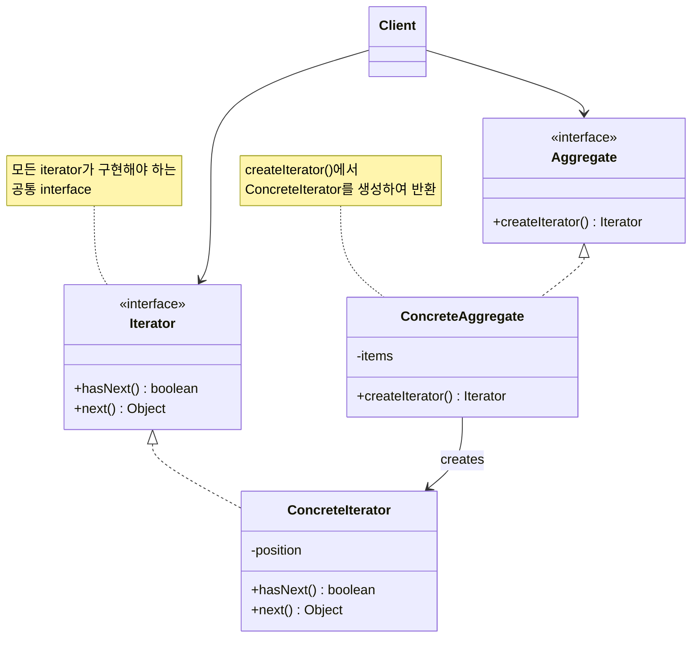
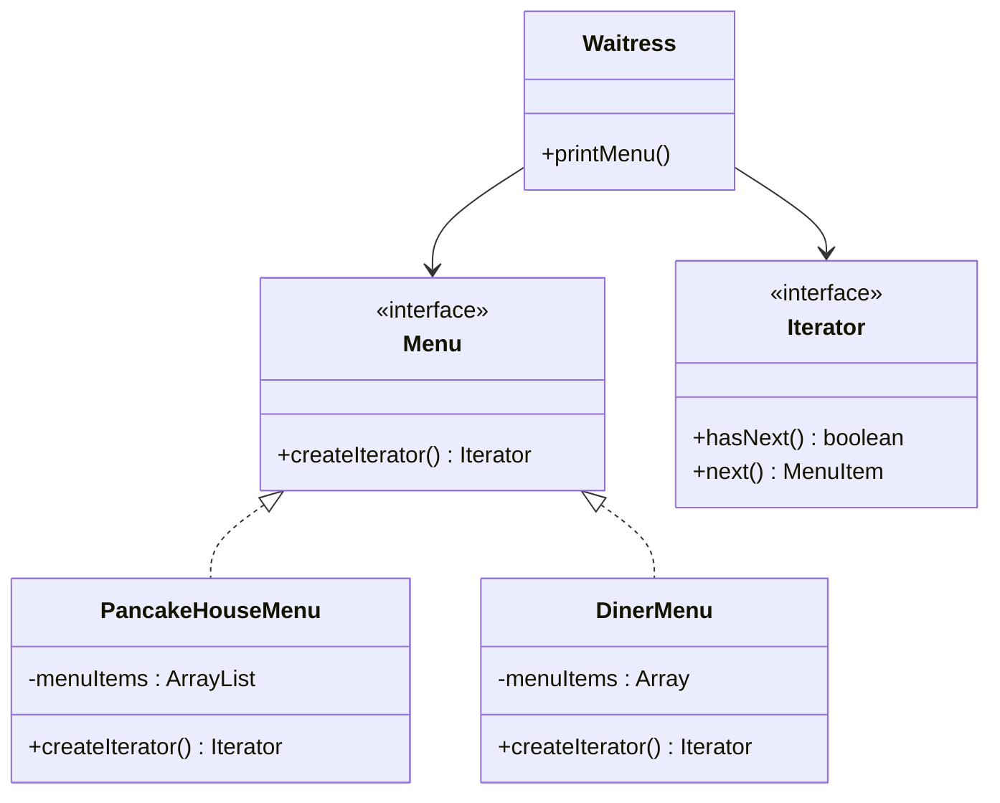

## Iterator Pattern : Collection 순회를 캡슐화하기

- Iterator Pattern은 **collection의 내부 구현을 노출하지 않으면서 모든 항목에 접근**할 수 있게 합니다.
    - 순회(iteration) 책임을 collection이 아닌 iterator 객체에 위임합니다.
    - collection interface가 간단해지고, 각 객체가 자신의 역할에 집중할 수 있습니다.

- iterator를 사용하면 **다형적인 code**를 작성할 수 있습니다.
    - iterator를 지원하는 모든 collection에 동일한 순회 code를 적용할 수 있습니다.
    - collection의 구체적인 구현 방식(Array, List, Set 등)에 신경 쓸 필요가 없습니다.


### Iterator Pattern의 장점

- **collection 구현과 순회 logic이 분리됩니다.**
    - collection은 객체 저장에만 집중하고, iterator는 순회에만 집중합니다.
    - 단일 책임 원칙(SRP)을 따릅니다.

- **동일한 interface로 다양한 collection을 순회할 수 있습니다.**
    - client는 iterator interface만 알면 됩니다.
    - 새로운 collection type이 추가되어도 client code를 변경할 필요가 없습니다.

- **여러 순회 방식을 지원할 수 있습니다.**
    - 정방향, 역방향, filtering 등 다양한 iterator를 구현할 수 있습니다.


### Iterator Pattern의 단점

- **간단한 collection에는 과도한 설계일 수 있습니다.**
    - 단순한 배열 순회에 iterator를 적용하면 오히려 복잡해집니다.

- **iterator 상태 관리가 필요합니다.**
    - iterator는 현재 위치를 추적해야 하므로 상태를 가집니다.
    - 동시에 여러 순회가 필요하면 여러 iterator instance가 필요합니다.


---


## Iterator Pattern의 구성 요소

- Iterator Pattern은 **Aggregate와 Iterator**로 구성됩니다.
    - Aggregate는 collection을 나타내며, iterator를 생성하는 method를 제공합니다.
    - Iterator는 collection 순회를 담당합니다.

| 구성 요소 | 역할 |
| --- | --- |
| Iterator | 순회에 필요한 method(`hasNext()`, `next()`) 정의 |
| ConcreteIterator | 특정 collection에 대한 순회 구현, 현재 위치 관리 |
| Aggregate | collection interface, `createIterator()` method 정의 |
| ConcreteAggregate | 실제 collection 구현, 해당 iterator 생성 |


### Iterator Interface의 핵심 Method

- **`hasNext()`** : 순회할 항목이 남아있는지 확인합니다.
- **`next()`** : 다음 항목을 반환하고 위치를 이동합니다.
- **`remove()`** : (선택적) 현재 항목을 제거합니다.


---


## Class Diagram

- Iterator Pattern의 구조는 **Aggregate와 Iterator interface**, 그리고 이를 구현하는 concrete class로 구성됩니다.




---


## Internal Iterator와 External Iterator

- iterator는 **제어 주체**에 따라 두 가지로 나뉩니다.

| 구분 | External Iterator | Internal Iterator |
| --- | --- | --- |
| 제어 주체 | client | iterator 자체 |
| 순회 방식 | client가 `next()` 호출 | iterator가 자동 순회 |
| 유연성 | 높음 | 낮음 |
| 편의성 | 낮음 | 높음 |

- **External Iterator**는 client가 순회를 직접 제어합니다.
    - `next()`를 호출하여 다음 항목을 가져옵니다.
    - 순회 중 멈추거나 건너뛰는 등 유연한 제어가 가능합니다.

- **Internal Iterator**는 iterator가 순회를 제어합니다.
    - client는 각 항목에 수행할 작업만 전달합니다.
    - Java의 `forEach()`, stream의 `map()`, `filter()` 등이 해당됩니다.


---


## Example : 두 식당의 Menu 합치기

- 두 식당이 합병하여 menu를 통합해야 하는 상황입니다.
    - `PancakeHouse`는 `ArrayList`로 menu를 관리합니다.
    - `DinerMenu`는 배열로 menu를 관리합니다.
    - `Waitress`는 두 menu를 동일한 방식으로 출력해야 합니다.

- Iterator Pattern을 적용하면 **`Waitress`가 collection 구현에 상관없이 menu를 순회**할 수 있습니다.


### Class Diagram

- `Waitress`는 `Menu`와 `Iterator` interface에만 의존합니다.




### Client

```java
import java.util.*;

public class MenuTestDrive {
    public static void main(String args[]) {
        Menu pancakeHouseMenu = new PancakeHouseMenu();
        Menu dinerMenu = new DinerMenu();

        Waitress waitress = new Waitress(pancakeHouseMenu, dinerMenu);

        waitress.printMenu();
    }
}
```


### Waitress

- `Waitress`는 iterator를 사용하여 menu를 순회합니다.

```java
public class Waitress {
    Menu pancakeHouseMenu;
    Menu dinerMenu;

    public Waitress(Menu pancakeHouseMenu, Menu dinerMenu) {
        this.pancakeHouseMenu = pancakeHouseMenu;
        this.dinerMenu = dinerMenu;
    }

    public void printMenu() {
        Iterator pancakeIterator = pancakeHouseMenu.createIterator();
        Iterator dinerIterator = dinerMenu.createIterator();

        System.out.println("MENU\n----\nBREAKFAST");
        printMenu(pancakeIterator);
        System.out.println("\nLUNCH");
        printMenu(dinerIterator);
    }

    private void printMenu(Iterator iterator) {
        while (iterator.hasNext()) {
            MenuItem menuItem = iterator.next();
            System.out.print(menuItem.getName() + ", ");
            System.out.print(menuItem.getPrice() + " -- ");
            System.out.println(menuItem.getDescription());
        }
    }

    public void printVegetarianMenu() {
        printVegetarianMenu(pancakeHouseMenu.createIterator());
        printVegetarianMenu(dinerMenu.createIterator());
    }

    public boolean isItemVegetarian(String name) {
        Iterator breakfastIterator = pancakeHouseMenu.createIterator();
        if (isVegetarian(name, breakfastIterator)) {
            return true;
        }
        Iterator dinnerIterator = dinerMenu.createIterator();
        if (isVegetarian(name, dinnerIterator)) {
            return true;
        }
        return false;
    }

    private void printVegetarianMenu(Iterator iterator) {
        while (iterator.hasNext()) {
            MenuItem menuItem = iterator.next();
            if (menuItem.isVegetarian()) {
                System.out.print(menuItem.getName());
                System.out.println("\t\t" + menuItem.getPrice());
                System.out.println("\t" + menuItem.getDescription());
            }
        }
    }

    private boolean isVegetarian(String name, Iterator iterator) {
        while (iterator.hasNext()) {
            MenuItem menuItem = iterator.next();
            if (menuItem.getName().equals(name)) {
                if (menuItem.isVegetarian()) {
                    return true;
                }
            }
        }
        return false;
    }
}
```


### Iterator

```java
public interface Iterator {
    boolean hasNext();
    MenuItem next();
}
```

```java
public class PancakeHouseMenuIterator implements Iterator {
    List<MenuItem> items;
    int position = 0;

    public PancakeHouseMenuIterator(List<MenuItem> items) {
        this.items = items;
    }

    public MenuItem next() {
        return items.get(position++);
    }

    public boolean hasNext() {
        return items.size() > position;
    }
}
```

```java
public class DinerMenuIterator implements Iterator {
    MenuItem[] items;
    int position = 0;

    public DinerMenuIterator(MenuItem[] items) {
        this.items = items;
    }

    public MenuItem next() {
        return items[position++];
    }

    public boolean hasNext() {
        return items.length > position && items[position] != null;
    }
}
```

```java
import java.util.Calendar;

public class AlternatingDinerMenuIterator implements Iterator {
    MenuItem[] list;
    int position;

    public AlternatingDinerMenuIterator(MenuItem[] list) {
        this.list = list;
        position = Calendar.DAY_OF_WEEK % 2;
    }

    public MenuItem next() {
        MenuItem menuItem = list[position];
        position = position + 2;
        return menuItem;
    }

    public boolean hasNext() {
        if (position >= list.length || list[position] == null) {
            return false;
        } else {
            return true;
        }
    }
}
```


### Menu

```java
public interface Menu {
    public Iterator createIterator();
}
```

```java
import java.util.ArrayList;
import java.util.List;

public class PancakeHouseMenu implements Menu {
    List<MenuItem> menuItems;

    public PancakeHouseMenu() {
        menuItems = new ArrayList<MenuItem>();

        addItem("K&B's Pancake Breakfast",
            "Pancakes with scrambled eggs and toast",
            true,
            2.99);

        addItem("Regular Pancake Breakfast",
            "Pancakes with fried eggs, sausage",
            false,
            2.99);

        addItem("Blueberry Pancakes",
            "Pancakes made with fresh blueberries",
            true,
            3.49);

        addItem("Waffles",
            "Waffles with your choice of blueberries or strawberries",
            true,
            3.59);
    }

    public void addItem(String name, String description,
                        boolean vegetarian, double price) {
        MenuItem menuItem = new MenuItem(name, description, vegetarian, price);
        menuItems.add(menuItem);
    }

    public List<MenuItem> getMenuItems() {
        return menuItems;
    }

    public Iterator createIterator() {
        return new PancakeHouseMenuIterator(menuItems);
    }
}
```

```java
public class DinerMenu implements Menu {
    static final int MAX_ITEMS = 6;
    int numberOfItems = 0;
    MenuItem[] menuItems;

    public DinerMenu() {
        menuItems = new MenuItem[MAX_ITEMS];

        addItem("Vegetarian BLT",
            "(Fakin') Bacon with lettuce & tomato on whole wheat", true, 2.99);
        addItem("BLT",
            "Bacon with lettuce & tomato on whole wheat", false, 2.99);
        addItem("Soup of the day",
            "Soup of the day, with a side of potato salad", false, 3.29);
        addItem("Hotdog",
            "A hot dog, with sauerkraut, relish, onions, topped with cheese",
            false, 3.05);
        addItem("Steamed Veggies and Brown Rice",
            "Steamed vegetables over brown rice", true, 3.99);
        addItem("Pasta",
            "Spaghetti with Marinara Sauce, and a slice of sourdough bread",
            true, 3.89);
    }

    public void addItem(String name, String description,
                        boolean vegetarian, double price) {
        MenuItem menuItem = new MenuItem(name, description, vegetarian, price);
        if (numberOfItems >= MAX_ITEMS) {
            System.err.println("Sorry, menu is full! Can't add item to menu");
        } else {
            menuItems[numberOfItems] = menuItem;
            numberOfItems = numberOfItems + 1;
        }
    }

    public MenuItem[] getMenuItems() {
        return menuItems;
    }

    public Iterator createIterator() {
        return new DinerMenuIterator(menuItems);
    }
}
```


### MenuItem

```java
public class MenuItem {
    String name;
    String description;
    boolean vegetarian;
    double price;

    public MenuItem(String name,
                    String description,
                    boolean vegetarian,
                    double price) {
        this.name = name;
        this.description = description;
        this.vegetarian = vegetarian;
        this.price = price;
    }

    public String getName() {
        return name;
    }

    public String getDescription() {
        return description;
    }

    public double getPrice() {
        return price;
    }

    public boolean isVegetarian() {
        return vegetarian;
    }

    public String toString() {
        return (name + ", $" + price + "\n   " + description);
    }
}
```


---


## Java API 활용 사례

- Java에서는 **`java.util.Iterator`** interface를 표준으로 제공합니다.
    - `hasNext()`, `next()`, `remove()` method를 정의합니다.
    - 모든 `Collection`은 `iterator()` method로 iterator를 반환합니다.

```java
List<String> items = Arrays.asList("A", "B", "C");
Iterator<String> iterator = items.iterator();

while (iterator.hasNext()) {
    System.out.println(iterator.next());
}
```

- **enhanced for loop**는 내부적으로 iterator를 사용합니다.
    - `Iterable` interface를 구현한 객체에 사용할 수 있습니다.

```java
for (String item : items) {
    System.out.println(item);
}
```


### Enumeration과 Iterator

- 과거 Java에서는 `Enumeration`을 사용했습니다.
    - `Iterator`가 `Enumeration`을 대체했습니다.

| Enumeration | Iterator |
| --- | --- |
| `hasMoreElements()` | `hasNext()` |
| `nextElement()` | `next()` |
| - | `remove()` |

- 두 interface 간 변환이 필요하면 Adapter Pattern을 사용합니다.


---


## Reference

- Head First Design Patterns - Eric Freeman, Elisabeth Robson, Bert Bates, Kathy Sierra
- <https://refactoring.guru/design-patterns/iterator>

