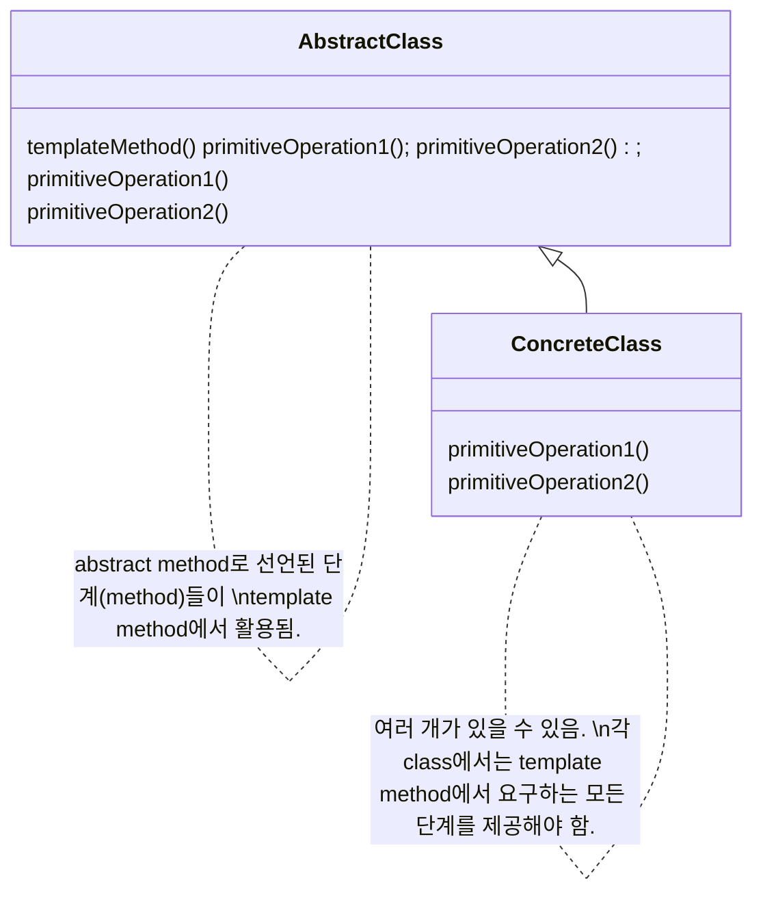
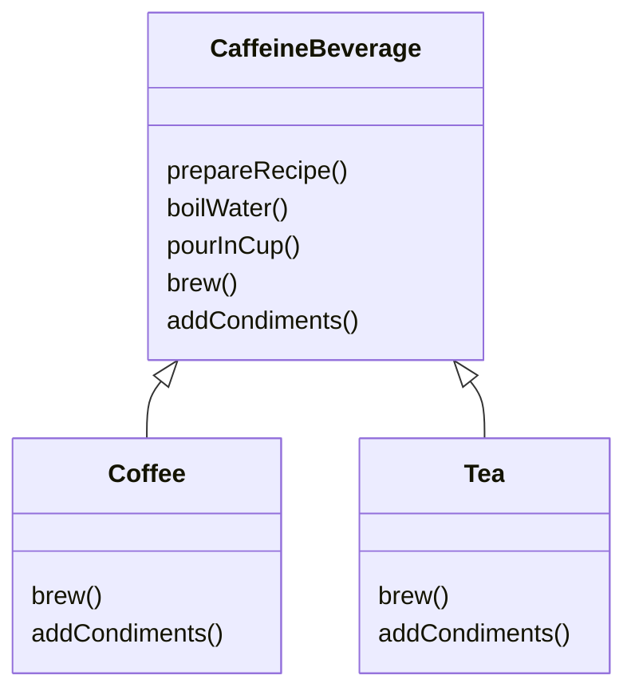

# Template Method Pattern

```
Template Method Pattern에서는 method에서 algorithm의 골격을 정의합니다. algorithm의 여러 단계 중 일부는 subclass에서 구현할 수 있습니다. template method를 이용하면 algorithm의 구조는 그대로 유지하면서 subclass에서 특정 단계를 재정의할 수 있습니다.
```

- algorithm의 틀(template)을 만듬
    - algorithm의 단계들을 정의하고, 일부 단계는 subclass에서 구현하도록 할 수 있음

- template method
    - 일련의 단계들로 algorithm을 정의한 method
    - 여러 단계 가운데 하나 이상이 추상 method로 정의되며, 그 추상 method는 subclass에서 구현됨
        - 추상 method이기 때문에 subclass에서 일부분을 구현할 수 있도록 하면서도 algorithm의 구조는 바꾸지 않아도 됨

- (template method가 들어있는) 추상 class에 정의할 수 있는 것들
    - 구상 method : superclass에서 정의한 algorithm의 공통 단계
    - 추상 method : 구현을 subclass에 맡기는 algorithm의 개별 단계
    - hook : superclass에서 기본 행동(아무 것도 안 할 수도 있음)을 정의하고 subclass에서 override하여 다르게 구현할 수도 있는 algorithm의 선택적 단계

- Hook
    - 추상 class에 선언되어 기본적인 내용만 구현되어 있거나 아무 code도 들어있지 않은 method
        - subclass에서는 해당 과정이 필요한 경우에만 구현을 함
            - 반드시 구현해야 한다면 hook이 아닌 추상 method를 써야 함
    - algorithm의 특정 부분이 선택적으로 적용되어야 하는 경우에 사용함
        - 이렇게 하면 subclass 입장에서는 다양한 위치에서 algorithm에 끼어들거나, 무시하고 넘어가는 것이 가능함

- Strategy Pattern & Template Method Pattern
    - 모두 algorithm을 캡슐화(encapsulation)하는 pattern
    - Strategy Pattern : 객체 구성을 사용함
        - 일련의 algorithm group을 정의하고 그 algorithm들을 서로 바꿔가면서 쓸 수 있게 해 줌
        - 의존성이 낮아 유연함
            - 어떤 것에도 의존하지 않고, algorithm을 전부 알아서 구현할 수 있음
    - Template Method Pattern : 객체 상속을 사용함
        - algorithm 구조 자체는 그대로 유지하면서, algorithm의 각 단계마다 다른 구현을 사용할 수 있음
        - code의 재사용성이 뛰어남
            - superclass에서 algorithm의 개요를 정의함
            - 중복되는 code를 superclass에 넣어 subclass에서 공유해 사용할 수 있음
                - superclass에서 정의하지 않은 code는 subclass에서 구현함
            - framework를 만드는 데에 좋음
        - algorithm이 전부 똑같고 한 줄만 다르다면 Template Method Pattern을 사용하는 것이 Strategy Pattern을 이용하는 것보다 효율적임

- Factory Method Pattern은 특화된 Template Method Pattern임


## Class Diagram




---


# Example : Barista의 Coffee와 Tea 제조법

- Coffee & Tea
    - caffeine 음료
    - 만드는 방법이 비슷함
        - 하지만 완전히 같지는 않음

- Coffee Recipe
    1. 물을 끓인다.
    2. 끓는 물에 coffee를 우려낸다.
    3. coffee를 cup에 따른다.
    4. 설탕과 우유를 추가한다.

- Tea Recipe
    1. 물을 끓인다.
    2. 끓는 물에 tea를 우려낸다.
    3. tea를 cup에 따른다.
    4. 레몬을 추가한다.

- Caffeine Beverage(coffee and tea) Recipe
    1. 물을 끓인다.
    2. 뜨거운 물을 이용하여 coffee 또는 tea를 우려낸다.
    3. 만들어진 음료를 cup에 따른다.
    4. 각 음료에 맞는 첨가물을 추가한다.


## Class Diagram




## Code

### Client

```java
public class BeverageTestDrive {
    public static void main(String[] args) {
 
        Tea tea = new Tea();
        Coffee coffee = new Coffee();
 
        System.out.println("\nMaking tea...");
        tea.prepareRecipe();
 
        System.out.println("\nMaking coffee...");
        coffee.prepareRecipe();

 
        TeaWithHook teaHook = new TeaWithHook();
        CoffeeWithHook coffeeHook = new CoffeeWithHook();
 
        System.out.println("\nMaking tea...");
        teaHook.prepareRecipe();
 
        System.out.println("\nMaking coffee...");
        coffeeHook.prepareRecipe();
    }
}
```

### Template method

```java
public abstract class CaffeineBeverage {
  
    final void prepareRecipe() {
        boilWater();
        brew();
        pourInCup();
        addCondiments();
    }
 
    abstract void brew();
  
    abstract void addCondiments();
 
    void boilWater() {
        System.out.println("Boiling water");
    }
  
    void pourInCup() {
        System.out.println("Pouring into cup");
    }
}
```

```java
public class Coffee extends CaffeineBeverage {
    public void brew() {
        System.out.println("Dripping Coffee through filter");
    }
    public void addCondiments() {
        System.out.println("Adding Sugar and Milk");
    }
}
```

```java
public class Tea extends CaffeineBeverage {
    public void brew() {
        System.out.println("Steeping the tea");
    }
    public void addCondiments() {
        System.out.println("Adding Lemon");
    }
}
```

### Template method with Hook

```java
public abstract class CaffeineBeverageWithHook {
 
    final void prepareRecipe() {
        boilWater();
        brew();
        pourInCup();
        if (customerWantsCondiments()) {
            addCondiments();
        }
    }
 
    abstract void brew();
 
    abstract void addCondiments();
 
    void boilWater() {
        System.out.println("Boiling water");
    }
 
    void pourInCup() {
        System.out.println("Pouring into cup");
    }
 
    boolean customerWantsCondiments() {
        return true;
    }
}
```

```java
public class CoffeeWithHook extends CaffeineBeverageWithHook {
 
    public void brew() {
        System.out.println("Dripping Coffee through filter");
    }
 
    public void addCondiments() {
        System.out.println("Adding Sugar and Milk");
    }
 
    public boolean customerWantsCondiments() {

        String answer = getUserInput();

        if (answer.toLowerCase().startsWith("y")) {
            return true;
        } else {
            return false;
        }
    }
 
    private String getUserInput() {
        String answer = null;

        System.out.print("Would you like milk and sugar with your coffee (y/n)? ");

        BufferedReader in = new BufferedReader(new InputStreamReader(System.in));
        try {
            answer = in.readLine();
        } catch (IOException ioe) {
            System.err.println("IO error trying to read your answer");
        }
        if (answer == null) {
            return "no";
        }
        return answer;
    }
}
```

```java
public class TeaWithHook extends CaffeineBeverageWithHook {
 
    public void brew() {
        System.out.println("Steeping the tea");
    }
 
    public void addCondiments() {
        System.out.println("Adding Lemon");
    }
 
    public boolean customerWantsCondiments() {

        String answer = getUserInput();

        if (answer.toLowerCase().startsWith("y")) {
            return true;
        } else {
            return false;
        }
    }
 
    private String getUserInput() {
        // get the user's response
        String answer = null;

        System.out.print("Would you like lemon with your tea (y/n)? ");

        BufferedReader in = new BufferedReader(new InputStreamReader(System.in));
        try {
            answer = in.readLine();
        } catch (IOException ioe) {
            System.err.println("IO error trying to read your answer");
        }
        if (answer == null) {
            return "no";
        }
        return answer;
    }
}
```

## Template method 적용 전

```java
public class Barista {
 
    public static void main(String[] args) {
        Tea tea = new Tea();
        Coffee coffee = new Coffee();
        System.out.println("Making tea...");
        tea.prepareRecipe();
        System.out.println("Making coffee...");
        coffee.prepareRecipe();
    }
}
```

```java
public class Coffee {
 
    void prepareRecipe() {
        boilWater();
        brewCoffeeGrinds();
        pourInCup();
        addSugarAndMilk();
    }
 
    public void boilWater() {
        System.out.println("Boiling water");
    }
 
    public void brewCoffeeGrinds() {
        System.out.println("Dripping Coffee through filter");
    }
 
    public void pourInCup() {
        System.out.println("Pouring into cup");
    }
 
    public void addSugarAndMilk() {
        System.out.println("Adding Sugar and Milk");
    }
}
```

```java
public class Tea {
 
    void prepareRecipe() {
        boilWater();
        steepTeaBag();
        pourInCup();
        addLemon();
    }
 
    public void boilWater() {
        System.out.println("Boiling water");
    }
 
    public void steepTeaBag() {
        System.out.println("Steeping the tea");
    }
 
    public void addLemon() {
        System.out.println("Adding Lemon");
    }
 
    public void pourInCup() {
        System.out.println("Pouring into cup");
    }
}
```


---


## Reference

- Head First Design Patterns - Eric Freeman, Elisabeth Robson, Bert Bates, Kathy Sierra
