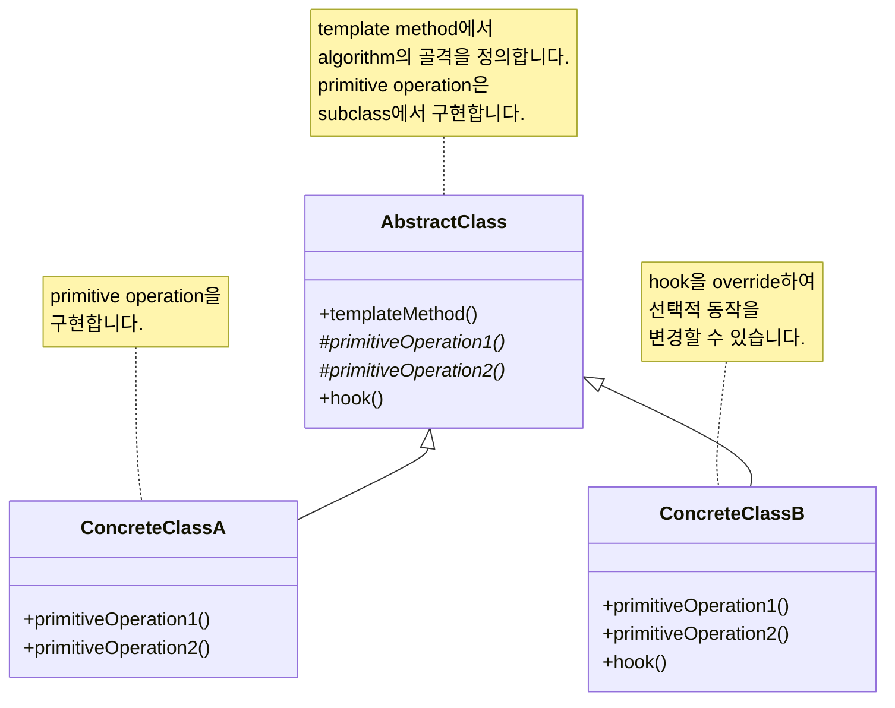
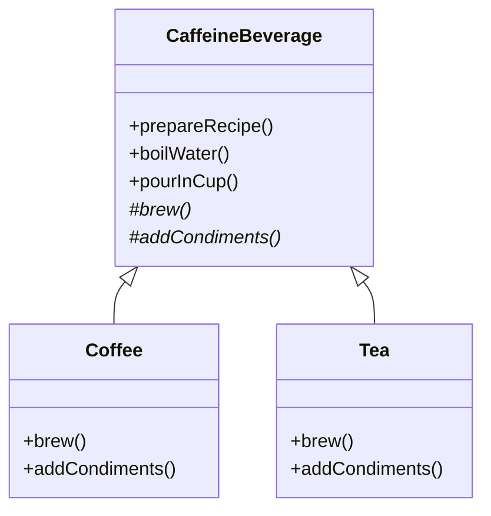

## Template Method Pattern : Algorithm의 구조 유지하며 단계 재정의하기

- Template Method Pattern은 **algorithm의 골격(skeleton)을 정의**하고, 일부 단계의 구현을 subclass에 맡깁니다.
    - algorithm의 구조는 그대로 유지하면서 특정 단계만 재정의할 수 있습니다.
    - 공통 logic은 superclass에 두고, 변하는 부분만 subclass에서 구현합니다.

- template method는 **일련의 단계로 algorithm을 정의한 method**입니다.
    - 여러 단계 중 일부는 abstract method로 정의됩니다.
    - abstract method는 subclass에서 반드시 구현해야 합니다.
    - algorithm의 골격은 template method가 유지하므로 구조가 변하지 않습니다.


### Template Method Pattern의 장점

- **code 재사용성이 뛰어납니다.**
    - 공통 algorithm을 superclass에 정의하여 중복을 제거합니다.
    - subclass는 변하는 부분만 구현하면 됩니다.

- **algorithm의 구조가 보장됩니다.**
    - template method를 `final`로 선언하면 subclass에서 algorithm 구조를 변경할 수 없습니다.
    - 전체 흐름은 동일하게 유지되고, 세부 구현만 달라집니다.

- **framework 구축에 적합합니다.**
    - framework에서 algorithm의 흐름을 제어하고, 사용자는 세부 구현만 제공합니다.
    - Hollywood Principle을 따라, framework가 사용자의 code를 호출하는 구조입니다.
        - Hollywood Principle : "Don't call us, we'll call you".


### Template Method Pattern의 단점

- **상속 기반이므로 유연성이 떨어집니다.**
    - subclass는 superclass의 template method에 종속됩니다.
    - runtime에 algorithm을 교체하기 어렵습니다.

- **algorithm 단계가 많아지면 관리가 복잡해집니다.**
    - abstract method와 hook이 많아지면 subclass 구현 부담이 증가합니다.


---


## Template Method Pattern의 구성 요소

- Template Method Pattern은 **abstract class와 concrete class**로 구성됩니다.
    - abstract class는 template method와 primitive operation을 정의합니다.
    - concrete class는 primitive operation을 구현합니다.


### Abstract Class에 정의되는 Method 종류

- **template method** : algorithm의 골격을 정의하며, primitive operation들을 호출합니다.
    - 보통 `final`로 선언하여 subclass에서 override할 수 없게 합니다.

- **abstract method (primitive operation)** : subclass에서 반드시 구현해야 하는 algorithm 단계입니다.
    - algorithm의 핵심적인 변하는 부분을 정의합니다.

- **concrete method** : superclass에서 기본 구현을 제공하는 공통 단계입니다.
    - 모든 subclass에서 동일하게 동작하는 부분입니다.

- **hook method** : 선택적으로 override할 수 있는 method입니다.
    - 기본 구현이 비어있거나 기본 동작을 제공합니다.
    - subclass에서 필요한 경우에만 override합니다.


### Hook Method 활용

- hook은 **algorithm의 특정 부분을 선택적으로 적용**할 때 사용합니다.
    - subclass에서 algorithm의 특정 단계를 건너뛰거나 추가 동작을 수행할 수 있습니다.
    - abstract method와 달리 반드시 구현할 필요가 없습니다.

```java
public abstract class CaffeineBeverage {

    final void prepareRecipe() {
        boilWater();
        brew();
        pourInCup();
        if (customerWantsCondiments()) {  // hook 사용
            addCondiments();
        }
    }

    abstract void brew();
    abstract void addCondiments();

    void boilWater() {
        System.out.println("물 끓이는 중");
    }

    void pourInCup() {
        System.out.println("잔에 따르는 중");
    }

    // hook method : 기본값은 true
    boolean customerWantsCondiments() {
        return true;
    }
}
```


---


## Class Diagram

- Template Method Pattern의 구조는 **abstract class와 이를 상속하는 concrete class**로 구성됩니다.




---


## Strategy Pattern과의 비교

- Template Method Pattern과 Strategy Pattern은 **모두 algorithm을 캡슐화**하지만 방식이 다릅니다.

| 구분 | Template Method Pattern | Strategy Pattern |
| --- | --- | --- |
| 구현 방식 | 상속 (inheritance) | 합성 (composition) |
| algorithm 교체 | compile time에 결정 | runtime에 교체 가능 |
| code 재사용 | superclass에서 공통 code 공유 | algorithm별 독립적 구현 |
| 유연성 | 상대적으로 낮음 | 상대적으로 높음 |
| 적합한 상황 | algorithm 골격이 고정되고 일부만 다를 때 | algorithm 전체가 다양하게 교체될 때 |

- **algorithm 대부분이 동일**하고 일부 단계만 다르다면 Template Method Pattern이 효율적입니다.
- **algorithm 전체가 다양**하게 변경되어야 한다면 Strategy Pattern이 적합합니다.


---


## Example : Caffeine 음료 제조

- Coffee와 Tea는 **제조 과정이 유사**하지만 세부 단계가 다릅니다.
    - 공통 단계 : 물 끓이기, 잔에 따르기.
    - 다른 단계 : 우려내기 방식, 첨가물.

- **Coffee 제조법** : 물 끓이기 → coffee 우려내기 → 잔에 따르기 → 설탕과 우유 추가.
- **Tea 제조법** : 물 끓이기 → tea 우려내기 → 잔에 따르기 → lemon 추가.


### Class Diagram

- `CaffeineBeverage`가 template method를 정의하고, `Coffee`와 `Tea`가 primitive operation을 구현합니다.




### Template Method 적용 전

- template method 적용 전에는 **Coffee와 Tea가 각각 독립적으로 구현**되어 있습니다.
    - 중복 code가 존재하고, algorithm 변경 시 두 class를 모두 수정해야 합니다.

```java
public class Coffee {

    void prepareRecipe() {
        boilWater();
        brewCoffeeGrinds();
        pourInCup();
        addSugarAndMilk();
    }

    public void boilWater() {
        System.out.println("Boiling water");
    }

    public void brewCoffeeGrinds() {
        System.out.println("Dripping Coffee through filter");
    }

    public void pourInCup() {
        System.out.println("Pouring into cup");
    }

    public void addSugarAndMilk() {
        System.out.println("Adding Sugar and Milk");
    }
}
```

```java
public class Tea {

    void prepareRecipe() {
        boilWater();
        steepTeaBag();
        pourInCup();
        addLemon();
    }

    public void boilWater() {
        System.out.println("Boiling water");
    }

    public void steepTeaBag() {
        System.out.println("Steeping the tea");
    }

    public void addLemon() {
        System.out.println("Adding Lemon");
    }

    public void pourInCup() {
        System.out.println("Pouring into cup");
    }
}
```


### Template Method 적용 후

- **abstract class** : algorithm의 골격을 정의합니다.

```java
public abstract class CaffeineBeverage {

    final void prepareRecipe() {
        boilWater();
        brew();
        pourInCup();
        addCondiments();
    }

    abstract void brew();

    abstract void addCondiments();

    void boilWater() {
        System.out.println("Boiling water");
    }

    void pourInCup() {
        System.out.println("Pouring into cup");
    }
}
```

- **concrete class** : primitive operation을 구현합니다.

```java
public class Coffee extends CaffeineBeverage {

    public void brew() {
        System.out.println("Dripping Coffee through filter");
    }

    public void addCondiments() {
        System.out.println("Adding Sugar and Milk");
    }
}
```

```java
public class Tea extends CaffeineBeverage {

    public void brew() {
        System.out.println("Steeping the tea");
    }

    public void addCondiments() {
        System.out.println("Adding Lemon");
    }
}
```


### Hook을 활용한 Template Method

- hook method를 사용하여 **첨가물 추가 여부를 선택적으로 결정**할 수 있습니다.

```java
public abstract class CaffeineBeverageWithHook {

    final void prepareRecipe() {
        boilWater();
        brew();
        pourInCup();
        if (customerWantsCondiments()) {
            addCondiments();
        }
    }

    abstract void brew();

    abstract void addCondiments();

    void boilWater() {
        System.out.println("Boiling water");
    }

    void pourInCup() {
        System.out.println("Pouring into cup");
    }

    boolean customerWantsCondiments() {
        return true;
    }
}
```

```java
public class CoffeeWithHook extends CaffeineBeverageWithHook {

    public void brew() {
        System.out.println("Dripping Coffee through filter");
    }

    public void addCondiments() {
        System.out.println("Adding Sugar and Milk");
    }

    public boolean customerWantsCondiments() {
        String answer = getUserInput();

        if (answer.toLowerCase().startsWith("y")) {
            return true;
        } else {
            return false;
        }
    }

    private String getUserInput() {
        String answer = null;

        System.out.print("Would you like milk and sugar with your coffee (y/n)? ");

        BufferedReader in = new BufferedReader(new InputStreamReader(System.in));
        try {
            answer = in.readLine();
        } catch (IOException ioe) {
            System.err.println("IO error trying to read your answer");
        }
        if (answer == null) {
            return "no";
        }
        return answer;
    }
}
```

```java
public class TeaWithHook extends CaffeineBeverageWithHook {

    public void brew() {
        System.out.println("Steeping the tea");
    }

    public void addCondiments() {
        System.out.println("Adding Lemon");
    }

    public boolean customerWantsCondiments() {
        String answer = getUserInput();

        if (answer.toLowerCase().startsWith("y")) {
            return true;
        } else {
            return false;
        }
    }

    private String getUserInput() {
        String answer = null;

        System.out.print("Would you like lemon with your tea (y/n)? ");

        BufferedReader in = new BufferedReader(new InputStreamReader(System.in));
        try {
            answer = in.readLine();
        } catch (IOException ioe) {
            System.err.println("IO error trying to read your answer");
        }
        if (answer == null) {
            return "no";
        }
        return answer;
    }
}
```


### Client Code

- template method를 호출하여 음료를 제조합니다.

```java
public class BeverageTestDrive {

    public static void main(String[] args) {
        Tea tea = new Tea();
        Coffee coffee = new Coffee();

        System.out.println("\nMaking tea...");
        tea.prepareRecipe();

        System.out.println("\nMaking coffee...");
        coffee.prepareRecipe();

        TeaWithHook teaHook = new TeaWithHook();
        CoffeeWithHook coffeeHook = new CoffeeWithHook();

        System.out.println("\nMaking tea...");
        teaHook.prepareRecipe();

        System.out.println("\nMaking coffee...");
        coffeeHook.prepareRecipe();
    }
}
```


---


## Java API 활용 사례

- Template Method Pattern은 **Java API 여러 곳에서 활용**됩니다.


### Arrays.sort()와 Comparable

- `Arrays.sort()`는 정렬 algorithm의 골격을 제공하고, 비교 logic은 `Comparable` interface에 위임합니다.

```java
public class Duck implements Comparable<Duck> {
    String name;
    int weight;

    public Duck(String name, int weight) {
        this.name = name;
        this.weight = weight;
    }

    @Override
    public int compareTo(Duck other) {
        return Integer.compare(this.weight, other.weight);
    }
}
```

```java
Duck[] ducks = {
    new Duck("Daffy", 8),
    new Duck("Dewey", 2),
    new Duck("Howard", 7)
};

Arrays.sort(ducks);  // weight 기준 정렬
```


### InputStream.read()

- `InputStream`의 `read(byte[] b, int off, int len)`은 template method 역할을 합니다.
    - 내부적으로 abstract method인 `read()`를 호출합니다.
    - subclass는 `read()`만 구현하면 됩니다.


---


## Reference

- Head First Design Patterns - Eric Freeman, Elisabeth Robson, Bert Bates, Kathy Sierra
- <https://refactoring.guru/design-patterns/template-method>

