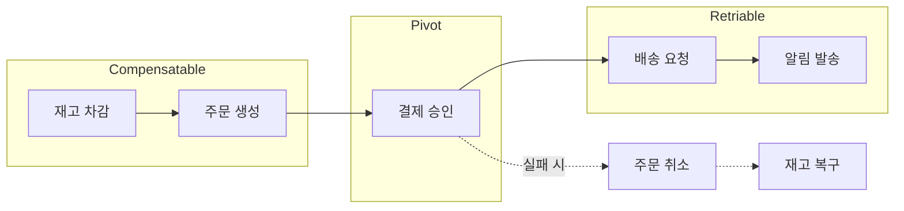

## Saga Pattern 개요

- Saga Pattern은 **여러 service에 걸친 business transaction을 local transaction의 연속으로 분해하고, 실패 시 보상 transaction으로 상태를 복구**하는 pattern입니다.
    - 1987년 Hector Garcia-Molina와 Kenneth Salem이 발표한 논문에서 처음 제안되었습니다.
    - 원래는 long-lived transaction의 문제를 해결하기 위해 고안되었으나, 현재는 MSA 환경에서 분산 transaction 처리에 널리 사용됩니다.

- Saga는 **ACID 중 Isolation을 포기하고 결과적 일관성(Eventual Consistency)을 추구**합니다.
    - global lock 없이 각 service가 독립적으로 local transaction을 commit합니다.
    - 중간 상태가 외부에 노출될 수 있으나, 최종적으로 일관된 상태에 도달합니다.


---


## 보상 Transaction 설계

- 보상 transaction(Compensating Transaction)은 **이미 commit된 transaction의 효과를 의미론적으로 되돌리는 transaction**입니다.
    - database의 rollback과 달리, 새로운 transaction을 실행하여 이전 상태를 복원합니다.
    - 따라서 보상 transaction도 실패할 수 있으며, 이에 대한 처리가 필요합니다.


### 보상 가능성에 따른 분류

- 하나의 Saga는 여러 step으로 구성되며, **각 step은 위치와 특성에 따라 세 가지 유형으로 분류**됩니다.
    - 이 분류는 서로 다른 종류의 transaction이 아니라, Saga 흐름 내에서 각 step이 가지는 역할을 구분한 것입니다.

- **Compensatable Transaction** : Pivot 이전에 실행되며, 실패 시 보상 transaction으로 되돌릴 수 있는 step입니다.
    - database에 data를 insert한 경우, delete로 보상합니다.
    - 상태를 변경한 경우, 이전 상태로 되돌립니다.

- **Pivot Transaction** : Saga의 성공 여부를 결정하는 분기점입니다.
    - 이 step이 성공하면 Saga는 끝까지 진행됩니다.
    - 실패하면 이전의 모든 Compensatable Transaction을 역순으로 보상합니다.
    - 일반적으로 외부 system 호출이나 되돌리기 어려운 핵심 작업이 Pivot이 됩니다.

- **Retriable Transaction** : Pivot 이후에 실행되며, 실패해도 재시도하여 반드시 성공시키는 step입니다.
    - Pivot이 성공한 이후이므로 rollback 대신 완료를 보장해야 합니다.
    - 멱등성(idempotency)이 보장되어야 재시도 시 부작용이 없습니다.


#### 주문 Saga 예시

- 주문 생성 Saga를 예로 들면, 각 step의 역할이 명확해집니다.

| 순서 | Step | 유형 | 보상 방법 |
| --- | --- | --- | --- |
| 1 | 재고 차감 | Compensatable | 재고 복구 |
| 2 | 주문 생성 | Compensatable | 주문 취소 |
| 3 | 결제 승인 | Pivot | - |
| 4 | 배송 요청 | Retriable | 재시도 |
| 5 | 알림 발송 | Retriable | 재시도 |

- 결제 승인(Pivot) 전에 실패하면 재고와 주문을 역순으로 보상합니다.
- 결제 승인 후에는 배송과 알림을 재시도하여 반드시 완료합니다.




### Semantic Rollback

- 일부 작업은 물리적으로 되돌릴 수 없어 **의미론적 보상(Semantic Rollback)**이 필요합니다.
    - email 발송 : 발송 취소 안내 email을 전송합니다.
    - 외부 API 호출 : 취소 요청 API를 호출합니다.
    - file upload : 삭제 요청을 수행합니다.

- semantic rollback을 설계할 때는 **business 관점에서 "되돌린 것과 동등한 효과"**를 정의해야 합니다.


---


## 격리성 부재로 인한 문제

- Saga는 격리성을 보장하지 않으므로, **동시에 실행되는 Saga 간에 간섭**이 발생할 수 있습니다.

- **Lost Update** : 한 Saga가 data를 읽고 수정하는 사이에 다른 Saga가 같은 data를 덮어씁니다.

- **Dirty Read** : 한 Saga가 아직 완료되지 않은 다른 Saga의 변경 사항을 읽습니다.
    - 이후 원래 Saga가 rollback되면 잘못된 data를 기반으로 작업한 것이 됩니다.

- **Non-repeatable Read** : Saga 실행 도중 다른 Saga가 data를 변경하여, 같은 data를 다시 읽었을 때 값이 달라집니다.


### 대응 전략

- 격리성 문제에 대응하기 위한 application level 전략이 있습니다.

- **Semantic Lock** : 처리 중인 data에 flag를 설정하여 다른 Saga가 접근하지 못하게 합니다.
    - 예를 들어, 주문 상태를 `PENDING`으로 설정하여 다른 Saga가 해당 주문을 수정하지 못하게 합니다.
    - Saga 완료 시 flag를 해제합니다.

- **Commutative Update** : 연산 순서와 관계없이 같은 결과를 내도록 설계합니다.
    - 절대값 설정(`balance = 100`) 대신 상대적 변경(`balance += 10`)을 사용합니다.

- **Pessimistic View** : business logic 순서를 조정하여 dirty read 가능성을 줄입니다.
    - dirty read로 인한 오류 발생 시, 재시도하거나 보상 transaction을 실행합니다.

- **Reread Value** : 변경 전에 data를 다시 읽어 값이 변경되지 않았는지 확인합니다.
    - optimistic lock과 유사한 접근입니다.


---


## 구현 시 고려 사항

- Saga Pattern 구현 시 **보상 transaction의 독립적 실행, Self-Invocation 문제, 보상 실패 처리** 등의 기술적 문제가 발생합니다.


### 보상 Transaction의 Transaction 경계

- 보상 transaction은 **독립적인 transaction으로 실행**되어야 합니다.
    - 원본 transaction이 실패한 상태에서 보상 transaction을 실행하므로, 같은 transaction context를 공유하면 안 됩니다.
    - Spring에서는 `@Transactional(propagation = REQUIRES_NEW)`를 사용하여 새로운 transaction을 시작합니다.


### Self-Invocation 문제

- Spring AOP 기반으로 Saga를 구현할 때, **같은 class 내에서 method를 호출하면 AOP가 적용되지 않는** 문제가 발생합니다.
    - Spring AOP는 proxy pattern을 기반으로 동작합니다.
    - 같은 class 내에서 `this.method()` 형태로 호출하면 proxy를 거치지 않고 대상 객체를 직접 호출합니다.

- 보상 transaction method에 선언된 `@Transactional(propagation = REQUIRES_NEW)`가 무시되는 결과가 발생합니다.
    - 보상 logic이 수행되지 않거나, 실패한 기존 transaction에 참여하여 예외가 발생합니다.

```java
// 문제가 발생하는 code
public class OrderService {

    public void createOrder(Order order) {
        // 주문 생성 logic
        saveOrder(order);
    }

    @Transactional(propagation = Propagation.REQUIRES_NEW)
    public void compensateOrder(Long orderId) {
        // 같은 class 내 호출 시 REQUIRES_NEW가 무시됨
        deleteOrder(orderId);
    }
}
```

#### Self-Invocation 해결 방법

- Self-Invocation 문제를 해결하는 방법은 여러 가지가 있습니다.

- **별도 class 분리** : 보상 transaction을 담당하는 class를 분리하여 외부에서 호출합니다.
    - 가장 단순하고 명확한 방법입니다.

- **Self-Injection** : 자기 자신의 bean을 주입받아 proxy를 통해 호출합니다.
    - 순환 참조 문제가 발생할 수 있어 주의가 필요합니다.

- **ApplicationContext 사용** : `ApplicationContext`에서 bean을 직접 가져와 호출합니다.

- **SpEL Bean Reference** : AOP에서 SpEL을 사용할 때, `#this` 대신 bean 이름을 명시합니다.
    - 예를 들어, `#this.compensate()`를 `@orderService.compensate()`로 변경합니다.

```java
// 해결 방법 1 : 별도 class 분리
public class OrderService {
    private final OrderCompensator compensator;

    public void createOrder(Order order) {
        saveOrder(order);
    }
}

public class OrderCompensator {
    @Transactional(propagation = Propagation.REQUIRES_NEW)
    public void compensateOrder(Long orderId) {
        // proxy를 통해 호출되어 REQUIRES_NEW가 정상 적용됨
        deleteOrder(orderId);
    }
}
```


### 보상 Transaction 실패 처리

- 보상 transaction도 실패할 수 있으며, 이에 대한 전략이 필요합니다.

- **Retry** : 일시적 오류인 경우 재시도합니다.
    - exponential backoff를 적용하여 재시도 간격을 점진적으로 늘립니다.
    - 최대 재시도 횟수를 설정합니다.

- **Dead Letter Queue** : 재시도 실패 시 별도 queue에 저장하여 수동 처리합니다.
    - 운영자가 확인하고 수동으로 보상 작업을 수행합니다.

- **Monitoring과 Alert** : 보상 실패를 감지하고 알림을 발송합니다.
    - data 불일치 상태를 빠르게 인지하고 대응할 수 있습니다.


---


## Custom Saga 구현 예시

- Spring AOP와 SpEL을 활용하면 별도 framework 없이 경량 Saga를 구현할 수 있습니다.
    - **AOP(Aspect-Oriented Programming)**는 횡단 관심사를 분리하여 method 실행 전후에 공통 logic을 적용하는 programming paradigm입니다.
    - **SpEL(Spring Expression Language)**은 runtime에 객체 graph를 조회하고 조작할 수 있는 표현식 언어입니다.


### Annotation 정의

- Saga의 시작점과 보상 대상을 표시하는 두 개의 annotation을 정의합니다.
    - `@SagaRoot`는 Saga의 진입점을 표시하며, 이 method에서 예외가 발생하면 보상이 시작됩니다.
    - `@Compensatable`은 보상이 필요한 method에 붙이며, `rollbackMethod` 속성에 보상 method를 SpEL로 지정합니다.

```java
// Saga의 진입점을 표시
@Target(ElementType.METHOD)
@Retention(RetentionPolicy.RUNTIME)
public @interface SagaRoot {
}

// 보상이 필요한 method를 표시
@Target(ElementType.METHOD)
@Retention(RetentionPolicy.RUNTIME)
public @interface Compensatable {
    String rollbackMethod();  // 보상 method를 SpEL로 지정
}
```


### Aspect 구현

- Aspect는 `@Compensatable` method 성공 시 보상 정보를 stack에 등록하고, `@SagaRoot` method에서 예외 발생 시 stack을 역순으로 순회하며 보상을 실행합니다.
    - `ThreadLocal<Deque>`를 사용하여 thread별로 보상 정보를 관리합니다.
    - `@AfterReturning`으로 성공한 method의 보상 정보를 stack에 push합니다.
    - `@Around`로 `@SagaRoot` method를 감싸고, 예외 발생 시 stack에서 pop하며 보상을 실행합니다.
    - `finally` block에서 `ThreadLocal`을 반드시 초기화하여 memory 누수를 방지합니다.

```java
@Aspect
@Component
public class SagaAspect {

    private final ThreadLocal<Deque<CompensationInfo>> compensations =
        ThreadLocal.withInitial(ArrayDeque::new);

    @Around("@annotation(SagaRoot)")
    public Object handleSaga(ProceedingJoinPoint joinPoint) throws Throwable {
        try {
            return joinPoint.proceed();
        } catch (Exception e) {
            executeCompensations();
            throw e;
        } finally {
            compensations.remove();  // memory 누수 방지
        }
    }

    @AfterReturning("@annotation(compensatable)")
    public void registerCompensation(JoinPoint joinPoint, Compensatable compensatable) {
        CompensationInfo info = new CompensationInfo(
            compensatable.rollbackMethod(),
            joinPoint.getArgs()
        );
        compensations.get().push(info);
    }

    private void executeCompensations() {
        Deque<CompensationInfo> stack = compensations.get();
        while (!stack.isEmpty()) {
            CompensationInfo info = stack.pop();
            // SpEL을 사용하여 보상 method 실행
            executeCompensation(info);
        }
    }
}
```


### 사용 예시

- annotation을 적용하여 Saga를 구성하며, SpEL을 통해 보상 method와 parameter를 유연하게 지정합니다.
    - `@SagaRoot`가 붙은 method가 Saga의 시작점이 되며, 이 method 내에서 호출되는 `@Compensatable` method들이 보상 대상으로 등록됩니다.
    - `rollbackMethod`에서 `@beanName.method()` 형식으로 bean을 참조하면 proxy를 통해 호출되어 `@Transactional`이 정상 적용됩니다.
    - `#paramName` 형식으로 원본 method의 parameter를 보상 method에 전달할 수 있습니다.

```java
@Service
public class AccountService {

    @SagaRoot
    public void createAccount(String accountNo) {
        masterDbAdaptor.save(accountNo);  // Compensatable
        subDbAdaptor.save(accountNo);     // Compensatable
        // 여기서 예외 발생 시 역순으로 보상 실행
    }
}

@Component
public class MasterDbAdaptor {

    @Compensatable(rollbackMethod = "@masterDbAdaptor.compensateSave(#accountNo)")
    @Transactional
    public void save(String accountNo) {
        // Master DB에 저장
    }

    @Transactional(propagation = Propagation.REQUIRES_NEW)
    public void compensateSave(String accountNo) {
        // Master DB에서 삭제
    }
}
```


---


## Reference

- <https://microservices.io/patterns/data/saga.html>
- <https://www.cs.cornell.edu/andru/cs711/2002fa/reading/sagas.pdf>

