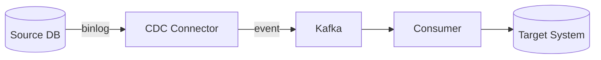
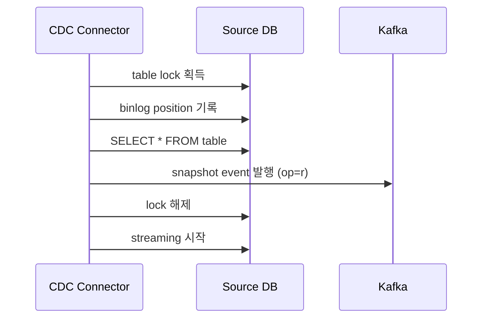
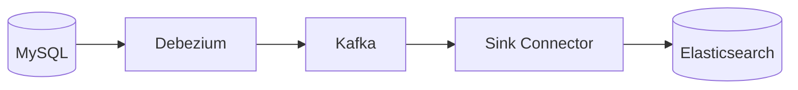
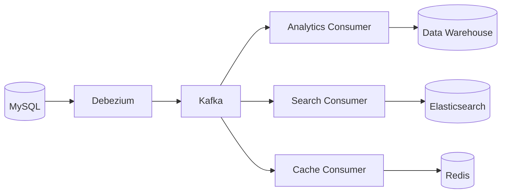
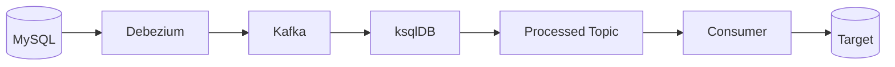

## CDC Pipeline



- **CDC(Change Data Capture) pipeline**은 source database의 변경 사항을 실시간으로 capture하여 target system으로 전파하는 architecture입니다.
    - database의 transaction log(binlog, WAL)를 읽어 insert, update, delete event를 추출합니다.
    - polling 방식과 달리 변경 발생 즉시 event가 생성되어 near real-time 동기화가 가능합니다.

- CDC pipeline의 주요 사용 사례는 **data 동기화, event 기반 architecture 구축, 실시간 analytics**입니다.
    - OLTP database에서 OLAP database로 data를 복제합니다.
    - legacy system의 data 변경을 event로 발행하여 MSA 환경에서 활용합니다.
    - 검색 engine이나 cache를 실시간으로 갱신합니다.


---


## CDC Pipeline 구성 요소

- CDC pipeline은 **source, CDC connector, message broker, consumer, target**의 5개 구성 요소로 이루어집니다.
    - 각 구성 요소는 독립적으로 확장 가능하며, 장애 시 개별 복구가 가능합니다.


### Source Database

- source database는 **변경 사항이 발생하는 원본 database**입니다.
    - MySQL, PostgreSQL, MongoDB 등 대부분의 database를 지원합니다.
    - transaction log를 통해 변경 사항을 추출하므로 application code 수정이 불필요합니다.

- CDC를 위해 source database에서 **binlog 또는 WAL 설정**이 필요합니다.
    - MySQL : `binlog_format=ROW`, `binlog_row_image=FULL` 설정이 필요합니다.
    - PostgreSQL : `wal_level=logical`, replication slot 생성이 필요합니다.


### CDC Connector

- CDC connector는 **source database의 transaction log를 읽어 event로 변환**하는 component입니다.
    - Debezium이 가장 널리 사용되는 open source CDC connector입니다.
    - database별 protocol을 추상화하여 일관된 event format을 제공합니다.

- CDC connector는 **현재 읽기 위치(offset)**를 관리하여 장애 복구 시 중복 없이 재개합니다.
    - MySQL의 경우 binlog file명과 position을 저장합니다.
    - Kafka Connect를 사용하면 offset이 Kafka topic에 자동 저장됩니다.


### Message Broker

- message broker는 **CDC event를 buffering하고 consumer에게 전달**하는 역할을 합니다.
    - Apache Kafka가 CDC pipeline의 message broker로 가장 많이 사용됩니다.
    - event의 순서 보장과 내구성을 제공합니다.

- Kafka를 사용할 때 **table당 하나의 topic**을 생성하는 것이 일반적입니다.
    - topic naming convention : `{server}.{database}.{table}` 형식을 사용합니다.
    - primary key를 partition key로 사용하여 동일 record의 순서를 보장합니다.


### Consumer

- consumer는 **message broker에서 event를 읽어 target system에 반영**하는 component입니다.
    - Kafka Connect Sink Connector, custom application, stream processing engine 등이 사용됩니다.
    - event를 변환하거나 filtering하는 logic을 포함할 수 있습니다.

- consumer는 **멱등성(idempotency)을 보장**하도록 구현해야 합니다.
    - 동일한 event를 여러 번 처리해도 결과가 같아야 합니다.
    - upsert 연산을 사용하거나 event의 고유 식별자로 중복을 검사합니다.


### Target System

- target system은 **CDC event가 최종적으로 반영되는 대상**입니다.
    - database, search engine, cache, data warehouse 등 다양한 system이 대상이 됩니다.
    - 용도에 따라 data 구조를 변환하여 저장합니다.


---


## CDC Event 구조

- CDC event는 **변경 전 data(before), 변경 후 data(after), metadata**로 구성됩니다.
    - Debezium의 경우 Kafka Connect의 message format을 따릅니다.

```json
{
  "before": {
    "id": 1,
    "name": "old_name",
    "updated_at": "2026-01-27T10:00:00Z"
  },
  "after": {
    "id": 1,
    "name": "new_name",
    "updated_at": "2026-01-28T10:00:00Z"
  },
  "source": {
    "connector": "mysql",
    "db": "inventory",
    "table": "products",
    "ts_ms": 1706432400000
  },
  "op": "u"
}
```


### Operation Type

- `op` field는 **변경 유형**을 나타냅니다.

| op | 의미 | before | after |
| --- | --- | --- | --- |
| **`c`** | create (insert) | null | 새 data |
| **`u`** | update | 변경 전 data | 변경 후 data |
| **`d`** | delete | 삭제된 data | null |
| **`r`** | read (snapshot) | null | 현재 data |


### Source Metadata

- `source` field는 **event의 출처 정보**를 포함합니다.
    - `connector` : mysql, postgresql 등 CDC connector 유형.
    - `db`, `table` : source database와 table 이름.
    - `ts_ms` : source database에서 변경이 발생한 timestamp.
    - `pos`, `file` : MySQL에서 binlog 위치.
    - `lsn` : PostgreSQL에서 log sequence number.


---


## Snapshot과 Streaming

- CDC는 **초기 snapshot과 이후의 streaming** 두 단계로 동작합니다.


### Initial Snapshot



- initial snapshot은 **기존 data를 target system에 복제하는 과정**입니다.
    - CDC connector가 처음 시작할 때 실행됩니다.
    - source table의 모든 row를 읽어 `op=r` event로 발행합니다.

- snapshot 중 **data 일관성을 보장하기 위한 전략**이 필요합니다.
    - MySQL : `FLUSH TABLES WITH READ LOCK`으로 global lock을 획득하거나, GTID 기반으로 lock 없이 수행합니다.
    - PostgreSQL : snapshot transaction의 consistent view를 활용합니다.

- snapshot 모드는 **성능과 일관성 trade-off**에 따라 선택합니다.
    - `initial`이 기본값으로, 최초 1회만 snapshot을 수행합니다.
    - `always`는 connector 재시작마다 snapshot을 수행합니다.
    - `never`는 snapshot 없이 현재 binlog position부터 시작합니다.
    - `schema_only`는 schema만 snapshot하고 data는 streaming으로만 수집합니다.


### Change Streaming

- change streaming은 **snapshot 이후 발생하는 변경 사항을 실시간으로 capture**하는 단계입니다.
    - binlog/WAL을 지속적으로 polling하여 새로운 event를 추출합니다.
    - source database에 부하를 최소화하면서 near real-time으로 동기화합니다.

- streaming 중 **offset 관리**가 중요합니다.
    - connector는 마지막으로 처리한 binlog position을 주기적으로 저장합니다.
    - 장애 복구 시 저장된 position부터 재개하여 data 손실을 방지합니다.


---


## CDC Pipeline 설계 시 고려 사항

- CDC pipeline 설계 시 **schema evolution, ordering, delivery semantics, lag monitoring**을 고려해야 합니다.
    - 각 요소는 data 정합성과 system 안정성에 직접적인 영향을 미칩니다.


### Schema Evolution

- source database의 **schema 변경을 CDC pipeline에서 처리**해야 합니다.
    - column 추가, 삭제, type 변경 등이 발생할 수 있습니다.
    - Debezium은 schema 변경을 감지하여 별도의 schema history topic에 기록합니다.

- schema 호환성 전략을 선택해야 합니다.
    - **backward compatible** : 새 schema가 이전 data를 읽을 수 있으며, consumer를 먼저 배포합니다.
    - **forward compatible** : 이전 schema가 새 data를 읽을 수 있으며, producer를 먼저 배포합니다.
    - Avro와 Schema Registry를 사용하면 schema 호환성을 자동으로 검증합니다.


### Ordering 보장

- CDC event의 **순서 보장 범위**를 결정해야 합니다.
    - 동일 record의 변경 순서는 primary key를 partition key로 사용하여 보장합니다.
    - 서로 다른 record 간의 전역 순서는 보장되지 않습니다.

- **인과 관계가 있는 변경**의 순서 처리가 필요합니다.
    - 외래 key 관계가 있는 table 간의 순서 문제가 발생할 수 있습니다.
    - parent record가 child보다 먼저 처리되도록 consumer에서 처리하거나, 단일 transaction의 event를 묶어서 처리합니다.


### Exactly-Once Delivery

- CDC pipeline에서 **exactly-once semantics를 달성하기는 어렵습니다**.
    - 일반적으로 at-least-once를 보장하고, consumer에서 멱등성을 구현합니다.

- exactly-once에 근접하기 위한 전략이 있습니다.
    - **transactional outbox** : source database와 동일 transaction으로 outbox table에 event를 기록합니다.
    - **idempotent consumer** : event의 고유 식별자로 중복 처리를 방지합니다.
    - **Kafka transactions** : Kafka producer와 consumer 간 exactly-once를 활용합니다.


### Lag Monitoring

- CDC pipeline의 **지연(lag)을 monitoring**해야 합니다.
    - source database의 변경 발생 시각과 target 반영 시각의 차이를 측정합니다.
    - lag이 증가하면 consumer 성능 문제나 network 지연을 의심합니다.

- 주요 monitoring 지표는 다음과 같습니다.
    - **replication lag** : source timestamp와 현재 시각의 차이.
    - **consumer lag** : Kafka topic의 최신 offset과 consumer offset의 차이.
    - **throughput** : 초당 처리되는 event 수.


---


## CDC Pipeline Architecture Pattern

- CDC pipeline은 **용도와 복잡도에 따라 여러 architecture pattern**으로 구성됩니다.
    - Single Target, Fan-Out, Stream Processing 등의 pattern이 있습니다.


### Single Target Pattern



- 가장 단순한 pattern으로, **단일 source에서 단일 target으로 data를 복제**합니다.
    - 검색 engine 동기화, cache 갱신 등에 사용됩니다.
    - Kafka Connect의 source와 sink connector만으로 구성 가능합니다.


### Fan-Out Pattern



- **하나의 CDC event를 여러 target system으로 전파**하는 pattern입니다.
    - Kafka의 consumer group을 활용하여 각 target이 독립적으로 event를 소비합니다.
    - target별로 다른 변환 logic을 적용할 수 있습니다.


### Stream Processing Pattern



- **CDC event를 실시간으로 변환, 집계, join**하는 pattern입니다.
    - ksqlDB, Kafka Streams, Flink 등의 stream processing engine을 사용합니다.
    - 복잡한 business logic을 적용하거나 여러 table의 data를 결합합니다.

- 주요 사용 사례는 여러 table join, 실시간 집계, event filtering입니다.
    - 여러 table의 data를 join하여 denormalized view를 생성합니다.
    - 최근 1시간 주문 수와 같은 실시간 집계를 수행합니다.
    - event filtering 및 enrichment를 적용합니다.


---


## 장애 대응

- CDC pipeline의 장애는 **connector, source database, consumer** 세 지점에서 발생할 수 있습니다.
    - 각 지점별 장애 특성과 복구 전략이 다릅니다.


### Connector 장애

- CDC connector 장애 시 **offset 기반으로 복구**합니다.
    - Kafka Connect는 connector의 offset을 내부 topic에 저장합니다.
    - connector 재시작 시 마지막 offset부터 재개하여 data 손실을 방지합니다.

- **snapshot 중 장애**가 발생하면 snapshot을 처음부터 다시 수행해야 합니다.
    - snapshot 완료 전에는 offset이 commit되지 않습니다.
    - 대용량 table의 경우 snapshot 시간이 길어질 수 있으므로 주의가 필요합니다.


### Source Database 장애

- source database 장애 시 **binlog retention 기간 내에 복구**해야 합니다.
    - binlog가 purge되면 CDC connector가 재개할 수 없습니다.
    - 이 경우 snapshot을 다시 수행해야 합니다.

- **database failover** 시 CDC connector 재설정이 필요할 수 있습니다.
    - MySQL GTID를 사용하면 failover 후에도 position을 유지할 수 있습니다.
    - PostgreSQL은 replication slot이 primary에만 존재하므로 failover 시 재생성이 필요합니다.


### Consumer 장애

- consumer 장애 시 **consumer group의 rebalancing**이 발생합니다.
    - 다른 consumer instance가 해당 partition을 인계받습니다.
    - at-least-once delivery로 인해 일부 event가 중복 처리될 수 있습니다.

- 장애 복구 후 **backlog 처리**에 시간이 소요될 수 있습니다.
    - consumer lag이 증가하므로 일시적으로 scale-out이 필요할 수 있습니다.


---


## Reference

- <https://debezium.io/documentation/reference/stable/architecture.html>
- <https://www.confluent.io/blog/cdc-and-streaming-analytics-using-debezium-kafka/>
- <https://martinfowler.com/articles/data-mesh-principles.html>

