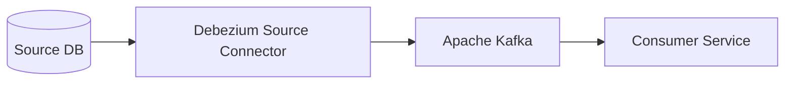
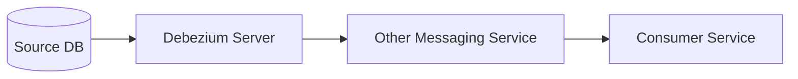
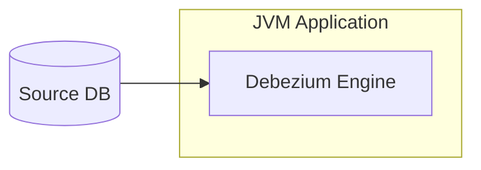

## Debezium : Database의 변경 사항을 실시간으로 감지하고 전달하기

> Debezium is a set of distributed services to capture changes in your databases so that your applications can see those changes and respond to them. Debezium records all row-level changes within each database table in a change event stream, and applications simply read these streams to see the change events in the same order in which they occurred.

- Debezium은 **database의 변경 사항을 실시간으로 capture**하여, application이 이러한 변경 사항을 감지하고 대응할 수 있게 해주는 분산 service입니다.
    - 각 database table의 행 단위 변경 사항을 change event stream으로 기록하며, application은 이 stream을 읽어 변경 event를 발생 순서대로 확인할 수 있습니다.

- Debezium은 실시간 data 동기화, microservice 간 data 일관성 유지, data 분석, monitoring, cache 무효화, 검색 index update 등 다양한 use case에 활용될 수 있습니다.
    - database의 변경 사항을 실시간으로 처리해야 하는 모든 scenario에 적합합니다.

### Debezium의 주요 특징

- Debezium은 **Log 기반 CDC** 방식으로 database의 변경 사항을 capture합니다.
    - **transaction log를 읽어들여 database의 변경 사항을 실시간으로 감지**하고 이를 다른 시스템으로 전달합니다.

- Log 기반 CDC 방식을 채용하였기에, Log 기반 CDC의 장점을 동일하게 가집니다.

1. **완전한 Data 변경 Capture** : 모든 data 변경 사항을 누락 없이 포착합니다.
    - database의 commit된 transaction을 실시간으로 추적하여 INSERT, UPDATE, DELETE 연산을 정확하게 capture합니다.

2. **낮은 지연 시간** : MySQL이나 PostgreSQL의 경우 millisecond 단위의 지연 시간으로 변경 사항을 감지하며, 잦은 polling으로 인한 CPU 사용량 증가를 방지합니다.
    - binary log나 WAL(Write-Ahead Log)을 직접 읽어 효율적으로 처리합니다.

3. **Data Model 유지** : "Last Updated" 같은 추가 column이 필요하지 않습니다.
    - 기존 application의 data model을 변경하지 않고도 CDC를 구현할 수 있습니다.

4. **삭제 Event Capture** : data 삭제 작업도 감지 가능합니다.
    - 삭제된 record의 key와 이전 값을 포함한 완전한 정보를 제공합니다.

5. **풍부한 Metadata** : 이전 record 상태, transaction ID, 원인이 된 query 등 다양한 metadata를 capture할 수 있습니다.
    - source database의 schema 변경 사항도 추적 가능합니다.

### Debezium의 주요 기능

1. **Snapshot** : connector 시작 시 필요한 log가 없는 경우, database의 현재 상태를 초기 snapshot으로 생성할 수 있습니다.
    - runtime에 trigger할 수 있는 증분 snapshot도 지원됩니다.
    - schema 변경이나 data 복구 시에도 부분 snapshot을 활용할 수 있습니다.
    - snapshot mode를 구성하여 초기 load 동작을 제어할 수 있습니다.

2. **Filtering** : include/exclude list를 통해 capture할 schema, table, column을 구성할 수 있습니다.
    - 정규 표현식을 사용한 동적 filtering이 가능합니다.
    - 특정 database 사용자의 변경 사항만 capture하도록 설정할 수 있습니다.
    - 조건부 filtering을 통해 특정 조건을 만족하는 record만 capture할 수 있습니다.

3. **Masking** : 민감한 data가 포함된 특정 column의 값을 masking 처리할 수 있습니다.
    - hash, tokenization, 난독화 등의 다양한 masking algorithm을 제공합니다.
    - custom masking 변환기를 구현하여 사용할 수 있습니다.
    - 조건부 masking으로 특정 상황에서만 masking을 적용할 수 있습니다.

4. **Monitoring** : 대부분의 connector는 JMX를 통한 monitoring이 가능합니다.
    - 지연 시간, 처리량, 오류율 등 다양한 metric을 제공합니다.
    - Prometheus와 Grafana를 통한 시각화가 가능합니다.
    - 알림 설정을 통해 문제 상황을 즉시 감지할 수 있습니다.

5. **Message 변환** : message routing, filtering, event 평탄화 등을 위한 즉시 사용 가능한 변환 기능을 제공합니다.
    - SMT(Single Message Transform)을 통한 message 구조 변경이 가능합니다.
    - outbound routing을 통해 조건에 따라 다른 topic으로 message를 전송할 수 있습니다.
    - schema 진화(evolution)를 지원하여 schema 변경에 유연하게 대응할 수 있습니다.
    - event 평탄화를 통해 복잡한 관계형 data를 단순화할 수 있습니다.

---

## Debezium Architecture : 여러 가지 사용 방식

- Debezium은 기본적으로 Apache Kafka Connect를 위한 source connector set이지만, 다른 방식으로도 사용할 수 있습니다.

### 1. Kafka Connect Source Connector ([참고 문서](https://debezium.io/documentation/reference/stable/architecture.html))

- Kafka Connect를 통해 Apache Kafka를 이용하여 변경 event를 전송합니다.
- Kafka Connect의 source connector로 Debezium을 사용하는, 가장 일반적인 사용 방식입니다.

### 2. Debezium Server ([참고 문서](https://debezium.io/documentation/reference/stable/operations/debezium-server.html))

- Debezium Server를 사용하여 다른 messaging infra로 통해 변경 event를 전송합니다.
- Kafka 외의 messaging service를 사용해야 하는 경우 사용합니다.

### 3. Debezium Engine ([참고 문서](https://debezium.io/documentation/reference/stable/development/engine.html))

- Debezium Engine library를 JVM 기반 application에 embed하여 사용합니다.
- messaging service를 통하지 않고, application으로 변경 사항을 바로 전달받고 싶은 경우 사용합니다.

---

## Reference

- <https://debezium.io/documentation/reference/stable/index.html>
- <https://debezium.io/documentation/reference/stable/features.html>
