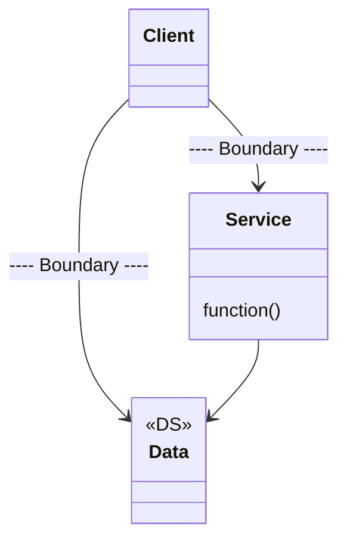
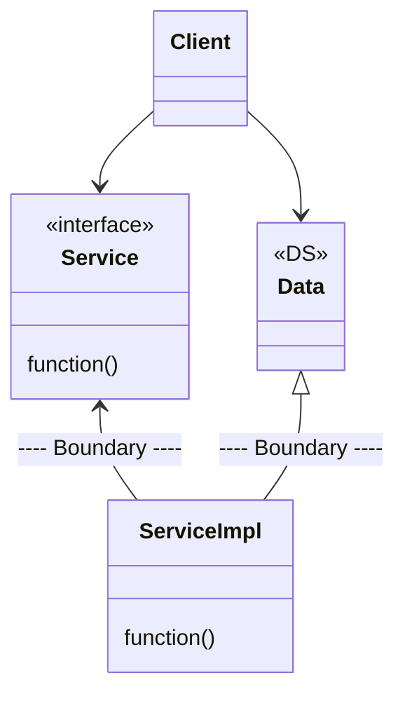

- 경계 횡단은 한 쪽에 있는 기능에서 반대편 기능을 호출하여 data를 전달하는 일입니다.
    - 이때, 적절한 위치에서 경계를 횡단하게 하려면 source code 의존성을 관리해야 합니다.
    - module 하나가 변경되면 이에 의존하는 다른 module도 변경하거나 다시 배포해야 할 수도 있기 때문입니다.

## 정방향 경계 횡단

- 가장 단순한 형태의 경계 횡단이며, 저수준 client가 고수준 service를 호출합니다.
    - runtime 의존성과 compile time 의존성은 모두 저수준에서 고수준으로 같은 방향을 향합니다.
    - 제어 흐름도 경계를 횡단할 때 저수준에서 고수준으로 흐릅니다.

## 역방향 경계 횡단

- 제어 흐름과 반대 방향으로 의존성을 역전하는 경우이며, 고수준 client가 저수준 service를 호출합니다.
    - runtime 의존성은 compile time 의존성과는 반대가 됩니다.

- 정적 link된 monolitic 구조의 실행 file이라도 이렇게 규칙적인 방식으로 구조를 분리하면 장점이 많습니다.
    - team들은 서로의 영역에 침범하지 않은 채, 자신만의 component를 독립적으로 작업할 수 있습니다.
    - 고수준 component는 저수준 세부 사항으로부터 독립적으로 유지됩니다.

---

## Reference

- Clean Architecture (도서) - Robert C. Martin
