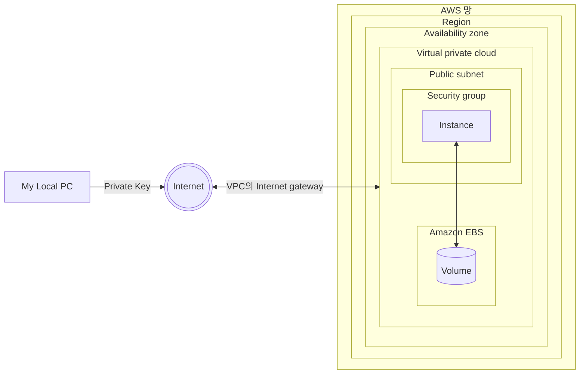

## EC2 : Elastic Compute Cloud

- EC2는 안전하고 크기 조정이 가능한 computing 자원(resource)을 Cloud에서 제공하는 Web service입니다.
    - Amazon의 검증된 computing 환경에서 application을 실행할 수 있습니다.
    - Web 규모의 Cloud computing 작업을 쉽게 할 수 있도록 설계되었습니다.

- EC2는 CPU와 Memory를 주로 제공합니다.
    - 'Elastic Compute Cloud'의 'Compute'가 '연산'을 의미하기 때문에, computing 자원에 대한 포괄적인 제어권을 제공합니다.

---

## 가동 중인 EC2 Instance에 접속하기 위한 환경

- endpoint(local PC)의 위치는 AWS 망 밖에 있기 때문에, internet으로 접근해야 합니다.
- VPC엔 Internet gateway를 통해 접속합니다.
    - 접속 시, local PC에 저장해둔 Privte Key를 사용합니다.

| 구성 | 설명 |
| --- | --- |
| AWS 망 | AWS 기능을 사용할 수 있는 망입니다. |
| Region | service 지역입니다. data center들이 있는 곳을 의미합니다. 서울 region은 `ap-northeast-2`라는 id로 구분됩니다. |
| Availability zone (AZ) | 가용 영역입니다. 한 region에 여러 개의 가용 영역을 포함됩니다. 하나의 가용 영역은 하나의 data center를 의미합니다. 서울에는 총 4개의 가용 영역이 있으며, `ap-northeast-2a`, `ap-northeast-2b`, `ap-northeast-2c`, `ap-northeast-2d`라는 id로 구분됩니다. |
| Virtual private cloud (VPC) | 가상 network입니다. |
| Internet gateway | VPC 접속 router입니다. |
| Public subnet | IP 통신을 할 수 있도록 설정된 network입니다. |
| Security group | 방화벽입니다. |
| Instance | EC2로 실행한 VM(Virtual Machine)입니다. |
| Amazon EBS | 저장 장치를 관리하는 service입니다. |
| Volume | 저장 장치입니다. Instance와 연결되어 있습니다. On-premise와 달리 저장 장치가 Instance 밖에 위치합니다. |

---

## Instance의 IP 종류

- EC2 Instance에는 외부 IP와 내부 IP가 있습니다.
- 외부 IP와 내부 IP는 1대1로 routing됩니다.

### 외부 IP : Public IP

- 외부 IP(Public IP)는 Internet gateway라는 router에 설정되어 있습니다.
- Instance(VM)은 이 외부 IP는 알지 못합니다.

### 내부 IP : Private IP

- Instance에 실제로 설정된 IP입니다.

---

## EC2 관련 Resource

### Security group

- Security group은 방화벽입니다.
- 방화벽은 기본적으로 하나가 준비되어 있습니다.
- Security group는 비용 없이 여러 개를 만들 수 있습니다.

### Key pair

- Key pair는 AWS 망 외부에서 Instance에 Instance에 안전하게 연결하기 위한 private key입니다.
- Key pair는 비용 없이 여러 개를 만들 수 있습니다.

- Key pair가 'pair'인 이유는 두 개의 key(public key, private key)이기 때문입니다.
    - public key는 server에 저장하고, private key는 사용자가 가지고 있어야 합니다.
    - Instance에 연결할 때 두 개의 key pair를 맞추어 인증합니다.

---

## Reference

- AWS Cloud 핵심 Service 활용 및 ECS EKS 개발 환경 구축 (강의) - 이한기
