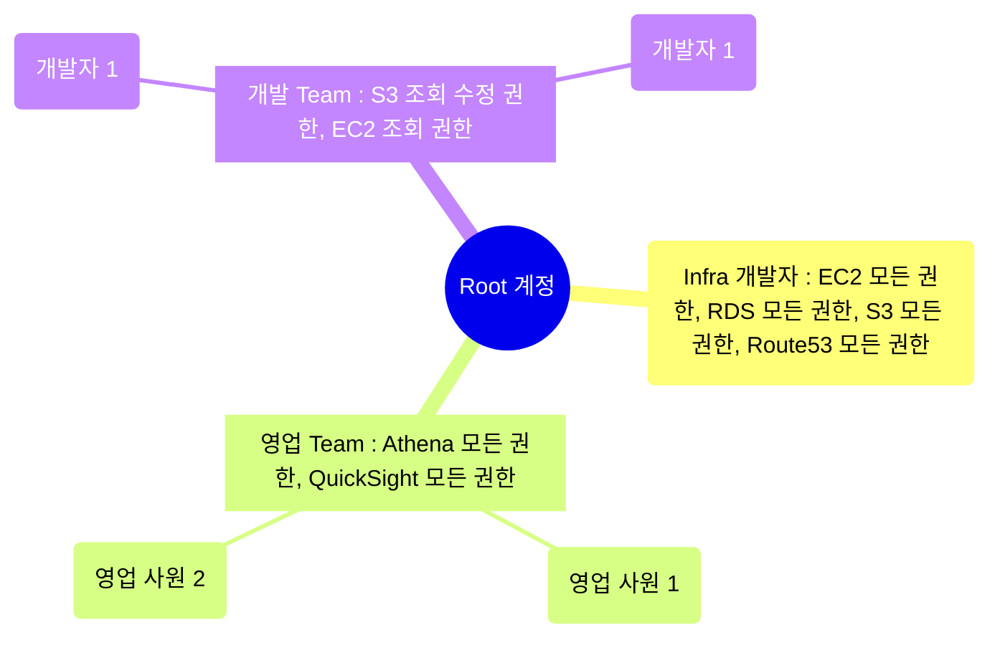

## IAM : Identify and Access Management

- IAM은 AWS의 여러 기능에 대한 사용자의 접근을 제어합니다.

- root 사용자는 하위 사용자와 사용자 group을 만들어 권한을 관리할 수 있습니다.
    - 사용자에게 권한을 부여할 수 있습니다.
    - group에 권한을 설정하고, 사용자를 group에 추가하여 관리할 수도 있습니다.

