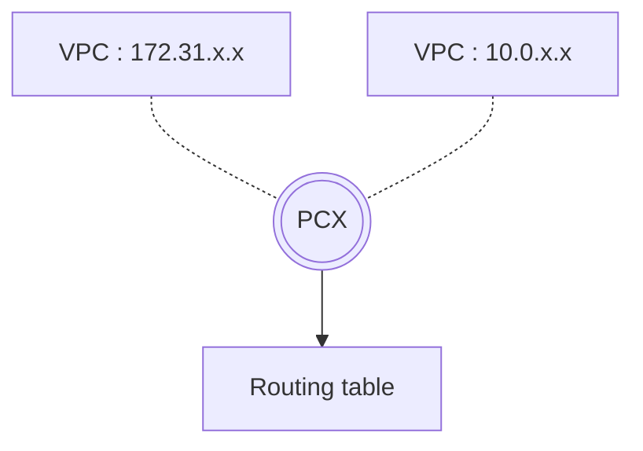

## VPC Peering

- peering이란 서로 다른 VPC에 있는 Instance 간의 통신을 가능하게 해주는 것입니다.
    - region이 달라도 peering할 수 있습니다.
    - 서로의 Private IP로 통신할 수 있게 해줍니다.

- Public IP 통신에는 peering이 필요하지 않습니다.
    - Security group의 Inbound 규칙에 `모든 ICMP`를 등록하면, Public IP로 연결할 수 있습니다.

- 같은 IP 대역을 사용하고 있다면 peering할 수 없습니다.
    - IP가 충돌하기 때문입니다.

---

### VPC PCX : VPC 간의 중개자

- 다른 VPC를 peering하기 위해 중개자 역할의 **PCX**(Peering Connection)를 생성합니다.
- PCX를 생성할 때는 **요청자(Requester) VPC**와 **수락자(Accepter) VPC**를 설정합니다.
- PCX를 생성한 후에, 실제로 통신할 수 있도록 PCX를 routing table에 연결합니다.
    - routing table에 PCX를 등록합니다.

---

## Reference

- AWS Cloud 핵심 Service 활용 및 ECS EKS 개발 환경 구축 (강의) - 이한기
