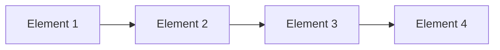

## 선형 자료 구조 : Data를 선형적으로 관리하기

- 선형 자료 구조는 **data가 일렬로 나열된 형태**의 자료 구조입니다.
    - 각 data 요소는 연속적으로 배치되며, 이전 요소와 다음 요소에 대해 고유한 선형 순서를 가집니다.
        - 자료들 간의 앞뒤 관계가 1:1의 선형 관계입니다.
    - data 요소들이 하나의 직선 형태로 배치되어 있어 한 번에 한 방향으로만 탐색이 가능합니다.

- 구조가 단순하고 접근 방식이 일관되어 **구현과 관리가 상대적으로 간단**합니다.
    - data가 일렬로 나열된 형태이기 때문에 요소 간의 관계가 단순합니다.
    - 배열은 index를 통해 직접 접근할 수 있고, 연결 List는 순차적으로 접근할 수 있어 각 자료 구조의 접근 방식이 명확하고 일관됩니다.

### 선형 자료 구조의 종류

|  | 설명 | 장점 | 단점 |
| --- | --- | --- | --- |
| **배열 (Array)** | **고정된 크기**의 **연속된 memory 공간**에 data 요소를 저장하며, index를 사용하여 임의의 요소에 접근할 수 있습니다. | **임의 접근(random access)이 빠르며 memory 사용이 효율적**입니다. | 크기가 고정되어 있어 **크기 변경이 어렵습니다.** |
| **연결 List (Linked List)** | 각 요소가 **다음 요소를 가리키는 pointer**를 포함하여 data를 저장하며, **동적 크기**를 가집니다. | 요소의 **삽입 및 삭제가 용이**합니다. | **임의 접근(random access)이 느리며**, 추가적인 memory 공간(pointer)이 필요합니다. |
| **Stack** | **후입선출(LIFO, Last In First Out) 원칙**을 따르며, 가장 최근에 추가된 요소가 가장 먼저 제거됩니다. | **구현이 간단**하고 함수 호출 stack과 같은 system 자원 관리에 유용합니다. | FIFO 구조가 필요한 상황에는 부적합합니다. |
| **Queue** | **선입선출(FIFO, First In First Out) 원칙**을 따르며, 가장 먼저 추가된 요소가 가장 먼저 제거됩니다. | **순차적으로 처리해야 하는 작업에 적합**합니다. | 후입선출이 필요한 상황에는 부적합합니다. |
| **Deque (Double-ended Queue)** | **양쪽 끝에서 삽입과 삭제가 모두 가능**한 자료 구조로, Stack과 Queue의 기능을 모두 포함합니다. | 양쪽에서 data를 추가/삭제할 수 있어 **유연성**이 높습니다. | **구현이 복잡**할 수 있으며, 단방향 삽입/삭제가 주로 필요한 경우에는 비효율적일 수 있습니다. |

- Stack, Queue, Deque는 배열이나 연결 List를 기반으로 구현될 수 있으며, 상황에 맞추어 두 가지 자료 구조 중에 무엇을 사용할지 선택하여 구현하면 됩니다.
    - **배열 기반 구현** : index를 사용하여 빠른 접근이 가능하지만, 크기가 고정되어 있어 크기를 변경하려면 새로운 배열을 생성해야 합니다.
    - **연결 List 기반 구현** : 동적 크기를 가지며 요소의 추가/삭제가 용이하지만, 각 요소에 대한 접근 시간이 `O(n)`으로 느립니다.
