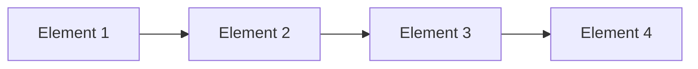

## 선형 자료 구조 : Data를 선형적으로 관리하기

- 선형 자료 구조는 **data가 일렬로 나열된 형태**의 자료 구조입니다.
    - 각 data 요소는 연속적으로 배치되며, 이전 요소와 다음 요소에 대해 고유한 선형 순서를 가집니다.
        - 자료들 간의 앞뒤 관계가 1:1의 선형 관계입니다.
    - data 요소들이 하나의 직선 형태로 배치되어 있어 한 번에 한 방향으로만 탐색이 가능합니다.

- 구조가 단순하고 접근 방식이 일관되어 **구현과 관리가 상대적으로 간단**합니다.
    - data가 일렬로 나열된 형태이기 때문에 요소 간의 관계가 단순합니다.
    - 배열은 index를 통해 직접 접근할 수 있고, 연결 List는 순차적으로 접근할 수 있어 각 자료 구조의 접근 방식이 명확하고 일관됩니다.

### 선형 자료 구조의 종류

|  | 설명 | 장점 | 단점 |
| 