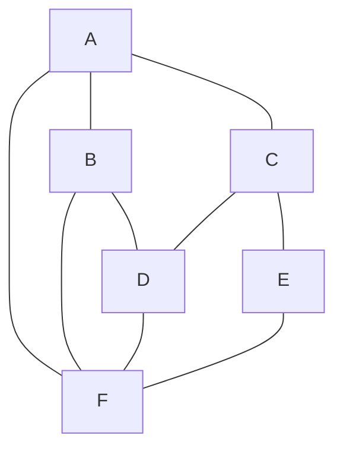

## 비선형 자료 구조 : Data가 순서 없이 복잡하게 연결된 구조

- 비선형 자료 구조(Non-linear Data Structure)는 data가 순차적으로 나열되지 않고 **계층적 또는 network 형태로 연결된 자료 구조**를 의미합니다.
    - 비선형 자료 구조는 한 node가 여러 개의 자식 node를 가질 수 있으며, data 사이의 관계가 더 복잡하게 얽혀 있습니다.
        - 따라서 선형 자료 구조보다 data 요소들 간의 복잡한 관계를 더 잘 표현할 수 있습니다.

### 비선형 자료 구조의 특징

- **계층적 관계** : data 요소들이 부모-자식 관계와 같이 계층적으로 배열됩니다.
    - 이러한 구조는 Tree와 같이 조직도나 file system에서 자주 사용됩니다.

- **다대다 관계** : 각 data 요소가 여러 다른 요소들과 연결될 수 있습니다.
    - 예를 들어, Graph에서는 하나의 정점이 여러 간선을 통해 다른 여러 정점들과 연결될 수 있습니다.

- **복잡한 연결** : data 요소들 간의 관계가 복잡하게 얽혀 있으며, 순환 구조를 가질 수도 있습니다.
    - 이는 network나 social network graph와 같은 구조를 표현할 때 유용합니다.

### 비선형 자료 구조의 장점

- **효율적인 검색 및 접근** : 비선형 자료 구조는 특정 data에 대한 빠른 검색 및 접근을 가능하게 합니다.
    - 예를 들어, 이진 탐색 Tree에서는 data의 삽입, 삭제, 검색이 평균적으로 `O(log n)`의 시간 복잡도로 이루어질 수 있습니다.

- **유연한 Data 표현** : 비선형 자료 구조는 복잡한 data 관계를 자연스럽게 표현할 수 있어, 현실 세계의 다양한 문제를 modeling하기에 적합합니다.
    - 예를 들어, Graph는 도로망, social network, 전기 회로 등을 modeling하는 데 유용합니다.

- **효율적인 Memory 사용** : 비선형 자료 구조는 필요한 부분만 memory에 적재(load)하여 사용할 수 있습니다.
    - 따라서 대규모 data를 처리할 때 memory 사용을 효율적으로 관리할 수 있습니다.

### 비선형 자료 구조의 단점

- **구현의 복잡성** : 비선형 자료 구조는 선형 자료 구조보다 구현이 복잡합니다.
    - 각 data 요소 간의 연결을 관리하고 유지하는 것이 어렵기 때문에, 구현 시 더 많은 주의가 필요합니다.

- **탐색의 복잡성** : data 요소 간의 관계가 복잡하여, 특정 data를 찾기 위한 탐색 과정이 복잡해질 수 있습니다.
    - 예를 들어, Graph 탐색에서는 깊이 우선 탐색(DFS)이나 너비 우선 탐색(BFS)과 같은 algorithm을 사용해야 합니다.

- **추가적인 Overhead** : data 요소 간의 관계를 저장하기 위한 추가적인 memory overhead가 발생할 수 있습니다.
    - 예를 들어, Graph의 인접 행렬 또는 인접 list를 저장하기 위한 추가적인 memory 공간이 필요합니다.

### 비선형 자료 구조의 종류 : Graph와 Tree

|  | Graph | Tree |
| --- | --- | --- |
| **정의** | node와 그 node를 연결하는 간선(edge)을 하나로 모아 놓은 자료 구조. | Graph의 한 종류. DAG(Directed Acyclic Graph, 방향성이 있는 비순환 Graph)의 한 종류. |
| **방향성** | 방향(directed) Graph, 무방향(undirected) Graph 모두 존재함. | 방향(directed) Graph. |
| **Cycle** | cycle 가능. 자체 간선(self-loop) 가능. 순환(cyclic) Graph, 비순환(acyclic) Graph 모두 존재함. | cycle 불가능. 자체 간선(self-loop) 불가능. 비순환(acyclic) Graph. |
| **Root Node** | root node의 개념이 없음. | 한 개의 root node만이 존재함. 모든 자식 node는 한 개의 부모 node만들 가짐. |
| **부모-자식** | 부모-자식의 개념이 없음. | 부모-자식 관계. top-bottom 또는 bottom-top으로 이루어짐. |
| **Model** | network model. | 계층 model. |
| **순회** | DFS, BFS. | DFS, BFS 안의 Pre-order, In-order, Post-order. |
| **간선의 수** | Graph에 따라 간선의 수가 다름. 간선이 없을 수도 있음. | node가 N개인 Tree는 항상 N-1개의 간선을 가짐. |
| **경로** | - | 임의의 두 node 간의 경로는 유일함. |
| **예시 및 종류** | 지도, 지하철 노선도의 최단 경로, 전기 회로의 소자들, 도로(교차점과 일방 통행길), 선수 과목. | 이진 Tree, 이진 탐색 Tree, 균형 Tree(AVL Tree, Red-Black Tree), 이진 Heap(최대 Heap, 최소 Heap). |

---

## Reference

- <https://gmlwjd9405.github.io/2018/08/12/data-structure-tree.html>