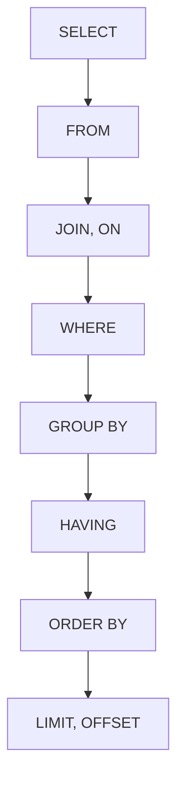
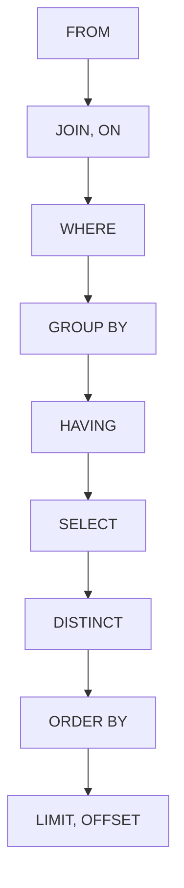

## 작성 순서

```mermaid
flowchart TD

select[SELECT] --> from[FROM] --> join[JOIN, ON] --> where[WHERE] --> group[GROUP BY] --> having[HAVING] --> order[ORDER BY] --> limit[LIMIT, OFFSET]
```

---

## 실행 순서

```mermaid
flowchart TD

from[FROM] --> join[JOIN, ON] --> where[WHERE] --> group[GROUP BY] --> having[HAVING] --> select[SELECT] --> distinct[DISTINCT] --> order[ORDER BY] --> limit[LIMIT, OFFSET]
```
