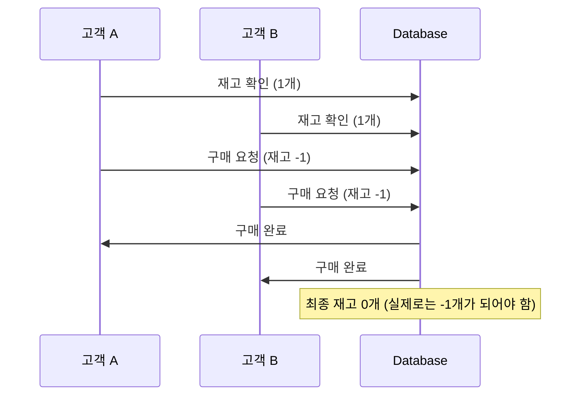
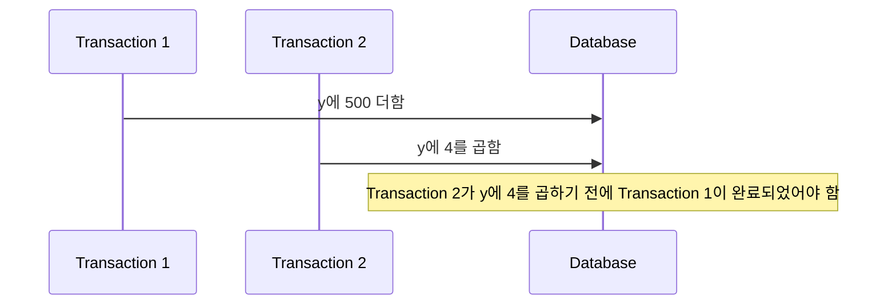
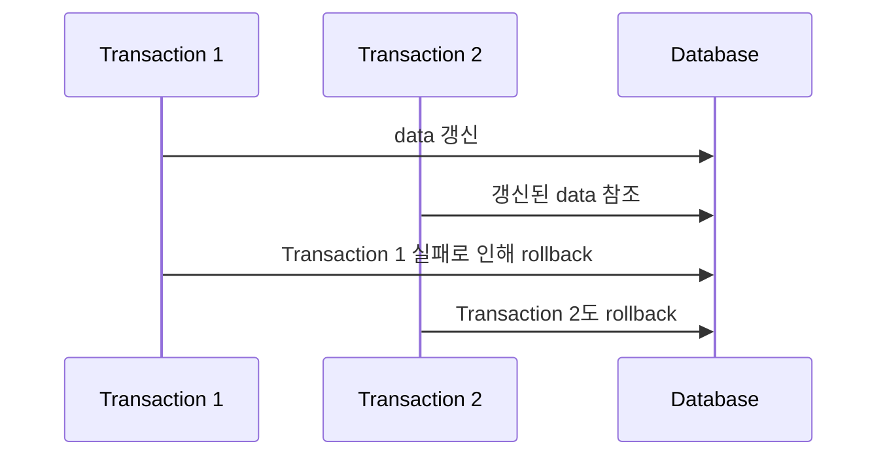
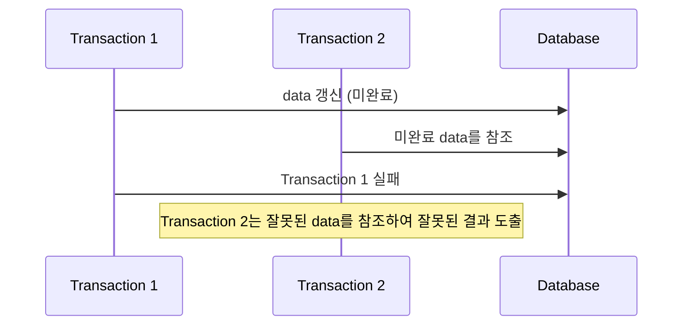

## 병행 제어 : 일관성과 효율성 모두 지키기

- **병행(concurrency)**은 매우 빠르게 여러 transaction 사이를 이동하면서 조금씩 처리를 수행하는 방식입니다.
    - 실제로는 한 번에 한 transaction만 수행하지만, 마치 동시에 여러 transaction을 수행하는 것처럼 보이도록 합니다.

- **병행 제어(concurrency control)**는 여러 transaction이 동시에 수행될 때 database의 일관성과 무결성을 유지하기 위한 기법입니다.
    - 병행 transaction들이 서로 영향을 미치지 않도록 제어하는 것이 목적입니다.
    - data를 일관성 있게 유지하면서 동시에 여러 사용자가 database를 최대한 공유할 수 있도록 합니다.

- 병행 제어는 database의 **일관성**(data 무결성 유지)과 **효율성**(system 성능 최적화)이라는 **서로 상충되는 목적을 동시에 추구**합니다.
    - **Database의 일관성 유지** : 여러 transaction이 동시에 실행되더라도 database의 무결성과 일관성을 보장하여, 모든 transaction이 완료된 후에도 database가 정확하고 일관된 상태를 유지하도록 합니다.
    - **Database의 최대 공유** : system의 자원을 효율적으로 활용하고 사용자 간의 data 공유를 최대화함으로써, 가능한 한 많은 사용자가 동시에 database에 접근할 수 있도록 합니다.
    - **System 활용도 극대화** : database system의 자원(CPU, Memory, Disk 등)을 최대한 효율적으로 사용하여 전체적인 system 성능을 향상시킵니다.
    - **사용자 응답 시간 최소화** : 각 transaction의 실행 시간을 최소화하고 사용자가 요청한 작업에 대한 응답을 빠르게 받을 수 있도록 하여, 사용자 경험을 개선하고 system의 효율성을 높입니다.
    - **단위 시간당 처리할 수 있는 Transaction 수 최대화** : 주어진 시간 내에 처리할 수 있는 transaction의 수를 늘려 system의 처리량(throughput)을 증가시킴으로써, 전체적인 system의 성능과 효율성을 높입니다.

---

## 병행 제어 없는 병행의 문제점

- 병행 제어 없이 병행 수행을 할 경우, 여러 transaction이 동시에 data에 접근하고 수정할 때 다양한 문제들이 발생합니다.

### 갱신 분실 (Lost Update)

- 갱신 분실은 **두 개 이상의 transaction이 동일한 data를 수정할 때 발생**하며, **한 transaction의 갱신 결과가 다른 transaction의 갱신에 의해 덮어쓰여서 일부 갱신이 소실되는 현상**을 말합니다.
    1. `Transaction A`와 `Transaction B`가 동시에 수량 data를 확인하고 각각 수정을 시도합니다.
    2. 두 transaction 모두 수량이 1인 것을 확인합니다.
    3. `Transaction A`가 수정 요청을 보내고 수량을 1 감소시킵니다.
    4. `Transaction B`도 수정 요청을 보내고 수량을 1 감소시킵니다.
    5. database는 두 요청을 모두 처리하여 수량을 0으로 만듭니다.
    6. 실제로는 수량이 -1이 되어야 하지만, `Transaction B`의 갱신이 `Transaction A`의 갱신을 덮어쓰게 되어 최종 수량은 0이 됩니다.

- 예를 들어, online shopping site에서 **두 명의 고객이 동시에 재고가 1개 남은 상품을 구매하려고 할 때** 갱신 분실 문제가 발생할 수 있습니다.
    - `고객 A`와 `고객 B`가 동시에 상품의 재고를 확인하고, 각각 재고 1개를 기반으로 구매 요청을 보냅니다.
    - database는 두 요청을 처리하지만, 실제로는 한 요청만 처리되었어야 합니다.
    - 이로 인해 두 번째 transaction의 갱신이 첫 번째 transaction의 갱신을 덮어쓰며, 최종 재고가 실제보다 잘못 저장됩니다.
    - `고객 B`의 구매로 인한 재고 감소가 '갱신 분실'되었습니다.
    - 이로 인해 database의 일관성이 깨지고, 실제 재고보다 더 많은 상품이 판매되는 문제가 발생합니다.

- 갱신 분실 문제를 해결하기 위해서는 transaction 격리 수준을 적절히 설정하거나, lock을 사용하여 동시 접근을 제어하는 등의 동시성 제어 기법을 적용해야 합니다.

### 모순성 (Inconsistency)

- 모순성은 여러 transaction이 병행 수행될 때, **한 transaction이 data를 수정하는 동안 다른 transaction이 수정 중인 data를 읽어 참조**하면서 발생하는 불일치 문제를 말합니다.
    - Transaction 1이 data를 갱신 중일 때, Transaction 2가 그 data를 참조하면 불일치한 결과가 도출될 수 있습니다.

- **두 개의 transaction이 data `y`를 각각 갱신하는 상황에서 모순성이 발생**할 수 있습니다.
    - `Transaction 1`이 `y`에 500을 더하고, 그 이후에 `Transaction 2`가 `y`에 4를 곱해야 합니다.
    - 하지만 `Transaction 2`가 먼저 실행되어 `y`에 4를 곱한 후에 `Transaction 1`이 500을 더하는 상황이 발생할 수 있습니다.
    - 이는 data의 일관성을 해치며, transaction의 결과가 서로 모순(data 불일치)되게 됩니다.

### 연쇄 복귀 (Cascading Rollback)

- 연쇄 복귀는 **한 transaction의 실패로 인해 다른 transaction들이 함께 rollback되는 현상**입니다.
    - 병행 수행 중인 transaction들이 서로 참조하고 있거나 상호 연관된 경우, 하나의 transaction이 실패하면 다른 transaction들도 영향을 받아 rollback될 수 있습니다.

- `Transaction 1`이 data를 갱신하고, 그 data를 기반으로 `Transaction 2`가 수행되는 상황에서 연쇄 복귀가 발생할 수 있습니다.

- `Transaction 1`이 실패하여 rollback되면, `Transaction 2`는 이미 `Transaction 1`이 갱신한 data를 참조하고 있기 때문에 `Transaction 2`도 rollback되어야 합니다.
- 연쇄적인 rollback은 data 일관성 문제로 이어집니다.

### 현황 파악 오류 (Uncommitted Dependency)

- 현황 파악 오류는 **한 transaction이 아직 commit되지 않은 data를 다른 transaction이 참조하면서 발생하는 문제**를 의미합니다.
    - 중간 상태의 data에 의존하여 잘못된 결과를 도출할 수 있는 위험을 동반합니다.

- `Transaction 1`이 data를 갱신하고 있지만 아직 commit되지 않은 상태에서 `Transaction 2`가 그 data를 참조하는 상황에서 현황 파악 오류가 발생할 수 있습니다.

- `Transaction 1`이 실패한 후에도 `Transaction 2`는 이미 실패한 data를 기반으로 연산을 수행했기 때문에, `Transaction 2` 역시 오류를 내포할 수밖에 없습니다.
- 현황 파악 오류는 transaction의 무결성과 신뢰성을 저하시킵니다.

---

## 병행 제어 기법

- 각 환경과 요구사항에 따라 적절한 병행 제어 기법을 선택하고 혼합하여, database의 일관성과 성능을 최적화할 수 있습니다.

| 기법 | 주요 특징 | 장점 | 단점 | 적합한 사용 상황 |
| --- | --- | --- | --- | --- |
| **Locking** | data에 잠금을 걸어 독점적 사용 | data 일관성 보장, 구현이 상대적으로 간단 | 교착 상태 발생 가능, 잠금 단위에 따른 성능 차이 | data 일관성이 매우 중요한 경우, transaction 충돌이 빈번한 환경 |
| **Timestamp Ordering** | transaction에 timestamp 부여하여 순서대로 실행 | 교착 상태 발생 없음, 우선 순위 부여 가능 | Rollback 발생률 높음, 연쇄 복귀 가능성 | transaction 우선 순위가 중요한 경우, 교착 상태를 완전히 피해야 하는 상황 |
| **Optimistic Concurrency Control** | transaction 종료 후 검증 | 충돌이 적은 환경에서 높은 성능, 잠금 overhead 없음 | 충돌 시 rollback 비용 높음, 검증 단계에서 병목 현상 가능 | 읽기 위주의 transaction이 많은 환경, 충돌 가능성이 낮은 상황 |
| **Multi-version Concurrency Control** | data의 여러 version 유지 | 읽기 작업의 병행성 향상, rollback 감소 | 저장 공간 증가, version 관리 복잡성 | 읽기와 쓰기 작업이 혼재된 환경, 긴 transaction과 짧은 transaction이 공존하는 상황 |

### Locking : 잠금 기법

- Locking은 transaction이 data를 독점적으로 사용하기 위해 **잠금을 걸어 다른 transaction의 접근을 막는 기법**입니다.
    - transaction이 lock을 걸면 해당 data는 unlock될 때까지 독점적으로 사용됩니다.
    - data의 잠금 단위는 field, record, table 등으로 설정할 수 있습니다.
    - 이를 통해 상호 배제 기능을 제공하며, 잠금을 설정한 transaction이 해제(unlock)할 때까지 data를 독점적으로 사용할 수 있습니다.
        - **상호 배제(mutual exclusion)는 여러 process나 transaction이 동시에 공유 자원에 접근하지 못하도록 하는 기법입니다.

- **한 번에 locking 할 수 있는 data의 크기**를 **locking 단위**라고 하며, field, record, table, file, database 모두 locking 단위가 될 수 있습니다.

- **locking 단위의 크기에 따라 병행성 수준과 성능의 차이가 발생**합니다.
    - 병행성 수준은 여러 transaction이 동시에 실행될 수 있는 정도를 의미합니다.
    - **locking 단위가 클수록** 병행 제어가 단순해지고 관리하기가 편해지지만, 병행성 수준이 낮아집니다.
    - **locking 단위가 작을수록** 병행 제어가 복잡해지고 overhead가 증가하지만, 병행성 수준과 database 공유도가 높아집니다. 

- locking 기법은 **교착 상태(deadlock)가 발생할 수 있다는 한계점**이 있습니다.
    - 교착 상태란 여러 transaction이 특정 data에 lock을 한 채 다른 transaction이 lock을 수행한 data에 접근하려고 할 때 실행을 하지 못하고 서로 무한정 기다리는 상태를 말합니다.
    - 예를 들어, `Transaction 1`에서 `x`를 lock하고 `Transaction 2`에서 `y`를 lock한 경우에, `Transaction 1`도 `y`에 접근할 수 없고 `Transaction 2`도 `x`에 접근할 수 없게 되기 때문에, 서로 무한정 기다리게 됩니다.

- **locking의 종류에는 공유 잠금(S-lock)과 배타 잠금(X-lock)** 두 가지가 있으며, 둘 중 하나를 설정하는 기준은 읽기 연산(read)과 쓰기 연산(write)의 필요성에 따라 결정됩니다.
    - 읽기 연산(read)만 필요한 경우 공유 잠금을 설정하고, 쓰기 연산(write)이 필요한 경우 배타 잠금을 설정합니다.
    - 읽기와 쓰기 모두 필요한 경우에도 배타 잠금을 설정합니다.

| S-lock (공유 잠금) | X-lock (배타 잠금) |
| --- | --- |
| 읽기 연산(read)만 가능 | 읽기 연산(read)과 쓰기 연산(write) 모두 가능 |
| 다른 transaction도 읽기 연산(read)만 가능 | 다른 transaction은 읽기 연산(read)과 쓰기 연산(write) 모두 불가능 |
| 여러 transaction이 동시에 공유 잠금을 설정할 수 있음 | 하나의 transaction만이 배타 잠금을 설정할 수 있음 |

### Timestamp Ordering : Timestamp 순서 기법

- Timestamp Ordering 기법은 transaction 간의 충돌을 방지하고 일관성을 유지하기 위해 **transaction의 timestamp를 활용하는 방식**입니다.
    - transaction의 실행 순서를 미리 지정된 timestamp에 따라 결정하는 방법으로, 직렬 가능성(serializability)을 보장합니다.
    - transaction이 system에 들어오는 시점을 기준으로 각각 고유한 timestamp를 부여받고, 이 timestamp에 따라 database 연산이 수행됩니다.
    - timestamp는 database에서 transaction이 동시다발적으로 일어날 때, 그 **순서에 대한 명확한 규칙을 제공**합니다.

- Timestamp 순서 기법은 **직렬 가능성을 보장하고 교착 상태를 방지할 수 있다는 장점**이 있습니다.
    - **직렬 가능성 보장** : timestamp를 통해 transaction 간의 순서를 명확히 하여 직렬 가능한 스케줄을 보장할 수 있습니다.
    - **교착 상태 방지** : transaction 간에 자원 점유 대기 상태가 발생하지 않으므로 교착 상태(deadlock)를 예방할 수 있습니다.

- Timestamp 순서 기법은 **낙관적인 기법에 비해 비효율적이고 memory 및 연산 비용이 높다는 단점**이 있습니다.
    - **낙관적인 기법에 비해 비효율적** : 충돌이 자주 발생하면 transaction을 자주 중단해야 하므로 비효율적일 수 있습니다.
    - **memory 및 연산 비용** : 각 data 항목에 대해 Read Timestamp와 Write Timestamp를 지속적으로 관리해야 하므로 추가적인 memory와 연산 자원이 필요합니다.

#### Timestamp Ordering 기법의 주요 개념

1. **Timestamp** : transaction이 시작될 때 system이 부여하는 고유한 숫자.
    - timestamp는 transaction의 상대적 실행 순서를 나타내며, transaction을 구분하고, transaction의 시작 순서를 보장하는 데 사용됩니다.
    - timestamp에는 **Read Timestamp (RTS)**와 **Write Timestamp (WTS)** 두 가지 종류가 있습니다.
        - **Read Timestamp (RTS)** : 해당 data 항목을 가장 최근에 읽은 transaction의 timestamp.
        - **Write Timestamp (WTS)** : 해당 data 항목을 가장 최근에 기록한 transaction의 timestamp.

2. **Read Operation** : 읽기 연산.
    - transaction `T`가 data 항목 `X`를 읽으려면 `T`의 timestamp `TS(T)`가 data 항목 `X`의 Write Timestamp `WTS(X)`보다 커야 합니다.
        - 즉, `T`가 `X`를 쓰기 연산한 다른 transaction보다 나중에 실행된 transaction이어야 합니다.
    - 만약 `TS(T)` < `WTS(X)`인 경우, 이는 `X`가 이미 `T`보다 최신 transaction에 의해 갱신된 상태임을 의미하므로, `T`는 무효화되거나 중단됩니다.

3. **Write Operation** : 쓰기 연산.
   - transaction `T`가 data 항목 `X`를 쓰려면 `T`의 timestamp `TS(T)`가 `X`의 Read Timestamp `RTS(X)`와 Write Timestamp `WTS(X)` 모두보다 커야 합니다.
   - 만약 `TS(T)` < `RTS(X)`인 경우, 다른 transaction이 이미 `X`를 읽었기 때문에 쓰기 연산이 거부됩니다.
   - 마찬가지로, `TS(T)` < `WTS(X)`인 경우, `T`는 `X`보다 나중에 발생한 쓰기 연산을 덮어쓸 수 없으므로 쓰기 연산이 거부됩니다.

4. **병행 제어 및 직렬 가능성 보장** : timestamp를 기반으로 transaction 우선순위 결정.
    - Timestamp Ordering 기법은 transaction들이 data 항목에 대해 읽기 및 쓰기 연산을 수행하는 순서를 timestamp를 기반으로 결정함으로써, transaction 간의 충돌을 방지하고, 결과적으로 직렬 가능성을 보장합니다.
    - 만약 규칙을 위반하는 transaction이 발생하면 해당 transaction은 **중단**되거나 **재시작**되며, 일관성이 유지되도록 합니다.

### Optimistic Concurrency Control : 낙관적 병행 제어 기법

- 낙관적 병행 제어 기법(Optimistic Concurrency Control, OCC)은 transaction 간의 **충돌이 거의 발생하지 않을 것이라는 가정하에 설계된 병행 제어 기법**입니다.
    - transaction이 수행되는 동안 충돌 감지를 하지 않고, **transaction이 끝난 후에 충돌이 발생했는지 확인한 후 충돌이 발생하면 rollback을 수행하는 방식**으로 병행 제어를 처리합니다.

- 낙관적 병행 제어 기법은 **잠금 없이 동작하고, 교착 상태 방지할 수 있으며, overhead가 낮다는 장점**이 있습니다.
    - **잠금 없이 동작** : transaction 수행 중에 data 항목에 잠금을 걸지 않으므로, **잠금에 의한 병목 현상**이 발생하지 않습니다.
        - 따라서 충돌이 드문 환경에서 대체로 좋은 성능을 보입니다.
    - **교착 상태 방지** : transaction이 서로 자원을 점유하지 않으므로 **교착 상태(Deadlock)**가 발생하지 않습니다.
    - **낮은 overhead** : 잠금과 관련된 추가적인 비용이 없으므로, transaction의 처리 속도가 빨라질 수 있습니다.

- 낙관적 병행 제어 기법은 **충돌이 빈번한 환경에서 비효율적이고, rollback 비용이 높으며, 대규모 data에 비효율적이라는 단점**이 있습니다.
    - **충돌이 빈번한 환경에서 비효율적** : 충돌이 자주 발생하면 transaction이 검증 단계에서 자주 rollback될 수 있습니다.
        - 이는 transaction의 재시도를 유발하고, 결과적으로 system의 **성능 저하**를 초래할 수 있습니다.
    - **rollback 비용** : 충돌이 발생할 경우 transaction이 rollback되며, transaction이 수행한 모든 작업을 무효화해야 하므로 자원 낭비가 발생할 수 있습니다.
    - **대규모 data에 비효율적** : database에서 대규모의 transaction이 동시다발적으로 발생할 때 충돌 가능성이 높아지며, 검증과 rollback에 대한 비용이 증가할 수 있습니다.

- 따라서 낙관적 병행 제어는 **transaction 간의 충돌이 드물 것으로 예상되는 환경**에서 효과적입니다.
    - transaction 간 충돌이 적은 환경에서는 잠금과 관련된 overhead 없이 transaction을 병행 처리할 수 있어 성능을 향상시킬 수 있습니다.
    - 충돌이 드문 경우 성능이 우수하지만, 충돌이 빈번한 환경에는 적합하지 않습니다.
    - 예를 들어, **읽기 위주**의 transaction이 많은 system이나, **분산 system**에서 자주 사용됩니다.

#### OCC가 Transaction을 처리하는 세 단계

1. **Transaction 수행 단계 (Transaction Execution Phase)** : transaction이 data 항목을 읽고, **변경을 memory 상에서 수행**하는 단계입니다.
    - 이 단계에서 database의 실제 data는 변경되지 않고, transaction이 수정하려는 내용은 transaction의 local 작업 공간에 기록됩니다.
    - 다른 transaction과의 충돌을 고려하지 않고 자유롭게 작업을 수행할 수 있습니다.

2. **검증 단계 (Validation Phase)** : transaction의 **충돌 여부를 확인**하고 **commit 가능성을 결정**하는 단계입니다.
    - transaction이 완료되면, transaction이 수행한 읽기 및 쓰기 연산이 다른 transaction과 충돌하지 않았는지 검증합니다.
    - 이 단계에서 transaction의 작업을 commit할 수 있는지 결정합니다. 충돌이 없으면 transaction이 성공적으로 commit되고, 충돌이 발생하면 transaction이 rollback됩니다.
    - OCC는 transaction 간의 timestamp를 기반으로 충돌을 감지하며, 주로 두 transaction이 동일한 data 항목을 동시에 수정하려 할 때 충돌이 발생합니다.
    - 검증 단계에서 transaction 간 충돌을 확인하기 위해 두 가지 기준을 사용합니다.
        - **읽기-쓰기 충돌** : transaction이 읽은 data 항목을 다른 transaction이 동시에 수정하려 했는지 확인하며, 만약 충돌이 발생하면 transaction은 rollback됩니다.
        - **쓰기-쓰기 충돌** : transaction이 동시에 동일한 data 항목을 수정하려는 경우 발생하는 충돌이며, 두 transaction이 같은 data를 수정하려 할 때, 하나의 transaction만 commit되고 나머지는 rollback됩니다.

3. **쓰기 단계 (Write Phase)** : 검증 단계를 통과한 transaction의 **변경 사항을 실제 database에 반영**하는 단계입니다.
    - 검증 단계에서 충돌이 없다고 판단되면, transaction의 작업 결과를 실제 database에 반영합니다.
    - transaction이 사용했던 local 작업 공간의 data를 database에 적용하여 변경 내용을 확정합니다.

### Multi-version Concurrency Control : 다중 Version 병행 제어 기법

- 다중 Version 병행 제어 기법(Multi-version Concurrency Control, MVCC)은 **data의 여러 version을 유지**하여 transaction 간 충돌을 줄이고 읽기 일관성을 보장하면서도 높은 병행성을 제공하는 병행 제어 기법입니다.
    - data의 여러 version을 관리함으로써 **transaction들이 동일한 data를 동시에 읽고 수정할 수 있게** 합니다.
    - database 관리 system에서 transaction 간의 충돌을 최소화하고 병행성을 높이기 위해 사용되는 병행 제어 기법입니다.

- MVCC는 **병행성이 높고, 읽기 일관성을 보장하며, deadlock 발생 가능성을 줄여 준다는 장점**이 있습니다.
    - **높은 병행성** : 읽기 작업이 쓰기 작업을 차단하지 않기 때문에 높은 병행성을 제공합니다.
    - **읽기 일관성 보장** : transaction은 시작 시점의 data 상태를 항상 일관되게 읽을 수 있어, 사용자에게 일관된 읽기 환경을 제공합니다.
    - **Deadlock 감소** : MVCC는 읽기 작업이 잠금을 필요로 하지 않으므로, 읽기 작업으로 인한 deadlock 발생 가능성이 크게 줄어듭니다.

- MVCC는 **version 관리 overhead가 있고, 복잡한 구현이 필요하다는 단점**이 있습니다.
    - **Version 관리 Overhead** : 여러 version을 유지해야 하기 때문에, 저장 공간이 더 많이 필요합니다.
        - 또한 오래된 version을 정리하는 작업(garbage collection)도 필요할 수 있습니다.
    - **복잡한 구현** : data의 여러 version을 관리하고 정리하는 logic이 복잡하며, 성능 최적화가 쉽지 않습니다.

- MVCC는 **다중 사용자가 동시에 data를 처리할 때 발생하는 병행성 문제를 효과적으로 해결**하며, data의 일관성을 보장하면서 system의 성능을 최적화할 수 있는 기법입니다.
    - 주로 PostgreSQL, MySQL(InnoDB Engine)과 같은 현대적인 database에서 사용되며, 특히 OLTP(Online Transaction Processing) 환경에서 뛰어난 성능을 발휘합니다.
    - 사용자가 읽기와 쓰기를 동시에 수행할 때 일관성을 유지하면서도 높은 병행성을 제공하는 것이 중요한 경우 MVCC가 적합합니다.

#### MVCC의 주요 개념

1. **다중 Version 유지** : MVCC는 **data의 여러 version을 유지**합니다.
    - 즉, data가 갱신될 때마다 새로운 version이 생성되며, 이전 data는 별도의 version으로 보관됩니다.
    - 이를 통해 각 transaction은 자신이 시작될 때 존재했던 data의 snapshot을 읽을 수 있으며, 다른 transaction의 변경 사항이 아직 commit되지 않았을 경우 이를 무시하고 일관된 상태의 data를 읽을 수 있습니다.

2. **읽기-쓰기 충돌 방지** : transaction이 data를 읽을 때 data에 대한 잠금을 걸지 않기 때문에 **읽기 작업은 쓰기 작업과 충돌하지 않습니다.**
    - 이를 통해 읽기 작업이 대기할 필요가 없어지고 병행성이 높아집니다.
    - 쓰기 작업의 경우 새로운 version을 생성하기 때문에, 여러 transaction이 동시에 data를 수정하려 할 때도 각 transaction이 독립적인 version을 관리하며 충돌을 줄일 수 있습니다.

3. **Transaction Timestamp** : MVCC에서는 transaction의 timestamp나 ID를 활용하여 version을 관리합니다.
    - 각 transaction은 고유한 timestamp를 가지며, **이 timestamp를 기준으로 transaction이 접근해야 할 data의 적절한 version을 결정**합니다.
    - data version은 언제 생성되었는지와 유효성을 나타내는 timestamp를 포함하며, 이를 이용해 특정 transaction이 어떤 version을 읽어야 하는지를 결정하게 됩니다.

4. **읽기 일관성 보장** : MVCC는 transaction이 시작될 때의 database 상태를 유지하여 읽기 작업에 대해 일관된 결과를 제공합니다.
    - 따라서 transaction이 시작된 이후 다른 transaction이 data를 변경해도 해당 transaction은 변하기 이전의 상태를 읽게 되어, **일관된 읽기(consistent read)를 보장**합니다.
    - 이를 통해 **Phantom Read, Non-repeatable Read와 같은 문제를 해결**할 수 있습니다.

#### MVCC의 작동 방식

1. **읽기 작업** : transaction이 data를 읽을 때 MVCC는 해당 transaction의 timestamp와 data의 **여러 version을 비교하여 가장 적절한 version을 반환**합니다.
    - 이렇게 함으로써 읽기 작업이 다른 transaction의 쓰기 작업과 충돌하지 않으며, 대기 없이 data를 읽을 수 있게 됩니다.

2. **쓰기 작업** : transaction이 data를 수정할 때는 **기존 data를 갱신하지 않고, 대신 새로운 version을 생성**합니다.
    - 새로운 data version에는 transaction의 timestamp가 기록되며, 다른 transaction이 해당 data를 읽을 때 이 timestamp를 사용하여 올바른 version을 읽도록 합니다.
    - 만약 두 transaction이 동시에 동일한 data를 수정하려고 할 때, MVCC는 충돌을 감지하고 한 transaction을 rollback하거나 재시도하게 합니다.
        - 이를 통해 data 무결성을 유지합니다.

---

## Reference

- <https://rebro.kr/163>
