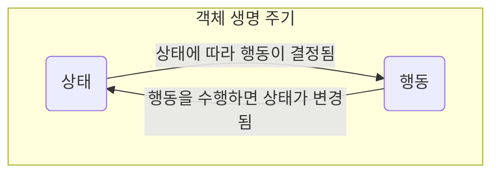
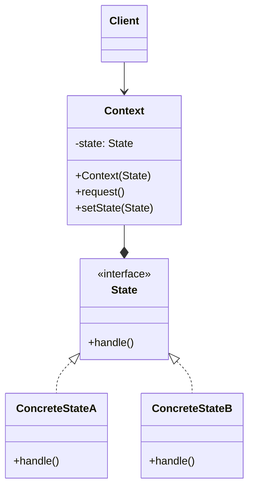
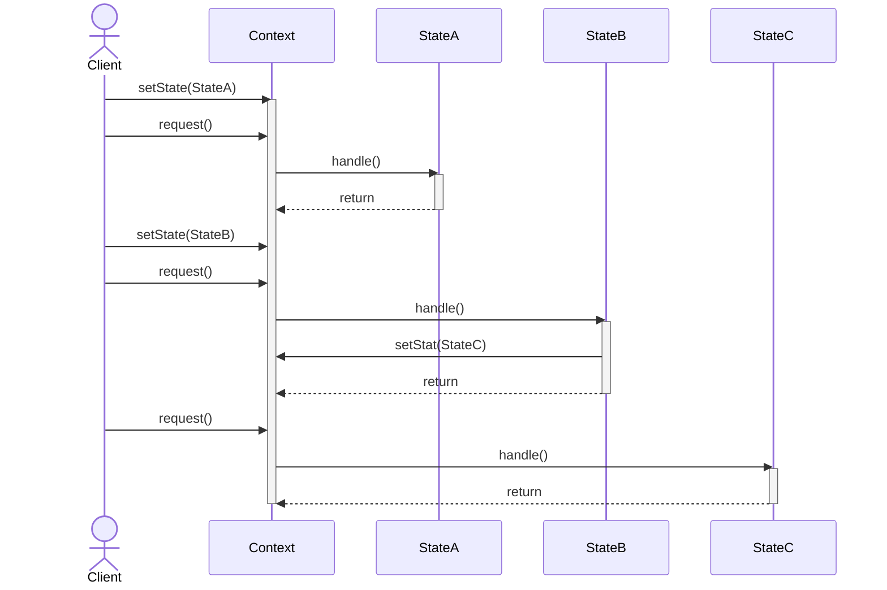
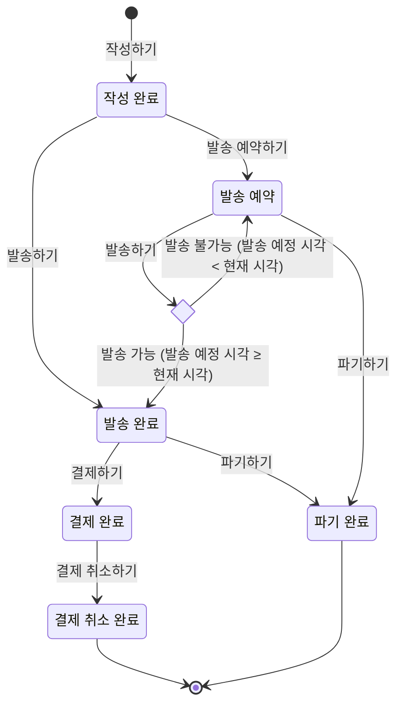
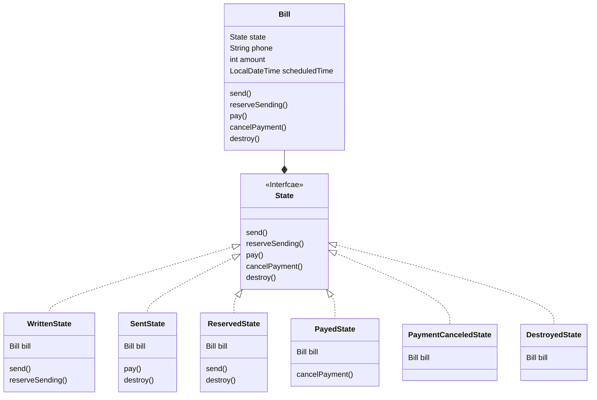
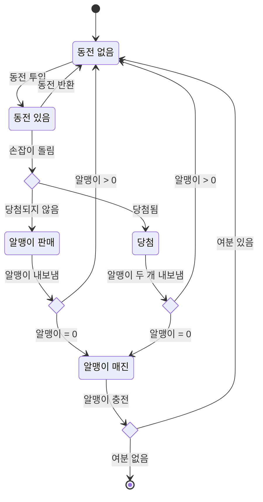
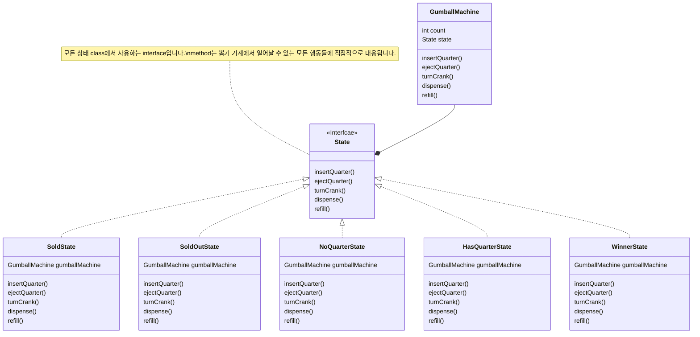

## State Pattern : 객체의 상태에 따라 행동 바꾸기

- State Pattern은 **객체의 상태 변화에 따라 해당 객체의 행동이 바뀌어야 할 때** 유용한 객체 지향 design pattern입니다.
    - 마치 객체의 class가 변경되는 것 같은 효과를 낼 수 있으며, 상태 변화에 따른 행동 변경 규칙을 체계적으로 관리할 수 있습니다.
        - 객체의 상태 변경 시 객체의 행동도 함께 바뀝니다.

- State Pattern은 **상태를 별도의 class로 캡슐화(encapsulation)**하고, **상태에 의존적인 행동을 해당 상태 class 내에 정의**합니다.
    - **어떤 상태에 어떤 행동을 해야하는지 명확하게 관리**함으로써, 상태 변화에 따른 행동 변경도 쉽게 정의할 수 있습니다.

- State Pattern이 적용된 code는 **SRP 원칙과 OCP 원칙을 준수**합니다.
    - 특정 상태와 관련된 code를 별도의 class로 구성하기 때문에, 단일 책임 원칙(SRP)을 준수합니다.
    - 기존의 상태나 사용자를 변경하지 않고 새로운 상태를 도입할 수 있기 때문에, 개방 폐쇄 원칙(OCP)을 준수합니다.
        - 각 상태의 행동을 수정하고 싶으면, 해당 상태 class만 수정하면 됩니다.
        - 상태를 추가(확장)하고 싶으면, 새로운 상태 class를 추가하면 됩니다.

- State Pattern을 사용하여 **복잡한 조건문(if-else, switch-case) 대신 객체 지향적인 방식으로 상태에 따른 행동의 변화를 관리**할 수 있게 됩니다.
    - 예를 들어, 문서 편집기에서 문서가 '초안', '검토 중', '승인됨', '거부됨'과 같은 여러 상태를 가질 때, State Pattern을 사용하여 각 상태에 해당하는 class를 구현하고, 문서의 현재 상태에 따라 적절한 행동(편집, 검토 요청, 승인, 거부)을 수행할 수 있습니다.
    - 만약 조건문을 사용하면, 상태를 가지고 있는 객체 안에서 상태에 따른 분기 logic을 작성하여, 직접 다른 행동들을 설졍해야 합니다.

- 객체의 **상태 전환 logic이 복잡**하거나 **중복되는 조건 분기가 많을 때**, State Pattern을 사용합니다.
    - **실행 시간(runtime)에 객체의 상태를 유연하게 변경**할 수 있으며, 동시에 각 상태별로 구체적인 행동을 명확하게 정의할 수 있습니다.

- State Pattern을 적용하면 상태 별로 class를 생성하므로, **관리해야 할 class 수가 많아진다는 단점**이 있습니다.
    - 상태의 규칙이 자주 변경되거나 상태 class의 수가 많을 경우, 상태 관리 logic이 복잡해질 수 있습니다.
    - 반대로 상태 변경이 드물거나 상태가 몇 개 없는 경우, pattern 적용이 과도하게 느껴질 수 있습니다.


### 상태(State)란?

- programming에서 **상태(state)**라는 단어는 흔하게 사용되며, 일반적으로 **특정 시점에 가질 수 있는 모든 가능한 조건이나 상황**을 의미합니다.
    - **변수의 값** : program 내에서 변수에 할당된 값은 program의 상태를 대변할 수 있습니다.
        - 예를 들어, game의 'score' 변수는 게임의 현재 상태(점수)를 나타냅니다.
    - **객체의 속성** : 객체 지향 programming에서, 객체의 속성(또는 member 변수)은 해당 객체의 상태를 정의합니다.
        - 예를 들어, '자동차' 객체가 가지고 있는 '속도'나 '색상' 속성은 그 자동차의 상태를 나타냅니다.
        - 예를 들어, 'email 계정"을 객체로 볼 때, "login 상태", "logout 상태", "읽지 않은 mail이 있는 상태", "읽지 않은 mail이 없는 상태" 등이 있을 수 있습니다.
            - 각각의 상태는 email 계정의 특정 속성들(사용자 login 여부, 읽지 않은 mail의 수)에 의해 결정됩니다.
    - **system 설정** : application 전체의 설정 또는 환경도 application의 상태로 볼 수 있습니다.
        - 예를 들어, web application의 'Dark Mode' 설정은 사용자의 선호에 따라 변경될 수 있는 application의 상태입니다.

- State Pattern에서의 '상태'는 **객체의 행동을 결정하는 내부 조건이나 구성**을 뜻합니다.
- 객체의 **상태는 객체가 가진 정보(data)와 그 정보를 처리하는 방법(행위)에 의해 결정**됩니다.
- 이렇게 **결정된 상태는 객체의 행위에 영향**을 미치고, 그 **행위는 다시 객체의 상태를 변경**할 수 있습니다.
    - 이 과정은 객체의 생명 주기 안에서 무한히 반복될 수 있습니다.




---


## State Pattern 구현


### State Pattern의 Class 구조



1. **`State` Interface** : 여러 상태들을 추상화한 상태.
    - `State` interface는 **모든 구체적인 상태 class가 따라야 하는 공통 interface**(또는 추상 class)입니다.
        - 이 interface에 상태에 따라 다르게 동작해야 하는 method들이 정의되어 있습니다.
    - 모든 구체적인 상태 class가 같은 interface(`State`)를 구현할 것이기 때문에, 상태를 사용하는 객체(`Context`)는 **구체적인 상태를 자유롭게 바꿔가면서 사용**할 수 있습니다.

2. **`ConcreteState` Class** : 구체적인 상태.
    - `ConcreteState` class는 **상태 interface를 구현하는(또는 추상 상태 class를 상속받는) 구체적인 상태 class**들입니다.
    - 각각의 상태 class는 추상화된 상태(`State`)를 구현하여, 특정 상태에 대한 행동을 정의합니다.
        - 예를 들어, 켜짐/꺼짐/대기, 제출/검토/승인/거부 등.
    - `ConcreteState` class는 상태를 사용하는 객체(`Context`)로부터 전달된 요청을 처리합니다.
        - 각 `ConcreteState`에서 그 요청을 처리하는 방법을 자기 나름의 방식으로 구현합니다.
        - 따라서 `Context`에서 상태를 바꾸기만 하면 행동도 바뀌게 됩니다.

3. **`Context` Class** : 상태를 사용하는 객체.
    - `Context` class는 사용자(`Client`)가 상호 작용하는 주 객체로, 여러 상태를 가질 수 있습니다.
    - `Context` 객체의 상태가 변경될 때, **`State` interface type의 상태 변수를 다른 구체적인 상태 객체(`ConcreteState`)로 교체**하여, 객체의 행동을 변경합니다.
        - `request()` method는 `state.handle()`을 호출하여 구체적인 상태 객체(`ConcreteState`)에게 작업(행동)을 위임합니다.
    - `Context` 객체는 추상화된 상태(`State`)만을 알고 있습니다.
        - 상속을 사용하지 않으며, 합성(composition)을 통해 여러 상태 객체(`ConcreteState`)를 바꿔가면서 사용합니다.
            - 상태를 사용하는 쪽은 구체적인 상태를 모르기 때문에 상태를 바꿀 수 있습니다.
        - 따라서, 동일한 상황에 대해서 어떤 상태를 가지고 있는지에 따라 다른 행동을 할 수 있습니다.

```java
class Context {
    State state;

    void setState(State state) {
        this.state = state;
    }

    void request() {
        state.handle(this);    // state 객체에 처리를 위임함
    }
}
```

```java
interface State {
    void handle(Context context);
}

class ConcreteStateA implements State {
    @Override
    public void handle(Context context) {
        // ...
    }
}

class ConcreteStateB implements State {
    @Override
    public void handle(Context context) {
        // ...
        context.setState(ConcreteStateC.getInstance());    // 상태에서 동작을 실행한 후 바로 다른 상태로 바꾸기도 함
    }
}

class ConcreteStateC implements State {
    @Override
    public void handle(Context context) {
        // ...
    }
}
```


### State Pattern 사용 흐름



- State Pattern에서 객체의 **상태는 실행 시간(runtime)에 변경될 수 있습니다.**
    - 상태 전환은 **상태 객체(`State`)가 제어**할 수도 있고, **상태를 사용하는 객체(`Context`)가 제어**할 수도 있습니다.

- 객체의 상태가 바뀌면, 해당 객체가 호출하는 method의 행동도 자동으로 바뀝니다.
    - 이는 객체가 현재의 **상태 객체에 모든 작업을 위임(delegate)하기 때문**입니다.

- 이러한 방식으로, State Pattern은 객체의 상태에 따라 객체의 행동을 유연하게 변경할 수 있는 구조를 제공합니다.

```java
class Client {
    public static void main(String[] args) {
        Context context = new Context();

        // 1. StateA 상태 설정
        context.setState(new ConcreteStateA());

        // 2. 현재 StateA 상태에 맞는 method 실행
        context.request();

        // 3. StateB 상태 설정
        context.setState(new ConcreteStateB());

        // 4. StateB 상태에서 다시 StateC 상태로 변경
        context.request();

        // 5. StateC 상태에 맞는 method 실행
        context.request();
    }
}
```


---


## 비슷하지만 다른 Strategy Pattern과 State Pattern

- State Pattern은 Strategy Pattern과 class 구성이 거의 동일하고, code 사용법도 비슷합니다.

- 두 pattern 모두 복잡한 조건 분기를 극복하기 위해, '전략' 또는 '상태'의 형태를 객체화합니다.
    - 객체의 일련의 행동이 캡슐화(encapsulation)되어 객체 지향 원칙을 준수합니다.
    - 합성(composition)을 통해 상속의 한계를 극복합니다.

- State Pattern은 Strategy Pattern의 확장된 version으로 간주할 수도 있습니다.

- State Pattern과 Strategy Pattern은 이렇게 **문제를 해결하는 방식(solution)은 비슷**하지만, 각각 **처한 상황(context)과 해결해야 할 문제(problem)에서 차이**가 있기 때문에, 다른 pattern으로 분류합니다.

| Strategy Pattern | State Pattern |
| --- | --- |
| **행동**(algorithm)을 객체화함.<br>(새로운 행동을 추가할 때 새로운 객체를 추가함.) | **상태**(state)를 객체화함.<br>(새로운 상태를 추가할 때 새로운 객체를 추가함.) |
| **Context 객체가 행동을 결정**함. | **State 객체가 행동을 결정**함.<br>(Context 객체가 행동할 때는 상태 전환 규칙에 따라 결정된 상태의 행동을 수행함.) |
| 전략 객체는 **그 전략만의 알고리즘 동작을 정의 및 수행**함.<br>(만일 전략을 상태화하면 class 폭발이 일어날 수 있음.) | 상태 객체는 상태가 적용되는 **대상 객체가 할 수 있는 모든 행동들을 정의 및 수행**함. |


---


## Example : Mobile 청구서

- 발송할 수 있는 형태의 청구서입니다.
- 발송을 예약하면 예약 시간 전에는 발송할 수 없습니다.






### Test Code

```java
import java.time.LocalDateTime;
import java.util.Scanner;

public class BillTest {
    public static void main(String[] args) throws InterruptedException {
        Scanner sc = new Scanner(System.in);

        System.out.println("청구서를 작성합니다.");
        System.out.print("전화번호 : ");
        String phone = sc.next();
        System.out.print("금액 : ");
        int amount = sc.nextInt();

        Bill bill = new Bill(phone, amount);

        while (true) {
            System.out.println("\n행동을 선택하세요.\n0. 상태보기\n1. 발송하기\n2. 발송 예약하기\n3. 결제하기\n4. 결제 취소하기\n5. 파기하기\n9. 종료하기");
            System.out.print("행동 번호 : ");
            int action = sc.nextInt();

            switch(action) {
                case 0:
                    System.out.println(bill);
                    break;
                case 1:
                    bill.send();
                    break;
                case 2:
                    System.out.print("예약 발송 시간을 몇 초 뒤로 설정하시겠습니까? : ");
                    long seconds = sc.nextLong();
                    bill.reserveSending(LocalDateTime.now().plusSeconds(seconds));
                    break;
                case 3:
                    bill.pay();
                    break;
                case 4:
                    bill.cancelPayment();
                    break;
                case 5:
                    bill.destroy();
                    break;
                case 9:
                    System.out.println("종료합니다.");
                    return;
                default:
                    System.out.println("없는 행동입니다.");
                    break;
            }

            Thread.sleep(1000);
        }
    }
}
```

### Context

```java
import java.time.LocalDateTime;

public class Bill {
    State writtenState;
    State sentState;
    State reservedState;
    State payedState;
    State paymentCanceledState;
    State destroyedState;

    State state;
    String phone;
    int amount;
    LocalDateTime scheduledTime;

    public Bill(String phone, int amount) {
        writtenState = new WrittenState(this);
        sentState = new SentState(this);
        reservedState = new ReservedState(this);
        payedState = new PayedState(this);
        paymentCanceledState = new PaymentCanceledState(this);
        destroyedState = new DestroyedState(this);

        this.state = writtenState;
        this.phone = phone;
        this.amount = amount;
    }

    public void send() {
        this.state.send();
    }

    public void reserveSending(LocalDateTime scheduledTime) {
        this.state.reserveSending(scheduledTime);
    }

    public void pay() {
        this.state.pay();
    }

    public void cancelPayment() {
        this.state.cancelPayment();
    }

    public void destroy() {
        this.state.destroy();
    }

    public String toString() {
        return "청구서 상태 : " + state.toString();
    }
}
```

### State

```java
import java.time.LocalDateTime;

public interface State {
    default void send() {
        System.out.println(this + " 상태의 청구서는 발송할 수 없습니다.");
    }

    default void reserveSending(LocalDateTime scheduledTime) {
        System.out.println(this + " 상태의 청구서는 발송 예약할 수 없습니다.");
    }

    default void pay() {
        System.out.println(this + " 상태의 청구서는 결제할 수 없습니다.");
    }

    default void cancelPayment() {
        System.out.println(this + " 상태의 청구서는 결제 취소할 수 없습니다.");
    }

    default void destroy() {
        System.out.println(this + " 상태의 청구서는 파기할 수 없습니다.");
    }

    String toString();
}
```

```java
import java.time.LocalDateTime;

public class WrittenState implements State {
    Bill bill;

    public WrittenState(Bill bill) {
        this.bill = bill;
    }

    public void send() {
        System.out.println("발송 성공했습니다.");
        this.bill.state = this.bill.sentState;
    }

    public void reserveSending(LocalDateTime scheduledTime) {
        this.bill.scheduledTime = scheduledTime;
        this.bill.state = this.bill.reservedState;
        System.out.println(this.bill.scheduledTime + "에 발송이 예약되었습니다.");
    }

    public String toString() {
        return "작성 완료";
    }
}
```

```java
public class SentState implements State {
    Bill bill;

    public SentState(Bill bill) {
        this.bill = bill;
    }

    public void pay() {
        System.out.println("결제되었습니다.");
        this.bill.state = this.bill.payedState;
    }

    public void destroy() {
        System.out.println(this + " 상태의 청구서를 파기했습니다.");
        this.bill.state = this.bill.destroyedState;
    }

    public String toString() {
        return "발송 완료";
    }
}
```

```java
import java.time.LocalDateTime;

public class ReservedState implements State {
    Bill bill;

    public ReservedState(Bill bill) {
        this.bill = bill;
    }

    public void send() {
        if (LocalDateTime.now().isAfter(this.bill.scheduledTime)) {
            this.bill.state = this.bill.sentState;
            System.out.println("예약 발송 성공했습니다.");
        } else {
            System.out.println("아직 발송 예정 시각 전입니다.");
        }
    }

    public void destroy() {
        this.bill.state = this.bill.destroyedState;
        System.out.println(this + " 상태의 청구서를 파기했습니다.");
    }

    public String toString() {
        return "발송 예약";
    }
}
```

```java
public class PayedState implements State {
    Bill bill;

    public PayedState(Bill bill) {
        this.bill = bill;
    }

    public void cancelPayment() {
        this.bill.state = this.bill.paymentCanceledState;
        System.out.println("결제가 취소되었습니다.");
    }

    public String toString() {
        return "결제 완료";
    }
}
```

```java
public class PaymentCanceledState implements State {
    Bill bill;

    public PaymentCanceledState(Bill bill) {
        this.bill = bill;
    }

    public String toString() {
        return "결제 취소 완료";
    }
}
```

```java
public class DestroyedState implements State {
    Bill bill;

    public DestroyedState(Bill bill) {
        this.bill = bill;
    }

    public String toString() {
        return "파기 완료";
    }
}
```

### Context without State Pattern

```java
import java.time.LocalDateTime;

public class Bill {
    final static int WRITTEN = 0;
    final static int RESERVED = 1;
    final static int SENT = 2;
    final static int PAYED = 3;
    final static int PAYMENT_CANCELED = 4;
    final static int DESTROYED = 5;

    int state;
    String phone;
    int amount;
    LocalDateTime scheduledTime;

    public Bill(String phone, int amount) {
        this.state = this.WRITTEN;
        this.phone = phone;
        this.amount = amount;
    }

    public void send() {
        if (this.state == WRITTEN) {
            this.state = SENT;
            System.out.println("발송 성공했습니다.");
        } else if (this.state == RESERVED) {
            if (LocalDateTime.now().isAfter(scheduledTime)) {
                this.state = SENT;
                System.out.println("예약 발송 성공했습니다.");
            } else {
                System.out.println("아직 발송 예정 시각 전입니다.");
            }
        } else {
            System.out.println(getStateName() + " 상태의 청구서는 발송할 수 없습니다.");
        }
    }

    public void reserveSending(LocalDateTime scheduledTime) {
        if (this.state == WRITTEN) {
            this.scheduledTime = scheduledTime;
            this.state = RESERVED;
            System.out.println(scheduledTime + "에 발송이 예약되었습니다.");
        } else {
            System.out.println(getStateName() + " 상태의 청구서는 발송 예약할 수 없습니다.");
        }
    }

    public void pay() {
        if (this.state == SENT) {
            this.state = PAYED;
            System.out.println("결제되었습니다.");
        } else {
            System.out.println(getStateName() + " 상태의 청구서는 결제할 수 없습니다.");
        }
    }

    public void cancelPayment() {
        if (this.state == PAYED) {
            this.state = PAYMENT_CANCELED;
            System.out.println("결제가 취소되었습니다.");
        } else {
            System.out.println(getStateName() + " 상태의 청구서는 결제 취소할 수 없습니다.");
        }
    }

    public void destroy() {
        if (this.state == RESERVED || this.state == PAYMENT_CANCELED) {
            this.state = DESTROYED;
            System.out.println(getStateName() + " 상태의 청구서를 파기했습니다.");
        } else {
            System.out.println(getStateName() + " 상태의 청구서는 파기할 수 없습니다.");
        }
    }

    private String getStateName() {
        if (this.state == WRITTEN) return "작성 완료";
        else if (this.state == RESERVED) return "발송 예약";
        else if (this.state == SENT) return "발송 완료";
        else if (this.state == PAYED) return "결제 완료";
        else if (this.state == PAYMENT_CANCELED) return "결제 취소 완료";
        else if (this.state == DESTROYED) return "파기 완료";
        else return "";
    }

    public String toString() {
        return "청구서 상태 : " + getStateName();
    }
}
```


---


## Example : 뽑기 기계

- 동전을 넣고 손잡이를 돌리면 알맹이가 1개 나오는 기계입니다.
- 10% 확률로 당첨되면 알맹이를 2개 받습니다.






### Test Code

```java
public class GumballMachineTestDrive {
    public static void main(String[] args) {
        GumballMachine gumballMachine = new GumballMachine(10);

        System.out.println(gumballMachine);

        gumballMachine.insertQuarter();
        gumballMachine.turnCrank();
        gumballMachine.insertQuarter();
        gumballMachine.turnCrank();

        System.out.println(gumballMachine);

        gumballMachine.insertQuarter();
        gumballMachine.turnCrank();
        gumballMachine.insertQuarter();
        gumballMachine.turnCrank();

        System.out.println(gumballMachine);

        gumballMachine.insertQuarter();
        gumballMachine.turnCrank();
        gumballMachine.insertQuarter();
        gumballMachine.turnCrank();

        System.out.println(gumballMachine);

        gumballMachine.insertQuarter();
        gumballMachine.turnCrank();
        gumballMachine.insertQuarter();
        gumballMachine.turnCrank();

        System.out.println(gumballMachine);

        gumballMachine.insertQuarter();
        gumballMachine.turnCrank();
        gumballMachine.insertQuarter();
        gumballMachine.turnCrank();

        System.out.println(gumballMachine);
    }
}
```


### Context

```java
public class GumballMachine {
 
    State soldOutState;
    State noQuarterState;
    State hasQuarterState;
    State soldState;
    State winnerState;
 
    State state = soldOutState;
    int count = 0;
 
    public GumballMachine(int numberGumballs) {
        soldOutState = new SoldOutState(this);
        noQuarterState = new NoQuarterState(this);
        hasQuarterState = new HasQuarterState(this);
        soldState = new SoldState(this);
        winnerState = new WinnerState(this);

        this.count = numberGumballs;
         if (numberGumballs > 0) {
            state = noQuarterState;
        } 
    }
 
    public void insertQuarter() {
        state.insertQuarter();
    }
 
    public void ejectQuarter() {
        state.ejectQuarter();
    }
 
    public void turnCrank() {
        state.turnCrank();
        state.dispense();
    }

    void setState(State state) {
        this.state = state;
    }
 
    void releaseBall() {
        System.out.println("A gumball comes rolling out the slot...");
        if (count > 0) {
            count = count - 1;
        }
    }
 
    int getCount() {
        return count;
    }
 
    void refill(int count) {
        this.count += count;
        System.out.println("The gumball machine was just refilled; its new count is: " + this.count);
        state.refill();
    }

    public State getState() {
        return state;
    }

    public State getSoldOutState() {
        return soldOutState;
    }

    public State getNoQuarterState() {
        return noQuarterState;
    }

    public State getHasQuarterState() {
        return hasQuarterState;
    }

    public State getSoldState() {
        return soldState;
    }

    public State getWinnerState() {
        return winnerState;
    }
 
    public String toString() {
        StringBuffer result = new StringBuffer();
        result.append("\nMighty Gumball, Inc.");
        result.append("\nJava-enabled Standing Gumball Model #2004");
        result.append("\nInventory: " + count + " gumball");
        if (count != 1) {
            result.append("s");
        }
        result.append("\n");
        result.append("Machine is " + state + "\n");
        return result.toString();
    }
}
```


### State

```java
public interface State {
 
    public void insertQuarter();
    public void ejectQuarter();
    public void turnCrank();
    public void dispense();
    
    public void refill();
}
```

```java
public class SoldState implements State {
    GumballMachine gumballMachine;
 
    public SoldState(GumballMachine gumballMachine) {
        this.gumballMachine = gumballMachine;
    }
       
    public void insertQuarter() {
        System.out.println("Please wait, we're already giving you a gumball");
    }
 
    public void ejectQuarter() {
        System.out.println("Sorry, you already turned the crank");
    }
 
    public void turnCrank() {
        System.out.println("Turning twice doesn't get you another gumball!");
    }
 
    public void dispense() {
        gumballMachine.releaseBall();
        if (gumballMachine.getCount() > 0) {
            gumballMachine.setState(gumballMachine.getNoQuarterState());
        } else {
            System.out.println("Oops, out of gumballs!");
            gumballMachine.setState(gumballMachine.getSoldOutState());
        }
    }
    
    public void refill() { }
 
    public String toString() {
        return "dispensing a gumball";
    }
}
```

```java
public class SoldOutState implements State {
    GumballMachine gumballMachine;
 
    public SoldOutState(GumballMachine gumballMachine) {
        this.gumballMachine = gumballMachine;
    }
 
    public void insertQuarter() {
        System.out.println("You can't insert a quarter, the machine is sold out");
    }
 
    public void ejectQuarter() {
        System.out.println("You can't eject, you haven't inserted a quarter yet");
    }
 
    public void turnCrank() {
        System.out.println("You turned, but there are no gumballs");
    }
 
    public void dispense() {
        System.out.println("No gumball dispensed");
    }
    
    public void refill() { 
        gumballMachine.setState(gumballMachine.getNoQuarterState());
    }
 
    public String toString() {
        return "sold out";
    }
}
```

```java
import java.util.Random;

public class HasQuarterState implements State {
    Random randomWinner = new Random(System.currentTimeMillis());
    GumballMachine gumballMachine;
 
    public HasQuarterState(GumballMachine gumballMachine) {
        this.gumballMachine = gumballMachine;
    }
  
    public void insertQuarter() {
        System.out.println("You can't insert another quarter");
    }
 
    public void ejectQuarter() {
        System.out.println("Quarter returned");
        gumballMachine.setState(gumballMachine.getNoQuarterState());
    }
 
    public void turnCrank() {
        System.out.println("You turned...");
        int winner = randomWinner.nextInt(10);
        if ((winner == 0) && (gumballMachine.getCount() > 1)) {
            gumballMachine.setState(gumballMachine.getWinnerState());
        } else {
            gumballMachine.setState(gumballMachine.getSoldState());
        }
    }

    public void dispense() {
        System.out.println("No gumball dispensed");
    }
    
    public void refill() { }
 
    public String toString() {
        return "waiting for turn of crank";
    }
}
```

```java
public class NoQuarterState implements State {
    GumballMachine gumballMachine;
 
    public NoQuarterState(GumballMachine gumballMachine) {
        this.gumballMachine = gumballMachine;
    }
 
    public void insertQuarter() {
        System.out.println("You inserted a quarter");
        gumballMachine.setState(gumballMachine.getHasQuarterState());
    }
 
    public void ejectQuarter() {
        System.out.println("You haven't inserted a quarter");
    }
 
    public void turnCrank() {
        System.out.println("You turned, but there's no quarter");
     }
 
    public void dispense() {
        System.out.println("You need to pay first");
    } 
    
    public void refill() { }
 
    public String toString() {
        return "waiting for quarter";
    }
}
```

```java
public class WinnerState implements State {
    GumballMachine gumballMachine;
 
    public WinnerState(GumballMachine gumballMachine) {
        this.gumballMachine = gumballMachine;
    }
 
    public void insertQuarter() {
        System.out.println("Please wait, we're already giving you a Gumball");
    }
 
    public void ejectQuarter() {
        System.out.println("Please wait, we're already giving you a Gumball");
    }
 
    public void turnCrank() {
        System.out.println("Turning again doesn't get you another gumball!");
    }
 
    public void dispense() {
        gumballMachine.releaseBall();
        if (gumballMachine.getCount() == 0) {
            gumballMachine.setState(gumballMachine.getSoldOutState());
        } else {
            gumballMachine.releaseBall();
            System.out.println("YOU'RE A WINNER! You got two gumballs for your quarter");
            if (gumballMachine.getCount() > 0) {
                gumballMachine.setState(gumballMachine.getNoQuarterState());
            } else {
                System.out.println("Oops, out of gumballs!");
                gumballMachine.setState(gumballMachine.getSoldOutState());
            }
        }
    }
 
    public void refill() { }
    
    public String toString() {
        return "despensing two gumballs for your quarter, because YOU'RE A WINNER!";
    }
}
```

### Context without State Pattern

```java
public class GumballMachine {
 
    final static int SOLD_OUT = 0;
    final static int NO_QUARTER = 1;
    final static int HAS_QUARTER = 2;
    final static int SOLD = 3;
 
    int state = SOLD_OUT;
    int count = 0;
  
    public GumballMachine(int count) {
        this.count = count;
        if (count > 0) {
            state = NO_QUARTER;
        }
    }
  
    public void insertQuarter() {
        if (state == HAS_QUARTER) {
            System.out.println("You can't insert another quarter");
        } else if (state == NO_QUARTER) {
            state = HAS_QUARTER;
            System.out.println("You inserted a quarter");
        } else if (state == SOLD_OUT) {
            System.out.println("You can't insert a quarter, the machine is sold out");
        } else if (state == SOLD) {
            System.out.println("Please wait, we're already giving you a gumball");
        }
    }

    public void ejectQuarter() {
        if (state == HAS_QUARTER) {
            System.out.println("Quarter returned");
            state = NO_QUARTER;
        } else if (state == NO_QUARTER) {
            System.out.println("You haven't inserted a quarter");
        } else if (state == SOLD) {
            System.out.println("Sorry, you already turned the crank");
        } else if (state == SOLD_OUT) {
            System.out.println("You can't eject, you haven't inserted a quarter yet");
        }
    }
 
    public void turnCrank() {
        if (state == SOLD) {
            System.out.println("Turning twice doesn't get you another gumball!");
        } else if (state == NO_QUARTER) {
            System.out.println("You turned but there's no quarter");
        } else if (state == SOLD_OUT) {
            System.out.println("You turned, but there are no gumballs");
        } else if (state == HAS_QUARTER) {
            System.out.println("You turned...");
            state = SOLD;
            dispense();
        }
    }
 
    private void dispense() {
        if (state == SOLD) {
            System.out.println("A gumball comes rolling out the slot");
            count = count - 1;
            if (count == 0) {
                System.out.println("Oops, out of gumballs!");
                state = SOLD_OUT;
            } else {
                state = NO_QUARTER;
            }
        } else if (state == NO_QUARTER) {
            System.out.println("You need to pay first");
        } else if (state == SOLD_OUT) {
            System.out.println("No gumball dispensed");
        } else if (state == HAS_QUARTER) {
            System.out.println("No gumball dispensed");
        }
    }
 
    public void refill(int numGumBalls) {
        this.count = numGumBalls;
        state = NO_QUARTER;
    }

    public String toString() {
        StringBuffer result = new StringBuffer();
        result.append("\nMighty Gumball, Inc.");
        result.append("\nJava-enabled Standing Gumball Model #2004\n");
        result.append("Inventory: " + count + " gumball");
        if (count != 1) {
            result.append("s");
        }
        result.append("\nMachine is ");
        if (state == SOLD_OUT) {
            result.append("sold out");
        } else if (state == NO_QUARTER) {
            result.append("waiting for quarter");
        } else if (state == HAS_QUARTER) {
            result.append("waiting for turn of crank");
        } else if (state == SOLD) {
            result.append("delivering a gumball");
        }
        result.append("\n");
        return result.toString();
    }
}
```


---


## Reference

- Head First Design Patterns (도서) - Eric Freeman, Elisabeth Robson, Bert Bates, Kathy Sierra
- <https://inpa.tistory.com/entry/GOF-💠-상태State-pattern-제대로-배워보자>
