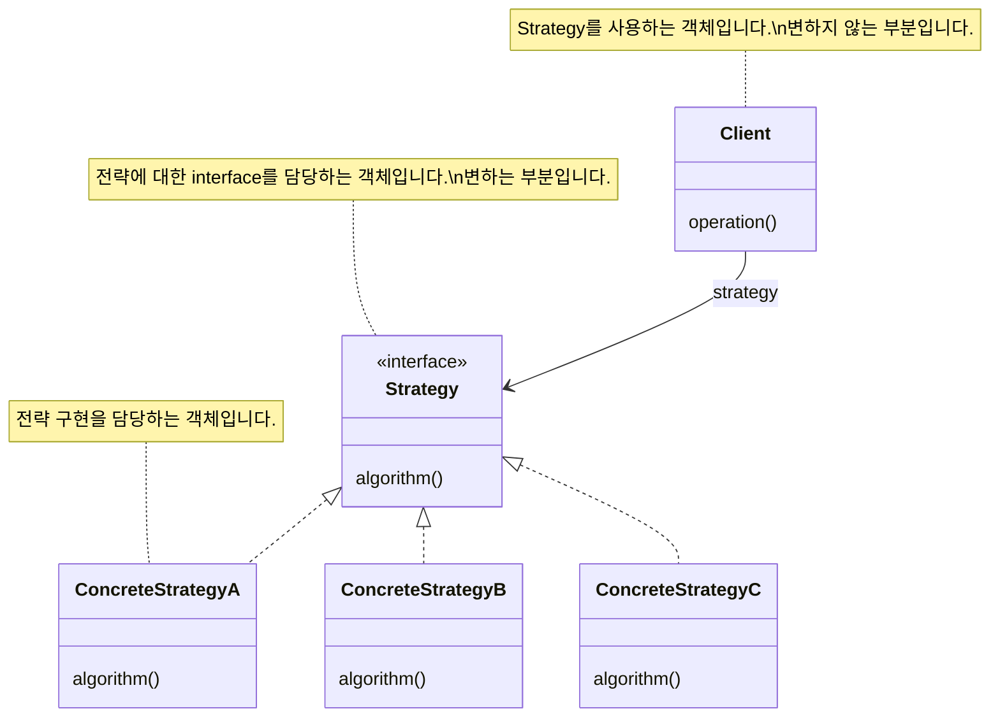
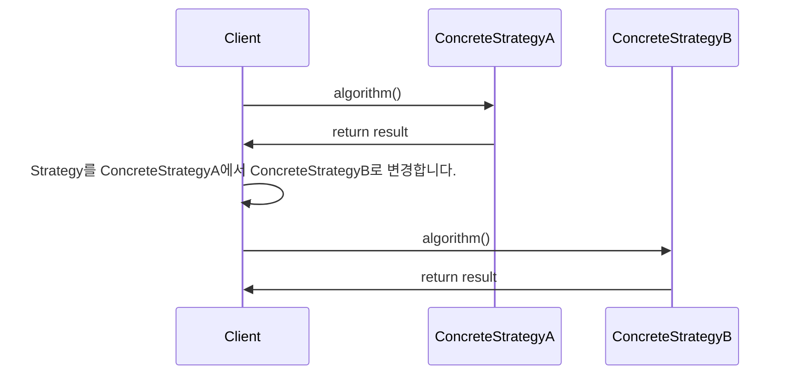
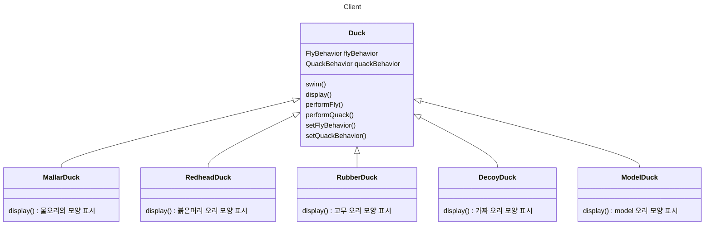
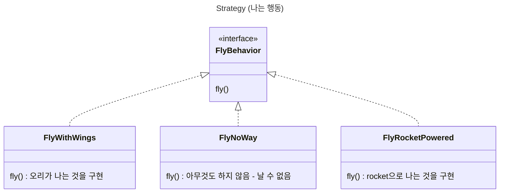
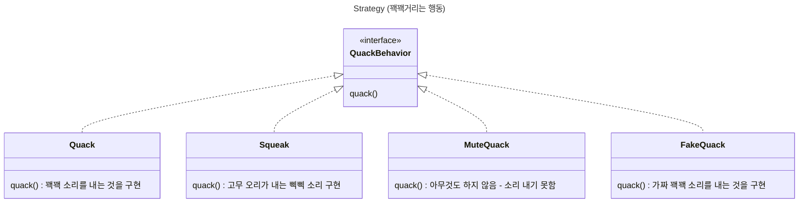

- Strategy Pattern을 이용하면 algorithm을 상황에 따라 변경해가며 사용할 수 있습니다.
    - 동일한 목적을 지닌 algorithm group을 정의하고 각각을 캡슐화(encapsulation)하여 group 내의 algorithm을 교환해서 사용할 수 있도록 합니다.
    - algorithm을 사용하는 client에서 algorithm을 분리하기 때문에 독립적으로 algorithm을 변경할 수 있습니다.

- 같은 목적을 가진 class들의 algorithm을 상황에 따라 교체해야 하는 경우, Strategy Pattern을 사용하면 좋습니다.
    - 평소에는 한 가지 algorithm을 사용하더라도 algorithm을 변경해야 할 때가 있습니다.
        - 예를 들어, 참조하는 class가 변경/제거될 때(compile time).
        - 예를 들어, 사용하는 시점에 따라서 적용할 algorithm이 다를 때(runtime).


---


## 장점

### Code 중복이 줄어듦

- algorithm마다 사용되는 code의 중복을 방지할 수 있습니다.
    - algorithm의 변경 부분만 concrete strategy로 빼내어 구현했기 때문입니다.

### 전략 확장이 용이함

- 새로운 전략을 추가하더라도 기존 code를 변경하지 않습니다.
- 새로운 algorithm을 추가하려면 새로운 객체를 추가하면 됩니다.

### Runtime에 전략 결정과 교체가 가능함

- 상속 대신 합성(composition)을 사용하기 때문에 runtime에 strategy(algorithm)를 변경할 수 있습니다.
    - client가 strategy interface에 의존하고 있기 때문에 strategy 구현체를 교체하기 쉽습니다.


## 단점

### 복잡도 증가

- algorithm이 늘어날 수록 객체도 무한히 늘어납니다.
    - logic이 늘어날 때마다 구현체 class가 늘어납니다.

- logic을 단순히 client에 if-else로 분리해서 그 안에 구현하는 게 보기 편할 수도 있습니다.
    - 한 눈에 들어오는 짧은 code에서는 Strategy Pattern을 사용하는 것이 오히려 가독성을 떨어뜨립니다.
    - 예를 들어, 분기가 2개인 경우에는 if-else를 사용하는 것이 더 나을 수 있습니다.

### Client가 구체적인 전략(concrete strategy)에 대해 알고 있어야 함

- client는 모든 algorithm에 대한 성능과 효율을 알고 있어야 합니다.
    - client가 자신이 사용할 전략 객체를 직접 결정하기 때문입니다.

- client와 strategy를 한번 조립하면 전략을 변경하기 힘들어집니다.
    - client가 algorithm을 알고 있기 때문입니다.


---


## Diagram






---


## Example : 오리 Class

- client에서는 **나는 행동**과 **꽥꽥거리는 행동** 모두에 대해서 캡슐화(encapsulation)된 algorithm group을 **활용**합니다.
    - client는 `setter`로 행동 변수를 설정하고 `perform` 함수를 사용하면 됩니다.
        - 예를 들어, `setFlyBehavior()` -> `performFly()`

- 각 행동의 집합은 각 algorithm group입니다.








### Main

```java
public class MiniDuckSimulator {
    public static void main(String[] args) {
 
        Duck mallard = new MallardDuck();
        mallard.performQuack();
        mallard.performFly();
   
        Duck model = new ModelDuck();
        model.performFly();
        model.setFlyBehavior(new FlyRocketPowered());
        model.performFly();
    }
}
```

```java
public class MiniDuckSimulator {
    public static void main(String[] args) {
 
        MallardDuck mallard = new MallardDuck();
        FlyBehavior cantFly = () -> System.out.println("I can't fly");
        QuackBehavior squeak = () -> System.out.println("Squeak");
        RubberDuck rubberDuckie = new RubberDuck(cantFly, squeak);
        DecoyDuck decoy = new DecoyDuck();
 
        Duck model = new ModelDuck();

        mallard.performQuack();
        rubberDuckie.performQuack();
        decoy.performQuack();
   
        model.performFly();    
        model.setFlyBehavior(new FlyRocketPowered());
        model.performFly();
    }
}
```


### Client

```java
public abstract class Duck {
    FlyBehavior flyBehavior;
    QuackBehavior quackBehavior;

    public Duck() {
    }

    public void setFlyBehavior(FlyBehavior fb) {
        flyBehavior = fb;
    }

    public void setQuackBehavior(QuackBehavior qb) {
        quackBehavior = qb;
    }

    abstract void display();

    public void performFly() {
        flyBehavior.fly();
    }

    public void performQuack() {
        quackBehavior.quack();
    }

    public void swim() {
        System.out.println("All ducks float, even decoys!");
    }
}
```

```java
public class MallardDuck extends Duck {
    public MallardDuck() {
        quackBehavior = new Quack();
        flyBehavior = new FlyWithWings();
    }

    public void display() {
        System.out.println("I'm a real Mallard duck");
    }
}
```

```java
public class RedHeadDuck extends Duck {
    public RedHeadDuck() {
        flyBehavior = new FlyWithWings();
        quackBehavior = new Quack();
    }
 
    public void display() {
        System.out.println("I'm a real Red Headed duck");
    }
}
```

```java
public class RubberDuck extends Duck {
    public RubberDuck() {
        flyBehavior = new FlyNoWay();
        // quackBehavior = new Squeak();
        quackBehavior = () -> System.out.println("Squeak");
    }
    
    public RubberDuck(FlyBehavior flyBehavior, QuackBehavior quackBehavior) {
        this.flyBehavior = flyBehavior;
        this.quackBehavior = quackBehavior; 
    }
 
    public void display() {
        System.out.println("I'm a rubber duckie");
    }
}
```

```java
public class DecoyDuck extends Duck {
    public DecoyDuck() {
        setFlyBehavior(new FlyNoWay());
        setQuackBehavior(new MuteQuack());
    }

    public void display() {
        System.out.println("I'm a duck Decoy");
    }
}
```

```java
public class ModelDuck extends Duck {
    public ModelDuck() {
        flyBehavior = new FlyNoWay();
        quackBehavior = new Quack();
    }

    public void display() {
        System.out.println("I'm a model duck");
    }
}
```


### Strategy : 나는 행동

```java
public interface FlyBehavior {
    public void fly();
}
```

```java
public class FlyWithWings implements FlyBehavior {
    public void fly() {
        System.out.println("I'm flying!!");
    }
}
```

```java
public class FlyNoWay implements FlyBehavior {
    public void fly() {
        System.out.println("I can't fly");
    }
}
```

```java
public class FlyRocketPowered implements FlyBehavior {
    public void fly() {
        System.out.println("I'm flying with a rocket");
    }
}
```


### Strategy : 꽥꽥거리는 행동

```java
public interface QuackBehavior {
    public void quack();
}
```

```java
public class Quack implements QuackBehavior {
    public void quack() {
        System.out.println("Quack");
    }
}
```

```java
public class Squeak implements QuackBehavior {
    public void quack() {
        System.out.println("Squeak");
    }
}
```

```java
public class MuteQuack implements QuackBehavior {
    public void quack() {
        System.out.println("<< Silence >>");
    }
}
```

```java
public class FakeQuack implements QuackBehavior {
    public void quack() {
        System.out.println("Qwak");
    }
}
```


---


## Reference

- Head First Design Patterns (도서) - Eric Freeman, Elisabeth Robson, Bert Bates, Kathy Sierra
- <https://gmlwjd9405.github.io/2018/07/06/strategy-pattern.html>
- <https://scorpio-mercury.tistory.com/21>
