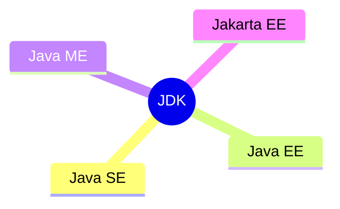
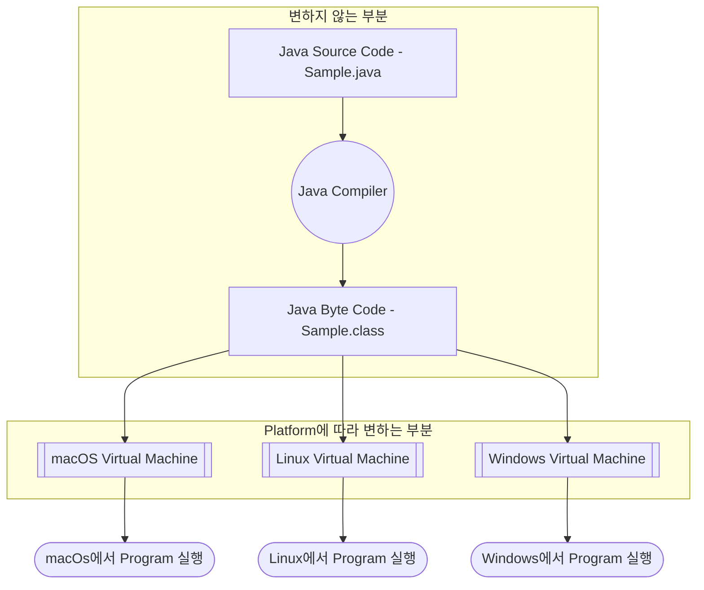
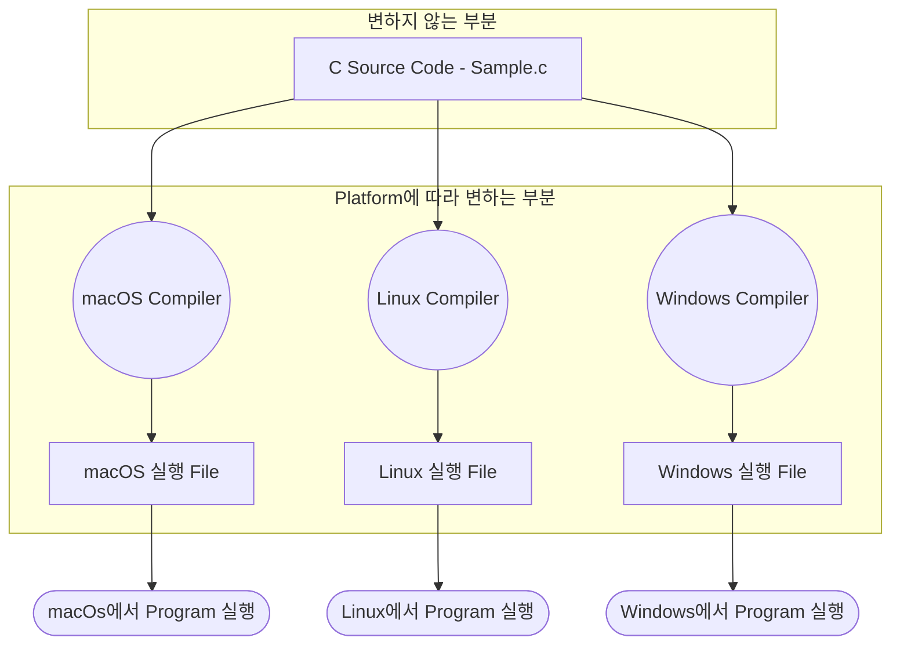

## Java 개발 환경

| Name | Full Name | 번역 |
| --- | --- | --- |
| JDK | Java Development Kit | Java 개발 도구 |
| JRE | Java Runtime Environment | Java 실행 환경 |
| JVM | Java Virtual Machine | Java 가상 기계 |


### 포함 관계 : JVM ⊂ JRE ⊂ JDK

```txt
JDK는 JRE를 포함하고, JRE는 JVM을 포함합니다.
```

- 개발자가 Java 언어로 개발하기 위해서는 **JDK**가 필요합니다.
- **JDK**는 개발 단계에서 필요한 도구 모음이며, 실행 환경인 **JRE**를 포함합니다.
- **JRE**는 개발자가 작성한 code를 실행시키기 위해 **JVM**을 포함합니다.
- **JVM**은 compile한 code를 최종적으로 실행합니다.


---


## JDK : Java Development Kit

- JDK는 Java program을 개발하는데 필요한 모든 library 및 file을 포함합니다.
    - 개발 단계에서 필요한 모든 기능을 수행합니다.
        - 예를 들어, Java code(`.java`)를 compile하거나, debugging하거나, 실행할 수 있습니다.
    - JRE를 포함합니다.
        - JRE로는 compile된 Java bytecode(`.class`)를 실행만 할 수 있습니다.

- JDK의 대표적인 기능은 Java code(`.java`)를 Java bytecode(`.class`)로 compile하는 기능입니다.


### JDK의 종류



- Java SE는 Java의 기본 규격입니다.
- 사용 목적에 따라 Java SE를 기준으로 기능을 더하거나 뺀 특수 목적 edition이 있습니다.
    - 예를 들어, Java EE, Java ME.

#### Java SE : Java Platform, Standard Edition

- 표준 Java platform으로 표준적인 computing 환경을 지원하기 위한 JVM 규격 및 API 집합을 포함합니다.

#### Java EE : Java Platform, Enterprise Edition

- Java SE에 WAS(Web Application Server)에서 동작하는 기능을 추가한 platform입니다.

#### Jakarta EE : Jakarta, Enterprise Edition

- Jakarta EE는 Java EE의 새로운 version입니다.

- Jakarta EE는 Java EE의 상위 version이지만, 서로 호환되지 않습니다.
    - Jakarta EE로 옮겨가려면 migration이 필요합니다.

#### Java ME : Java Platform, Micro Edition

- 제한된 자원을 가진 embedded system에서 Java로 program을 개발할 떄 이용합니다.
    - 예를 들어, mobile phone, PDA, set-top box 등.


---


## JRE : Java Runtime Environment

- JRE는 Java가 실행되기 위해 필요한 환경을 제공합니다.
    - JVM만 가지고는 Java program을 동작시킬 수 없습니다.
    - JVM을 포함합니다.
    - JVM이 Java program을 실행하기 위해 필요한 Java class loader, Java class library를 포함합니다.
        - JVM이 program을 실행할 수 있도록 class file을 load하고, Java code를 library와 결합합니다.

- JRE는 그 자체로 기능이 있다기보다는 JVM이 동작하기 위한 환경을 뜻합니다.
    - memory 및 기타 system 자원을 관리합니다.


---


## JVM : Java Virtual Machine

- JVM은 Java bytecode(`.class`)를 기계(hardware)가 이해할 수 있도록 기계어로 번역하며, program을 실질적으로 실행합니다.


### Platform에 종속적인 JVM

- Java는 platform에 종속적이지 않지만, JVM은 platform에 종속적입니다.
    - JVM은 Java에서 변하는 부분(platform에 종속적인 부분)을 module로 분리한 것입니다.
    - JVM만이 platform을 알고 있기 때문에, Java는 WORA(`Write Once, Run Anywhere.`)가 가능합니다.

- JVM은 Java bytecode(`.class`)를 해당 platform에 맞는 기계어로 변환하여 실행합니다.
    - platform(OS, hardware)마다 실행을 위한 기계어는 다르기 때문에 JVM도 다릅니다.
        - 예를 들어, macOS의 JVM과 Linux의 JVM은 서로 다릅니다.

- 예를 들어, C 언어의 compiler는 platform에 종속되지만, Java의 compiler는 종속되지 않습니다.
    - C 언어는 compiler가 종속되기 때문에 실행 file도 종속됩니다.
    - Java는 compiler가 종속되지 않기 때문에 실행 file(`.class`)도 종속되지 않습니다.
        - JVM이 환경에 맞게 실행 file을 그때그때 변환하여 사용합니다.


### Java 실행 과정

- JVM이 platform에 따라 변하는 부분을 맡습니다.




### C 언어 실행 과정

- compiler가 platform에 따라 변하는 부분을 맡습니다.




---


## Reference

- <https://coding-factory.tistory.com/827>
- <https://jhyonhyon.tistory.com/16>
