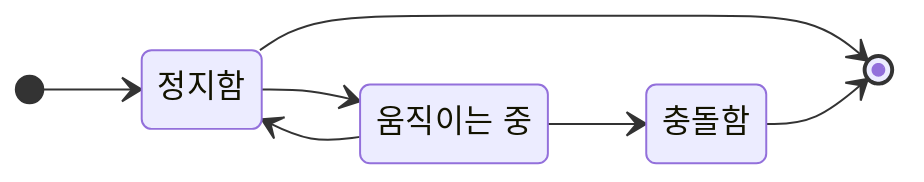
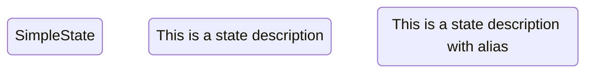
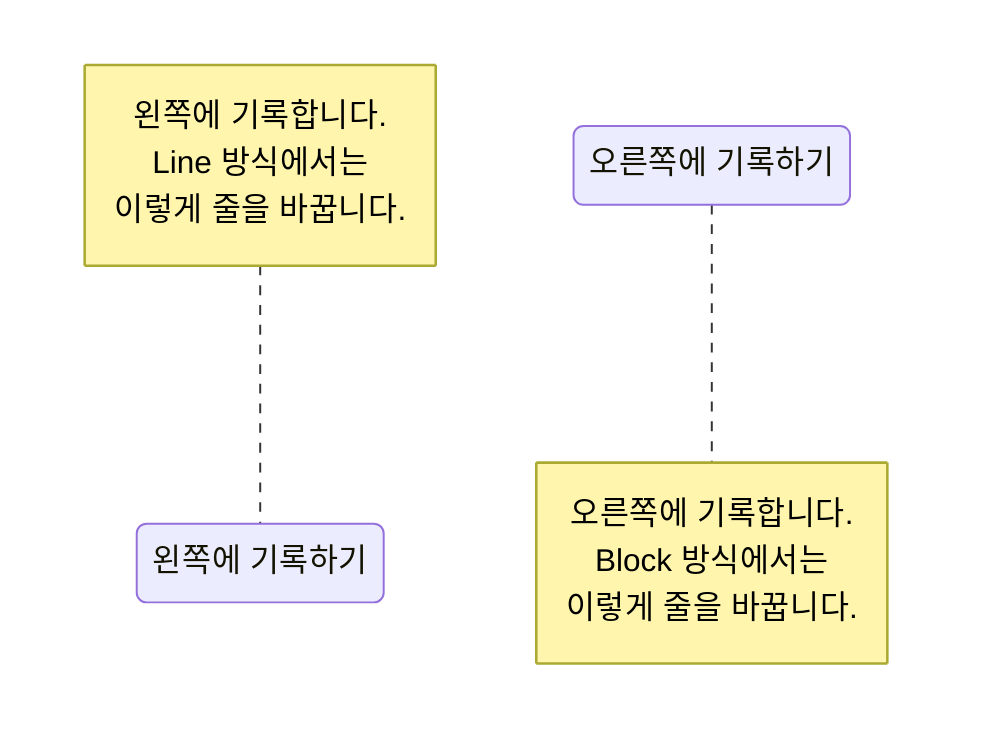
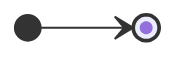
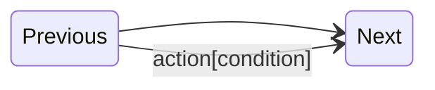
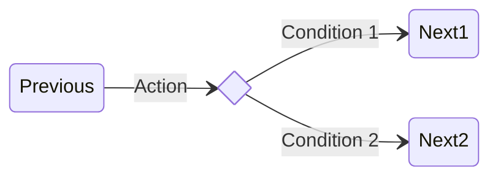
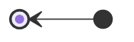

## Mermaid.js State Diagram

- mermaid를 사용해 State Diagram을 그릴 수 있습니다.




---


## 상태 정의하기

```txt
[state_id]
[state_id] : [description]
state "[description]" as [state_id]
```

- 상태의 식별값과 설명을 작성하여 정의합니다.

```txt
stateDiagram-v2

SimpleState
descState : This is a state description
state "This is a state description with alias" as descStateWithAlias
```




### Note 작성하기

```txt
note [position] of [state_id]
    [memo]
end

note [position] of [state_id] : [memo]
```

- `note` keyword로 상태에 대한 설명을 추가할 수 있습니다.
- note는 Block 방식과 Line 방식으로 작성할 수 있습니다.
- `left`와 `right` 값으로 설명을 보일 위치를 지정할 수 있습니다.

```txt
stateDiagram-v2

state "오른쪽에 기록하기" as stateWithRightNote
state "왼쪽에 기록하기" as stateWithLeftNote

note right of stateWithRightNote
    오른쪽에 기록합니다.
    Block 방식에서는
    이렇게 줄을 바꿉니다.
end note

note left of stateWithLeftNote : 왼쪽에 기록합니다.<br>Line 방식에서는<br>이렇게 줄을 바꿉니다.
```




---


## 시작 상태와 종료 상태 정의하기

- 시작 상태와 종료 상태는 `[*]`로 정의합니다.
    - 화살표가 나간다면 시작 상태입니다.
    - 화살표가 들어온다면 종료 상태입니다.

```txt
stateDiagram-v2

[*] --> [*]
```




---


## 전이 정의하기

- 전이는 `-->`로 정의합니다.
- colon(`:`) 뒤에 설명을 적을 수 있습니다.

```txt
stateDiagram-v2

Previous --> Next
Previous --> Next : action[condition]
```




---


## 선택 정의하기

```txt
state [choice_id] <<choice>>
```

- 선택 상태는 `<<choice>>` keyword를 상태 식별값 뒤에 작성하여 정의합니다.
- 선택 상태는 두 개 이상의 상태 중에 결정해야 하는 상황에서 사용합니다.

```txt
stateDiagram-v2

state if <<choice>>

Previous --> if : Action
if --> Next1 : Condition 1
if --> Next2 : Condition 2
```




---


## Diagram 방향 설정하기

- `direction` 명령어와 상하좌우를 의미하는 `T`, `B`, `L`, `R` code를 이용하여 화살표의 방향을 설정합니다.

```txt
direction [begin][end]
```

| Code | 화살표의 방향 |
| --- | --- |
| `direction TB` | 상 -> 하 |
| `direction BT` | 하 -> 상 |
| `direction LR` | 좌 -> 우 |
| `direction RL` | 우 -> 좌 |


### Top to Bottom (상 -> 하)

```txt
stateDiagram-v2
direction TB
[*] --> [*]
```


### Bottom to Top (하 -> 상)

```txt
stateDiagram-v2
direction BT
[*] --> [*]
```


### Left to Right (좌 -> 우)

```txt
stateDiagram-v2
direction LR
[*] --> [*]
```


### Right to Left (우 -> 좌)

```txt
stateDiagram-v2
direction RL
[*] --> [*]
```




---


## Reference

- <https://mermaid.js.org/syntax/stateDiagram.html>
