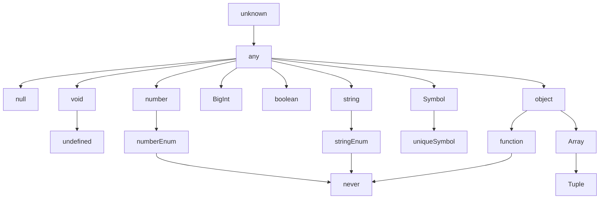

## TypeScript = JavaScript + Type Check

- TypeScript는 **AltJS**(Alternative JavaScript) 중 하나입니다.
    - AltJS는 'JavaScript 파생 언어'로, TypeScript 말고도 CoffeScript, Dart 등이 있습니다.

- TypeScript는 **JavaScript(ES5)의 Superset**(상위 확장)이므로 기존의 JavaScript 문법을 그대로 사용할 수 있습니다.
    - 따라서 TypeScript 실행 환경에 JavaScript를 coding하면 정상적으로 동작합니다.
    - 하지만 JavaScript 실행 환경에 TypeScript를 coding하면 동작하지 않습니다.

- TypeScript는 '정적 Typing', ES6(ECMAScript 2015)의 'class'와 'module', ES7의 'Decorator' 등을 지원합니다.

### TypeScript의 Type 계층 구조

