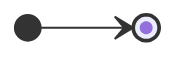

## State Diagram의 구성 요소

- State Diagram은 상태(State), 전이(Transition), 선택(Choice), 시작 상태(Initial state), 종료 상태(Final state)로 구성됩니다.

### 시작 상태와 종료 상태

|  | 시작 상태 (Initial state) | 종료 상태 (Final state) |
| 