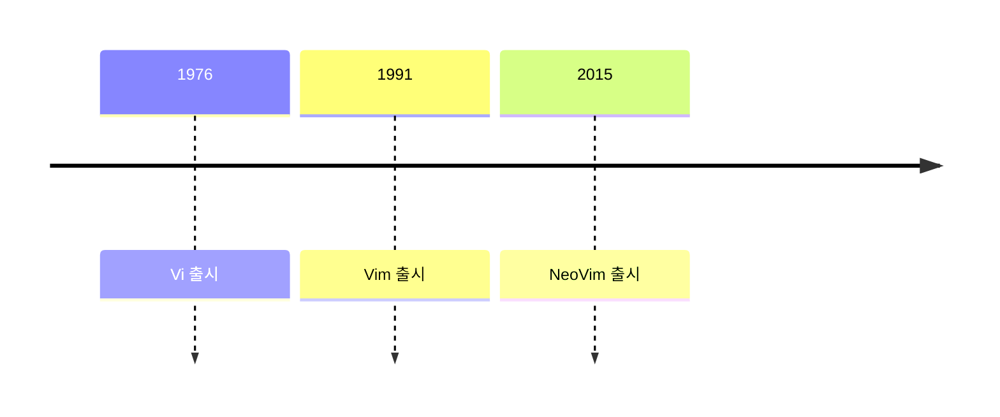

## Vim : 개선된 Vi

```sh
vi file_name.txt
vim file_name.txt
```

- Linux의 대표적인 편집기인 vi와 호환되는 text 편집기입니다.

- terminal에서 `vi`, `vim` 명령어로 편집기를 실행할 수 있습니다.
    - 최신 환경에서는 대부분 `vi`를 입력해도 자동으로 Vim이 실행됩니다.

- neovim(`nvim`)은 개선된 Vim입니다.




