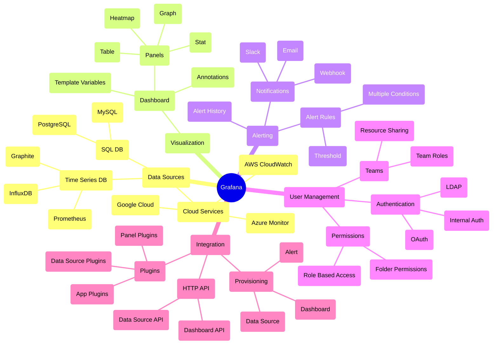

## Grafana : Data Visualization & Monitoring Tool

- Grafana는 **system monitoring과 분석을 위한 open source visualization platform**입니다.
    - 다양한 data source로부터 수집된 metric data를 실시간으로 분석하고 시각화합니다.
    - 시각화된 dashboard를 통해 system의 상태를 직관적으로 파악할 수 있습니다.

- web application으로 제공되어, browser를 통해 접근(default port `3000`)할 수 있습니다.
    - 일반적으로 server에 설치하여 사용하지만, cloud service로도 제공됩니다.

- Prometheus, InfluxDB, Graphite 등 여러 data source와 연동하여 사용할 수 있습니다.

### Grafana의 사용 사례

- Grafana는 시각화 기능을 필요로 하는 다양한 분야에서 활용할 수 있습니다.

#### IT Infrastructure Monitoring : Server 및 Network Monitoring

- **server resource 사용률을 실시간으로 monitoring**합니다.
    - CPU, Memory, Disk 사용률을 tracking합니다.
    - process별 resource 점유율을 분석합니다.
    - threshold 기반 alert을 설정하여 과부하를 감지합니다.

- **network traffic을 상세하게 분석**합니다.
    - bandwidth 사용률과 latency를 측정합니다.
    - protocol별 traffic 분포를 시각화합니다.
    - network bottleneck을 식별하고 troubleshooting합니다.

- **application performance를 종합적으로 측정**합니다.
    - response time과 error rate를 tracking합니다.
    - request 처리량과 queue 상태를 monitoring합니다.
    - service dependency를 분석하여 성능 병목을 파악합니다.

#### Business Metrics 분석 : 매출 및 사용자 행동 분석

- **매출 추이를 다각도로 시각화**합니다.
    - 일별, 월별, 분기별 매출을 비교 분석합니다.
    - 제품별, 지역별 매출 분포를 파악합니다.
    - 계절성과 trend를 시각화하여 예측에 활용합니다.

- **사용자 행동을 세부적으로 분석**합니다.
    - user retention(사용자 유지율)과 churn rate(이탈율)를 tracking합니다.
    - user flow와 conversion funnel을 분석합니다.
    - session duration과 engagement metrics를 측정합니다.

- **marketing 효과를 정량적으로 측정**합니다.
    - campaign별 ROI를 계산하고 시각화합니다.
    - acquisition channel 효율성을 비교합니다.
    - A/B test 결과를 실시간으로 monitoring합니다.

#### IoT Device Monitoring : Sensor Data 수집 및 분석

- **sensor data를 실시간으로 수집하고 분석**합니다.
    - temperature, humidity, pressure 등 환경 데이터를 tracking합니다.
    - energy 사용량과 효율성을 측정합니다.
    - 생산 공정의 품질 관련 metrics를 수집합니다.

- **device 상태를 지속적으로 monitoring**합니다.
    - device의 uptime과 connectivity를 확인합니다.
    - battery 수준과 hardware 성능을 tracking합니다.
    - firmware version과 update 상태를 관리합니다.

- **이상 징후를 실시간으로 감지하고 alert을 발생**시킵니다.
    - 정상 범위를 벗어난 sensor 값을 즉시 감지합니다.
    - device 오작동이나 통신 장애를 감지합니다.
    - predictive maintenance를 위한 패턴을 분석합니다.

---

## Grafana의 다양한 기능들

### Data Sources : Data 수집 관련 기능

- **다양한 data source 연동**을 지원합니다.
    - Prometheus, InfluxDB, Graphite 등 time series database를 지원합니다.
    - MySQL, PostgreSQL 등 SQL database를 지원합니다.
    - AWS CloudWatch, Azure Monitor, Google Cloud 등 cloud service를 지원합니다.
    - custom data source plugin 개발이 가능합니다.

- **data query 기능**을 제공합니다.
    - 복잡한 data 분석을 위한 다양한 query 문법을 지원합니다.
    - query 결과를 실시간으로 확인하고 수정할 수 있습니다.
    - data source별로 최적화된 query editor를 제공합니다.

### Visualization : Data 시각화 관련 기능

- **다양한 형태의 시각화 panel**을 제공합니다.
    - graph, gauge, heat map, histogram 등 여러 형태의 시각화가 가능합니다.
    - dashboard에 여러 panel을 배치하여 복합적인 monitoring 환경을 구성합니다.
    - template variable을 통해 동적인 dashboard 구성이 가능합니다.

- **직관적인 dashboard** 구성이 가능합니다.
    - annotation을 통해 중요 event를 시각적으로 표시합니다.
    - panel을 자유롭게 배치하고 크기를 조절할 수 있습니다.
    - dashboard를 folder로 구조화하여 체계적으로 관리합니다.

### Alerting : Monitoring 및 Alert 관련 기능

- **alert system**을 제공합니다.
    - 복잡한 조건의 alert rule 설정이 가능합니다.
    - threshold 기반의 alert 조건을 설정할 수 있습니다.
    - 다중 조건을 조합하여 alert rule을 생성할 수 있습니다.

- **다양한 notification** 기능을 제공합니다.
    - email, Slack, webhook 등 다양한 channel을 통해 alert을 전송합니다.
    - notification 방식을 상세하게 설정할 수 있습니다.
    - alert history를 통해 과거 alert을 추적하고 분석합니다.

### User Management : User 및 권한 관리 기능

- **체계적인 team 관리**가 가능합니다.
    - team 기반의 resource 관리를 지원합니다.
    - team 내부에서 role을 부여하여 권한을 세분화합니다.
    - folder 단위로 접근 권한을 설정할 수 있습니다.

- **안전한 인증과 접근 제어**를 제공합니다.
    - internal authentication, LDAP, OAuth 등 다양한 인증 방식을 지원합니다.
    - session 기반의 접근 제어를 제공합니다.
    - API key를 통한 안전한 접근을 지원합니다.

### Integration : 외부 System 연동 기능

- **확장성 있는 plugin system**을 제공합니다.
    - data source plugin을 통해 새로운 data source를 추가할 수 있습니다.
    - panel plugin을 통해 새로운 시각화 방식을 추가할 수 있습니다.
    - app plugin을 통해 새로운 기능을 추가할 수 있습니다.

- **자동화와 integration**을 지원합니다.
    - provisioning을 통해 설정을 자동화할 수 있습니다.
    - HTTP API를 통해 프로그래밍 방식의 접근이 가능합니다.
    - dashboard와 data source를 code로 관리할 수 있습니다.

---

## Monitoring Tool 비교

| 평가 항목 | Grafana | Datadog | Prometheus UI |
| --- | --- | --- | --- |
| **특징** | open source 기반 시각화 도구 | 통합 관제 SaaS | metric 수집 특화 도구 |
| **주요 장점** | 다양한 data source 연동, Plugin 기반 확장 | 자동화된 monitoring, ML 기반 anomaly 탐지 | 높은 확장성, 안정적인 metric 수집 |
| **주요 단점** | 초기 설정 복잡, 높은 learning curve | 높은 비용, vendor lock-in | UI 기능 부족, 제한적인 시각화 |
| **사용 난이도** | 중 (직관적 UI, 복잡한 설정) | 하 (자동화된 설정, 쉬운 UI) | 상 (복잡한 query, 높은 학습 난이도) |
| **설치 방식** | On-premise, Cloud | Cloud | On-premise |
| **가격** | 무료, Enterprise 유료 | 구독형 과금 | 무료 |
| **License** | AGPL v3.0 | 상용 License | Apache 2.0 |

### 사용 난이도 책정 근거

- **Grafana** : 중간 난이도.
    - 초기 설정이 복잡하지만, dashboard 구성과 panel 설정이 직관적입니다.
    - plugin 설치와 data source 연동에는 system 지식이 필요합니다.
    - query 작성에는 SQL이나 PromQL 등의 이해가 필요합니다.

- **Datadog** : 낮은 난이도.
    - SaaS 형태로 제공되어 초기 설정이 간단합니다.
    - UI가 직관적이고 자동화된 기능이 많습니다.
    - 기본 제공되는 dashboard template이 풍부합니다.

- **Prometheus UI** : 높은 난이도.
    - query 언어인 PromQL의 learning curve가 높습니다.
    - metric 수집을 위한 exporter 설정이 복잡합니다.
    - alert rule 설정과 관리가 복잡합니다.
