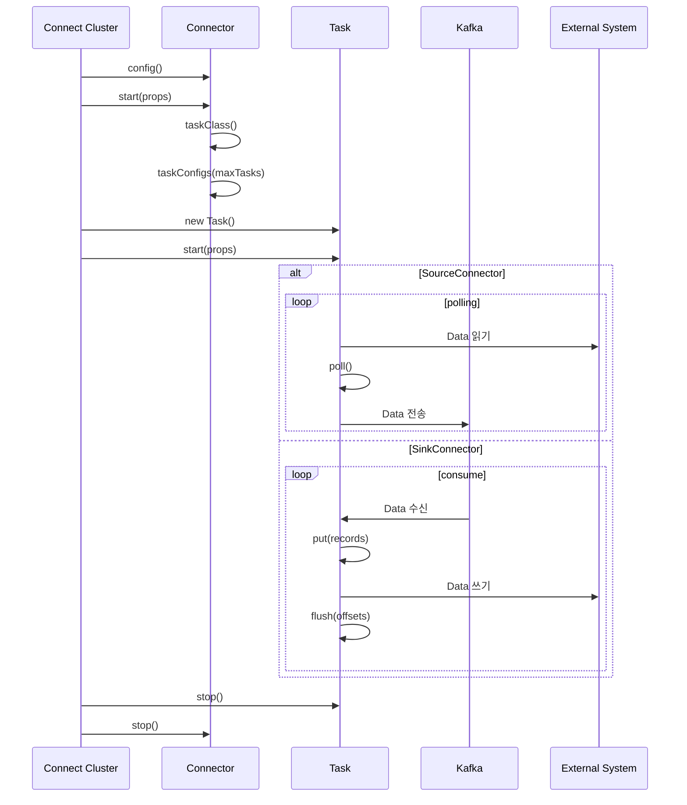

## Custom Connector : Connector 직접 개발하기

- Kafka Connect는 외부 system과 Kafka 간의 data 연동을 쉽게 해주는 framework이며, **Connector는 Kafka Connect에서 실제 data를 이동시키는 plugin** 역할을 합니다.

- **custom connector**는 기존에 제공되는 connector로 충족할 수 없는 요구 사항을 위해 **직접 개발한 connector**입니다.
    - **Kafka Connect API를 활용**하여 custom connector를 직접 구현할 수 있습니다.
    - custom connector는 크게 **`Connector` class와 `Task` class로 구성**되며, 두 class 모두 Kafka Connect API의 interface를 구현해야 합니다.
        - `Connector` class는 전체 data 이동 작업을 관리하는 책임을 가집니다.
        - `Task` class는 `Connector`가 생성하며 실제 data 전송 작업을 수행합니다.

- custom connector는 표준 connector와 동일하게 **source connector와 sink connector로 구분**됩니다.
    - source connector : 외부 system에서 data를 가져와 Kafka topic으로 전송합니다.
    - sink connector : Kafka topic의 data를 외부 system으로 전송합니다.

- 개발한 custom connector는 **Kafka Connect framework에 등록하여 사용**할 수 있습니다.
    - **JAR file로 packaging**하여 Kafka Connect의 **plugin directory에 배포**합니다.
    - 배포된 custom connector는 표준 connector와 동일하게 Kafka Connect REST API를 통해 관리합니다.

- **표준 connector로 해결할 수 없는 특수한 data 연동 scenario에 custom connector가 사용**됩니다.
    - 특정 database의 CDC(Change Data Capture) 구현.
    - 비표준 API를 가진 system과의 연동.
    - 복잡한 data 변환 logic이 필요한 경우.
    - IoT device나 sensor에서 data를 수집하는 경우.
    - 특정 business logic이 포함된 data 처리가 필요한 경우.


### Custom Connector의 장점

- 특정 requirement에 최적화된 connector를 개발하여 custom business 요구 사항을 정확히 충족할 수 있습니다.
- 기존 connector ecosystem에서 지원하지 않는 legacy system, 내부 개발 system, 또는 특수 protocol을 사용하는 platform과의 data 연동이 가능합니다.
- ETL(Extract, Transform, Load) process 중 transform 단계에서 복잡한 data 변환, filtering, enrichment 등의 logic을 connector 내부에 직접 구현할 수 있습니다.
- business domain에 특화된 error handling을 구현하여 data 손실 방지, 재시도 전략, dead letter queue 관리 등 세밀한 제어가 가능합니다.
- 조직 내 특화된 보안 정책이나 compliance 요구 사항을 connector 수준에서 구현할 수 있습니다.
- 성능 최적화를 위한 batch 처리, connection pooling, data 압축 등의 기술을 적용할 수 있습니다.
- 내부 monitoring system과 통합하여 custom metric을 수집하고 운영 가시성을 높일 수 있습니다.
- 조직의 knowledge base를 활용하여 특정 domain에 최적화된 solution을 구현할 수 있습니다.


### Custom Connector의 단점

- 초기 개발 비용이 높고, 지속적인 유지 보수와 bug fix를 위한 전담 engineer resource가 필요합니다.
- 잘 설계되지 않은 custom connector는 code 복잡성 증가와 함께 기술 부채로 이어질 수 있습니다.
- 표준 connector와 달리 community support가 없어 모든 issue를 내부적으로 해결해야 합니다.
- 보안 취약점 발견 시 즉각적인 대응과 patch 배포에 대한 책임이 전적으로 개발 조직에 있습니다.
- Kafka Connect API의 major version이 update되는 경우, custom connector 전체를 호환되도록 수정해야 합니다.
- 개발자 이직 등으로 인한 knowledge gap 발생 시 유지 보수가 어려워질 수 있습니다.
- 자체 개발 test 및 검증 infra를 구축하고 유지해야 하므로 추가 비용이 발생합니다.
- Kafka Connect의 distributed mode 환경에서 발생할 수 있는 복잡한 분산 system 문제를 자체적으로 해결해야 합니다.
- 다양한 환경(development, staging, production)에서의 configuration 관리와 배포 pipeline 구축이 필요합니다.
- 동시 실행되는 task 수, memory 사용량, CPU 사용률 등 resource 사용에 대한 최적화 작업을 직접 수행해야 합니다.


---


## Custom Connector 개발 방법

- **Java를 사용**하여 **Kafka Connect API를 구현**합니다.
    - Kafka Connect API는 **Kafka Connect framework와 connector 간의 통신을 위한 interface**를 제공합니다.
    - project의 dependency에 Kafka Connect API를 추가하여 사용합니다.
        - Maven이나 Gradle을 사용하여 `kafka-connect-api` artifact를 dependency로 추가합니다.

- custom connector는 반드시 **Kafka Connect framework의 `Connector` class와 `Task` class를 상속받아 구현**해야 합니다.
    - **`Connector` class는 connector의 설정과 task 생성**을, **`Task` class는 실제 data 처리**를 담당합니다.
    - Source Connector 개발 시, `SourceConnector` class와 `SourceTask` class를 구현합니다.
    - Sink Connector 개발 시, `SinkConnector` class와 `SinkTask` class를 구현합니다.

- 개발이 완료되면, **JAR file로 packaging**하여 **Kafka Connect의 plugin directory에 배포**합니다.
    - 이때 JAR file에는 connector의 구현 class와 필요한 library가 포함되어 있어야 합니다.
        - **fat JAR**로 packaging하여 모든 dependency를 하나의 JAR가 포함하도록 하는 것이 좋습니다.
    - Kafka Connect의 plugin directory는 `plugin.path` configuration으로 설정할 수 있습니다.


### 1. 개발 환경 설정

- Java 개발 환경을 구축합니다.
- Maven이나 Gradle project를 생성하고 Kafka Connect API dependency를 추가합니다.

#### Maven Project Dependency

```xml
<!-- pom.xml -->
<dependency>
    <groupId>org.apache.kafka</groupId>
    <artifactId>connect-api</artifactId>
    <version>3.9.0</version>
</dependency>
```

#### Gradle Project Dependency

```groovy
/* build.gradle */
dependencies {
    compileOnly 'org.apache.kafka:connect-api:3.9.0'
}
```


### 2. Connector class 구현

- source connector는 `SourceConnector`, sink connector는 `SinkConnector` class를 확장(`extends`)합니다.
    - `org.apache.kafka.connect.source.SourceConnector` 또는 `org.apache.kafka.connect.sink.SinkConnector`를 상속합니다.

- 모든 resource는 `start()` method에서 초기화하고 `stop()` method에서 정리해야 합니다.

- connector는 `taskConfigs(maxTasks)`를 통해 여러 task를 생성할 수 있습니다.
    - 각 task는 독립적으로 동작하여 병렬 처리가 가능합니다.
    - task 수는 connector 구성에 따라 결정되며, 처리량에 따라 조정할 수 있습니다.
    - task는 서로 다른 worker node에서 실행될 수 있어 분산 처리가 가능합니다.

```java
public class CustomSourceConnector extends SourceConnector {
/* public class CustomSinkConnector extends SinkConnector { */

    private Map<String, String> configProps;

    @Override
    public void start(Map<String, String> props) {
        this.configProps = props;
    }

    @Override
    public Class<? extends Task> taskClass() {
        return CustomSourceTask.class;
        /* return CustomSinkTask.class; */
    }

    @Override
    public List<Map<String, String>> taskConfigs(int maxTasks) {
        final List<Map<String, String>> taskConfigs = new ArrayList<>(maxTasks);
        for (int i = 0; i < maxTasks; i++) {
            taskConfigs.add(configProps);
        }
        return taskConfigs;
    }

    @Override
    public void stop() {
        // clean up resources
    }

    @Override
    public ConfigDef config() {
        return new ConfigDef();
    }

    @Override
    public String version() {
        return "1.0";
    }
}
```

#### Connector Class 필수 Method

- `version()` : connector version을 반환합니다.
- `start(Map<String, String> props)` : connector를 초기화합니다.
    - resource 초기화 작업을 구현합니다.
- `taskClass()` : task 구현 class를 반환합니다.
- `taskConfigs(int maxTasks)` : 병렬 처리를 위한 task 구성 정보를 생성합니다.
- `stop()` : connector를 정상적으로 종료합니다.
    - resource 정리 작업을 구현합니다.
- `config()` : connector 구성을 정의합니다.
    - 필요한 설정 항목을 정의합니다.


### 3. Task class 구현

- Source Task는 `SourceTask`, Sink Task는 `SinkTask` class를 확장(`extends`)합니다.
    - `org.apache.kafka.connect.source.SourceTask` 또는 `org.apache.kafka.connect.sink.SinkTask`를 상속합니다.

- connector class와 마찬가지로, `start()`, `stop()` method에서 resource 초기화 및 정리 작업을 구현합니다.

- Source Task이냐, Sink Task이냐에 따라, `poll()` 또는 `put()` method를 구현합니다.
    - Source Task의 경우, `poll()` method에서 외부 system에서 data를 읽어 `SourceRecord`로 변환합니다.
    - Sink Task의 경우, `put()` method에서 Kafka에서 받은 data를 외부 system에 기록합니다.

- task는 병렬 처리를 위해 **상태 비저장(stateless) 방식**으로 구현해야 합니다.
    - 여러 task가 동시에 실행되어도 서로 영향을 주지 않아야 합니다.
    - task는 독립적으로 동작하며, task 간의 상태 공유는 피해야 합니다.

- task 실행 중 error가 발생하면 Kafka Connect framework가 error를 처리합니다.
    - 일시적인 error는 자동으로 retry됩니다.
    - 지속적인 error가 발생하면 task가 중지되고, Connector의 상태가 `FAILED`로 변경됩니다.
    - Kafka Connect framework는 실패한 task를 재시작하거나, 필요시 새로운 worker node에서 task를 시작합니다.

```java
public class CustomSourceTask extends SourceTask {
/* public class CustomSinkTask extends SinkTask { */
    @Override
    public void start(Map<String, String> props) {
        // initialize resources
    }

    /* Source Task인 경우 */
    @Override
    public List<SourceRecord> poll() throws InterruptedException {
        // read data from external system
        // convert to SourceRecord
        return Collections.emptyList();
    }

    /* Sink Task인 경우 */
    @Override
    public void put(Collection<SinkRecord> records) {
        // write data to external system
    }

    @Override
    public void stop() {
        // clean up resources
    }

    @Override
    public String version() {
        return "1.0";
    }
}
```

#### Task Class 필수 Method

- `version()` : task 버전을 반환합니다.
- `start(Map<String, String> props)` : task를 초기화합니다.
- `stop()` : task를 정상적으로 종료합니다.
- (Source Task) `poll()` : source system에서 data를 가져옵니다.
- (Sink Task) `put(Collection<SinkRecord> records)` : kafka에서 data를 가져와 대상 system에 저장합니다.
- (Sink Task) `flush(Map<TopicPartition, OffsetAndMetadata> offsets)` : 처리된 data를 대상 system에 확정합니다.


### 4. JAR File Packaging

- Maven이나 Gradle을 사용하여 JAR file로 packaging합니다.
- JAR file에는 connector class와 필요한 library가 포함되어 있어야 합니다.
- 따라서 fat JAR로 packaging하여 모든 dependency를 포함하도록 합니다.
    - Maven의 `maven-assembly-plugin` 또는 Gradle의 `shadowJar` plugin을 사용하여 fat JAR를 생성합니다.

#### Maven Project Packaging

```xml
<!-- pom.xml -->
<build>
    <plugins>
        <plugin>
            <groupId>org.apache.maven.plugins</groupId>
            <artifactId>maven-assembly-plugin</artifactId>
            <version>3.3.0</version>
            <configuration>
                <descriptorRefs>
                    <descriptorRef>jar-with-dependencies</descriptorRef>
                </descriptorRefs>
            </configuration>
            <executions>
                <execution>
                    <phase>package</phase>
                    <goals>
                        <goal>single</goal>
                    </goals>
                </execution>
            </executions>
        </plugin>
    </plugins>
</build>
```

```bash
mvn clean package
```

#### Gradle Project Packaging

```groovy
/* build.gradle */
plugins {
    id 'com.github.johnrengelman.shadow' version '7.1.2'
}

shadowJar {
    archiveBaseName.set('custom-sink-connector')
}

artifacts {
    archives shadowJar
}
```

```bash
gradle clean shadowJar
```


### 5. Kafka Connect Plugin으로 배포

- 개발한 custom connector를 Kafka Connect의 plugin directory에 배포합니다.
    - plugin directory는 `plugin.path` configuration을 통해 지정한 경로입니다.

```bash
cp [path_to_jar_file] [kafka_connect_plugin_directory]
cp build/libs/custom-connector.jar /usr/share/java/
```


### 6. Custom Connector 등록

- 먼저 custom connector를 사용할 수 있도록, JSON 설정 file(`connector-config.json`)을 작성합니다.
    - connector의 이름, class, 설정 등을 포함합니다.

- Kafka Connect REST API를 통해 custom connector를 등록하고 실행합니다.
    - `POST /connectors` endpoint를 사용하여 connector를 등록합니다.
    - `PUT /connectors/{connector-name}/config` endpoint를 사용하여 connector의 설정을 변경합니다.
    - `DELETE /connectors/{connector-name}` endpoint를 사용하여 connector를 삭제합니다.

```json
// connector-config.json
{
    "name": "custom-source-connector",
    "config": {
        "connector.class": "com.example.CustomSourceConnector",
        "tasks.max": "1",
        "topic": "my-topic",
        "key.converter": "org.apache.kafka.connect.storage.StringConverter",
        "value.converter": "org.apache.kafka.connect.storage.StringConverter",
        "key.converter.schemas.enable": "false",
        "value.converter.schemas.enable": "false"
    }
}
```

```bash
# custom connector 등록
curl -X POST -H "Content-Type: application/json" --data @connector-config.json http://localhost:8083/connectors
```


---


## Custom Connector의 생명 주기와 Method 호출 순서




### Connector와 Task의 Life Cycle

- **Connector 생명 주기** : `start()` -> `config()` -> `taskClass()` -> `taskConfigs(maxTasks)` -> `stop()`.
    1. Kafka Connect cluster가 시작되면 설정된 connector를 load합니다.
    2. `config()` method를 호출하여 connector 구성 정보를 확인합니다.
    3. `start(props)` method를 호출하여 connector를 초기화합니다.
    4. connector는 `taskClass()`를 통해 사용할 task class를 정의합니다.
    5. connector는 `taskConfigs(maxTasks)`를 통해 생성할 task 수와 각 task 구성을 결정합니다.
    6. connector가 중지될 때 `stop()` method가 호출됩니다.

- **Task 생명 주기** : `start()` -> `poll()` or `put(records)` -> `flush(offsets)` -> `stop()`.
    1. Connector가 지정한 task class의 instance가 생성됩니다.
    2. 각 task는 `start(props)` method로 초기화됩니다.
    3. task는 구성된 작업 유형에 따라 동작합니다.
    4. task가 중지될 때 `stop()` method가 호출됩니다.


### Source/Sink Task의 동작 흐름

- **Source Task 동작 흐름** : `start()` -> `poll()` -> `stop()`.
    1. `start(props)` : task 초기화.
        - source system 연결 설정.
        - 구성 정보 저장.
        - 필요한 resource 초기화.
    2. `poll()` : data 가져오기.
        - source system에서 data 읽기.
        - record 변환 및 생성.
        - 읽은 위치(offset) 추적.
    3. Connect framework가 `poll()`에서 반환된 record를 Kafka topic으로 전송.
    4. `stop()` : task 종료.
        - resource 정리.
        - 연결 종료.

- **Sink Task 동작 흐름** : `start()` -> `put(records)` -> `flush(offsets)` -> `stop()`.
    1. `start(props)` : task 초기화.
        - sink system 연결 설정.
        - 구성 정보 저장.
        - 필요한 resource 초기화.
    2. Connect framework가 Kafka topic에서 data를 가져옴.
    3. `put(records)` : 가져온 record 처리.
        - record 변환.
        - sink system에 data 쓰기.
    4. `flush(offsets)` : 처리된 data 확정.
        - 대상 system에 변경 사항 반영.
        - transaction 완료.
    5. `stop()` : task 종료.
        - resource 정리.
        - 연결 종료.


### 실제 Data Flow

- **Source Connector Data Flow** : `external system` -> `task.poll()` -> `SourceRecord` -> `Kafka topic`.
    1. external system의 data 변경.
    2. task의 `poll()` method 호출.
    3. 변경된 data를 가져와 SourceRecord로 변환.
    4. Connect framework가 SourceRecord를 Kafka topic으로 전송.
    5. 전송 완료 후 다시 `poll()` 호출하여 1~4 반복.

- **Sink Connector Data Flow** : Kafka topic -> SinkRecord -> task.put() -> external system.
    1. Kafka topic에 새로운 data 도착.
    2. Connect framework가 data를 가져와 SinkRecord로 변환.
    3. task의 `put(records)` method 호출.
    4. data 변환 후 external system에 저장.
    5. `flush(offsets)` method 호출하여 처리된 data 확정.
    6. offset commit 후 저장 완료.

