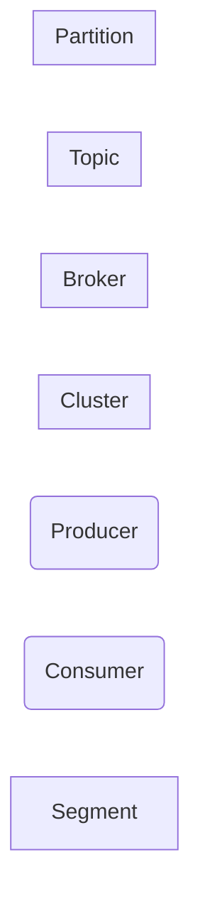

## Kafka Architecture

---

## Cluster

---

## Broker

---

## Topic

---

## Partition

---

## Segment

---

## Reference

- <https://curiousjinan.tistory.com/entry/understanding-kafka-all-structure>
