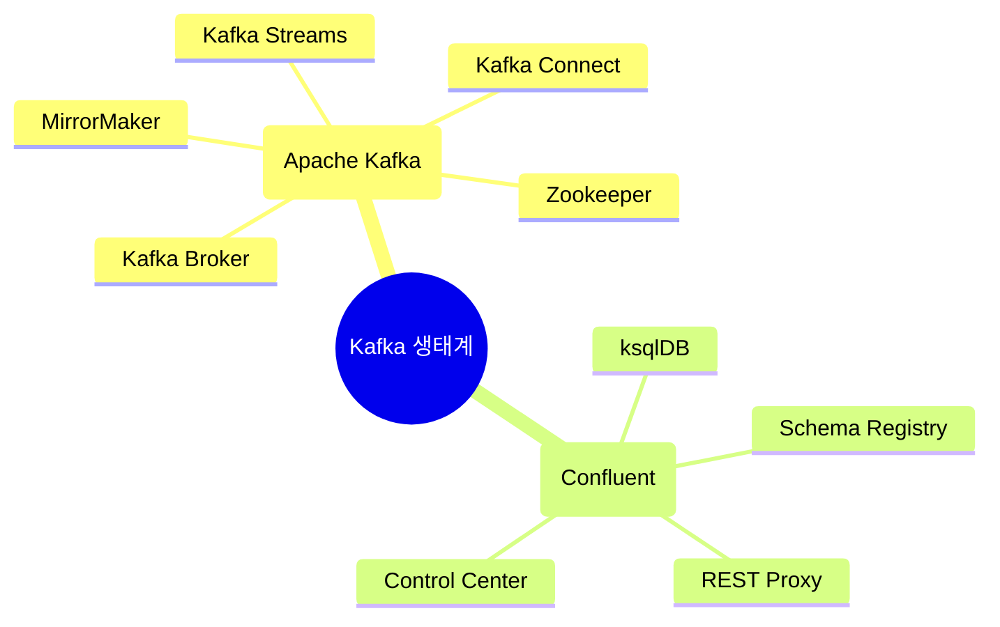

## Apache Kafka Component

- Apache Kafka는 현대적인 data pipeline의 중추적인 역할을 담당하는 분산 streaming platform입니다.

- Kafka 생태계에는 많은 component가 있습니다.
    - 크게 **Apache Kafka Project에 포함된 핵심 component**와, **Confluent 등의 기업에서 제공하는 추가 component**가 있습니다.
    - 다양한 component가 존재하는 이유는 분산 system의 각기 다른 요구 사항들을 해결하기 위해서입니다.
        - 예를 들어, schema 관리, monitoring, data 복제, REST 통신 등의 요구 사항이 있을 수 있습니다.
    - 필요한 기능에 따라 component를 선택적으로 사용할 수 있습니다.

### Apache Kafka Project의 기본 Component

1. **Kafka Broker** : Message Broker.
    - **실제 message를 저장하고 관리하는 server**로, **Kafka의 가장 핵심적인 component**입니다.
    - **topic과 partition을 관리**하며, 고가용성을 위해 여러 broker가 cluster를 구성합니다.
    - data의 복제와 장애 복구를 자동으로 처리하여 안정성을 보장합니다.

2. **Kafka Streams** : Stream 처리 Engine.
    - **Java/Scala 기반의 stream 처리 library**로, **실시간 data 처리를 지원**합니다.
    - 상태 기반 처리와 시간 window 연산을 제공하여 **복잡한 stream 분석이 가능**합니다.
    - 특징적인 기능으로는, 실시간 집계와 Join 연산, event 시간 기반 처리, 정확히 한 번 처리 의미론(exactly-once semantics) 지원, 내결함성 있는 local 상태 관리 등이 있습니다.

3. **Kafka Connect** : Data 통합 Framework.
    - **외부 system과 Kafka 사이의 data 이동**을 담당하는 확장 가능한 도구입니다.
    - 주요 connector 유형으로 Source Connector와 Sink Connector 두 가지 connector 유형이 있습니다.
        - **Source Connector** : 외부 system의 data를 Kafka로 가져옵니다.
        - **Sink Connector** : Kafka의 data를 외부 system으로 내보냅니다.
    - 선언적 설정으로 code 없이 data pipeline을 구축할 수 있습니다.
    - 분산 mode 지원으로 확장성을 확보할 수 있습니다.
    - 다양한 data format과 변환을 지원합니다.

4. **MirrorMaker** : Cluster 간 복제 도구.
    - 서로 다른 **Kafka cluster 간의 data 복제**를 담당합니다.
    - 재해 복구, 지역 간 data 동기화, data backup 등에 활용됩니다.

5. **Zookeeper** : 분산 Coordination Service.
    - **Kafka cluster의 metadata를 관리**하고 **분산 coordination**을 담당합니다.
    - broker의 생존 여부 monitoring, topic 구성 관리, controller 선출 등을 처리합니다.
    - cluster의 상태 정보를 안정적으로 저장하고 변경 사항을 cluster 전체에 동기화합니다.
    - Kafka 2.8 version부터는 KRaft mode를 통해 선택적으로 사용할 수 있습니다.
        - 원래 Zookeeper는 Kafka를 사용하기 위해 필수적으로 사용해야 하는 component였습니다.

### Confluent Platform의 확장 Component

1. **Schema Registry** : Data Schema 관리.
    - **data schema를 중앙에서 관리하고 version을 추적**합니다.
    - Avro, Protobuf, JSON schema 등 다양한 schema 형식을 지원합니다.
    - schema 진화(evolution)를 관리하여 하위 호환성을 보장합니다.

2. **ksqlDB** : Streaming SQL Engine.
    - **SQL 문법으로 stream 처리를 수행할 수 있는 database**입니다.
    - 실시간 query와 지속적인 query를 모두 지원합니다.
    - 내장된 streaming 기능으로 복잡한 처리 logic을 구현할 수 있습니다.
    - REST API를 통한 접근을 지원합니다.

3. **Control Center** : 관리 및 Monitoring UI 도구.
    - **Kafka cluster의 상태를 실시간으로 monitoring**합니다.
    - 주요 기능으로, cluster health check, 처리량(throughput)과 지연 시간(latency) monitoring, schema 관리, 보안 설정 등이 있습니다.

4. **REST Proxy** : HTTP Interface.
    - **HTTP를 통해 Kafka와 통신할 수 있는 REST API를 제공**합니다.
    - 다양한 programming 언어에서 Kafka 접근을 용이하게 합니다.

---

## Component 선택 및 활용 Guide

- component는 독립적으로, 또는 조합하여 사용할 수 있으며, 각 조직의 요구 사항과 기술 stack에 따라 적절히 선택하여 활용할 수 있습니다.

1. **기본 Messaging System** : Kafka Broker.
    - 단순한 pub-sub(발행/구독) model이 필요한 경우 **Kafka Broker**만으로 충분합니다.
    - 고가용성이 필요한 경우 여러 broker로 cluster를 구성합니다.

2. **실시간 Data 처리** : Kafka Streams, ksqlDB.
    - 실시간 처리가 필요한 경우 **Kafka Streams**나 **ksqlDB**를 활용합니다.
    - Java/Scala 개발자는 Kafka Streams를, SQL 친화적인 개발자는 ksqlDB를 선택합니다.

3. **Data 통합** : Kafka Connect.
    - 외부 system과의 연동이 필요한 경우 **Kafka Connect**를 사용합니다.
    - 많은 수의 connector가 이미 개발되어 있어 재사용이 가능합니다.

4. **Enterprise 확장** : Schema Registry, Control Center.
    - 대규모 운영 환경에서는 **Schema Registry**와 **Control Center**가 필수적입니다.
    - REST Proxy는 다양한 client 지원이 필요한 경우에 도입합니다.

