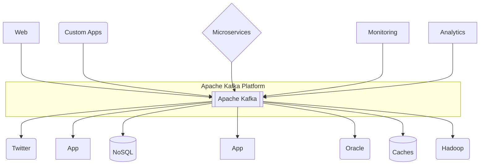
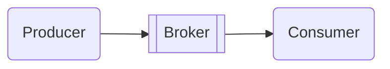

## Apache Kafka : 성능과 기능이 좋은 Message Queue

- Apache Kafka는 LinkedIn에서 개발하여 2011년 open source로 공개된 **분산 streaming platform**으로, **대용량 실시간 data 처리에 특화된 system**입니다.
    - 초당 수백만 건의 message를 안정적으로 처리할 수 있는 **고성능 구조**를 갖추고 있습니다.
    - 분산 system 구조를 채택하여 **높은 확장성과 안정성**을 제공합니다.

- **발행-구독(Publish-Subscribe) model을 기반으로 동작하는 messaging system**입니다.
    - **data 생산자(Producer)가 message를 발행**하면, **소비자(Consumer)가 필요한 message를 구독하여 처리**합니다.
    - 다수의 생산자와 소비자가 동시에 data를 주고받을 수 있는 구조입니다.

- **Kafka는 Broker** 역할을 수행하며, 일종의 **Message Queue**입니다.
    - Producer application과 Conumer application 사이에 위치하여 Message를 전달합니다.

