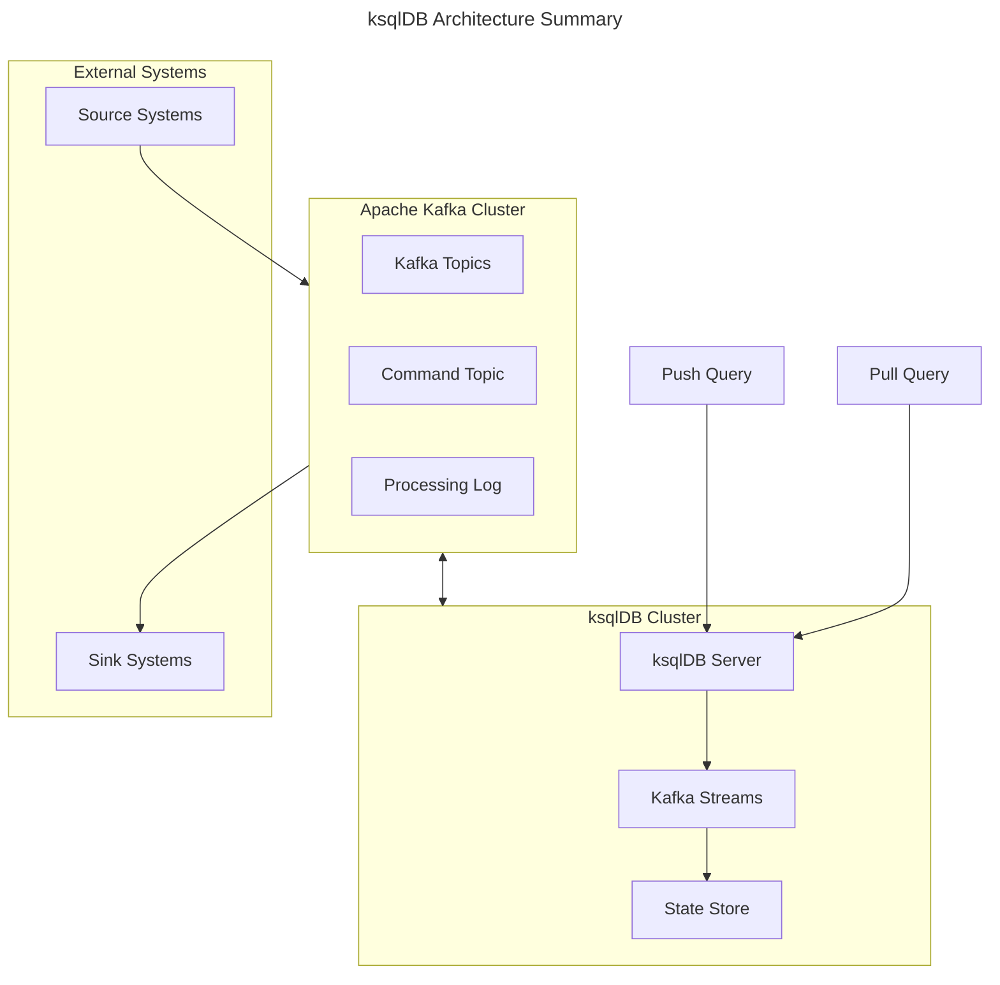
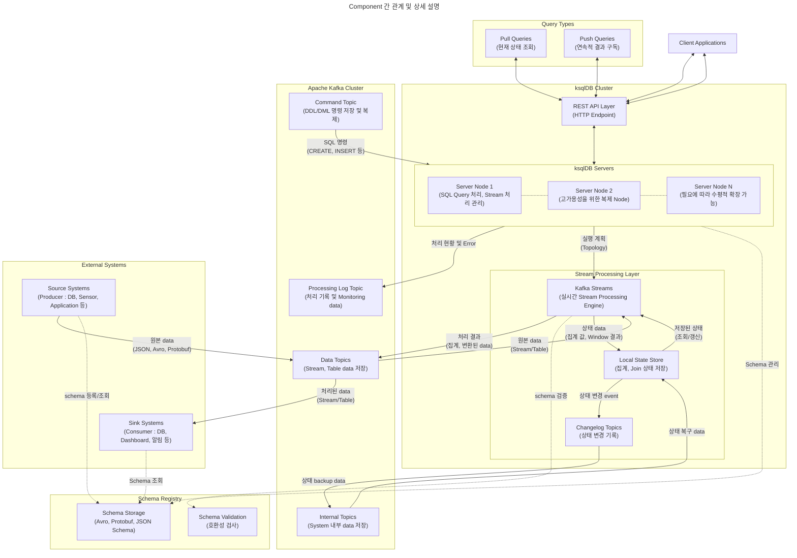

## ksqlDB : Kafka Event Streaming Database

- ksqlDB는 Apache Kafka를 위해 특별히 설계된 database로, **streaming data를 실시간으로 처리하고 분석할 수 있는 event streaming database**입니다.
    - Confluent에서 만든 streaming processing tool입니다.

- **SQL과 유사한 문법**을 사용하여 Kafka의 streaming data를 쉽게 처리할 수 있게 해줍니다.
    - ksqlDB는 Kafka 생태계의 주된 제품인 **Kafka Streams와 Kafka Connect를 활용**하여 만들어졌으며, 따라서 동작도 해당 제품들의 원리를 따릅니다.
    - ksqlDB의 주 동작은 SQL을 변환하여 Kafka Streams와 Kafka Connect의 기능을 사용해 사용자가 원하는 결과를 만드는 것입니다.

- ksqlDB는 실시간 data processing, streaming 분석, Event 기반 application 개발 등의 다양한 용도로 활용할 수 있습니다.
    - 특히 microservice architecture에서 event 중심의 data 처리가 필요한 경우에 유용하게 사용됩니다.

### ksqlDB의 특징

- **Stream 처리 중심 설계** : 실시간으로 흐르는 data를 지속적으로 처리할 수 있습니다.
    - event 시간 기반의 Window 처리를 지원하여 시계열 분석이 가능합니다.
    - Stream과 Table이라는 두 가지 주요 추상화를 제공합니다.

- **SQL 기반 Interface** : 기존 SQL 개발자들이 쉽게 적응할 수 있는 친숙한 문법을 제공합니다.
    - 복잡한 stream 처리 logic을 간단한 SQL문으로 표현할 수 있습니다.
    - SELECT, CREATE, INSERT 등 표준 SQL 명령어를 지원합니다.

- **확장성과 신뢰성** : Kafka의 분산 architecture를 기반으로 하여 높은 확장성을 제공합니다.
    - 장애 발생 시에도 data 손실 없이 처리할 수 있는 내결함성을 갖추고 있습니다.
    - 수평적 확장이 용이하여 대규모 data 처리가 가능합니다.

- **실시간 처리 기능** : millisecond 단위의 지연 시간으로 data를 처리할 수 있습니다.
    - Push query를 통해 실시간 update를 구독할 수 있습니다.
    - streaming ETL, 실시간 monitoring 등 다양한 usecase를 지원합니다.

- **통합 개발 환경** : REST API를 통한 programming 성격의 접근이 가능합니다.
    - 다양한 data 포맷(JSON, Avro, Protobuf 등)을 지원합니다.
    - 내장된 connector를 통해 외부 system과의 통합이 용이합니다.

- **상태 관리** : 지속적인 query 처리를 위한 상태 저장소를 제공합니다.
    - 분산 환경에서도 일관된 상태 관리가 가능합니다.
    - 장애 복구 시 상태를 자동으로 복구할 수 있습니다.

### ksqlDB의 주요 개념

- **KSQL** : ksqlDB에서 사용하는 SQL style의 query 언어입니다.

- **Stream** : Kafka topic의 message stream을 나타내며, 실시간으로 data가 추가되는 무한한 sequence입니다.
    - stream은 data의 흐름을 나타내며, 이를 통해 실시간으로 data를 처리하고 분석할 수 있습니다.
    - ksqlDB에서 data는 Stream 단위로 처리됩니다.

- **Table** : Stream의 상태를 나타내는 View입니다.
    - stream의 data를 table 형태로 변환하여 상태를 유지하고, 이력을 추적할 수 있습니다.
    - table은 stream의 data를 query하여 실시간으로 조회하거나 분석할 수 있습니다.

- **Persistent Query** : 한 번 실행되면 종료하지 않고 지속적으로 실행되는 영구 query입니다.
    - 새로운 data가 들어올 때마다 자동으로 처리하여 결과를 update합니다.
    - `CREATE STREAM AS SELECT` 또는 `CREATE TABLE AS SELECT` 문으로 생성됩니다.

- **Push & Pull Query** : ksqlDB에서 제공하는 두 가지 유형의 query 방식입니다.
    - Push Query는 실시간으로 update되는 결과를 지속적으로 받아보는 query입니다.
    - Pull Query는 특정 시점의 현재 상태만을 조회하는 일회성 query입니다.

- **Windowing** : 시간을 기준으로 data를 grouping하여 처리하는 기능입니다.
    - Tumbling Window는 고정된 시간 간격으로 data를 분할합니다.
    - Hopping Window는 일정 시간 간격으로 이동하면서 겹치는 구간을 처리합니다.
    - Session Window는 event 발생 시간을 기준으로 session 단위로 처리합니다.

- **Connector** : 외부 system과 ksqlDB를 연결하는 component입니다.
    - Source Connector는 외부 system의 data를 ksqlDB로 가져옵니다.
    - Sink Connector는 ksqlDB의 처리 결과를 외부 system으로 내보냅니다.

- **Materialized View** : stream 처리 결과를 저장하고 유지하는 특별한 형태의 table입니다.
    - 실시간으로 update되며, 빠른 조회가 가능합니다.
    - 주로 집계(group by)나 Join 연산의 결과를 caching하는 용도로 사용됩니다.

- **Schema Registry** : data의 schema 정보를 중앙에서 관리하는 system입니다.
    - schema version 관리와 호환성 검사를 제공합니다.
    - Avro, Protobuf, JSON Schema 등의 형식을 지원합니다.

### KSQL과 SQL의 차이점

| 특징 | KSQL | SQL |
| --- | --- | --- |
| **Data 모델** | Stream(무한 Sequence)과 Table 중심 | Table 중심의 관계형 모델 |
| **처리 방식** | 연속적인 실시간 처리 (Continuous Processing) | 요청 시점의 일회성 처리 (Request-Response) |
| **Query 실행** | 지속적으로 실행되며 결과가 계속 update됨 | 한 번 실행되고 결과가 즉시 반환됨 |
| **시간 개념** | event 시간과 처리 시간을 모두 고려함 | query 실행 시점의 현재 상태만 고려함 |
| **Join 연산** | Stream-Stream, Stream-Table, Table-Table Join 지원 | Table-Table Join만 지원 |
| **Window 처리** | 시간 기반 Window 연산 기본 제공 | Window 함수는 제한적으로 제공 |
| **상태 관리** | 분산 상태 저장소 필수 | Transaction 기반 상태 관리 |
| **확장성** | 수평적 확장 용이 (Kafka 기반) | 수직적 확장 중심 |
| **Data 보존** | event 기록 영구 보존 가능 | 최신 상태만 유지 |
| **Transaction** | 제한적인 Transaction 지원 | ACID Transaction 완벽 지원 |
| **사용 사례** | 실시간 분석, event 처리, streaming ETL | business data 관리, 보고서 생성, OLTP/OLAP |
| **Schema** | schema 진화 지원 | 엄격한 schema 제약 |

---

## ksqlDB Architecture Component

- **ksqlDB server** : ksqlDB의 핵심 실행 engine입니다.
    - REST API endpoint를 제공하여 query 실행과 stream 처리를 담당합니다.
    - 여러 server를 cluster로 구성하여 고가용성과 확장성을 제공합니다.

- **Kafka Streams** : ksqlDB의 기반이 되는 stream processing engine입니다.
    - 상태 저장소(State Store)를 관리하고 stream processing logic을 실행합니다.
    - 장애 복구와 scaling을 자동으로 처리합니다.

- **Apache Kafka** : event storage로 활용됩니다.
    - topic을 통해 data를 영구 저장하고 streaming합니다.
    - source connector와 sink connector를 통해 외부 system과 통합됩니다.

- **Command Topic** : ksqlDB query와 application 상태를 저장합니다.
    - cluster 내 server 간 동기화에 사용됩니다.
    - DDL 명령어와 persistent query 정보를 보관합니다.

- **Processing Log** : stream 처리 중 발생하는 오류와 예외를 기록합니다.
    - debugging과 monitoring에 활용됩니다.
    - Kafka topic에 저장되어 추후 분석이 가능합니다.

- **Pull/Push Query** : data를 조회하는 질의문입니다.
    - Pull Query : 특정 시점의 상태를 조회하는 요청-응답 방식의 query입니다.
    - Push Query : 지속적으로 결과를 streaming하는 실시간 query입니다.

