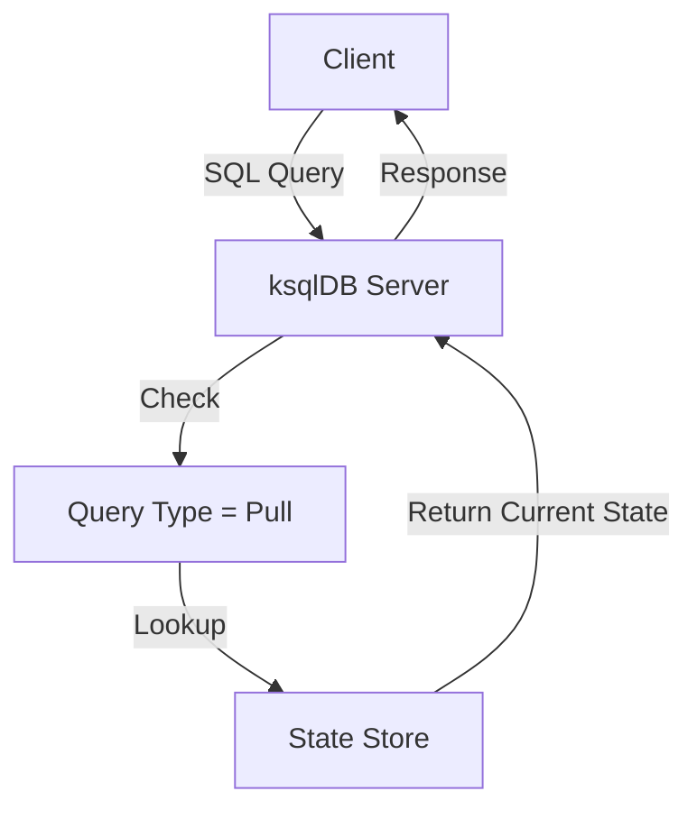
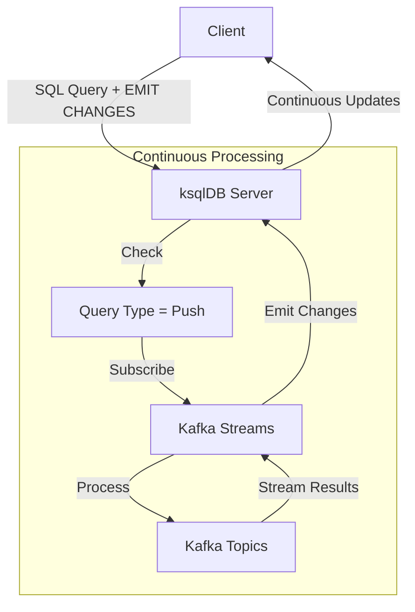
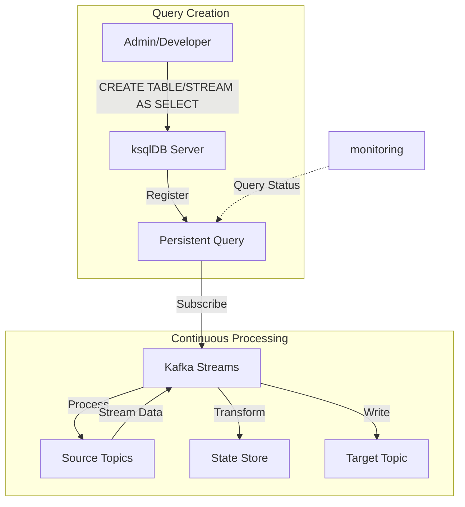

## ksqlDB의 Query Type : Pull, Push, Persistent

- ksqlDB에는 세 가지 종류의 query 유형이 존재합니다.

| 특성 | Pull Query | Push Query | Persistent Query |
| --- | --- | --- | --- |
| **실행 방식** | 즉시 조회 후 종료 (일회성 요청-응답) | 실시간 구독 형태로 동작 (streaming) | server process로 독립 실행 (server 상주) |
| **문법 Keyword** | `SELECT` | `SELECT` + `EMIT CHANGES` | `CREATE TABLE/STREAM AS SELECT` |
| **Data Source** | 집계된 Table만 | Stream, Table 모두 | Stream, Table 모두 |
| **결과 저장** | 미저장 | 미저장 | 새로운 Stream/Table로 저장 |
| **`WHERE` 조건** | key 기반 필수 | 선택적 | 선택적 |
| **종료 시점** | 즉시 | 연결 종료 시 | 삭제 전까지 영구 실행 |
| **사용 사례** | 현재 상태 조회 | 실시간 monitoring | ETL, 실시간 data 변환 |
| **Resource 사용** | 낮음 | 중간 | 높음 |
| **장점** | 빠른 응답, 간단한 구현, resource 효율적 | 실시간 update, 유연한 filtering, event 기반 처리 | 자동화된 처리, data 영구 저장, 복잡한 변환 가능 |
| **단점** | 제한된 query 범위, key 기반 조회만 가능 | 연결 관리 필요, client 부하 | 높은 resource 사용, 관리 복잡성 |

- **ksqlDB는 subquery를 지원하지 않으며, 앞으로의 지원 계획도 없습니다.**
    - 개발사(Confluent)가 subquery를 통한 복잡도는 project 성격에 맞지 않다고 판단했기 때문입니다.
    - 대신 subquery가 아닌 여러 query를 Kafka로 통합하는 방향을 지향하고 있습니다.


---


## Pull Query : 현재의 상태만을 조회하기

```sql
SELECT *
FROM table_name
WHERE condition;
```

- Pull Query는 **특정 시점의 상태를 조회**할 때 사용합니다.

- 일반적인 SQL의 `SELECT` 문처럼 요청 시점의 data를 한 번만 가져옵니다.
    - 전통적인 database의 `SELECT` 문과 유사한 방식으로 동작합니다.

- Materialized View나 Table에서만 조회할 수 있으며, key 기반 조회가 필수입니다.

- Push Query와 달리 지속적으로 결과를 streaming하지 않고, **일회성 조회만** 합니다.
    - 실시간 monitoring이나 dashboard에는 Push Query를 사용하는 것이 더 적합합니다.

```sql
-- 사용자 정보 확인
SELECT * FROM users_table 
WHERE user_id = '123';

-- 사용자 ID가 1인 사용자의 현재 주문 상태 조회
SELECT user_id, order_status
FROM orders_by_user
WHERE user_id = 1;
```

- Pull Query는 microservice architecture에서 service 간 data 조회나 상태 확인 등에 유용하게 활용됩니다.


### Pull Query 특징

1. **요청-응답 Model** : query를 실행하면 즉시 결과를 반환하고 종료됩니다. 
2. **현재 상태 조회** : Materialized View나 Table의 현재 상태를 조회합니다.
    - Stream 처리 결과가 집계된 최신 상태를 의미합니다.
3. **Key 기반 조회** : 특정 key나 key 범위를 기준으로 data를 조회할 수 있습니다.


### Pull Query 제한 사항

- Pull Query는 Materialized View나 Table에서만 사용 가능합니다.
- `WHERE` 절에서 key 기반 조건이 필요합니다.
- `GROUP BY`나 `HAVING` 절은 사용할 수 없습니다.

#### Pull Query가 WHERE 조건과 Key 기반 조건을 필요로 하는 이유

- Pull Query에서의 제약 사항은, 분산 system에서의 성능과 안정성을 위한 중요한 설계 결정입니다.
    - Push Query는 streaming 방식으로 결과를 지속적으로 반환하므로 전체 scan에 따른 부하를 분산시킬 수 있습니다.
    - 반면 Pull Query는 즉각적인 응답이 필요하므로, 조회 범위를 제한하지 않으면 system에 큰 부하를 줄 수 있습니다.

1. **Data 조회의 효율성** : 분산 환경에서 효율적인 data 검색을 위한 필수 조건.
    - ksqlDB는 분산 system에서 작동하며, 모든 data를 scan하는 것은 매우 비효율적입니다.
    - key 기반 조건을 통해 특정 partition만 조회할 수 있어 조회 성능이 크게 향상됩니다.
    - `WHERE` 절의 key 조건은 partition pruning을 가능하게 합니다.

2. **Resource 사용 제어** : system 안정성을 위한 memory 사용량 제한.
    - 제한 없는 Pull Query는 대량의 data를 반환할 수 있어 memory 사용량이 급증할 수 있습니다.
    - key 기반 조회를 강제함으로써 resource 사용을 예측 가능한 수준으로 제한할 수 있습니다.

3. **실시간 조회 용도** : 특정 key의 현재 상태 조회에 최적화된 query 방식.
    - Pull Query는 주로 특정 key에 대한 현재 상태를 조회하는 용도로 설계되었습니다.
    - 전체 dataset scan이 필요한 경우에는 Push Query를 사용하는 것이 더 적합합니다.


### Pull Query Process



1. client가 `SELECT` query를 전송합니다.
2. server가 Pull Query임을 확인합니다.
3. 지정된 key로 State Store를 조회합니다.
4. 현재 상태값을 반환합니다. 
5. client에 즉시 응답합니다.


---


## Push Query : 실시간 상태 변화를 구독하기

```sql
SELECT columns
FROM stream_or_table
[WHERE condition]
EMIT CHANGES;
```

- Push Query는 **실시간으로 data 변경 사항을 지속적으로 받아보고 싶을 때 사용**합니다.
    - query를 실행하면 초기 상태를 받은 후, 새로운 변경 사항이 발생할 때마다 update를 받습니다.

- `EMIT CHANGES` 구문을 사용하여 작성하며, Stream과 Table 모두에서 사용 가능합니다.
    - Push Query 문법은 Pull Query에 `EMIT CHANGES` 구문만 추가한 형태입니다.
    - 집계(`GROUP BY`), 조인(`JOIN`), Window(`WINDOW`) 연산 등 다양한 streaming 작업을 지원합니다.

- Push Query는 **실시간 data 처리가 필요한 경우에 적합**하며, event 기반 architecture에서 핵심적인 역할을 수행합니다.
    - 주로 실시간 dashboard, monitoring system, 실시간 알림 service, 지속적인 ETL 처리 등에 활용됩니다.

```sql
-- 주문 금액이 1000 이상인 주문을 실시간으로 monitoring
SELECT order_id, amount, status
FROM orders_stream
WHERE amount >= 1000
EMIT CHANGES;

-- 주문을 한 시간 단위로 집계하여 실시간으로 monitoring
SELECT product_id, COUNT(*) AS order_count 
FROM orders_stream 
    WINDOW TUMBLING (SIZE 1 HOUR) 
GROUP BY product_id 
EMIT CHANGES;
```


### Push Query 특징

1. **지속적인 Streaming** : query가 실행되면 data의 변경 사항을 실시간으로 계속 전달받습니다.
    - 연결이 유지되는 동안 새로운 결과가 발생할 때마다 client에게 전송됩니다.

2. **초기 상태 + Update** : query 실행 시점의 현재 상태를 먼저 반환하고, 이후 발생하는 변경 사항을 streaming합니다.


### Pull Query와의 주요 차이점

1. **연결 유지** : Push Query는 client와의 연결을 계속 유지합니다.
2. **실시간성** : data 변경을 즉시 감지하고 전달합니다.
3. **Resource 사용** : 지속적인 연결과 처리로 인해 더 많은 resource를 사용합니다.
4. **Query 제약** : Pull Query보다 더 자유로운 query 작성이 가능합니다.


### Push Query Process



1. client가 `EMIT CHANGES`가 포함된 query를 전송합니다.
2. server가 Push Query임을 확인합니다.
3. Kafka Streams에 구독을 설정합니다.
4. topic data를 지속적으로 처리합니다.
5. 변경 사항이 발생할 때마다 streaming합니다.
6. client에 실시간으로 전송합니다.


---


## Persistent Query : 영속화되는 query 결과

```sql
CREATE TABLE table_name AS
SELECT columns
FROM stream_or_table
[WHERE condition]
[GROUP BY columns]
EMIT CHANGES;
```

- Persistent Query는 **server에 영구적으로 등록되어 실행되는 query**입니다.

- `CREATE` 문으로 생성하며, server가 실행되는 동안 계속 동작합니다.
    - server가 재시작되더라도 자동으로 다시 시작되며, 상태를 저장소에 유지합니다.

- `SHOW QUERIES` 명령으로 실행 중인 Persistent Query 목록을 확인할 수 있습니다.

- Persistent Query는 **streaming data의 지속적인 처리와 상태 관리가 필요한 경우**에 유용하게 사용됩니다.
    - microservice architecture에서 event 기반 data pipeline을 구축하는데 핵심적인 역할을 합니다.
    - 주로 실시간 data 변환(ETL), 지속적인 data 집계, 실시간 Materialized View 유지, event 기반 알림 system 등에서 활용됩니다.

```sql
-- 지역별 주문 금액 합계를 계산하여 새로운 Table로 저장
CREATE TABLE regional_orders AS
SELECT region,
    COUNT(*) AS order_count,
    SUM(amount) AS total_amount
FROM orders_stream
GROUP BY region
EMIT CHANGES;

-- 고객별 최근 주문 상태를 추적하는 Table 생성
CREATE TABLE customer_latest_order AS
SELECT customer_id,
    LATEST_BY_OFFSET(order_id) AS latest_order_id,
    LATEST_BY_OFFSET(status) AS latest_status
FROM orders_stream
GROUP BY customer_id
EMIT CHANGES;

-- 날짜별 상품 판매량을 집계하는 Table 생성
CREATE TABLE daily_orders AS 
SELECT product_id,
    COUNT(*) as order_count,
    SUM(quantity) as total_quantity 
FROM orders_stream 
WINDOW TUMBLING (SIZE 24 HOURS) 
GROUP BY product_id 
EMIT CHANGES;
```


### Persistent Query 특징

1. **영구성과 생성 방식** : ksqlDB server가 실행되는 동안 계속 실행됩니다.
    - server가 재시작되더라도 자동으로 다시 시작됩니다.
    - `CREATE STREAM AS SELECT` 또는 `CREATE TABLE AS SELECT` 문을 통해 생성합니다.
        - query를 영구적으로 저장하기 때문에, `SELECT` 구문 앞에 `CREATE TABLE/STREAM`을 더 붙입니다.

2. **상태 관리와 복구** : query 결과를 지속적으로 상태 저장소(state store)에 유지합니다.
    - server 재시작 시 자동으로 재실행되며, 마지막 처리 지점부터 재개합니다.
    - 장애가 발생하더라도 복구가 가능합니다.

3. **Monitoring 기능** : `SHOW QUERIES` 명령으로 실행 중인 Persistent Query 목록을 확인할 수 있습니다.
    - 개별 query의 상태와 metric을 monitoring할 수 있습니다.


### Persistent Query 관리 명령어

```sql
-- 실행 중인 query 목록 확인
SHOW QUERIES;

-- 특정 query 종료
TERMINATE QUERY [query_id];

-- 특정 query 설명
EXPLAIN [query_id];
```


### Persistent Query Process



1. 관리자가 `CREATE TABLE/STREAM AS SELECT` query를 등록합니다.
2. server에 Persistent Query로 등록합니다.
3. Kafka Streams application을 생성합니다.
4. source topic을 구독하고 처리합니다.
5. data를 변환/가공합니다.
6. State Store를 update합니다.
7. 결과를 새로운 topic에 저장합니다.


---


## Query 관리를 위한 주요 명령어

- query 관리 명령어를 통해 query를 효율적으로 관리하고 monitoring할 수 있습니다.
- 실제 운영 환경에서는 특히 `SHOW QUERIES`, `EXPLAIN`, `TERMINATE` 등의 명령어를 자주 사용합니다.


### Query 조회 관련 명령어

```sql
-- 실행 중인 모든 query 조회
SHOW QUERIES;

-- 특정 query ID의 상세 정보 조회
EXPLAIN <query_id>;

-- 특정 query의 실행 계획 확인
EXPLAIN <query>;

-- streaming query의 현재 상태 확인
SELECT queryString, state, kafkaTopic 
FROM KSQL_QUERIES_STREAM 
EMIT CHANGES;
```


### Query 실행 제어 명령어

```sql
-- 특정 query 종료
TERMINATE <query_id>;

-- 특정 query 일시 중지
PAUSE <query_id>;

-- 일시 중지된 query 재시작
RESUME <query_id>;
```


### Query 설정 관련 명령어

```sql
-- 현재 세션의 모든 속성 확인
SHOW PROPERTIES;

-- 특정 속성 설정
SET '<property_name>'='<value>';

-- 특정 속성 해제
UNSET '<property_name>';
```


### Query 분석 및 Debugging

```sql
-- query 실행 통계 확인
DESCRIBE EXTENDED <query_id>;

-- query 처리량 확인
SELECT * FROM KSQL_PROCESSING_LOG;

-- 특정 topic의 메시지 확인
PRINT '<topic_name>' FROM BEGINNING;
PRINT '<topic_name>' FROM BEGINNING LIMIT 10;
```


### Query History 관련

```sql
-- 실행했던 query history 조회
SHOW HISTORY;

-- 특정 시점 이후의 query history
SHOW HISTORY FROM_TIME '2024-01-07T00:00:00';
```


### Query 권한 관리

```sql
-- 사용자 권한 확인
SHOW ACCESS;

-- 특정 query에 대한 권한 부여
GRANT SELECT ON STREAM <stream_name> TO <user>;
```


### Query 성능 최적화 도구

```sql
-- query 실행 계획 분석
ANALYZE <query>;

-- query 성능 통계 확인
SELECT * FROM KSQL_PROCESSING_LOG 
WHERE LEVEL='ERROR' 
EMIT CHANGES;
```


### Query Monitoring

```sql
-- resource 사용량 확인
DESCRIBE EXTENDED <stream_or_table>;

-- 처리된 record 수 확인
SELECT ROWTIME, ROWKEY, * 
FROM KSQL_PROCESSING_LOG 
WHERE LOGGER='processing.log' 
EMIT CHANGES;
```


---


## Referene

- <https://ojt90902.tistory.com/1112>

