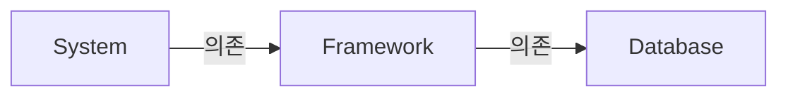

## Architecture 설계에도 적용되는 SOLID 원칙

- 좋은 software system은 clean code로부터 시작합니다.
    - 좋은 벽돌(code)을 사용하지 않으면 건물의 구조(architecture)가 좋고 나쁜 것은 큰 의미가 없는 것과 같습니다.
    - 그리고 SOLID 원칙은 clean code를 짜는 데에 도움이 됩니다.

- SOLID 원칙은 객체 지향 software에만 적용되는 것은 아닙니다.
    - SOLID 원칙은 함수와 data 구조를 class로 배치하는 방법과 class들을 서로 결합하는 방법을 설명합니다.
    - class는 단순히 함수와 data의 집합을 의미할 뿐이기 때문에, SOLID 원칙은 객체 지향 software가 아니더라도 적용될 수 있습니다.

- SOLID 원칙의 목적은 **중간 수준의 software 구조**를 **변경에 유연**하고, **이해하기 쉽게** 하고, 많은 software system에서 사용되는 **component의 기반이 되도록** 하는 데에 있습니다.
    - '중간 수준'이란 code보다 상위 수준인 module과 component의 내부를 의미합니다.
    - 'module'은 source code(하나의 class) 수준을, 'component'는 배포 가능한 가장 작은 단위를 의미합니다.

---

## SRP : 단일 책임 원칙 (Single Responsibility Principle)

- SRP는 **단일 module의 변경 이유는 오직 하나**여야만 한다는 원칙입니다.
- 단일 책임 원칙은 method와 class 수준의 원칙입니다.
- 하지만 상위 module과 component 수준의 공통 폐쇄 원칙(CCP, Common Closure Principle)에서도 단일 책임 원칙이 적용됩니다.
- architecture 수준에서는 architecture 경계의 생성을 책임지는 변경의 축이 됩니다.

---

## OCP : 개방-폐쇄 원칙 (Open-Closed Pinciple)

- OCP는 **software 개체(artifact)는 확장에는 열려 있어야 하고, 변경에는 닫혀 있어야 한다**는 원칙입니다.
    - OCP를 위해 서로 다른 목적으로 변경되는 요소를 적절하게 분리하고(SRP), 이 요소들 사이의 의존성을 체계화(DIP)해야 합니다.
    - 행위를 확장할 수 있어야 하지만 개체를 변경해서는 안 되며, 이것이 architecture를 공부하는 근본적인 이유입니다.

- OCP의 목표는 **system을 확장하기 쉬운 동시에, 변경으로 인해 system이 너무 많은 영향을 받지 않도록 하는 것**입니다.
    - 이를 위해 system을 component 단위로 분리하고, 저수준 component에서 발생한 변경으로부터 고수준 component를 보호할 수 있는 형태의 의존성 계층 구조가 만들어지도록 해야 합니다.

- OCP는 system의 architecture를 떠받치는 원동력 중 하나입니다.
    - software architecture가 훌륭하다면 변경되는 code의 양이 최소화될 것입니다.
    - 이상적인 code 변경량은 0입니다.

---

## LSP : Liskov 치환 원칙 (Liskov Subsitution Principle)

- LSP는 부모 객체와 자식 객체가 있을 때, **부모 객체를 호출하는 동작에서 자식 객체가 부모 객체를 완전히 대체할 수 있어야 한다**는 원칙입니다.
    - 올바른 상속을 위해, 자식 객체의 확장이 부모 객체의 방향을 온전히 따르도록 권고하는 원칙입니다.

- LSP는 architecture 수준까지 확장할 수 있고, 반드시 확장해야만 합니다.
    - 치환 가능성을 조금이라도 위배하면 system architecture가 오염되어 상당량의 별도 mechanism을 추가해야할 수 있기 때문입니다.

---

## ISP : Interface 분리 원칙 (Interface Segregation Principle)

- ISP는 **큰 덩어리의 interface들을 구체적이고 작은 단위들로 분리**시킴으로써, **client들이 꼭 필요한 method들만 이용**할 수 있도록 합니다.

- software 설계자는 사용하지 않은 것에 의존하지 않아야 합니다.
    - 일반적으로 필요 이상으로 많은 것을 포함하는 module에 의존하는 것은 해롭습니다.
    - source code의 의존성이 높다면, 변경 사항이 생길 때 불필요한 compile과 배포를 해야만 합니다.
    - 더 고수준인 architecture도 마찬가지입니다.

### Architecture 입장에서 ISP를 어기는 경우

- System을 구축중인 architect가 Framework를 도입하길 원하고, 개발자는 Database를 반드시 사용해야 하는 상황입니다.
    - 따라서 System는 Framework에 의존하며, Framework는 다시 Database에 의존하는 상황입니다.

- Database에 기능이 추가됩니다.
    - Framework와 System에는 불필요한 기능입니다.
    - 이 기능은 Database에 포함되고, Framework와 System은 직간접적으로 Database에 의존하고 있습니다.
    - 그래서 **Database 내부가 변경되면 Framework를 재배포**해야 할 수 있고, **Framework를 재배포하기 때문에 System까지 재배포**해야 할 가능성이 있습니다.

- 또한 Database 내부의 기능 중 Framework와 System에서 불필요한 기능에 문제가 발생해도 Framework와 System이 영향을 받게 됩니다.

---

## DIP : 의존 관계 역전 원칙 (Dependency Inversion Principle)

- DIP는 **고수준 정책을 구현하는 code는 저수준 세부사항을 구현하는 code에 의존해서는 안 된다**는 원칙입니다.

- architecture의 입장에서 **유연성이 극대화된 system**이란 **의존성이 추상(abstraction)에 의존하며 구체(concretion)에는 의존하지 않는 system**을 의미합니다.
    - DIP는 architecture diagram에서 가장 눈에 잘 띄는 원칙이기도 합니다.
    - 의존성은 더 추상적인 entity가 있는 쪽으로만 향해야하며, 이 규칙을 의존성 규칙(Dependency Rule)이라 부릅니다.

- Java같은 정적 type 언어에서 `use`, `import`, `include` 구문은 오직 interface나 추상 class 같은 추상적인 선언만을 참조해야 합니다.
    - 구체적인 요소에 의존할 수는 있지만, 변동성이 큰(volatile) 구체적인 요소에는 절대로 의존해서는 안 됩니다.

- 안정된 software architecture란 **변동성이 큰(volatile) 구현체에 의존하는 일은 지양**하고, **안정된 추상 interface에 의존하는 것을 선호**하는 architecture입니다.
    - 뛰어난 software architect라면 interface의 변동성을 낮추고, interface를 변경하지 않고도 구현체에 기능을 추가할 수 있도록 architecture를 설계합니다.
        - interface에 변경이 생기면 구현체들도 수정해야하지만, 구현체들에는 변경이 생기더라도 interface는 대부분 변경될 필요가 없습니다.
    - interface는 구현체보다 변동성이 낮습니다.

### DIP 위반이 허용되는 경우

- 원래 component, module, 객체는 구체가 아닌 추상에 의존해야 하지만, software system이라면 구체적인 많은 장치에 반드시 의존하게 됩니다.
- 이는 DIP를 위반하는 것이지만, DIP를 모든 곳에서 지키는 것은 비현실적이며, 경우에 따라서 위반을 허용하기도 합니다.

- 예를 들어, Java의 `String` class는 구체 class이며, 이를 추상화시키려는 의도는 현실성이 없습니다.
    - String 구체 class에 대한 source code 의존성은 벗어날 수 없고, 벗어나서도 안 됩니다.
    - String class는 매우 안정적이며, 변경되는 일은 거의 없습니다.
        - 변경이 있더라도 엄격하게 통제됩니다.
    - programmer와 architect는 String class에 변경이 자주 발생하리라고 염려할 필요가 없습니다.
    - 따라서 Java의 `String` class는 **개발자들의 암묵적 합의에 의해서 DIP를 위반이 허용**됩니다.

- `String` class 같이, DIP를 논할 때 운영 체제나 platform과 같이 **안정성이 보장된 환경**에 대해서는 무시합니다.
- DIP를 지켜서 의존하지 않도록 피해야 하는 것은 변동성이 큰 구체적인 요소(개발 중이라서 자주 변경될 수 밖에 없는 module들)입니다.
