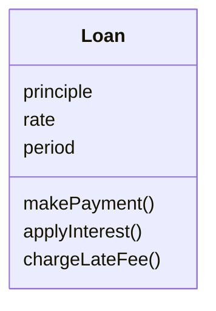

- software system이란 정책을 기술한 것이며, **정책은 모든 업무 규칙(business logic)과 절차(process)를 구체화합니다.**
    - 하나의 정책은 이 정책을 서술하는 여러 개의 작은 정책들로 쪼갤 수 있습니다.
    - system의 본질적인 가치는 세부 사항이 아닌 정책에 있습니다.

- software architecture 개발에는 **정책을 신중하게 분리**하고, **정책이 변경되는 양상에 따라 정책을 재편성**하는 일도 포함됩니다.

- 단일 책임 원칙(SRP)과 공통 폐쇄 원칙(CCP)에 따르면, **동일한 이유로 동일한 시점에 변경되는 정책은 함께 묶여야 합니다.**
    - 동일한 이유로 동일한 시점에 변경되는 정책은 동일한 수준에 위치하며, 동일한 component에 속합니다.
    - 다른 이유 혹은 다른 시점에 변경되는 정책은 다른 수준에 위치하며, 다른 component로 분리합니다.


---


## 업무 규칙 (Business Logic)

- 업무 규칙은 **사업적으로 수익을 얻거나 비용을 줄일 수 있는 규칙 또는 절차**이며, program 구현 여부와는 상관없습니다.
    - 업무 규칙은 system에서 가장 독립적이며 가장 많이 재사용할 수 있는 code여야 합니다.

- 업무 규칙이 요구하는 data를 **업무 data**라고 합니다.
    - 예를 들어, 대출에 일정 비율의 이자를 부과한다는 사실은 은행이 돈을 버는 업무 규칙이며, 대출 잔액이나 이자율 등은 업무 data입니다.

- 핵심 업무 규칙(Critical Business Rule)은 사업 자체에 핵심적인 규칙입니다.
    - 규칙을 자동화하는 system이 없더라도 그대로 존재하며, 사람이 수동으로 직접 수행하더라도 마찬가지로 그대로 존재합니다.

- 핵심 업무 data (Critical Business Data)는 핵심 업무 규칙에 필요한 data입니다.
    - system으로 자동화하지 않은 경우에도 존재하는 data입니다.
    - 핵심 규칙과 핵심 data는 본질적으로 결합되어 있고, 이것으로 만든 객체를 Entity라고 함


---


## 업무 규칙 구현에 필요한 세 가지 요소

- 업무 규칙을 구현할 때는 **Entity**, **UseCase**, **Request/Response Model**이 필요합니다.


### 1. Entity

- Entity는 **핵심 업무 규칙과 핵심 업무 data를 객체로 만든 것**입니다.
    - 사업에 중요한 **핵심 업무 규칙**과 핵심 업무 규칙이 요구하는 **핵심 업무 data**는 본질적으로 결합되어 있으므로 객체로 만들기 좋은 후보입니다.

- Entity는 computer system 내부의 객체로서, **핵심 업무 data를 기반으로 동작하는 일련의 핵심 업무 규칙을 구체화**합니다.
    - Entity 객체는 핵심 업무 data를 직접 포함하거나, 핵심 업무 data에 매우 쉽게 접근할 수 있습니다.
    - Entity의 interface는 핵심 업무 data를 기반으로 동작하는 핵심 업무 규칙을 구현한 함수들로 구현됩니다.

- Entity class는 **business의 대표자**로서 독립적으로 존재하며, **순전히 업무에 대한 것**이어야 합니다.
    - Entity class는 업무 이외의 database, 사용자 interface, third party framework 등에 대한 고려 사항들로 인해 오염되어서는 안 됩니다.
    - 어떠한 system에서도 Entity의 업무를 수행할 수 있어야 합니다.
        - system의 표현 형식이나 data 저장 방식, computer가 배치되는 방식과도 무관해야 합니다.
    - 따라서 Entity는 핵심 업무 data와 규칙을 하나로 묶어서 **별도의 software module**로 만들어야 합니다.

- Entity를 만들 때 반드시 객체 지향 언어를 사용할 필요는 없습니다.
    - 단지 핵심 업무 data와 핵심 업무 규칙을 하나로 묶어서 별도의 software module로 만들면 됩니다.

- 업무 규칙 구현에 필요한 Entity는 **Domain Entity**입니다.
    - Entity라는 단어는 여러 곳에서 다른 의미로 쓰이고 있으며, 대표적으로 **business의 Domain Entity**와 **JPA의 영속성 Entity**가 있습니다.
    - JPA Entity는 DB와 mapping되는 영속성 Entity이므로 핵심 업무 규칙을 가지는 Domain Entity의 개념과는 다릅니다.
        - 하지만 JPA Entity가 업무 규칙을 가져 Domain Entity 역할까지 가질 수도 있습니다.

#### Entity Example

- 대출을 의미하는 Loan Entity는 3가지 핵심 업무 data를 포함하며, 3가지 핵심 업무 규칙을 interface로 제공합니다.




### 2. UseCase

- UseCase는 **application에 특화된(application-specific) 업무 규칙**을 설명합니다.
    - 사용자가 제공해야 하는 입력, 사용자에게 보여줄 출력, 그리고 해당 출력을 생성하기 위한 처리 단계를 기술합니다.
    - UseCase는 Entity 내부의 핵심 규칙을 언제 어떻게 호출할지 명시하는 규칙을 담습니다.
        - 입/출력 data를 형식 없이 명시한다는 점을 제외하고 UI를 기술하지 않습니다.
    - system이 사용자에게 어떻게 보이는지는 설명하지 않습니다.
        - system에서 data가 들어오고 나가는 방식은 UseCase와는 무관하며, 그 역할은 Request/Response Model이 맡습니다.

- UseCase는 **자동화된 system이 동작하는 방법을 정의하고 제약함으로써 수익을 얻거나 비용을 줄이는 업무 규칙**입니다.
    - UseCase는 자동화된 system이 사용되는 방법을 설명합니다.
        - UseCase는 자동화된 system의 요소로 존재해야만 의미가 있으므로, Entity처럼 수동 환경에서는 사용할 수 없습니다.
    - Entity가 어떻게 동작할지 제어하기 위해 system을 알아야 하기 때문에, Entity보다 덜 순수합니다.
        - UseCase는 Entity 내의 핵심 업무 규칙과는 반대되는 성격을 가집니다.

- UseCase는 객체이며, 함수와 data 요소를 포함합니다.
    - application에 특화된 업무 규칙을 구현하는 하나 이상의 함수를 제공합니다.
    - 입력 data, 출력 data, UseCase가 상호 작용하는 Entity에 대한 참조 data 등의 data 요소를 포함합니다.
        - 이를 통해 사용자와 entity 사이의 상호 작용을 규정합니다.

#### UseCase와 Entity 사이의 의존성

- UseCase와 Entity의 의존성 방향은 DIP(의존 관계 역전 원칙)를 준수합니다.
    - UseCase는 Entity에 의존하는 반면, Entity는 UseCase에 의존하지 않습니다.
- 고수준인 Entity는 저수준인 UseCase에 대해 알지 못하지만, 저수준인 UseCase는 고수준인 Entity를 알고 있습니다.
    - UseCase는 단일 application에 특화되어 있으며, system의 입/출력에 보다 가깝게 위치하기 때문에 저수준입니다.
    - Entity는 다양한 application에서 사용될 수 있도록 일반화한 것이며, 입/출력에서 더 멀리 떨어져 있으므로 고수준입니다.

#### UseCase Example

- 신규 대출을 위한 신상 정보를 수집하는 UseCase입니다.

```txt
• 입력 : 이름, 주소, 생일, 운전 면허 번호, 주민 번호 등
• 출력 : 사용자 확인을 위한 동일한 정보, 신용도
• 기본 과정
    1. 이름을 받아서 검증한다.
    2. 주소, 생일, 운전 면허 번호, 주민 번호 등을 검증한다.
    3. 신용도를 얻는다.
    4. 신용도가 500보다 낮으면, Denial(거절)을 활성화한다.
    5. 높으면 Customer(고객)를 생성하고 Loan Estimation(대충 견적)을 활성화한다.
```


### 3. Request/Response Model

- Request/Response Model은 system의 가장 저수준 영역에서 **사용자나 다른 component와 통신할 때의 입/출력 형식을 변환하고 제어**합니다.

- Request/Response Model은 **UseCase의 독립성을 보장**하기 위해 존재하며, 따라서 Request/Response Model은 독립적이어야 합니다.
    - UseCase는 입력 data로부터 출력 data를 생성하지만, 다른 component와 data를 주고 받는 방식은 몰라야 합니다.
    - UseCase class의 code가 HTML이나 SQL에 대해 알아서는 안 되며, Web이나 UI에 종속되지 않아야 합니다.
    - Request/Response Model이 독립적이지 않다면, 그 Model에 의존하는 UseCase도 결국 Model이 수반하는 의존성에 간접적으로 결합됩니다.

- Entity와 Request/Response Model은 많은 부분이 겹치지만, 통합해서 사용해서는 안 됩니다.
    - Entity와 Request/Response Model 객체는 존재의 목적이 다르며, 시간이 지나면 두 객체는 완전히 다른 이유로 변경될 것입니다.
    - 따라서 Entity와 Request/Response Model 객체를 함께 묶는 것은 OCP(공통 폐쇄 원칙)와 SRP(단일 책임 원칙)을 위반하는 것입니다.


---


## Reference

- Clean Architecture (도서) - Robert C. Martin
- <https://mangkyu.tistory.com/276>
