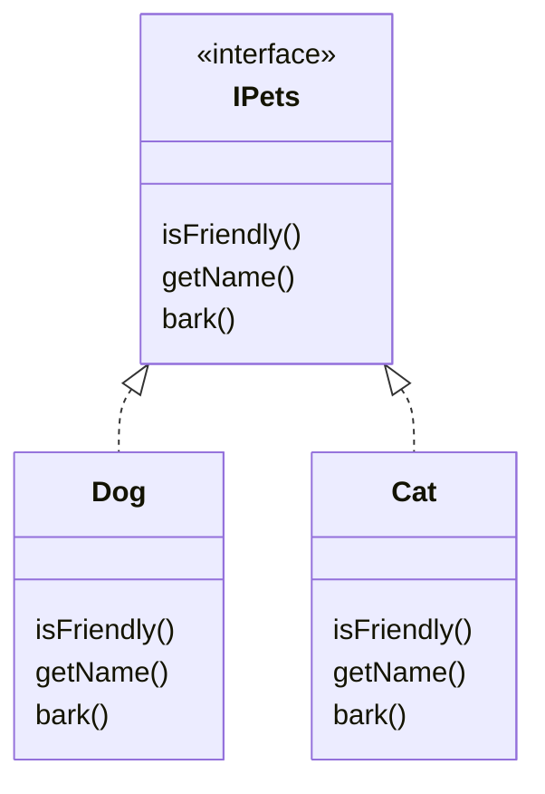
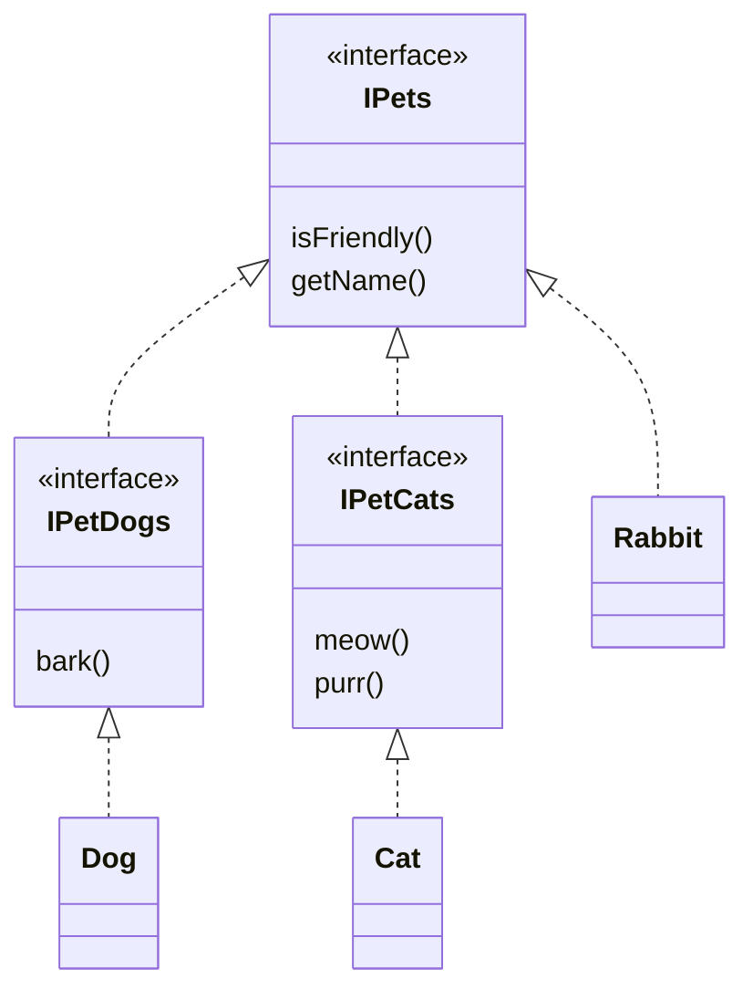

## ISP (Interface Segregation Principle) : Interface 분리 원칙

```txt
client가 자신이 이용하지 않는 method에 의존하지 않아야 합니다.
```

- client는 객체를 사용하는 소비자를 의미합니다.
    - 예를 들어, method, class 등.

- 기능이 많은 큰 덩어리의 interface를 구현하는 대신, 구체적이고 작은 단위들로 분리시켜 사용합니다.
    - client들이 꼭 필요한 method들만 이용할 수 있도록 합니다.

- ISP를 통해 system의 내부 의존성을 약화시켜 refactoring, 수정, 재배포를 쉽게 할 수 있습니다.
    - 결합도를 낮춘다는 말과 같습니다.

- Interface 분리 원칙은 **범용적인 interface보다는 client(사용자)가 실제로 사용하는 interface를 만들어야 한다**는 원칙입니다.
    - interface를 잘게 분리함으로써, client의 목적과 용도에 적합한 interface만을 제공할 수 있습니다.
    - ISP를 적용하면 class의 기능을 쉽게 파악할 수 있고, 객체의 기능을 유연하게 확장/수정할 수 있게 됩니다.

- 만약 interface의 추상 method들을 범용적으로 여러 가지를 구현하면, 그 interface를 상속받는 class는 자신이 사용하지 않는 interface도 억지고 구현해야 합니다.
    - 또한 사용하지도 않는 interface의 추상 method가 변경된다면, class에서도 수정이 필요하게 됩니다.


### ISP(Interface 분리 원칙)와 SRP(단일 책임 원칙)
 
- Interface 분리 원칙은 단일 책임 원칙과 비슷합니다.
    - SRP는 class의 단일 책임을 강조합니다.
    - ISP는 interface의 단일 책임을 강조합니다.

- 다만, interface는 class와 달리 추상화이기 때문에 여러 역할을 가지는 데에 제약이 없습니다.

- SRP의 목표가 class 분리를 통해 이루어진다면, ISP의 목표는 interface 분리를 통해 이루어집니다.
    - SRP를 적용할 때 class 책임 범위를 분리하는 기준이 다르듯이, interface를 분리하는 기준도 상황에 따라 다릅니다.
    - ISP 적용의 핵심은 관련된 기능을 하나의 interface에 모으되, 지나치게 커지지 않도록 크기를 제한하라는 점입니다.


### Example : Interface 분리하기

#### Interface 분리 전

- 고양이는 "멍멍" 짖지 않기 때문에, `IPets` interface에 `bark()` method가 있는 것은 적합하지 않습니다.



#### Interface 분리 후

- `IPets` interface에서 고양이와 개의 특징을 분리하여 `IPetDogs`와 `IPetCats` interface를 따로 만들었기 때문에, `IPets` interface는 토끼를 만들 때 사용할 수도 있습니다.




