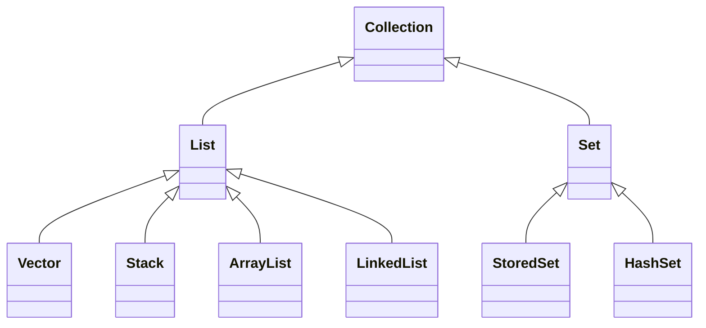

## LSP (Liskov Substitution Principle) : Liskov 치환 원칙

- Liskov 치환 원칙은 sub type(하위 유형)은 언제나 super type(기반이 되는 유형)으로 교체할 수 있어야 한다는 원칙입니다.
    - 1988년 Barbara Liskov가 올바른 상속 관계의 특징을 정의하기 위해 발표했습니다.

- "교체할 수 있다"는 말은, 자식 class는 최소한 자신의 부모 class에서 가능한 행위는 수행할 수 있어야 한다는 말입니다.
    - 부모 class의 instance를 사용하는 위치에 자식 class의 instance를 대신 사용했을 때, code가 원래의 의도대로 작동해야 합니다.
    - 이것을 부모 class와 자식 class 사이의 행위가 일관성이 있다고 말한다.

- LSP는 **다형성을 지원하기 위한 원칙**입니다.
    - 다형성 기능을 이용하기 위해서는 class를 상속시켜 type을 통합할 수 있게 설정하고, upcasting을 해도 method 동작에 문제가 없도록 설계하여야 하기 때문입니다.


### Java Collection Framework : LSP를 잘 지킨 사례

- 변수에 `LinkedList` 자료형을 담아 사용하다가, 중간에 전혀 다른 `HashSet` 자료형으로 바꿔도, `add()` method 동작을 보장받기 위해서는 `Collection`이라는 interface type으로 변수를 선언하여 할당하면 됩니다.
- interface `Collection`의 추상 method를 각기 하위 자료형 class에서 implements하여 interface 구현 규약을 잘 지키도록 미리 잘 설계되어 있기 때문입니다.



```java
void myData() {
    Collection data = new LinkedList();    // Collection interface type으로 변수를 선언합니다.
    data = new HashSet();    // 중간에 전혀 다른 자료형 class를 할당해도 호환이 됩니다.
    
    modify(data);
}

void modify(Collection data){
    list.add(1);    // interface 구현 구조가 잘 잡혀있기 때문에 add method 동작이 각기 자료형에 맞게 보장됩니다.
    // ...
}
```


