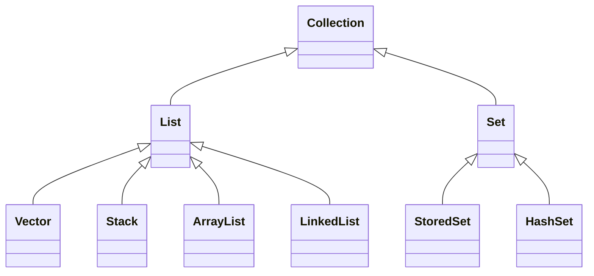

## LSP (Liskov Substitution Principle) : Liskov 치환 원칙

- Liskov 치환 원칙은 sub type(하위 유형)은 언제나 super type(기반이 되는 유형)으로 교체할 수 있어야 한다는 원칙입니다.
    - 1988년 Barbara Liskov가 올바른 상속 관계의 특징을 정의하기 위해 발표했습니다.

- "교체할 수 있다"는 말은, 자식 class는 최소한 자신의 부모 class에서 가능한 행위는 수행할 수 있어야 한다는 말입니다.
    - 부모 class의 instance를 사용하는 위치에 자식 class의 instance를 대신 사용했을 때, code가 원래의 의도대로 작동해야 합니다.
    - 이것을 부모 class와 자식 class 사이의 행위가 일관성이 있다고 말한다.

- LSP는 **다형성을 지원하기 위한 원칙**입니다.
    - 다형성 기능을 이용하기 위해서는 class를 상속시켜 type을 통합할 수 있게 설정하고, upcasting을 해도 method 동작에 문제가 없도록 설계하여야 하기 때문입니다.


### Java Collection Framework : LSP를 잘 지킨 사례

- 변수에 `LinkedList` 자료형을 담아 사용하다가, 중간에 전혀 다른 `HashSet` 자료형으로 바꿔도, `add()` method 동작을 보장받기 위해서는 `Collection`이라는 interface type으로 변수를 선언하여 할당하면 됩니다.
- interface `Collection`의 추상 method를 각기 하위 자료형 class에서 implements하여 interface 구현 규약을 잘 지키도록 미리 잘 설계되어 있기 때문입니다.



```java
void myData() {
    Collection data = new LinkedList();    // Collection interface type으로 변수를 선언합니다.
    data = new HashSet();    // 중간에 전혀 다른 자료형 class를 할당해도 호환이 됩니다.
    
    modify(data);
}

void modify(Collection data){
    list.add(1);    // interface 구현 구조가 잘 잡혀있기 때문에 add method 동작이 각기 자료형에 맞게 보장됩니다.
    // ...
}
```


---


## LSP 적용해보기


### 적용 전

- `Rectangle`은 직사각형을 구현한 객체입니다.
    - 너비와 높이를 지정하고 반환할 수 있으며, 지정된 값을 통해 자신의 넓이를 계산할 수 있습니다.

- 이때, 직사각형을 상속하여 정사각형을 만들면 Liskov 치환 원칙에 위배됩니다.
    - 정사각형 역시 직사각형의 한 종류입니다.
    - 하지만 정사각형은 직사각형과 달리 너비와 높이가 같기 때문에 너비나 높이를 지정하면 그에 맞게 너비와 높이를 모두 동일한 값으로 지정하게 됩니다.
    - 그래서 `Square`로 넓이를 계산했을 때와 `Rectangle`로 넓이를 계산했을 때는 다른 결과가 나옵니다.
    - `Square`는 `Rectangle`을 완전히 대체할 수 없기 때문에 Liskov 치환 원칙을 위배합니다.

- 직사각형과 정사각형은 상속 관계가 될 수 없습니다.
    - 사각형의 특징을 서로 가지고 있긴 하지만, 두 사각형 모두 사각형의 한 종류일 뿐입니다.
    - 하나가 다른 하나를 완전히 포함하지 못하는 구조입니다.

- 잘못된 객체를 상속하거나, 올바르게 확장하지 못한 경우에 Liskov 치환 원칙을 위반하기 쉽습니다.


```java
// 직사각형 class
public class Rectangle {
    protected int width;
    protected int height;
    
    public int getWidth() {
        return width;
    }
    
    public int getHeight() {
        return height;
    }
    
    public void setWidth(int width) {
        this.width = width;
    }
    
    public void setHeight(int height) {
        this.height = height;
    }
    
    public int getArea() {
        return width * height;
    }
}

// 정사각형 class
public class Square extends Rectangle {
    @Override
    public void setWidth(int width) {
        super.setWidth(width);
        super.setHeight(getWidth());
    }
    
    @Override
    public void setHeight(int height) {
        super.setHeight(height);
        super.setWidth(getHeight());
    }
}

// main class
public class Main {
    public static void main(String[] args) {
        Rectangle rectangle = new Rectangle();
        rectangle.setWidth(10);
        rectangle.setHeight(5);
        System.out.println(rectangle.getArea());    // 50
        
        Rectangle square = new Square();
        square.setWidth(10);
        square.setHeight(5);
        System.out.println(square.getArea());    // 125
    }
}
```


### 적용 후

- 직사각형과 정사각형은 상속의 관계가 성립되기 어렵습니다.
- 따라서 정사각형(`Square`)이 직사각형(`Rectangle`)를 상속받지 않고, 더 상위 개념인 사각형 객체(`Shape`)를 상속받도록 수정하여, Liskov 치환 원칙의 영향에서 벗어납니다.

- 이 예제는 Liskov 치환 원칙에 '위배되지 않도록' 수정한 것입니다.
    - Liskov 치환 원칙을 '준수하는' 예제로는 Java Collection Framework가 있습니다.

```java
// 사각형 객체
public class Shape {
    protected int width;
    protected int height;
    
    public int getWidth() {
        return width;
    }
    
    public int getHeight() {
        return height;
    }
    
    public void setWidth(int width) {
        this.width = width;
    }
    
    public void setHeight(int height) {
        this.height = height;
    }
    
    public int getArea() {
        return width * height;
    }
}

// 직사각형 class
class Rectangle extends Shape {
    public Rectangle(int width, int height) {
        setWidth(width);
        setHeight(height);
    }
}

// 정사각형 class
class Square extends Shape {
    public Square(int length) {
        setWidth(length);
        setHeight(length);
    }
}

// 메인 class
public class Main {
    public static void main(String[] args) {
        Shape rectangle = new Rectangle(10, 5);
        Shape square = new Square(5);

        System.out.println(rectangle.getArea());    // 50
        System.out.println(square.getArea());    // 25
    }
}
```


---


## LSP 적용 주의 사항

- LSP 원칙의 핵심은 상속(inheritance)입니다.
    - 다형성의 특징을 이용하기 위해 상위 class type으로 객체를 선언하여 하위 class의 instance를 받으면, upcasting된 상태에서 부모의 method를 사용해도 의도한대로만 수행되어야 한다는 원칙입니다.

- 하지만 객체 지향 programming에서 상속의 사용은 특별한 상황이 아니면 권장되지 않습니다.
    - 기반 class와 sub class 사이에 확실한 `IS-A` 관계가 있는 경우에만 상속을 사용해야 합니다.
    - 대부분의 경우는 합성(composition)을 사용하는 것이 더 낫습니다.

- 따라서 다형성을 이용하고 싶다면, 상속(`extends`) 대신 insterface로 구현(`implements`)하여 interface type으로 사용하는 것을 더 권장합니다.
- 또한 상위 class의 기능을 이용하거나 재사용하고 싶다면, 상속(inheritnace)보다는 합성(composition)으로 구성하는 것이 대부분 더 낫습니다.


---


## Reference

- <https://inpa.tistory.com/entry/OOP-%F0%9F%92%A0-%EC%95%84%EC%A3%BC-%EC%89%BD%EA%B2%8C-%EC%9D%B4%ED%95%B4%ED%95%98%EB%8A%94-LSP-%EB%A6%AC%EC%8A%A4%EC%BD%94%ED%94%84-%EC%B9%98%ED%99%98-%EC%9B%90%EC%B9%99>
- <https://blog.itcode.dev/posts/2021/08/15/liskov-subsitution-principle>
