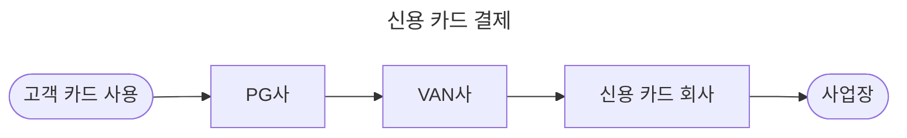
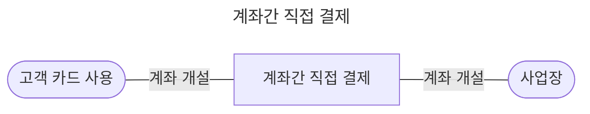

## PG사와 VAN사를 이용하는 기존 거래

- 일반적인 결제 환경은 PG사와 VAN사를 이용하는 system으로 이루어집니다.
    - PG사는 online에서 결제 시 지불을 대행하는 업체입니다.
    - VAN은 카드사와 가맹점 사이의 network를 구축해서 카드 사용에 따른 승인을 중계하고 카드사 대신 전표 매입 업무를 대행하는 업체입니다.

- 기존의 방식에서는 고객이 online에서 카드를 사용하면 PG사와 VAN사를 거쳐야만 카드사/고객/가맹점 간의 network를 구축할 수 있었습니다.
    - 그에 따라 가맹점의 수수료 부담이 발생하고, PG사와 VAN사는 이 수수료를 받아서 rebate하는 형식으로 수익 구조가 만들어져 있었습니다.
    - 전표에 대한 문제나 online 결제의 무결성에서부터 이렇게 번거로운 구조가 만들어지게 되었습니다.

- PG 업체는 소비자가 결제를 완료하면 VAN을 통해 금융 기관에게 연계하며, 이로 인해 발생하는 PG, VAN, 카드사의 수수료는 판매자가 부담하게 됩니다.

## App To App 직접 결제

- App to App 결제는 이러한 구매자와 판매자 사이의 network를 더욱 단순화한 형태의 결제 service입니다.
    - 기존의 PG사나 VAN사를 거치지 않고도 금융 기관과 직접적인 거래가 가능합니다.
        - 결제 수단을 제공하는 금융 기관(카드사, 은행 등)이 지급 결제 platform을 구성하여 직접 판매자과 구매자를 이어줍니다.
            - 구매자와 판매자가 은행 계좌를 개설하여 app을 통해 상호 간의 결제가 즉시 이뤄집니다.
        - PG사나 VAN사 없이 app service를 통해 모든 거래 내역이 전송됩니다.

- 중개 역할을 최소화했기 때문에 판매자는 수수료를 절감하는 효과가 있고, 절감된 수수료 비용을 다시 구매자에게 사은품 및 포인트 등의 또 다른 혜택으로 제공할 수 있습니다.
    - PG사와 VAN사를 거치지 않기 때문에, 카드사는 PG사 및 VAN사에 지급해야 했던 수수료를 절약할 수 있습니다.
    - 이로써 카드사는 가맹점에게 혜택(VAN사와 PG사의 rebate 개념)을 직접 줄 수 있게 됩니다.

- App to App 결제는 카드사와 가맹점 서로에게 win-win입니다.
    - 카드사는 VAN사와 PG사에게 수수료를 지불하지 않기 때문에 더 많은 수익을 얻을 수 있습니다.
    - 가맹점은 카드사로부터 직접적인 혜택(수수료 절감)을 받을 수 있습니다.

---

## Reference

- <https://finance3.tistory.com/53?category=779493>
