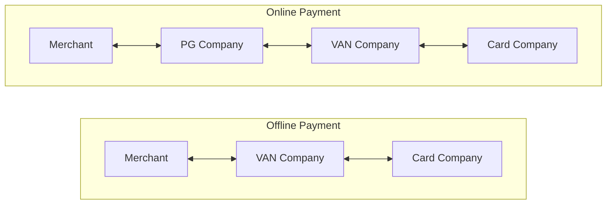

## VAN & PG : 카드 결제의 중계자

- **VAN사는 카드사와 가맹점 사이에서 결제 승인을 중개하는 역할**을 합니다.
    - 가맹점이 여러 카드사와 개별적으로 계약을 맺고 관리하는 것이 비효율적이기 때문에, VAN사가 중간에서 이를 대행하며 수수료를 통해 수익을 창출합니다.

- **PG사는 온라인 결제 환경에서 VAN사와 유사한 역할을 수행**합니다.
    - 물리적 카드 단말기 없이 이루어지는 온라인 결제에서, PG사는 결제 정보를 수집하고 이를 VAN사에 전달하여 최종적으로 카드사의 승인을 받는 과정을 관리합니다.

- VAN사와 PG사는 모두 결제 수수료를 통해 수익을 얻으며, 가맹점에 리베이트를 제공하는 방식으로 경쟁하고 있습니다.

- 그러나 최근에는 App to App service가 늘어나면서 기존의 VAN/PG를 사용하는 카드 결제 시스템이 점차 쇠퇴하고 있습니다
    - 소비자들이 간편결제나 모바일 페이먼트를 선호하면서 전통적인 VAN-PG 구조의 중요성이 감소하고 있습니다.

- Offline 카드 결제에서는 가맹점이 VAN사를 통해 카드사와 통신하며 결제를 처리합니다.
    - 전통적인 카드 결제 방식으로, 가맹점의 물리적 단말기(POS)를 통해 이루어집니다.

- Online 카드 결제의 경우, 가맹점은 PG사를 통해 결제를 시작하고, PG사는 다시 VAN사를 거쳐 카드사와 통신합니다.
    - 실물 카드 없이 온라인상에서 이루어지는 결제를 처리하기 위한 구조입니다.

