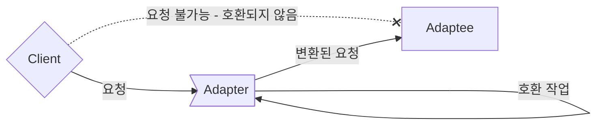

## Adapter Pattern

- 사용해야 하는 interface가 현재의 system과 호환되지 않는다고 해서 꼭 현재의 system을 변경해야 하는 것은 아닙니다.

- Adapter Pattern은 **서로 다른 interface를 가지는 두 객체를 연결**하여 사용할 수 있도록 하는 design pattern입니다.
    - interface가 호환되지 않아서 함께 동작할 수 없는 class들을 함께 사용할 수 있도록 변환합니다.
    - 예를 들어, 원래 객체와 호환되지 않는 외부 library나 API를 사용해야 하는 경우, Adapter Pattern을 적용하면 기존 code를 재사용하면서 외부 library나 API를 사용할 수 있습니다.
        - 한국에서 쓰던 220V 기기들을 Voltage Power Adapter를 사용하여 110V를 쓰는 곳에 가서도 그대로 쓸 수 있는 것과 비슷합니다.
        - Adapter Pattern에서도 Adapter처럼 변환하는 역할을 하는 class를 새로 만들어야 합니다.

- Adapter Pattern은 Wrapper Pattern이라고도 합니다.
    - Adapter가 legacy interface를 감싸서 새로운 interface로 변환하기 때문입니다.

- Adapter Pattern은 서로 다른 interface를 가진 class들이 상호 작용할 수 있도록 합니다.
    - Adapter Pattern을 사용하면 class의 interface를 다른 interface로 변환할 수 있습니다.
    - 기존의 class를 수정하지 않고도 특정 interface를 변환하여 다른 code에서 그대로 사용하는 것이 가능합니다.

- interface를 변환하는 Adapter를 만들어, 호환되지 않는 interface를 사용하는 Client를 그대로 활용할 수 있습니다.
    - Client와 구현된 interface를 분리시킬 수 있습니다.
        - Client를 특정 구현이 아닌 interface에 연결시키기 때문입니다.
        - Client가 사용하는 interface(Target interface)만 제대로 지킨다면, 나중에 다른 구현을 추가하는 것도 가능합니다.
    - 나중에 interface가 바뀌더라도 변경할 부분은 Adapter에 캡슐화(encapsulation)되어 있기 때문에 Client는 바뀔 필요가 없습니다.
    - 여러 interface를 모두 지원하는 Adapter를 Two Way Adapter(다중 Adapter)라고 부릅니다.

- MVC design pattern에서도 Adapter Pattern이 사용됩니다.
    - MVC  design pattern에서는 Model과 View 사이에 Controller를 두어 Model과 View를 연결합니다.
    - 이때 Adapter Pattern을 이용하여 Model과 View의 interface를 변환하면, Controller에서 Model과 View를 쉽게 연결할 수 있습니다.

- Adapter Pattern을 다른 pattern과 결합하여 더욱 효과적으로 사용할 수 있습니다.
    - Adapter Pattern은 다른 pattern들과 결합하여 사용하기 좋습니다.
    - 예를 들어, Builder Pattern과 Adapter Pattern을 결합하여, 새로운 객체를 생성하면서 외부 library나 API와 연결할 수 있습니다.

## Adapter Pattern & Facade pattern & Decorator Pattern

- Adapter Pattern은 Facade pattern, Decorator Pattern과 비슷합니다.
- 세 pattern 모두 객체를 감싸서 호환되지 않는 interface를 Client가 사용할 수 있게 합니다.

- 그러나 목적에 차이가 있기 때문에 다른 pattern으로 분류되어 있습니다.
    - Adapter Pattern는 한 interface를 다른 interface로 변환하는 것이 목적입니다.
    - Decorator Pattern은 interface는 바꾸지 않고 책임(기능)만 추가하는 것이 목적입니다.
    - Facade Pattern는 interface를 단순하게 바꾸는 것이 목적입니다.

