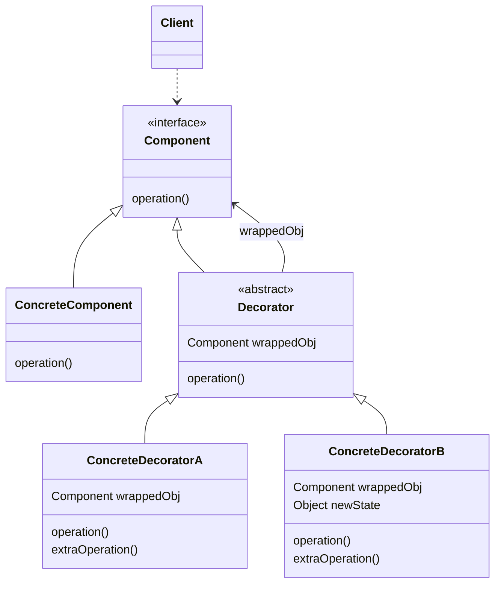
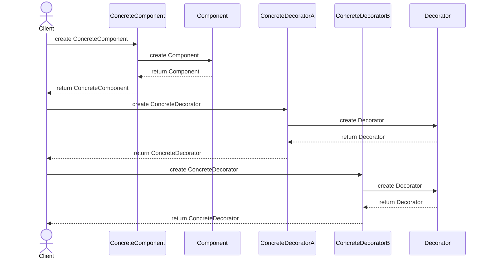
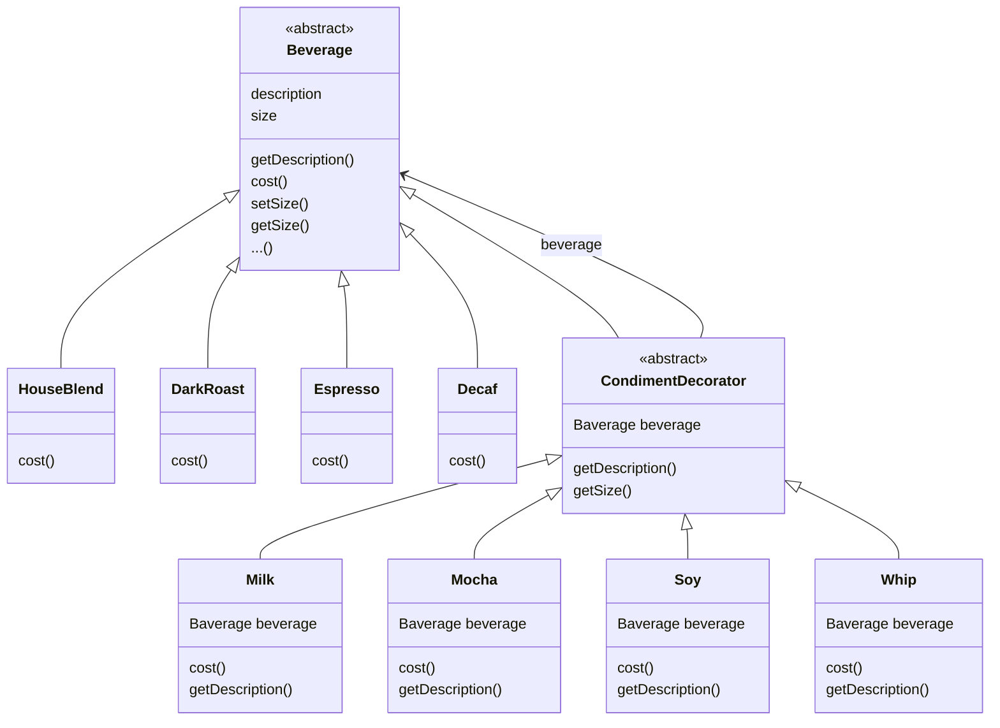

- Decorator Pattern은 기본 객체에 추가적인 기능을 추가할 때 사용됩니다.
    - Decorator Pattern의 주요 목적은 **객체의 기능을 동적으로 확장**하는 것입니다.
    - 기능 확장을 위해 sub class를 만드는 것보다 Decorator Pattern을 적용하는 것이 훨씬 유연합니다.

- Decorator Pattern은 **객체**(component)를 **새로운 행동을 포함한 특수 wrapper 객체**(decorator) 안에 넣어서, **행동을 해당 객체들에 연결**시키는 구조적 design pattern입니다.
    - 객체를 여러 개의 decorator로 언제든지(실행 중) 감쌀 수 있어, **객체에 여러 요건을 동적으로 추가하고 삭제**할 수 있습니다.

- 여러 벌의 옷을 입어서 복합 효과를 얻는 것은 Decorator Pattern을 사용하는 예시가 될 수 있습니다.
    1. 사람(`component`)이 있습니다.
    2. 추울 때 sweater(`decorator1`)로 몸을 감쌉니다.
    3. sweater를 입어도 춥다면 위에 jacket(`decorator2`)을 입습니다.
    4. 비가 오면 그 위에 비옷(`decorator3`)을 입습니다.
    - 모든 옷은 기초 행동을 '확장'하지만, 사람의 일부가 아니기에 필요하지 않을 때마다 옷을 쉽게 벗을 수 있습니다.
    - 기초 행동을 확장할 수 있는 이유는 모든 옷이 사람의 모양에 맞춰서 만들어져 있기 때문입니다.


---


## Class 구조



- `Component` : decorator와 decorating될 객체가 구현해야 하는 기본 기능을 정의합니다.
    - decorator와 decorating될 객체 모두를 하나의 type으로 묶는 interface입니다.
    - Decorator Pattern에서 다형성을 이용하여 중첩 구조를 가능하게 하는 핵심 객체입니다.

- `ConcreteComponent` : decorator에 의해 확장될 기본 객체입니다.
    - `Component`를 상속받으며, `Component`의 상태를 확장할 수도 있습니다.

- `Decorator` : 추가 기능을 제공하는 decorator의 기본 class입니다.
    - `Decorator`는 `Component`를 상속받는 동시에, `Component`를 참조하는 instance 변수(`wrappedObj`)를 가지고 있습니다.

- `ConcreteDecorator` : `Decorator`를 상속받아 구체적인 추가 기능을 구현합니다.
    - method에서 `ConcreteDecorator`가 감싸고 있는 `Component`의 method(`operation()`)를 호출하고, 호출 전/후로 부가적인 logic(`extraOperation()`)을 추가하여 새로운 행동을 추가할 수 있습니다.
        - 새로운 행동을 추가해야 할 때, 일반적으로 `ConcreteDecorator`에 새로운 method를 추가하는 대신 이 방식(이미 있는 method의 전/후에 method 추가)을 사용합니다.

```java
interface Component {
    void operation();
}

class ConcreteComponent implements Component {
    public void operation() {
        // ...
    }
}

abstract class Decorator implements Component {
    Component wrappedObj;

    Decorator(Component component) {
        this.wrappedObj = component;
    }

    public void operation() {
        wrappedObj.operation();
    }
}

class ConcreteDecoratorA extends Decorator {

    ConcreteDecoratorA(Component component) {
        super(component);
    }

    public void operation() {
        super.operation();
        extraOperation();
    }

    void extraOperation() {
        // ...
    }
}

class ConcreteDecoratorB extends Decorator {

    ConcreteDecoratorB(Component component) {
        super(component);
    }

    public void operation() {
        super.operation();
        extraOperation();
    }

    void extraOperation() {
        // ...
    }
}
```


---


## Decorator Pattern 작동 방식

- `Component` 객체를 생성한 후, 이 객체를 하나 이상의 `Decorator` 객체로 감싸(wrap) 추가적인 기능을 부여합니다.
- `Decorator` 객체는 `Component` 객체와 동일한 interface를 가지기 때문에, `Client`는 `Decorator` 객체를 원래의 `Component` 객체처럼 사용할 수 있습니다.

```java
Component decoratedComponenet = new ConcreteDecoratorB(new ConcreteDecoratorA(new ConcreteComponent()));
```




---


## Decorator Pattern에서의 상속

- Decorator Pattern의 모든 객체는 한 component의 상속을 받지만, 상속을 통해서 행동을 물려받기 위함이 아닙니다.
- Decorator Pattern에서 상속은 **형식을 맞추기 위한 것**입니다.
    - 다형성을 이용하여 decorator의 형식이 그 decorator로 감싸는 객체의 형식과 같도록 하기 위함입니다.

- 객체는 **새로운 행동을 합성을 통해서 얻게 됩니다.**
    - super class의 행동을 상속 받으면서 얻는 것이 아닙니다.
    - instance 변수로 다른 객체를 저장하는 합성(composition) 방식을 이용하기 때문에, 다양한 행동을 추가하면서도 유연성을 잃지 않습니다.


### 합성과 위임을 통한 동적인 행동 추가

- 위임(delegation)은 한 객체가 어떤 작업을 수행하기 위해 다른 객체의 method를 호출하는 것을 의미합니다.
    - 어떤 기능을 자신이 처리하지 않고 다른 객체에 위임시켜 그 객체가 일을 처리하도록 합니다.

- 합성(composition)을 통해서 객체의 행동을 확장하면 실행 중에 동적으로 행동을 설정할 수 있습니다.
    - 행동을 상속 받으면(sub class를 만드는 방식), 그 행동은 compile 시에 완전히 결정되기 때문에 새로운 행동을 추가하기 어렵습니다.

- concrete component를 감싸주는 decorator를 사용하여, **결과에 새로운 기능을 더해 행동을 확장**합니다.
    - component를 감싸는 decorator의 갯수에는 제한이 없기 때문에 super class의 code를 건드리지 않고 행동을 무한히 확장하는 것이 가능합니다.


---


## Decorator Pattern의 특징


### Decorator Pattern을 사용해야 할 때

- 객체 책임과 행동(다양한 기능)이 상황에 따라 동적으로 빈번하게 추가/삭제되는 경우, Decorator Pattern을 사용합니다.

- 객체의 결합을 통해 기능이 생성될 수 있는 경우, Decorator Pattern을 사용합니다.

- 객체를 사용하는 code를 손상시키지 않고 runtime에 객체에 추가 동작을 할당할 수 있어야 하는 경우, Decorator Pattern을 사용합니다.
    - decorator는 business logic을 계층으로 구성하고, 각 계층에 decorator를 생성하여 runtime에 이 logic의 다양한 조합들로 객체들을 구성할 수 있도록 합니다.
    - 모든 객체가 공통 interface를 따르기 때문에, client code는 모든 객체를 같은 방식으로 다룰 수 있습니다.

- 상속을 통해 sub class를 만들어 객체의 동작을 확장하는 것이 어색하거나 불가능할 때, Decorator Pattern을 사용합니다.
    - 많은 programming 언어에는 class의 추가 확장을 방지하는 데 사용할 수 있는 `final` keyword가 있습니다.
    - final class의 경우 기존 행동들을 재사용할 수 있는 유일한 방법은 Decorator Pattern을 사용하여 class를 자체 wrapper로 감싸는 것입니다.


### Decorator Pattern의 장점

- decorator를 사용하면 sub class를 만들 때보다 훨씬 더 유연하게 기능을 확장할 수 있습니다.

- 객체를 여러 decorator로 감싸서(wrapping) 여러 행동들을 합성할 수 있습니다.

- rumtime에(동적으로) 기능을 변경(객체로부터 책임들을 추가하거나 제거)할 수 있습니다.
    - 새로운 sub class를 만드는 방식(compile time에 결정)을 사용하지 않고도 객체의 행동을 확장할 수 있기 때문입니다.

- 단일 책임 원칙(SRP)을 준수하게 됩니다.
    - 다양한 행동들의 여러 변형들을 구현하는 monolithic class를 여러 개의 작은 decorator class들로 나눌 수 있습니다.
    - 각 decorator class가 고유의 책임을 가집니다.

- 개방 폐쇄 원칙(OCP)을 준수하게 됩니다.
    - 기능 확장이 필요하면 client code를 수정하지 않고 decorator class를 추가하면 됩니다.

- 의존 역전 원칙(DIP)을 준수하게 됩니다.
    - component들이 구현체가 아닌 interface를 바라봅니다.


### Decorator Pattern의 단점

- 추가한 기능들(component에 추가한 decorator들) 중 일부를 제거하기가 어렵습니다.
    - 중첩되어 있는 wrapper들의 stack에서 특정 wrapper를 제거하는 것은 어려운 작업입니다.

- decorator를 너무 많이 사용하면 code가 필요 이상으로 복잡해질 수도 있습니다.
    - option마다 만들다보면 자잘한 decorator 객체들이 많이 추가될 수 있기 때문입니다.
    - 또한 decorator를 조합하는 초기 생성 code가 보기 흉할 수 있습니다.
        - 예를 들어, `new A(new B(new C(new D())));`
    - 이 문제는 Factory Pattern과 Builder Pattern로 해결할 수 있습니다.

- decorator의 행동이 decorator 내의 순서에 의존하지 않는 방식으로 decorator를 구현하기가 어렵습니다.
    - 객체에 어느 decorator를 먼저 decorating 하느냐에 따라 decorator stack 순서가 결정됩니다.


---


## Decorator Pattern과 Proxy Pattern : 용도에 따른 분류

- Decorator Pattern과 Proxy Pattern는 class의 구조가 거의 동일합니다.
    - 두 pattern 모두 동일한 interface를 구현하고, wrapper class와 component class가 aggregation(has a) 관계를 가집니다.

- 그러나 두 pattern은 용도가 완전히 다르기 때문에 다른 pattern으로 분류합니다.
    - **용도는 pattern을 분류하는 핵심적인 기준**이 됩니다.

- **Proxy Pattern은 component class의 접근을 제어하는 것이 목적**입니다.
    - wrapper class와 component class의 관계가 compile time에 정해집니다.

- **Decorator Pattern은 component class의 기능에 다른 기능을 추가하는 것이 목적**입니다.
    - wrapper class와 component class의 관계가 runtime에 정해집니다.


---


## Example : 음료에 첨가물을 추가하고 가격 계산하기

- 음료(Beverage)에 첨가물(Shot, Syrup, Milk, Whip)을 동적으로 추가하고, 첨가물의 가격이 포함된 음료의 가격을 계산합니다.


### Class Diagram




### Main

```java
public class StarbuzzCoffee {
 
    public static void main(String args[]) {
        Beverage beverage = new Espresso();
        System.out.println(beverage.getDescription() + " $" + String.format("%.2f", beverage.cost()));
 
        Beverage beverage2 = new DarkRoast();
        beverage2 = new Mocha(beverage2);
        beverage2 = new Mocha(beverage2);
        beverage2 = new Whip(beverage2);
        System.out.println(beverage2.getDescription() + " $" + String.format("%.2f", beverage2.cost()));
 
        Beverage beverage3 = new HouseBlend();
        beverage3.setSize(Size.VENTI);
        beverage3 = new Soy(beverage3);
        beverage3 = new Mocha(beverage3);
        beverage3 = new Whip(beverage3);
        System.out.println(beverage3.getDescription() + " $" + String.format("%.2f", beverage3.cost()));
    }
}
```

### Component Class : 음료(beverage)를 나타내는 추상 Class

```java
public abstract class Beverage {
    public enum Size { TALL, GRANDE, VENTI };
    Size size = Size.TALL;
    String description = "Unknown Beverage";
  
    public String getDescription() {
        return description;
    }
    
    public void setSize(Size size) {
        this.size = size;
    }
    
    public Size getSize() {
        return this.size;
    }
 
    public abstract double cost();
}
```

### Decorator Class : 첨가물(condiment)을 나타내는 추상 Class

```java
public abstract class CondimentDecorator extends Beverage {
    public Beverage beverage;
    public abstract String getDescription();
    
    public Size getSize() {
        return beverage.getSize();
    }
}
```

### ConcreteComponent Class : 음료 구현

```java
public class HouseBlend extends Beverage {
    public HouseBlend() {
        description = "House Blend Coffee";
    }
 
    public double cost() {
        return .89;
    }
}
```

```java
public class DarkRoast extends Beverage {
    public DarkRoast() {
        description = "Dark Roast Coffee";
    }
 
    public double cost() {
        return .99;
    }
}
```

```java
public class Espresso extends Beverage {
    public Espresso() {
        description = "Espresso";
    }
  
    public double cost() {
        return 1.99;
    }
}
```

```java
public class Decaf extends Beverage {
    public Decaf() {
        description = "Decaf Coffee";
    }
 
    public double cost() {
        return 1.05;
    }
}
```

### ConcreteDecorator Class : 첨가물 구현

```java
public class Milk extends CondimentDecorator {
    public Milk(Beverage beverage) {
        this.beverage = beverage;
    }

    public String getDescription() {
        return beverage.getDescription() + ", Milk";
    }

    public double cost() {
        return beverage.cost() + .10;
    }
}
```

```java
public class Mocha extends CondimentDecorator {
    public Mocha(Beverage beverage) {
        this.beverage = beverage;
    }
 
    public String getDescription() {
        return beverage.getDescription() + ", Mocha";
    }
 
    public double cost() {
        return beverage.cost() + .20;
    }
}
```

```java
public class Soy extends CondimentDecorator {
    public Soy(Beverage beverage) {
        this.beverage = beverage;
    }

    public String getDescription() {
        return beverage.getDescription() + ", Soy";
    }

    public double cost() {
        double cost = beverage.cost();
        if (beverage.getSize() == Size.TALL) {
            cost += .10;
        } else if (beverage.getSize() == Size.GRANDE) {
            cost += .15;
        } else if (beverage.getSize() == Size.VENTI) {
            cost += .20;
        }
        return cost;
    }
}
```

```java
public class Whip extends CondimentDecorator {
    public Whip(Beverage beverage) {
        this.beverage = beverage;
    }
 
    public String getDescription() {
        return beverage.getDescription() + ", Whip";
    }
 
    public double cost() {
        return beverage.cost() + .10;
    }
}
```


---


## Reference

- Head First Design Patterns (도서) - Eric Freeman, Elisabeth Robson, Bert Bates, Kathy Sierra
- <https://refactoring.guru/ko/design-patterns/decorator>
- <https://inpa.tistory.com/entry/GOF-💠-데코레이터Decorator-패턴-제대로-배워보자>
- <https://sabarada.tistory.com/60>
