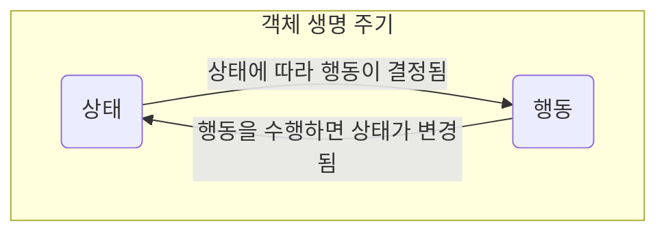

## State Pattern : 객체의 상태에 따라 행동 바꾸기

- State Pattern은 **객체의 상태 변화에 따라 해당 객체의 행동이 바뀌어야 할 때** 유용한 객체 지향 design pattern입니다.
    - 마치 객체의 class가 변경되는 것 같은 효과를 낼 수 있으며, 상태 변화에 따른 행동 변경 규칙을 체계적으로 관리할 수 있습니다.
        - 객체의 상태 변경 시 객체의 행동도 함께 바뀝니다.

- State Pattern은 **상태를 별도의 class로 캡슐화(encapsulation)**하고, **상태에 의존적인 행동을 해당 상태 class 내에 정의**합니다.
    - **어떤 상태에 어떤 행동을 해야하는지 명확하게 관리**함으로써, 상태 변화에 따른 행동 변경도 쉽게 정의할 수 있습니다.

- State Pattern이 적용된 code는 **SRP 원칙과 OCP 원칙을 준수**합니다.
    - 특정 상태와 관련된 code를 별도의 class로 구성하기 때문에, 단일 책임 원칙(SRP)을 준수합니다.
    - 기존의 상태나 사용자를 변경하지 않고 새로운 상태를 도입할 수 있기 때문에, 개방 폐쇄 원칙(OCP)을 준수합니다.
        - 각 상태의 행동을 수정하고 싶으면, 해당 상태 class만 수정하면 됩니다.
        - 상태를 추가(확장)하고 싶으면, 새로운 상태 class를 추가하면 됩니다.

- State Pattern을 사용하여 **복잡한 조건문(if-else, switch-case) 대신 객체 지향적인 방식으로 상태에 따른 행동의 변화를 관리**할 수 있게 됩니다.
    - 예를 들어, 문서 편집기에서 문서가 '초안', '검토 중', '승인됨', '거부됨'과 같은 여러 상태를 가질 때, State Pattern을 사용하여 각 상태에 해당하는 class를 구현하고, 문서의 현재 상태에 따라 적절한 행동(편집, 검토 요청, 승인, 거부)을 수행할 수 있습니다.
    - 만약 조건문을 사용하면, 상태를 가지고 있는 객체 안에서 상태에 따른 분기 logic을 작성하여, 직접 다른 행동들을 설졍해야 합니다.

- 객체의 **상태 전환 logic이 복잡**하거나 **중복되는 조건 분기가 많을 때**, State Pattern을 사용합니다.
    - **실행 시간(runtime)에 객체의 상태를 유연하게 변경**할 수 있으며, 동시에 각 상태별로 구체적인 행동을 명확하게 정의할 수 있습니다.

- State Pattern을 적용하면 상태 별로 class를 생성하므로, **관리해야 할 class 수가 많아진다는 단점**이 있습니다.
    - 상태의 규칙이 자주 변경되거나 상태 class의 수가 많을 경우, 상태 관리 logic이 복잡해질 수 있습니다.
    - 반대로 상태 변경이 드물거나 상태가 몇 개 없는 경우, pattern 적용이 과도하게 느껴질 수 있습니다.

### 상태(State)란?

- programming에서 **상태(state)**라는 단어는 흔하게 사용되며, 일반적으로 **특정 시점에 가질 수 있는 모든 가능한 조건이나 상황**을 의미합니다.
    - **변수의 값** : program 내에서 변수에 할당된 값은 program의 상태를 대변할 수 있습니다.
        - 예를 들어, game의 'score' 변수는 게임의 현재 상태(점수)를 나타냅니다.
    - **객체의 속성** : 객체 지향 programming에서, 객체의 속성(또는 member 변수)은 해당 객체의 상태를 정의합니다.
        - 예를 들어, '자동차' 객체가 가지고 있는 '속도'나 '색상' 속성은 그 자동차의 상태를 나타냅니다.
        - 예를 들어, 'email 계정"을 객체로 볼 때, "login 상태", "logout 상태", "읽지 않은 mail이 있는 상태", "읽지 않은 mail이 없는 상태" 등이 있을 수 있습니다.
            - 각각의 상태는 email 계정의 특정 속성들(사용자 login 여부, 읽지 않은 mail의 수)에 의해 결정됩니다.
    - **system 설정** : application 전체의 설정 또는 환경도 application의 상태로 볼 수 있습니다.
        - 예를 들어, web application의 'Dark Mode' 설정은 사용자의 선호에 따라 변경될 수 있는 application의 상태입니다.

- State Pattern에서의 '상태'는 **객체의 행동을 결정하는 내부 조건이나 구성**을 뜻합니다.
- 객체의 **상태는 객체가 가진 정보(data)와 그 정보를 처리하는 방법(행위)에 의해 결정**됩니다.
- 이렇게 **결정된 상태는 객체의 행위에 영향**을 미치고, 그 **행위는 다시 객체의 상태를 변경**할 수 있습니다.
    - 이 과정은 객체의 생명 주기 안에서 무한히 반복될 수 있습니다.

