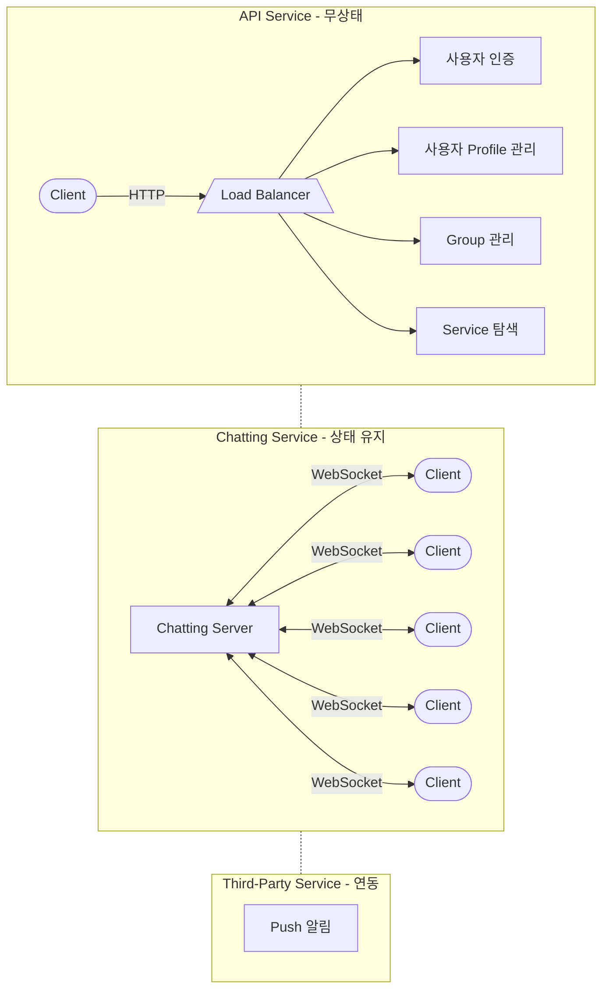

## Text Chatting System 설계

- text chatting system을 설계합니다.
    - chatting은 크게 1:1 chatting, group chatting으로 나뉩니다.
    - 대표적인 text chatting service로 KakaoTalk, Line, Slack, Facebook messenger 등이 있습니다.

- chatting system은 API Service, Chatting Service, Third-Party Service로 이루어집니다.
    1. **API Service**는 'Login/Logout', '회원 가입', '사용자 Profile 표시', 'Service 탐색' 등의 무상태(stateless) service 기능을 제공합니다.
        - Service 탐색(service discovery)은 client가 접속할 chatting server의 DNS hostname을 client에게 알려주는 역할을 합니다.
            - client의 geographical location(위치), server의 capacity(용량) 등을 기준으로 client에게 가장 적합한 chatting server를 추천해줍니다.
            - client는 해당 chatting server에 연결되어 message를 송수신합니다.
    2. **Chatting Service**는 'client 간의 통신'과 'message 저장' 등의 기능을 제공합니다.
        - 이 중 client 간의 통신은 실시간 data 교환을 위해 client와 server 사이의 연결을 유지하기 때문에 **상태 유지(stateful) service**입니다.
    3. **Third-Party Service**는 'message push 알림' 등의 추가적인 기능을 제공합니다.
        - 수신자가 미접속 중일 때 message에 대해 push 알림을 보내야 합니다.
        - 알림 system을 직접 설계하고 구현하는 것은 어려운 일이므로, 제 3자 service의 기능을 연동하여 사용합니다.
            - 필요에 따라 직접 구현하여 사용할 수도 있습니다.

- 이 글은 Chatting Service 설계에 대해 설명합니다.
    - API Service는 일반적인 Web Application과 같고, Third-Party Service는 기능을 연동하여 사용하기만 하면 됩니다.

