## NHN의 Commerce Platform을 위한 상품 검색 Engine 설계

- NHN FORWARD 22 행사에서 발표한 "Elasticsearch를 이용한 상품 검색 Engine 개발 일지" 내용을 정리한 글입니다.
    - 발표 영상은 [YouTube](https://youtu.be/fBfUr_8Pq8A)를 참고해주세요.


---


## 1. 검색 Engine 도입 배경

- 기존의 Shop by 상품 검색 system에서는 NHN Cloud Search를 활용하여 상품 검색 service를 제공해 왔습니다.

- NHN Clude Search는 우수한 검색 Engine이었으나, commerce platform에 특화되지 않은 범용 검색 Engine이라는 한계가 있었습니다.
    - NHN Clude Search는 commerce platform 특유의 요구 사항을 반영하는 데 제약이 있었습니다.

- 따라서 commerce platform에 특화된 검색 service를 제공하기 위해, 새로운 검색 Engine을 자체 구축하기로 결정하였습니다.
    - commerce 환경에 최적화된 검색 Engine을 Elasticsearch로 직접 구현합니다.


### Elasticsearch 선택 배경과 운영 환경

- **Elasticsearch**는 근실시간(Near Real-time) 검색 및 분석이 가능한 Open Source 검색 Engine입니다.
    - Lucene 기반으로 구축되어 있고 inverted index 구조를 지원하여 매우 빠른 검색 성능을 제공합니다.
    - 분산형 설계가 가능하여, data 보관의 안전성을 확보할 수 있습니다.
    - 속도, 확장성, 복원력 등 광범위한 기능을 제공합니다.
    - 현재 검색 Engine 시장에서 가장 높은 점유율을 보유하고 있습니다.
        - 높은 점유율은 활발한 사용자 community와 지속적인 문서 update를 통한 안정적인 지원을 의미합니다.

- 우수한 검색 속도와 성능, 시장 점유율 1위로 인한 높은 신뢰성, 활발한 community 지원과 문서화, 그리고 다양한 추가 기능과 확장성 등의 이유로 Elasticsearch를 도입하기로 결정하였습니다.

| 도구 | 설명 |
| --- | --- |
| **Elasticsearch** | JSON 기반의 분산형 검색 및 분석 engine |
| **Logstash** | 수집된 data 가공 pipeline |
| **Kibana** | Elasticsearch에 저장된 data를 분석 및 시각화하는 도구 |
| **Beats** | data 수집기 (무료 open source platform) |

- 운영 환경은 Elastic Stack에서 Logstash를 제외한 Elasticsearch, Kibana, Beats로 구성되어 있습니다.

- 별도의 data filtering은 불필요하다고 판단하여 Logstash는 운영하지 않습니다.
    - Beats를 통한 data 수집만으로 충분했기 때문입니다.


---


## 2. 검색 Engine Architecture

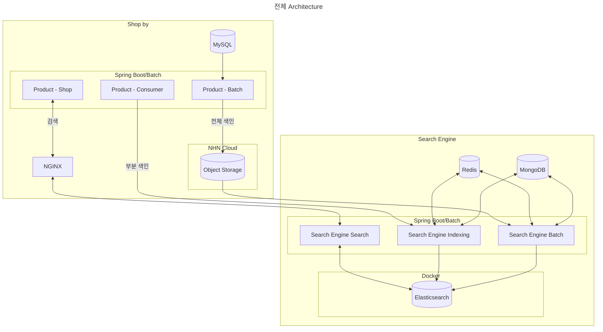

- Object Storage는 많은 양의 data를 저장할 수 있는 online 저장소 service를 의미합니다.

- data는 "SQL DB -> Elasticsearch -> Client"의 방향으로 순차적으로 흐릅니다.
    - 먼저 SQL DB에 저장된 상품 data가 Elasticsearch로 전송되어 검색 가능한 형태로 구축됩니다.
        - 상품 data(source data)들은 전부 SQL DB에 저장되어 있습니다.
    - 이후 client가 검색 API를 통해 요청을 보내면, Elasticsearch에 구축된 검색 data를 기반으로 검색 결과를 제공받게 됩니다.
    - 단방향 data 흐름을 통해 효율적이고 일관성 있는 검색 service가 가능합니다.

- 검색 data 구축을 위한 색인(indexing)은 두 가지 방식으로 운영됩니다.
    1. 전체 색인 : 전체 data를 대상으로 하는 indexing입니다.
    2. 부분 색인 : 변경된 data만을 대상으로 하는 indexing입니다.

- system은 세 개의 독립적인 server module로 구성되어 있습니다.
    1. 검색 API server : client 검색 요청을 처리하고 API를 제공합니다.
    2. Indexing server : Spring Scheduler를 활용하여 10초 주기로 부분 색인 작업을 수행합니다.
    3. Batch Server : Kubernetes CronJob을 통해 매일 새벽 2시에 전체 색인 작업을 실행합니다.

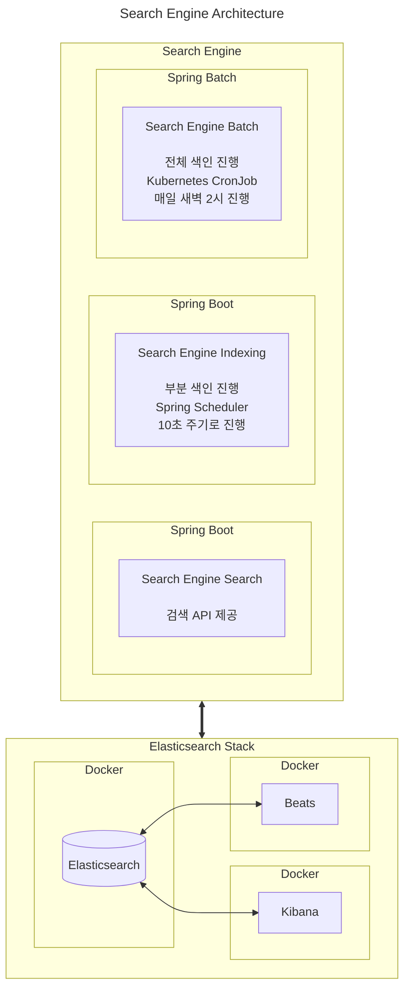

- system 운영을 위해서 Elasticsearch, Kibana, Beats 등의 Elastic Stack의 세 가지 핵심 기술을 활용하고 있습니다.


---


## 3. Data 색인 구조

- 색인(indexing)은 **원본 문서를 검색 가능한 형태로 변환**하는 과정입니다.
    - 색인이란, 책 속의 낱말이나 구절, 또 이에 관련한 지시자를 찾아보기 쉽도록 일정한 순서로 나열한 목록입니다.
    - Elasticsearch에서도 상품 정보를 검색하기 위해서는, **원본 문서를 검색어 token들로 변환하는 색인 과정**이 필수적입니다.

- 색인 유형에는 **전체 색인**과 **부분 색인** 두 가지가 있습니다.
    - **전체 색인**은 하루에 한 번씩 실행되며, SQL DB에 저장된 모든 상품 data를 Elasticsearch에 새롭게 색인하는 process입니다.
        - batch 작업을 통해 전체 data를 CSV file로 저장하고 이를 Object Storage에 upload한 후, 다시 이 file을 download하여 Elasticsearch에 색인하는 방식으로 진행됩니다.
        - data를 CSV file로 저장하는 과정은 새벽 1시에, 전체 색인은 새벽 2시에 진행합니다.
    - **부분 색인**은 10초 간격으로 실행되며, 실시간으로 수정된 상품 data만을 대상으로 재색인을 수행합니다.
        - Kafka Topic을 통해 상품 수정 정보를 전달받아 MongoDB에 임시 저장한 후, 이를 Elasticsearch에 반영하는 방식으로 운영됩니다.
        - 이러한 부분 색인을 통해 전체 색인 사이의 기간 동안 data의 최신성을 유지할 수 있습니다.

- **data 정합성을 관리**하기 위해, **전체 색인과 부분 색인이 동시에 실행되는 것을 방지**하는 로직이 추가되어 있습니다.
    - 전체 색인과 부분 색인이 동시에 실행될 경우 data 정합성에 문제가 발생할 수 있기 때문에, 두 process 간의 실행 시점을 제어하는 mechanism을 구현했습니다.
    - 따라서, 전체 색인이 시작될 때는 부분 색인이 실행되지 않고, 반대로 부분 색인이 진행 중일 때는 전체 색인이 시작되지 않도록 설계되어 있습니다.
    - 두 process의 동시 실행을 방지하기 위한 제어는 **Redis를 활용한 Lock mechanism**을 통해 구현됩니다.
        - 전체 색인이 시작되기 전에 system은 Redis를 통해 부분 색인의 실행 여부를 확인합니다.
        - 부분 색인이 실행 중이지 않은 경우에만 Lock을 획득하고 전체 색인을 시작합니다.
        - 전체 색인이 완료되면 Lock을 해제하여 부분 색인이 다시 실행될 수 있도록 합니다.
        - 부분 색인도 마찬가지로 전체 색인의 실행 여부를 확인하고 Lock을 관리하는 동일한 mechanism을 따릅니다.


### 전체 색인 Process

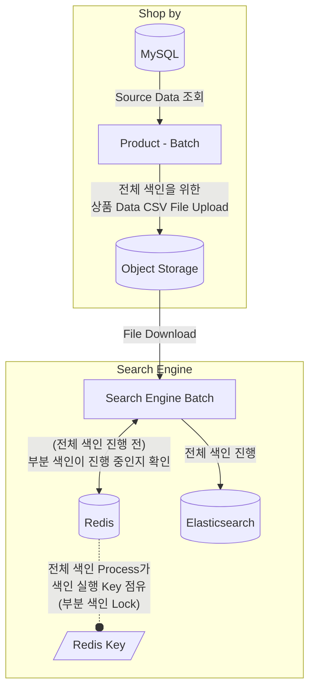

1. **사전 작업 단계**를 실행합니다. 
    - 모든 상품 data를 CSV file로 변환하여 Object Storage에 upload합니다.
    - Product Batch를 통해 매일 새벽 1시경에 작업을 완료합니다.

2. **색인 준비 단계**를 새벽 2시에 시작합니다.
    - Redis를 통해 부분 색인의 실행 여부를 확인합니다.
    - 부분 색인이 미실행 중인 경우, Redis Lock을 획득합니다.
    - Object Storage에서 CSV file을 download하고 data를 parsing합니다.

3. **data 적재 단계**를 수행합니다.
    - Elasticsearch의 Bulk API를 활용하여 새로운 index에 data를 적재합니다.
    - 2,000개 단위로 data를 묶어 20개의 비동기 작업으로 병렬 처리합니다.
    - 약 300만 개의 상품 data를 6-7분 내에 처리합니다.

4. **index 전환 단계**를 진행합니다.
    - Alias API를 활용하여 새로운 index로 무중단 전환합니다.
    - 기존 index는 backup용으로 보관합니다.
    - 예를 들어, 'product_20231201'에서 'product_20231202'로 'alias_product' alias를 전환합니다.

5. **작업 완료 단계**를 실행합니다.
    - Redis Lock을 해제하여 부분 색인 재개 가능 상태로 전환합니다.
    - 전체 색인 process를 종료합니다.


### 전체 색인 성능 최적화를 위한 처리

- 전체 색인의 성능을 최적화하기 위해, **Bulk API 활용**, **비동기 병렬 처리**, **bulk size 최적화** 등의 방법을 사용합니다.
    - 총 3,000,000개 이상의 상품 data를 가지고 성능 test를 진행하였습니다.

1. **Bulk API**는 여러 data를 하나의 요청으로 처리할 수 있는 기능입니다.
    - 현재 system에서는 2,000개의 data를 하나의 단위로 묶어 처리함으로써 개별 요청 대비 처리 효율을 크게 향상시켰습니다.

2. **비동기 병렬 처리**는 대량의 data를 여러 작업으로 분할하여 동시에 처리하는 방식입니다.
    - 구체적으로 2,000개의 data를 20개씩 병렬로 처리하도록 indexing logic을 구현했습니다.
    - 이러한 최적화를 통해 전체 색인 처리 시간을 기존 50분에서 6-7분으로 대폭 단축했습니다.

3. **bulk size 최적화**는 system의 처리 성능을 극대화하기 위한 중요한 요소입니다.
    - 무조건 size를 늘린다고 좋은 것은 아니며, cluster 구성이나 data 크기에 따라서 적합한 bulk size를 찾아 설정해주어야 합니다.
    - 일반적으로 5-15MB 크기를 시작점으로 하여 cluster 구성과 data 크기에 따라 점진적으로 조정하는 것이 권장됩니다.
    - 현재는 2,000개 단위가 최적의 성능을 보여주고 있으며, 향후 상품 data 증가에 따라 유연하게 조정할 수 있도록 설계되어 있습니다.

#### 전체 색인 Code 최적화 전

```kotlin
// Only 1 request for N products
runBlocking {
    indexData.chunked(5000).forEach {
        documentCount += it.size
        domainService.bulkIndexingProducts(
            targets = EsProductIndex.createBy(it),
            indexName = indexName,
        )
    }
}
```

```json
// POST /_bulk
{ "index": { "_index": "product", "_id": 10616 } }
{ "mallNo": 99, "productName": "난방기" }
{ "index": { "_index": "product", "_id": 10617 } }
{ "mallNo": 100, "productName": "냉장고" }
{ "index": { "_index": "product", "_id": 10618 } }
{ "mallNo": 101, "productName": "에어컨" }
```

- 5000개씩 끊어서 Bulk API를 호출하면, 3,000,000개의 data를 모두 처리하는 데에 50분에서 1시간 정도의 시간이 소요됩니다.
    - 전체 색인 도중에 장애가 발생하거나 빠르게 rollback이 필요하다면, 1시간의 색인 시간은 문제가 됩니다.

#### 전체 색인 Code 최적화 후

```kotlin
// async로 2,000개의 data를 20개씩 병렬 처리로 indexing 요청
val deferredJobs = mutableListOf<Deferred<Unit>>()

runBlocking {
    indexData.chunked(2000).forEach { products ->
        documentCount += products.size
        deferredJobs.add(
            async { domainService.bulkIndexingProducts(products, indexName) }
        )
        
        if (deferredJobs.count() == 20) {
            deferredJobs.awaitAll()
            deferredJobs.clear()
        }
    }
}
```

- 병렬 처리 logic을 추가하여 기존의 오래 걸리던 처리 시간을 단축하였습니다.
    - 500,000개의 data를 색인하는 데에 1분 정도가 소요되게 되었습니다.
    - 전체 3,000,000개의 data를 모두 색인하는 데에는 6-7분이 소요되게 되었습니다.


### 전체 색인에서의 Alias API 활용 : 안정적인 Service 운영

- 안정적인 service 운영을 위해, **Alias API를 활용**하여 무중단으로 index를 전환하고, **backup index를 유지**하는 system을 구현하여 사용합니다.

```json
// API : POST _aliases
{
    "actions": [
        {
            "remove": {
                "index": "기존 Index",
                "alias": "alias_product"
            }
        },
        {
            "add": {
                "index": "전체 색인으로 생성된 Index",
                "alias": "alias_product"
            }
        }
    ]
}
```

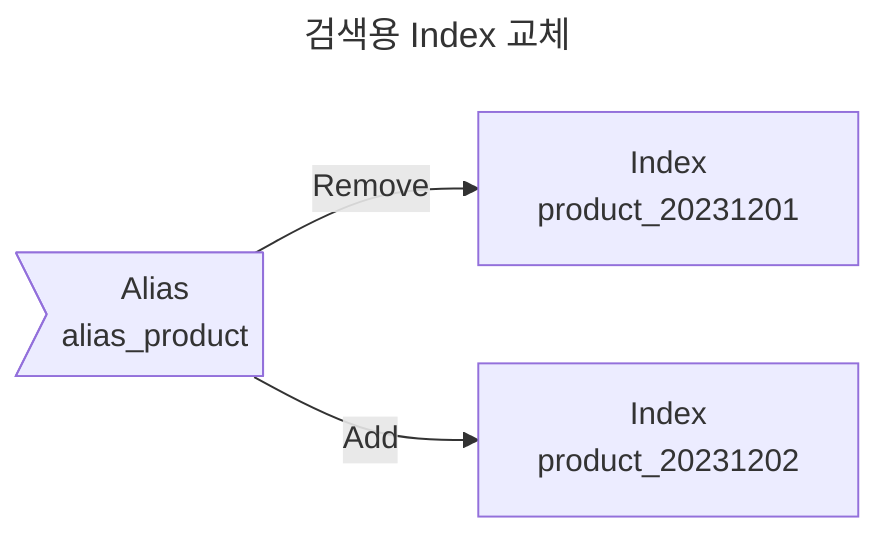

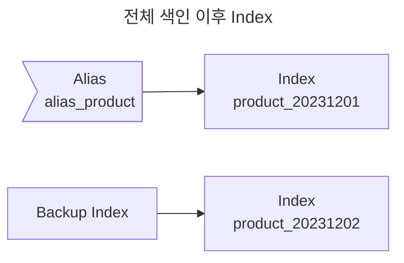

1. Elasticsearch의 **Alias API**를 사용하여 **index를 전환하는 과정에서 service 중단 없이 새로운 data로 검색 service를 제공**합니다.
    - Alias API는 **index에 alias를 부여**하여 실제 index를 유연하게 전환할 수 있게 해줍니다.
    - 예를 들어, 'product_20231201' index에 'alias_product'라는 alias가 연결(mapping)되어 있다면, client는 'alias_product'라는 alias만으로 해당 index에 접근할 수 있습니다.
        - 반대로, 'product_20231202' index에 'alias_product'라는 alias가 새로 연결된다면, client는 'alias_product'라는 alias로 'product_20231201'가 아닌, 'product_20231202' index에 접근합니다.
    - 전체 색인 과정에서 새로운 index가 생성되면, **Alias API의 multiple action 기능을 사용하여 alias를 새 index로 무중단 전환**합니다.
        - multiple action option을 사용하면, 무중단 alias 교체가 가능합니다.
        - 예를 들어, 'product_20231202' index가 새로 생성되면, 'alias_product' alias가 기존 index에서 새 index로 자연스럽게 전환됩니다.

2. **alias 연결이 끊어진 이전 index는 backup 용도로 보관**하여, 새 index에 문제가 발생했을 경우 신속하게 이전 상태로 rollback할 수 있도록 합니다.
    - 예를 들어, 'product_20231202' index에 문제가 발견되면 alias를 이전 'product_20231201' index로 즉시 되돌릴 수 있어 service의 안정성을 보장합니다.
    - 새 index가 생기더라도 이전 index는 삭제하지 않고 alias만 새 index로 옮기기 때문에 가능한 rollback 방법입니다.
    - 이 방식은 저장 공간을 더 많이 사용하게 되는 단점이 있기 때문에, 적절한 보관 기간을 설정하고, 일정 기간이 지난 backup index는 삭제하는 정책을 수립하는 것이 중요합니다.


### 부분 색인 Process

- 부분 색인 process는 상품 data의 실시간성을 보장하기 위한 mechanism입니다.
    - 전체 색인 사이의 간격에서도 검색 data의 최신성을 유지할 수 있도록 합니다.

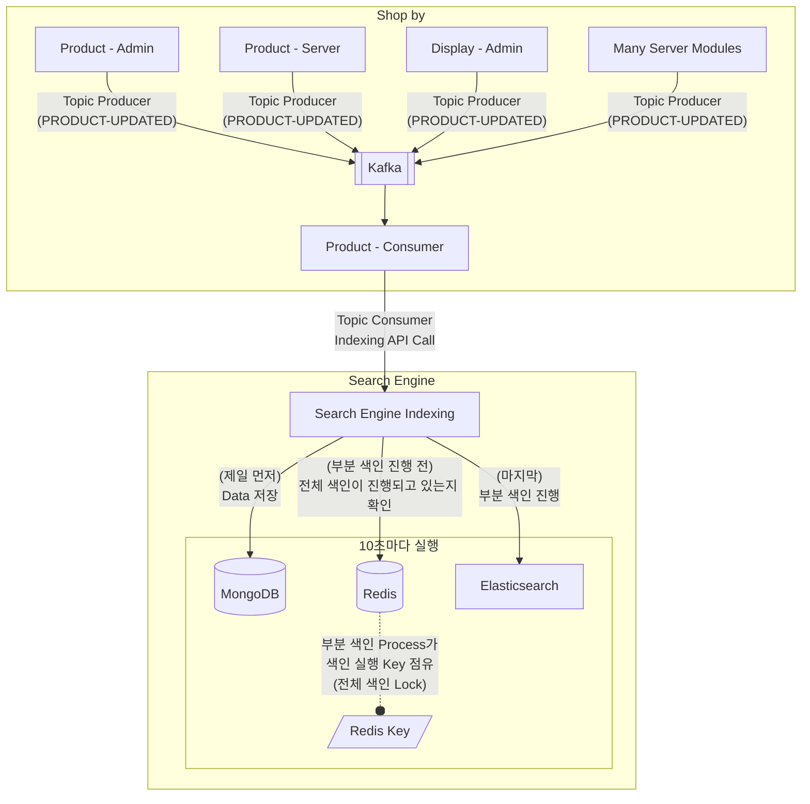

1. **Data 수정 감지와 전파** : 상품 data가 수정되면, system은 'product_update'라는 Kafka Topic을 발행합니다.
    - 여러 server module에서 발생하는 상품 수정 사항을 효과적으로 감지하고 전파하기 위해 Kafka를 활용합니다.

2. **임시 저장소 활용** : 수정된 data는 먼저 MongoDB에 임시 저장됩니다.
    - data를 그냥 바로 Elasticsearch에 넣어도 상관없지만, 가용성과 재색인 실패 방지를 위해 중간에 MongoDB를 둡니다.
    - MongoDB는 Elasticsearch server의 장애나 network issue 발생 시에도 data 손실을 방지하기 위한 안전 장치입니다.
    - MongoDB에 저장되는 data는 `UPDATE`와 `DELETE` 두 가지 action type으로 구분되며, 각각 최신 상품 정보와 삭제할 상품 번호를 포함합니다.

3. **Scheduling과 실행** : 부분 색인은 10초 간격으로 실행되는 scheduler에 의해 관리됩니다.
    - 실행 전에는 항상 전체 색인 작업의 진행 여부를 Redis를 통해 확인합니다.
    - 전체 색인이 진행 중이지 않을 때만 부분 색인이 실행되며, 이를 통해 data 정합성을 보장합니다.

4. **data 처리** : MongoDB에서 가져온 data는 action type에 따라 다르게 처리됩니다.
    - `UPDATE` action의 경우 해당 상품 문서를 최신 data로 갱신(update)하고, `DELETE` action의 경우 해당 상품 문서를 Elasticsearch에서 삭제(delete)합니다.
    - 이 과정에서도 Bulk API를 활용하여 효율적인 처리를 보장합니다.

#### MongoDB에 저장되는 임시 Data 예시

- `action` 항목에 `UPDATE`와 `DELETE`가 저장됩니다.

| _id | action | productNo | product | updatedDateTime |
| --- | --- | --- | --- | --- |
| 1 | UPDATE | 100000000 | {"serviceNo":1000, "mallNo":1122, "partnerNo":14232} | 2022-11-14T09:52:06.733Z |
| 2 | UPDATE | 100000001 | {"serviceNo":1000, "mallNo":1122, "partnerNo":14732} | 2022-11-14T09:52:06.733Z |
| 3 | UPDATE | 100000002 | {"serviceNo":1000, "mallNo":1122, "partnerNo":67312} | 2022-11-14T09:52:06.733Z |
| 4 | DELETE | 100000003 | <unset> | 2022-11-14T09:52:06.733Z |
| 5 | UPDATE | 100000004 | {"serviceNo":1000, "mallNo":1122, "partnerNo":64312} | 2022-11-14T09:52:06.733Z |
| 6 | UPDATE | 100000005 | {"serviceNo":1000, "mallNo":1122, "partnerNo":34564} | 2022-11-14T09:52:06.733Z |
| 7 | UPDATE | 100000006 | {"serviceNo":1000, "mallNo":1122, "partnerNo":54143} | 2022-11-14T09:52:06.733Z |
| 8 | DELETE | 100000007 | <unset> | 2022-11-14T09:52:06.733Z |
| 9 | UPDATE | 100000008 | {"serviceNo":1000, "mallNo":1122, "partnerNo":74523} | 2022-11-14T09:52:06.733Z |
| 10 | UPDATE | 100000009 | {"serviceNo":1000, "mallNo":1122, "partnerNo":97657} | 2022-11-14T09:52:06.733Z |
| 11 | UPDATE | 100000010 | {"serviceNo":1000, "mallNo":1122, "partnerNo":45654} | 2022-11-14T09:52:06.733Z |
| 12 | UPDATE | 100000011 | {"serviceNo":1000, "mallNo":1122, "partnerNo":64353} | 2022-11-14T09:52:06.733Z |
| 13 | DELETE | 100000012 | <unset> | 2022-11-14T09:52:06.733Z |
| 14 | UPDATE | 100000013 | {"serviceNo":1000, "mallNo":1122, "partnerNo":96759} | 2022-11-14T09:52:06.733Z |
| 15 | UPDATE | 100000014 | {"serviceNo":1000, "mallNo":1122, "partnerNo":34233} | 2022-11-14T09:52:06.733Z |
| 16 | UPDATE | 100000015 | {"serviceNo":1000, "mallNo":1122, "partnerNo":87576} | 2022-11-14T09:52:06.733Z |
| 17 | DELETE | 100000016 | <unset> | 2022-11-14T09:52:06.733Z |
| 18 | UPDATE | 100000017 | {"serviceNo":1000, "mallNo":1122, "partnerNo":43222} | 2022-11-14T09:52:06.733Z |
| 19 | DELETE | 100000018 | <unset> | 2022-11-14T09:52:06.733Z |
| 20 | UPDATE | 100000019 | {"serviceNo":1000, "mallNo":1122, "partnerNo":12334} | 2022-11-14T09:52:06.733Z |

#### 부분 색인 Source Code

- MongoDB에 있는 data를 토대로 부분 색인을 진행합니다.

- 부분 색인도 Bulk API를 사용하며, action 항목이 `UPDATE`인지 `DELETE`인지에 따라 분기하여 다르게 처리합니다.
    - `UPDATE`인 경우에는 해당 document를 수정된 정보로 최신화합니다.
    - `DELETE`인 경우에는 해당 document를 삭제합니다.

```kotlin
indexingTargets.forEach { target ->
    when (target.action) {
        UPDATE -> {
            bulkRequestBuilder.operations { bulkOperation ->
                bulkOperation.index {
                    it.index(indexName).id(target.productNo.toString()).document(target.product)
                }
            }
        }
        DELETE -> {
            bulkRequestBuilder.operations { bulkOperation ->
                bulkOperation.delete {
                    it.index(indexName).id(target.productNo.toString())
                }
            }
        }
        // ...
    }
}
```


### 부분 색인이 있는데 전체 색인을 추가로 하는 이유

- update가 필요한 data에 대해 10초에 한 번씩 실시간 부분 색인을 하기 때문에, 전체 색인을 하지 않아도 data의 정합성은 보장할 수 있습니다.
- 그러나 NHN의 검색 Engine에서 전체 색인은 **system의 안정성을 확보**하고 **검색 service의 품질을 향상**시키기 위한 필수 기능입니다.

1. **안정적인 backup**과 **신속한 장애 대응**이 가능합니다.
    - 매일 새벽 전체 색인을 수행할 때마다 새로운 index가 생성되며, 이전 index는 backup용으로 보존됩니다.
    - 현재 사용 중인 index에 문제가 발생하더라도 이전 index로 즉시 전환할 수 있어, service 중단을 최소화하고 신속하게 대응할 수 있습니다.

2. **검색 품질 개선을 위한 유연한 대응**이 가능합니다.
    - 현재 system은 Elasticsearch의 Nori plugin을 활용하여 검색 품질을 향상시키고 있습니다.
    - 이 plugin을 사용하면서 새로운 동의어를 추가해야 하는 경우가 생기는데, 이러한 변경 사항은 index 갱신을 필요로 합니다.
        - 추가된 동의어에 맞추어 모든 index를 갱신해야 합니다.
    - 매일 수행되는 전체 색인 작업을 통해 새롭게 추가된 동의어가 자동으로 인식되므로, 검색 품질을 지속적으로 개선할 수 있습니다.


---


## 4. 검색 품질 개선 방안

- 만족할 수 있는 검색 품질에는 여러 기준이 있을 수 있습니다.
    1. 얼마나 검색이 일치하는가.
    2. 얼마나 적절하게 형태소 분석이 되는가.
    3. 사용자 요청에 얼마나 유의미한 용어를 추출해 내는가.

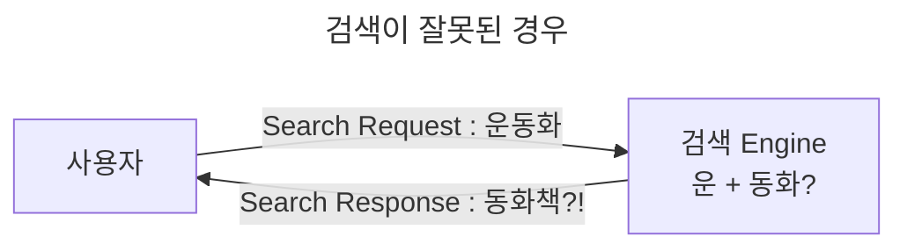

- NHN은 commerce platform의 검색 품질을 개선하기 위해 **text 분석 기능**과 **검색 query 기능**을 최적화하였습니다.


### Text 분석 기능 (with Elasticsearch Analyzer) : 형태소 분석, 사용자 사전, 동의어 사전

- NHN은 Elasticsearch Analyzer를 통해 text 분석 기능을 구현했습니다.
    - Elasticsearch Analyzer는 색인 시 입력된 data를 term으로 추출하기 위한 과정에 사용됩니다.
        - 하나의 text를 여러 개의 의미를 가진 최소한의 단어들로 분석합니다.

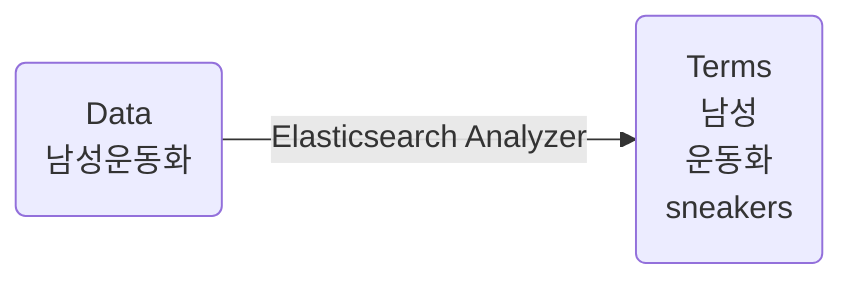

- 특히, 단어의 추가/수정/삭제 작업이 빈번한 **사용자/동의어 사전은 지속적인 update가 필요**하기 때문에, **자동화된 배포 system을 구축**했습니다.
    - 사전 file이 NHN Cloud Object Storage에 upload되면, Jenkins와 Ansible을 통해, 모든 cluster node에 자동으로 배포되고 적용됩니다.

#### Nori Tokenizer : 형태소 분석

- Elasticsearch의 **Nori tokenizer**를 한국어 처리를 위해 도입했습니다.
    - tokenizer는 검색어를 의미 있는 구성 요소로 효과적으로 분리합니다.
    - 예를 들어, "남성 운동화"라는 검색어는 "남성", "운동", "화" 세 부분으로 tokenization이 진행됩니다.

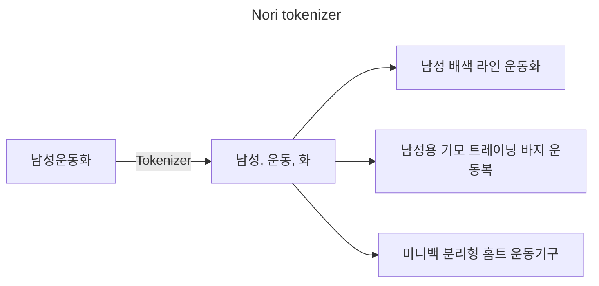

#### 사용자 사전 : 단어의 분리 제어

- 유사하지만 관련성은 없는 결과가 함께 표시되는 문제는 **사용자 사전**(`user_dictionary.txt`)을 구현하여 해결하였습니다.

- 초기에는 "운동화"를 검색했을 때 "운동복"이나 "운동기구"와 같은 관련 없는 결과가 함께 표시되는 문제가 있었습니다.

- 이를 해결하기 위해 사용자 사전을 구현하여 형태소 분석 과정에서 특정 단어가 불필요하게 분리되는 것을 방지했습니다.
    - 예를 들어, "운동화"라는 단어가 "운동"과 "화"로 분리되면 "운동복", "운동기구" 등 관련 없는 검색 결과가 나올 수 있습니다.
    - 따라서 사용자 사전에 "운동화"를 등록하면 이 단어가 하나의 완전한 단어로 취급되어 더 정확한 검색이 가능해집니다.


#### 동의어 사전 : 같은 의미를 가진 다양한 표현 연결

- 사용자들이 같은 상품을 다양한 방식으로 검색할 수 있도록 포괄적인 **동의어 사전**(`synonym.txt`)을 개발했습니다.
    - 예를 들어, 사용자가 "신발"이라는 단어를 검색했을 때 "러닝화", "운동화", "스니커즈" 등 같은 의미를 가진 상품들도 함께 검색될 수 있도록 합니다. 
    - 이를 통해 사용자가 어떤 표현을 사용하더라도 원하는 상품을 찾을 수 있게 됩니다.

| 동의어 사전 예시 |
| --- |
| 신발, 운동화, 런닝화, 러닝화, 스니커즈, shoes, sneakers |
| 물, 생수, 식수, ... |

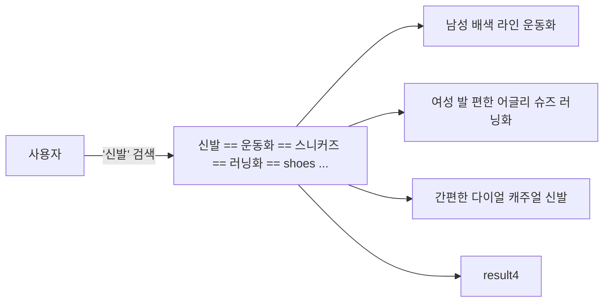


### 검색 Query 개선 : 더 자연스러운 결과 응답

- 여러 query 전략들의 조합으로 commerce platform의 검색 정확도와 사용자 경험이 크게 향상되었습니다.
    - 검색의 유연성을 유지하면서도 더 정확하고 관련성 높은 상품 검색이 가능해졌습니다.

#### `copy_to` 기능 구현

- Elasticsearch의 `copy_to` 기능을 사용하여 여러 검색 가능한 field(상품 이름, keyword, 브랜드 이름)를 하나의 field로 통합하여 저장합니다.

```json
// copy_to 전
"productName": "스마트 원터치 텀블러 450ml 3종 택1",
"keywords": [
    "스마트",
    "원터치",
    "텀블러",
    "450ml",
    "3종",
    "택1"
],
"displayCategory": {
    "names": [
        "주방",
        "컵/텀블러/보틀",
        "스테인리스 텀블러"
    ]
},
"marketingPhrases": "무료배송",
"brand": {
    "brandName": "NHN Commerce"
},
```

```json
// copy_to 후
"fields": {
    "keywordText": [
        "스마트 원터치 텀블러 450ml 3종 택1",
        "스마트",
        "원터치",
        "텀블러",
        "450ml",
        "3종",
        "택1",
        "주방",
        "컵/텀블러/보틀",
        "스테인리스 텀블러",
        "무료배송",
        "NHN Commerce"
    ]
}
```

- copy_to를 사용하여 query 구조가 크게 단순화되고 검색 효율성이 향상됩니다.
    - 여러 field를 검색하는 복잡한 query를 작성하는 대신, 통합된 단일 field만 검색하면 됩니다.

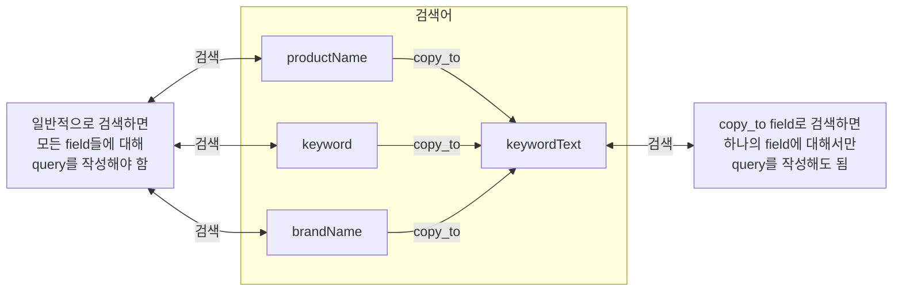

#### Minimum Should Match 구현

- 관련성 없는 검색 결과를 방지하기 위해, `minimum_should_match` parameter를 사용합니다.
    - 예를 들어, "김치냉장고"를 검색할 때, 이전에는 개별 token과 매칭되는 "와인냉장고"나 "김치만두"와 같은 관련 없는 상품들을 반환하기도 했습니다.
        - "김치냉장고"에 대한 token을 "김치"와 "냉장고"로 나누어서 검색하기 때문입니다.
    - `minimum_should_match` parameter는 검색어의 단어들 중 최소한 몇 개가 일치해야 문서가 검색 결과에 포함될지를 지정하며, 어느 정도 관련성 있는 검색 결과를 반환하도록 해줍니다.

- `minimum_should_match` parameter는 Elasticsearch의 match query에서 사용되는 parameter입니다.
    - `minimum_should_match` parameter로 검색의 정확도를 높일 수 있으며, 특히 불필요하게 광범위한 검색 결과를 제한하는 데 유용합니다.
        - `operator: "and"` 대신 사용하여 좀 더 유연한 검색 조건을 설정할 수 있습니다.
    - `minimum_should_match: "2"` : 세 단어 중 최소 2개 이상 일치하는 문서만 검색됩니다.
    - `minimum_should_match: "75%"` : 검색어 단어의 75% 이상이 일치하는 문서만 반환됩니다.
    - `minimum_should_match: "2<75%"` : 검색어가 2개 이하일 때는 모든 단어가 일치해야 하고, 3개 이상일 때는 75%가 일치해야 합니다.

- 적절한 임계값으로 `minimum_should_match`를 구현함으로써 더 관련성 높은 검색 결과를 보장할 수 있게 되었습니다.

```json
// 아래의 예시는 모두 "GET products/_search" API에 minimum_should_match parameter를 사용하는 예시

// minimum_should_match 대신 operator 사용
// 분석된 모든 단어들(김치, 냉장고)이 포함된 상품만 검색
{
    "query": {
        "match": {
            "keywordText": {
                "query": "김치냉장고",
                "operator": "and"
            }
        }
    }
}

// 기본적인 숫자 지정
// "고급", "스테인리스", "전기", "밥솥" 중 최소 2개의 단어가 포함된 문서가 검색됨
{
    "query": {
        "match": {
            "keywordText": {
                "query": "고급 스테인리스 전기 밥솥",
                "minimum_should_match": 2
            }
        }
    }
}

// 백분율 지정
// 5개 단어 중 60%, 즉 최소 3개의 단어가 일치해야 함
{
    "query": {
        "match": {
            "keywordText": {
                "query": "프리미엄 디지털 스마트 터치 에어프라이어",
                "minimum_should_match": "60%"
            }
        }
    }
}

// 조건부 로직
// 검색어가 2단어 이하일 때는 모두 일치해야 하고, 3단어 이상일 때는 75%가 일치해야 함
{
    "query": {
        "match": {
            "keywordText": {
                "query": "인공지능 음성인식 스피커",
                "minimum_should_match": "2<75%"
            }
        }
    }
}

// 복합 조건
// 1-3단어 : 모든 단어 일치 필요
// 4-5단어 : 90% 일치 필요
// 6단어 이상 : 70% 일치 필요
{
    "query": {
        "match": {
            "keywordText": {
                "query": "프리미엄 스마트 홈 system 패키지",
                "minimum_should_match": "3<90% 5<70%"
            }
        }
    }
}

// 음수 값 사용
// 전체 검색어에서 1개를 제외한 모든 단어가 일치해야 함
// 즉, 4개 단어 중 3개가 일치하면 검색 결과에 포함됨
{
    "query": {
        "match": {
            "keywordText": {
                "query": "무선 충전 보조배터리 케이스",
                "minimum_should_match": "-1"
            }
        }
    }
}
```

#### Hybrid Query 방식 : Match Query + Term Query

- 분석된 검색(Match Query)과 비분석 검색(Term Query) 기능을 모두 활용하는 hybrid 방식을 구현했습니다.
    - **Match Query** : 형태소 분석을 위해 **검색어를 analyzer를 통해 처리**하여 검색합니다.
    - **Term Query** : analyzer를 통한 분석 없이 **정확히 일치하는 단어**를 검색합니다.

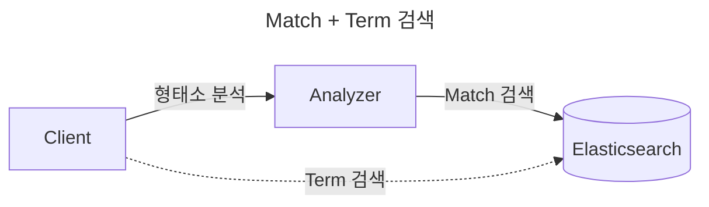

- hybrid 방식은 특히 의성어/의태어("폭신폭신" 등)와 같은 특수한 경우를 처리하는 데 유용합니다.
    - 어떤 용어들이 부사로 인식되어 분석기에 의해 filtering되더라도, term query를 통해 정확한 매칭을 찾을 수 있어 포괄적인 검색 결과를 보장합니다.

```json
{
    "query": {
        "bool": {
            "should": [
                { "match": {"keywordText": "폭신폭신"} },
                { "term": {"keywordList": "폭신폭신"} }
            ]
        }
    }
}
```

- Match Query에서 검색되지 않던 "폭신폭신"이라는 단어가, 오히려 Term Query에서는 검색이 되어 Match Query를 보완해줍니다.
    - Match Query 대상인 `keywordText` field에서는 분석기가 "폭신폭신"을 Null로 변환합니다.
        - "폭신폭신"이라는 단어가 분석기를 통해 부사로 인식되어 무시되었기 때문입니다.
    - Term Query 대상인 `keywordList` field에서는 "폭신폭신"이 그대로 "폭신폭신"으로 유지됩니다.
        - 검색어가 정확히 일치하는 경우에 결과를 반환하며, 따라서 "폭신폭신"이라는 단어가 포함된 결과도 검색됩니다.


---


## 5. 검색 성능 Test 결과 비교

- 최초의 검색 Engine 성능으로부터, 최소 **분당 20,000건(= 초당 약 350건) 이상의 검색 요청을 처리할 수 있도록 개선**해야 합니다.

| 성능 지표 | 초기 성능 | 목표 성능 |
| --- | --- | --- |
| **처리량 (TPS)** | 100-200건 | 350건 이상 |
| **평균 응답 속도** | 1.2초 이상 | 1초 미만 |

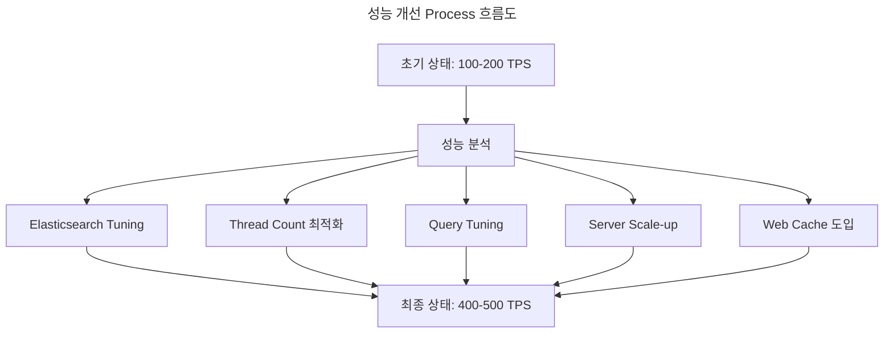

- 최종적으로 목표로 설정했던 **초당 350건의 동시 요청 처리와 1초 미만의 응답 속도를 모두 달성**하였으며, 안정적인 service 운영이 가능한 수준으로 system이 개선되었습니다.
    - **최종 처리량** : 400-500 TPS (초기 대비 2.5배 향상).
    - **최종 평균 응답 속도** : 0.7초 이하 (초기 대비 40% 단축).

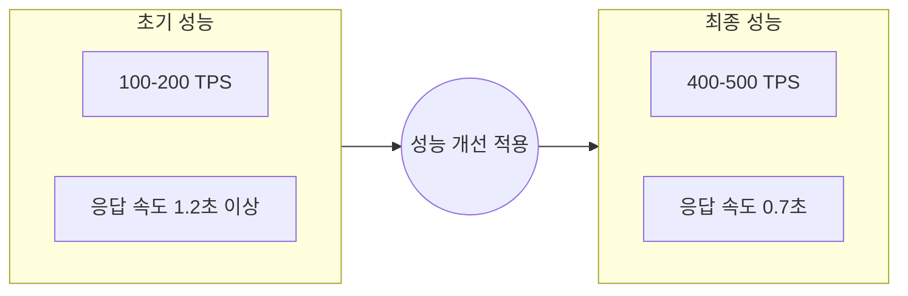


### 성능 개선 방안

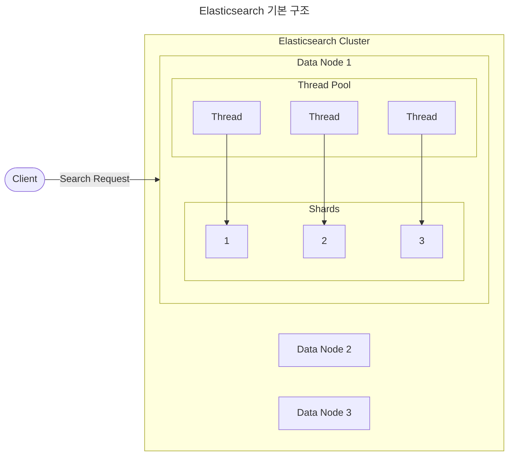

1. **Shard Size가 작을수록** Thread가 Shard를 선택하는 것이 빨라질 것입니다.
    - 작은 Shard는 Memory에서 더 효율적으로 관리되고 검색될 수 있기 때문에, Thread가 작업할 Shard를 선택하고 할당하는 과정이 더 빨라집니다.

2. **Search Thread가 많을수록** 동시 요청 처리 수가 많아질 것입니다.
    - 더 많은 Search Thread는 병렬 처리 능력을 향상시켜 동시에 더 많은 검색 요청을 처리할 수 있게 됩니다.

3. **Search Query 응답이 빠를수록** system의 전반적인 처리량(throughput)이 증가할 것입니다.
    - 각 query의 빠른 응답은 Thread가 더 빨리 다음 작업을 처리할 수 있게 하여, 전체 system의 효율성이 향상됩니다.

4. **Node별 사양이 좋을수록** 개별 query 처리 성능과 전체 system의 안정성이 향상될 것입니다.
    - 더 좋은 hardware spec(CPU, Memory, Disk I/O)은 각 node에서의 검색 작업 속도를 높이고, 더 많은 부하를 안정적으로 처리할 수 있게 합니다.

5. **Data Node가 많을수록** system의 확장성과 fault tolerance가 향상될 것입니다.
    - 더 많은 data node는 작업 부하를 더 넓게 분산시킬 수 있게 하며, 일부 node에 문제가 발생하더라도 system이 계속 작동할 수 있는 중복성을 제공합니다.

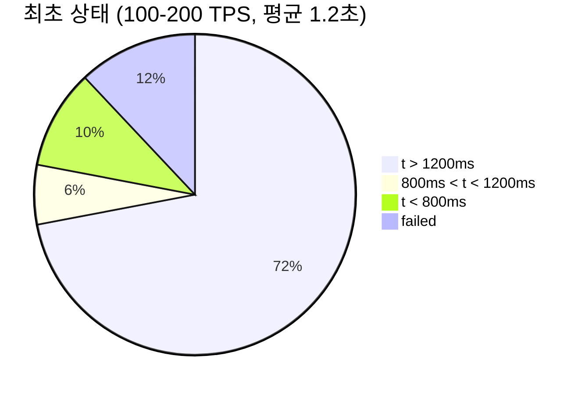

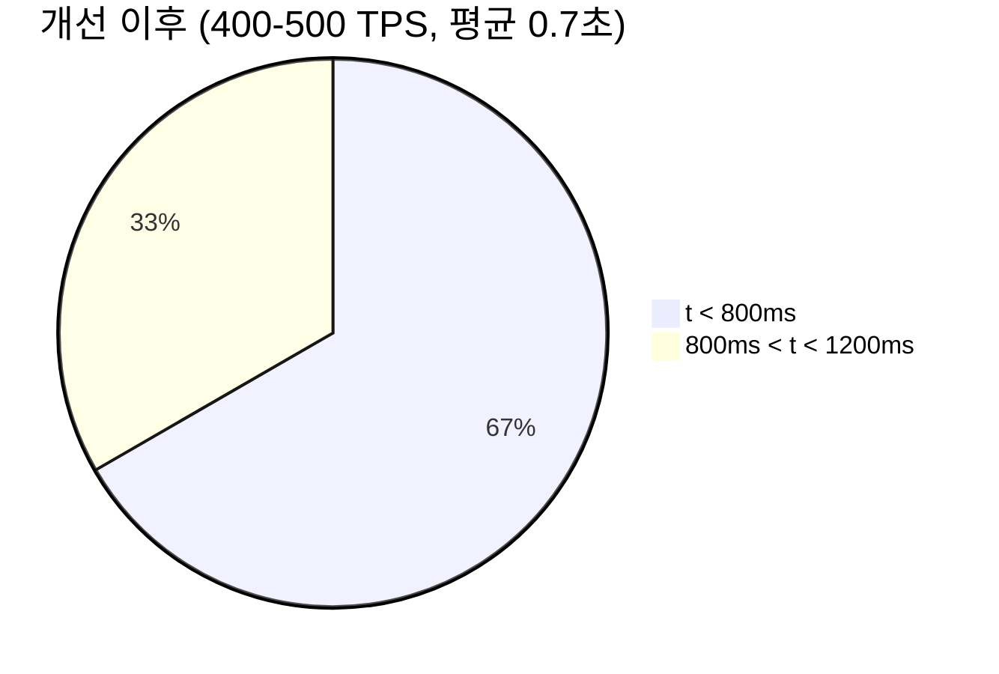


### 첫 번째 개선 : Elasticsearch Shard 최적화

- 전체 data 크기는 약 5GB이며, 각 node에 1.6GB가 할당되었습니다.
- Elasticsearch의 권장 사항(1-50GB/shard)을 고려하여, 각 node는 단일 shard를 유지하기로 결정하였습니다.
    - 각 node에 1.6GB가 할당되었기 때문에, 권장 범위 내에 이미 들어가 있습니다.


### 두 번째 개선 : Thread Count 설정

- Elasticsearch 설정 file의 thread poll 설정을 조정하였습니다.

```yaml
# elasticsearch.yml

cluster.name: es-docker-cluster
network.host: 0.0.0.0

thread_pool:
    search:
        size: 35
        queue_size: 1000
```

#### Thread Count 개선 Test : 초당 400 Request (10초간)

- 10초간 초당 400개의 검색을 요청하여 test하였으며, thread count 조정을 통해 유의미한 성능 변화가 있었습니다.

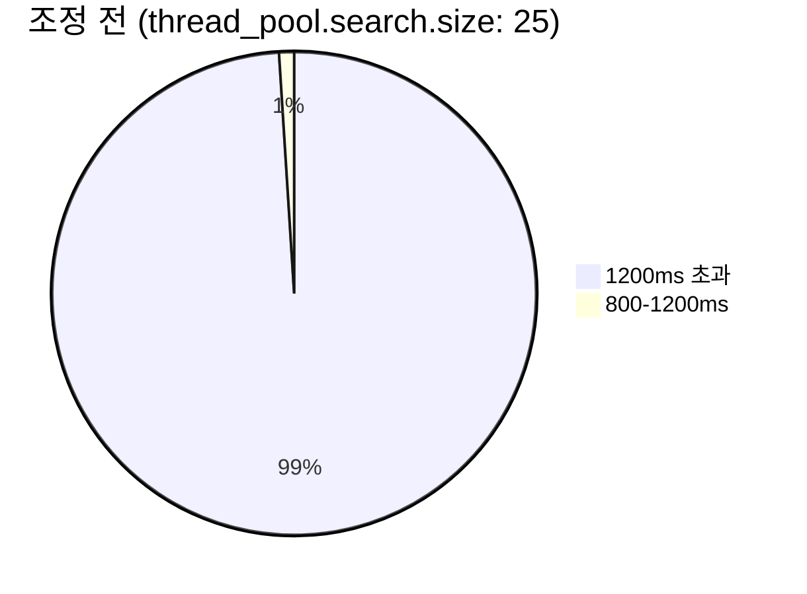

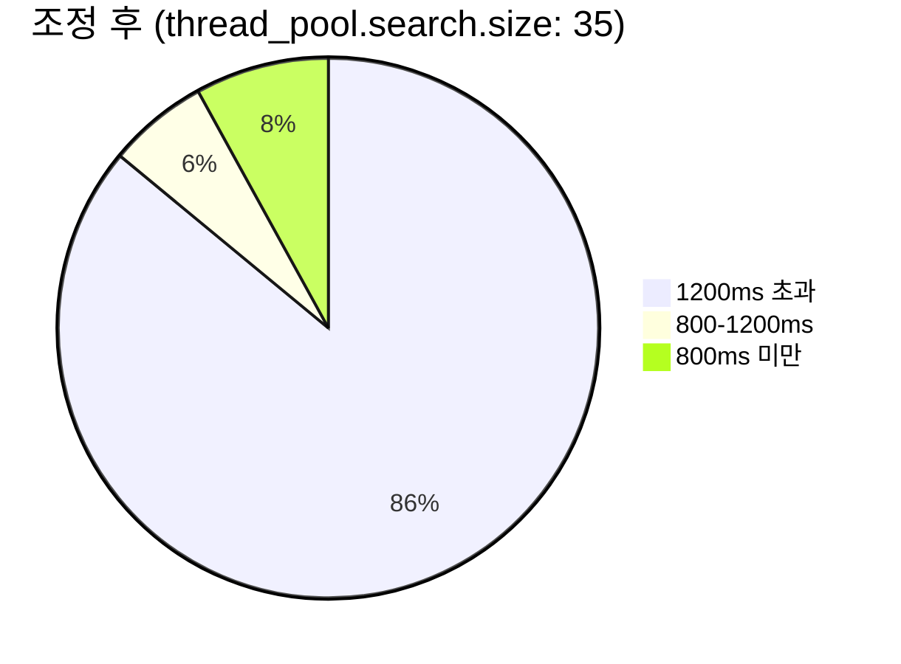


### 세 번째 개선 : Query Tunning

- 복잡한 category 구조를 단순화하여 query 성능을 개선하였습니다.

#### 초기의 복잡한 Category Query : 0.5 ~ 1.5 sec

```txt
[남성용 배색 운동화]

상품 Category
    depth 1 : 의류 잡화
        depth 2 : 신발
            depth 3 : 남성용 신발
                depth 4 : 수제화
                    depth 5 : 운동화
```

- 초기에는 category가 depth 1부터 5까지 있어, 집계를 위해 sub-aggregation을 사용하였습니다.
    - sub-aggregation은 일반 aggregation보다 느리고 복잡합니다.

```json
// GET /products/search
// 응답 시간 : 0.5 ~ 1.5 sec
{
    "aggs": {
        "depth1_count": { "terms": { "field": "displayCategory.depth1" } },
        "aggs": {
            "depth2_count": { "terms": { "field": "displayCategory.depth2" } },
            "aggs": {
                "depth3_count": { "terms": { "field": "displayCategory.depth3" } },
                "aggs": {
                    "depth4_count": { "terms": { "field": "displayCategory.depth4" } },
                    "aggs": {
                        "depth5_count": { "terms": { "field": "displayCategory.depth5" } }
                    }
                }
            }
        }
    }
}
```

#### 개선된 단순한 Category Query : 0.3 ~ 0.8 sec

```txt
[남성용 배색 운동화]

상품 Category
    summaries : 의류 잡화 | 신발 | 남성용 신발 | 수제화 | 운동화
```

- 개선을 위해 depth로 나뉘어져 있던 상품 category를 하나의 field로 모아서 저장했습니다.
    - Elasticsearch는 하나의 field만 aggregation할 수 있도록 query가 개선되어, 소요 시간이 0.3초에서 0.8초 사이로 단축되었습니다.

```json
// GET /products/search
// 응답 시간 : 0.3 ~ 0.8 sec
{
    "aggs": {
        "displayCategories": {
            "terms": {
                "field": "displayCategory.summaries"
            }
        }
    }
}
```

#### Query Tunning Test : 초당 400 Request (10초간)

```mermaid
pie title Query Tuning 이전 (단일 검색 약 1.5 ~ 2초)
    "t > 1200ms" : 86
    "800ms < t < 1200ms" : 6
    "t < 800ms" : 8
```

```mermaid
pie title Query Tuning 이후 (단일 검색 약 0.4 ~ 1초)
    "t < 800ms" : 76
    "800ms < t < 1200ms" : 38
```


### 네 번째 개선 : Server Scale-up

- server 사양을 8 Core CPU, 8GB Memory에서 16 Core CPU, 16GB Memory로 증설하였습니다.
- 증설 후 CPU 사용률이 안정화되었고 응답 지연 현상이 해소되었습니다.

#### Server 증설 비교 Test : 초당 200 Request (10초간)

```mermaid
pie title 증설 이전 (8 Core, 8 GB Memory)
    "t > 1200ms" : 72
    "800ms < t < 1200ms" : 6
    "t < 800ms" : 10
    "failed" : 12
```

```mermaid
pie title 증설 이전 (16 Core, 16 GB Memory)
    "t < 800ms" : 100
```


### 다섯 번째 개선 : Nginx Web Cache 도입

- Nginx web cache system을 구축하여 검색 성능을 약 2배 향상시켰습니다.
    - 추가적으로, cache server에 쌓이는 log를 이용하여, cache 비율, cache 현황, 그리고 검색 요청 현황을 monitoring할 수 있는 dashboard를 구성하였습니다.

| Cache Miss.. | Cache Hit! |
| --- | --- |
| 응답에 1.1 ~ 1.5초 소요 | 응답에 0.2 ~ 0.7초 소요 |

```mermaid
---
title : Web Cache 도입 이전
---
flowchart TD
    client([Client])
    shop_by_server[Shop by Server]
    search_server[Search Server]
    elasticsearch[Elasticsearch]

    client -- "검색 요청" --> shop_by_server
    shop_by_server --> search_server
    search_server --> elasticsearch
```

```mermaid
---
title : Web Cache 도입 이후
---
flowchart TD
    client([Client])
    shop_by_server[Shop by Server]
    search_server[Search Server]
    elasticsearch[Elasticsearch]

    subgraph nginx[Nginx]
        nginx_cache[Nginx Cache]
        nginx_log(cache.log)

        nginx_cache -. "검색 요청 Log 저장" .-> nginx_log
    end

    if_cache{Cache 확인}
    filebeat[FileBeat]

    client -- "검색 요청" --> shop_by_server --> nginx_cache --> if_cache

    if_cache -- "Cache Hit!" --> shop_by_server
    if_cache -- "Cache Miss.." --> search_server --> elasticsearch

    nginx_log -.-> filebeat -. "Log File 전달<br>(for Monitoring)" .-> elasticsearch
```


---


## 6. 후기

- project는 3명의 검색 Engine CFT 인원이 **5월 12일에 시작하여 7월 29일에 종료**하였습니다.
- 현재도 문의 사항과 feedback을 받으면서 수정과 refactoring을 하는 중입니다.


---


## Reference

- <https://youtu.be/fBfUr_8Pq8A>

