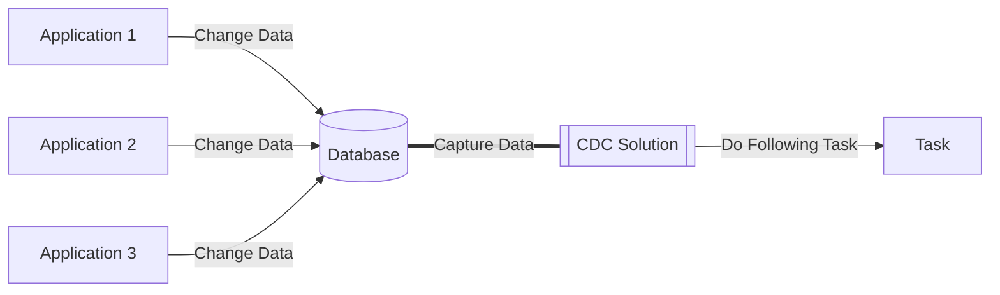
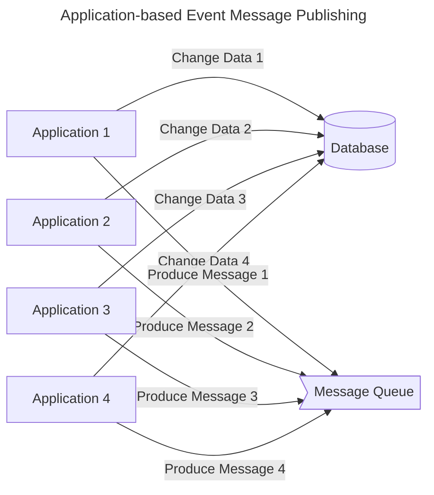
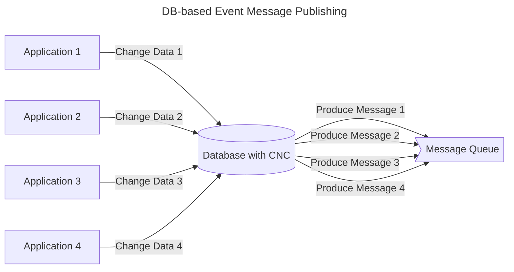

## CDC (Change Data Capture)

- CDC(Change Data Capture)는 **DB에 있는 data에 대한 변경을 감지해 필요한 후속 처리(data 전송/공유 등)를 자동화하는 기법**을 통칭합니다.
    - database 안에서 일어나는 모든 변화를 감지하고, 이를 각각의 event로 기록하며 event stream으로 전달합니다.

### CDC의 활용 사례

1. **Microservice 통합** : CDC를 통해 data 변경 사항을 legacy system에서 microservice 기반 application으로 원활하게 전송할 수 있습니다.
    - microservice를 기존의 monolithic application과 동기화하여, migration 시 발생할 수 있는 data 불일치 문제를 해결합니다.

2. **Data 복제** : database, data lake, data warehouse 등의 저장소에 data를 복제하여, 각 resource가 최신 version data를 보유하도록 할 수 있습니다.
    - data가 분산되어 있거나 data silo 문제가 있는 경우에도, 여러 부서가 동일한 최신 data에 접근하도록 지원할 수 있습니다.
        - data silo : data가 격리되어 특정 조직/부서/단위에서만 정보 접근 및 공유가 가능하여 다른 조직/부서/단위에서는 data가 격리되는 현상.
            - data silo는 부서 간의 단절을 유발하는 등, 기업에 부정적인 영향을 끼칩니다.

3. **분석 Dashboard** : CDC는 BI(Business Intelligence)와 같은 목적으로 data 변경 사항을 분석 dashboard에 제공하여, 의사결정을 도울 수 있습니다.

4. **감사 및 Compliance** : 감사 또는 보관 요건에 따라 특정 data의 변경 이력을 저장할 수 있습니다.
   - 엄격한 data compliance 요건을 준수하고 규정 미준수에 대한 엄격한 처벌을 피하려면 data 변경 이력을 저장하는 것이 중요합니다.

5. **Cache 무효화** : cache에서 오래된 항목을 교체하거나 제거하여 최신 version을 표시할 수 있습니다.

6. **CQRS Model Update** : CQRS(Command Query Responsibility Separation) 읽기 model을 기본 model과 동기화할 수 있습니다.

7. **전체 Text 검색** : 전체 text 검색 index를 database와 자동으로 동기화할 수 있습니다.
    - 이 경우, 일반적으로 Elasticsearch에 indexing하기 위해 CDC를 사용합니다.

---

## Event 기반 Architecture에서 CDC를 사용하는 이유

- data 변경에 대한 event message는 **application 기반으로 발행**할 수도 있고, **DB 기반으로 발행**할 수도 있습니다.
    - CDC는 DB 기반으로 message를 발행하는 쪽에 속합니다.

- CDC는 DB 기반으로 message를 발행하기 때문에, **data 변경에 의해 발행되는 모든 event의 관리 지점을 data로 모을 수 있다는 장점**이 있습니다.
    - CUD(Create, Update, Delete)에 의해 data가 수정되면 자동으로 event가 발행되기 때문입니다.

- **application 기반 message 발행 방식은 병렬 형태로 data를 처리**합니다.
    - event가 발생했을 때, application이 DB에 변경 사항도 반영하고 message queue에 message도 등록합니다.
        - DB CUD와 message를 등록하는 두 가지 작업을 application이 주체가 되어 모두 처리(dual write)합니다.
    - 해당 data를 변경하는 곳은 application상에 무수히 많이 존재하므로, event message를 발행하는 logic도 data를 변경하는 모든 곳에 추가해줘야 합니다.
        - DB에 CUD를 하는 logic이 API, batch, worker 등 여러가지가 있다면, 모든 logic에 event message 발행 과정을 추가해야 합니다.
        - 개발자가 어느 한 곳이라도 놓치면, message 발행이 누락됩니다.

- **DB 기반 message 발행 방식은 직렬 형태로 data를 처리**합니다.
    - event가 발생했을 때, **application은 DB에 변경 사항을 반영**하고, **message queue에 message 등록은 DB 변경 감지 도구(CDC solution)가** 합니다.
        - CDC solution이 DB 수준에서 data 변경을 감지하고, 변경된 data에 대한 message를 생성하여 queue에 등록합니다.
    - DB 수준에서는 **특정 data가 변경되는 지점을 하나로 관리**할 수 있으므로, **event message를 발행하는 곳도 단 한 곳**이 됩니다.

- event 기반 architecture에서 장애 조치, CS 건 처리 등의 이유로 **DB의 data를 수기로 변경(DDL 직접 실행)해야하는 경우**에도, CDC를 통한 event 발행 기능은 유용하게 사용됩니다.
    - 어떤 data를 수기로 수정하는 경우, 해당 data에 관련된 event를 application logic을 전부 점검하여, logic에 포함된 event를 모두 직접 발행해줘야 합니다.
        - 일반적으로 event는 application을 통해 발행되므로, 틀어지거나 수정된 data를 보정한 event 내역 또한 application logic에서 찾아, event trigger API를 호출하여 event를 직접 발행해야 합니다.
    - 그러나 만약 **data가 수정될 때 자동으로 관련 event가 발행**된다면, application logic을 모두 확인하지 않아도 누락 없이 처리가 가능하게 됩니다.
        - CDC가 data 변경을 감지하고, event를 자동으로 발행해주기 때문입니다.

### Event 기반 Architecture에 CDC를 적용하는 경우 생기는 단점

- DB 기반으로 event를 발행하면 관리 point가 줄어든다는 장점이 있지만, application 기반으로 message가 발행하지 않기 때문에 생기는 단점도 있습니다.

1. **단일 table에 대한 변경 사항만 capture 가능**합니다.
    - table에 있는 row(또는 collection에 있는 document) level에서의 변경 사항을 capture하기 때문에, 여러 table(또는 collection)에 대한 변경 사항을 하나의 message(Kafka topic 등)에 담을 수 없습니다.
    - DB에 담기지 않는 data 변경 사항은 Kafka message에 포함할 수 없습니다.

2. 변경된 data를 담을 **message scheme의 customizing이 제한적**입니다.
    - message를 application level에서 직접 produce하는 것이 아니기 때문입니다.
    - 예를 들어, operation type 구분을 'CREATE', 'UPDATE', 'DELETE' 3개로만 할 수 있습니다.
    
3. **CDC 구축 및 관리에 비용**이 어느 정도 들 수 있습니다.
    - 경우에 따라 DB에 부하가 가중될 수도 있습니다.
      
- 따라서 event 기반 architecture를 사용한다고 해서 CDC를 맹목적으로 적용해서는 안 되며, 득과 실을 잘 따져보아야 합니다.

---

## CDC 작동 방식

- CDC는 DB data의 변경 사항을 감지하는 기법을 통칭하는 용어일 뿐이며, 이를 **실제로 구현할 때는 여러가지 방식을 사용**할 수 있습니다.
    - 보통은 직접 구현하여 사용하지는 않고, **Debezium, Apache NiFi, Oracle GoldenGate, Maxwell 등**의 CDC Solution 제품을 사용합니다.

- 상황에 따라 여러 방식을 조합하여 사용하는 hybrid 방식도 존재합니다.
    - log 기반 방식과 trigger 기반 방식을 함께 사용하여 장점을 취하는 경우도 있습니다.
    - system 요구 사항과 성능 특성에 따라 적절한 방식을 선택해야 합니다.

### Log 기반 CDC (Log-based Change Data Capture)

- log 기반 CDC는 **database의 transaction log를 읽어서 data 변경 사항을 capture하는 방식**을 사용합니다.
    - 가장 널리 사용되는 방식입니다.
    - database는 모든 transaction 변경 사항(삽입, 수정, 삭제)을 transaction log에 순차적으로 기록합니다.
    - log 기반 CDC는 이 transaction log를 직접 읽어 변경 data를 capture합니다.
    - 이는 database table을 직접 조회하지 않고도 변경 사항을 파악할 수 있게 해줍니다.

- log 기반 CDC는 database의 transaction log를 직접 읽어 실시간으로 변경 사항을 추적하므로, database 성능 저하 없이 정확한 data 동기화가 가능합니다.
    1. **database 성능에 미치는 영향을 최소화**할 수 있습니다.
        - transaction log를 읽는 방식이므로 database table에 직접적인 query를 실행하지 않습니다.
    2. **실시간에 가까운 data 동기화가 가능**합니다.
        - 변경 사항이 발생하는 즉시 transaction log에 기록되므로, 이를 실시간으로 capture하여 처리할 수 있습니다.
    3. **data 정확성이 보장**됩니다.
        - transaction log는 모든 변경 사항을 정확한 순서로 기록하므로, data의 일관성과 무결성을 유지할 수 있습니다.

- 모든 환경에서 log 기반 CDC를 사용할 수 있는 것은 아닙니다.
    - 특히 cloud 기반 database나 hosting된 database solution에서는 transaction log에 대한 접근이 제한될 수 있으며, 이런 경우에는 다른 CDC 방식을 고려해야 합니다.

- log 기반 CDC는 **대규모 transaction이 발생하는 mission critical system에서 유용**합니다.
    - 예를 들어, 실시간 data 복제, data warehouse 동기화, microservice 간 data 동기화 등에 활용될 수 있습니다.
    - 또는 금융 system(은행, 증권 등), 대규모 전자 상거래 platform, 실시간 data 분석 system, 대규모 transaction이 발생하는 enterprise system 등의 **고성능이 요구되는 중요 system**에서 사용됩니다.

### Trigger 기반 CDC (Trigger-based Change Data Capture)

- trigger 기반 CDC는 **database의 변경 사항을 실시간으로 감지하고 기록(logging)하는 방식**입니다.
    - database에 변경이 발생할 때마다 **trigger가 자동으로 실행되어 해당 변경 내용을 별도의 table에 저장**합니다.

- trigger 기반 CDC는 실시간 data 추적이 필요하지만 system 성능에 큰 제약이 없는 환경에서 효과적입니다.
    - **실시간 Data 동기화**가 필요한 경우 : database의 변경 사항을 즉시 다른 system이나 application에 반영해야 하는 상황에서 적합합니다.
        - 예를 들어, 실시간 data warehouse 동기화나 microservice 간 data 일관성 유지에 활용됩니다.
    - System이 **충분한 처리 용량을 보유**한 경우 : trigger로 인한 추가적인 processing overhead를 처리할 수 있는 충분한 CPU, memory, storage 용량이 확보된 환경을 의미합니다.
    - Data의 **완전한 감사 추적**이 필요한 경우 : 규제 준수나 보안 요구 사항으로 인해 모든 data 변경 사항의 이력을 상세하게 추적해야 하는 상황에 적합합니다.
        - 금융 거래나 중요 business data의 변경 이력 관리에 특히 유용합니다.

- trigger 기반 CDC는 고성능 transaction과 대용량 data 처리가 필요하거나 system resource가 제한적인 환경에서는 적합하지 않습니다.
    - 고성능의 Transaction 처리가 필요한 경우 : 초당 수천 건 이상의 transaction이 발생하는 환경에서는 **trigger로 인한 지연**이 system 전반의 응답 시간에 부정적인 영향을 미칩니다.
        - 예를 들어, 실시간 결제 system이나 고빈도 거래 system에서는 적합하지 않습니다.
    - System Resource가 제한적인 경우 : system의 CPU, memory, disk I/O 등의 resource의 사용률이 이미 높은 상황에서는 **trigger로 인한 추가적인 resource 소비**가 system 안정성을 떨어뜨립니다.
        - 특히 cloud 환경에서 비용 효율성을 고려해야 하는 경우 부담이 될 수 있습니다.
    - 대용량 Data 처리가 필요한 환경 : 대규모 data migration이나 batch 처리 작업이 빈번한 환경에서는 trigger가 **병목 현상**(bottleneck)을 일으킬 수 있습니다.
        - 수백만 건 이상의 record를 처리해야 하는 경우, 각 변경마다 실행되는 trigger는 전체 처리 시간을 크게 증가시킵니다.
    - 기존 Application에 Trigger 추가가 제한되는 경우 : legacy system이나 보안 정책상 database 수정이 제한된 환경, 또는 database 관리자 권한이 제한된 상황에서는 trigger 구현 자체가 불가능합니다.
        - 이런 경우 log 기반 CDC와 같은 대안을 고려해야 합니다.

#### Trigger 기반 CDC의 두 가지 구현 방법

1. **전체 변경 기록 방식** : 모든 변경 사항의 완전한 기록을 유지하기 위해, 변경된 data의 이전 상태와 새로운 상태를 모두 저장합니다.
    - 변경의 전체 기록에 access할 수 있지만, 원본 transaction에 대한 data 양이 두 배로 증가합니다.
    - data 조회가 간단하고 직관적입니다.
        - 모든 변경 data가 별도의 table에 저장되므로 검색이 간단합니다.

2. **최소 Logging 방식** : 변경된 행의 식별 key와 수행된 작업 유형(Create, Update, Delete)만을 기록합니다.
    - 저장 공간 사용이 효율적이고, system 부하가 상대적으로 낮습니다.
        - 원본 transaction에 미치는 영향을 최소화할 수 있습니다.
   - data를 추출할 때는 변경 table과 기본 table 간의 join이 필요하므로 추가 resource를 사용합니다.
        - key와 작업 유형만으로는 전체 변경 기록을 재구성하는 데 충분하지 않기 때문에, 전체 변경 내용을 확인하기 위해서는 원본 table과의 join이 필요합니다.

### Timestamp 기반 CDC (Timestamp-based Change Data Capture)

- timestamp 기반 CDC는 **database의 각 record에 마지막 수정 시간을 기록하여 변경 사항을 추적하는 방식**입니다.
    - database의 각 table에는 `LAST_MODIFIED`와 같은 timestamp 열이 포함되어 있으며, record가 생성되거나 수정될 때마다 이 값이 자동으로 update됩니다.
    - CDC process는 이전 추출 시점 이후의 timestamp를 가진 record들을 주기적으로 조회하여 변경 사항을 식별합니다.

- timestamp 기반 CDC는 **구현이 단순**하고 **기존 database 구조에 최소한의 변경만으로 적용**할 수 있습니다.
    - 소규모 system이나 변경 빈도가 낮은 환경에서 효과적입니다.

- timestamp 기반 CDC에는 중요한 **한계점**들이 존재하기 때문에, 신중히 사용해야 합니다.
    1. 삭제된 data를 감지할 수 없습니다.
        - record가 삭제되면 해당 timestamp도 함께 사라지기 때문에, 삭제 작업을 추적할 방법이 없습니다.
    2. transaction의 정확한 순서를 보장할 수 없습니다.
        - 동시에 여러 변경이 발생하는 경우, timestamp만으로는 정확한 transaction 순서를 파악하기 어렵습니다.
    3. system 시간 동기화 문제가 발생할 수 있습니다.
        - 여러 server나 node가 관련된 경우, 시간 차이로 인해 data 불일치가 발생할 수 있습니다.

- timestamp 기반 CDC는 소규모 system의 간단한 data 변경 추적에 적합합니다.
    - **단순한 감사 추적**이 필요한 경우 : 기본적인 data 변경 이력 추적이 필요한 system에서 효과적입니다.
        - 사용자 profile 변경 이력이나 일반적인 문서 수정 이력을 추적하는 경우에 적합합니다.
    - **삭제 작업 추적이 중요하지 않은 환경** : 주로 data 추가와 수정이 중심이 되는 system에 적합합니다.
        - log data 수집이나 sensor data 기록과 같이 삭제가 거의 발생하지 않는 system에서 효과적입니다.
    - 실시간성보다는 **주기적인 Data 동기화**가 필요한 경우 : 일별 또는 주별 data 동기화가 충분한 환경에서 유용합니다.
        - 분석용 data warehouse update나 정기적인 리포트 생성 system에 적합합니다.
    - System Resource가 제한적이어서 **경량화된 Solution**이 필요한 경우 : embeded system이나 소규모 application과 같이 resource가 제한된 환경에서 효율적으로 작동합니다.
        - 단순한 timestamp column만으로 구현이 가능하기 때문입니다.

- timestamp 기반 CDC는 정확한 순서와 실시간성이 중요하거나 data 삭제 추적이 필요한 대규모 system에는 부적합합니다.
    - 정확한 Transaction 순서가 중요한 경우 : 금융 거래나 재고 관리 system과 같이 정확한 순서가 중요한 환경에서는 **timestamp만으로는 정확한 순서를 보장할 수 없어** 부적합합니다.
        - millisecond 단위의 동시 transaction이 발생할 경우 순서가 뒤바뀔 수 있습니다.
    - 삭제된 Data의 추적이 필수적인 경우 : 규제 준수나 법적 요구 사항으로 **data 삭제 이력을 반드시 추적해야 하는 system에서는 사용할 수 없습니다.**
        - 의료 기록 system이나 금융 거래 system에서는 부적합합니다.
    - 실시간 Data 동기화가 필요한 경우 : 실시간 알림 system이나 즉각적인 data 복제가 필요한 환경에서는 timestamp 기반 방식이 가진 **지연 시간**이 허용되지 않습니다.
        - 실시간 monitoring system이나 즉각적인 장애 감지가 필요한 system에는 적합하지 않습니다.
    - 고가용성이 요구되는 Mission Critical System : 24/7 운영되는 핵심 business system이나 대규모 transaction 처리가 필요한 환경에서는 timestamp 기반 CDC의 한계로 인해 **신뢰성 있는 data 동기화를 보장할 수 없습니다.**
        - 대규모 전자 상거래 platform이나 global 배송 추적 system에는 부적합합니다.

### 차이 기반 CDC (Difference-based Change Data Capture)

- 차이 기반 CDC는 **database의 두 시점 간 snapshot을 비교하여 변경 사항을 식별하는 방식**입니다.
    - **가장 단순한 형태의 CDC**로, 두 snapshot 간의 차이를 전체적으로 비교하여 어떤 data가 추가, 수정, 또는 삭제되었는지 파악합니다.

- 차이 기반 CDC는 **구현이 매우 직관적**입니다.
    - source data의 현재 상태와 이전 상태를 비교하여 변경 사항을 감지하므로, 특별한 database 기능이나 복잡한 설정이 필요하지 않습니다.
    - 그러나 이러한 단순성 때문에 여러 제약 사항이 있습니다.

- 차이 기반 CDC는 **data volume이 작고 변경 빈도가 낮은 환경에서만 실용적**입니다.
    - 모든 data를 scan해야 하므로 **상당한 system resource를 소비**합니다.
        - 각 비교 시점마다 전체 dataset을 읽어야 하기 때문에, 대규모 database에서는 성능 저하가 발생합니다.
    - 또한 snapshot 간의 간격 동안 발생한 중간 변경 사항을 포착할 수 없어, 세밀한 변경 이력 추적이 어렵습니다.
    - 따라서 소규모 구성 database나 참조 data의 변경 사항을 추적하는 경우에 적합합니다.
    - 그러나 transaction의 정확성이 중요하거나 실시간 변경 감지가 필요한 system에서는 사용해선 안 됩니다.
    

---

## CDC Solution 비교 : Debezium, Apache NiFi, Oracle GoldenGate, Maxwell

1. **Debezium**은 Kafka 생태계와의 강력한 통합과 다양한 database 지원이 강점이며, 대규모 분산 환경에 적합합니다.
2. **Apache NiFi**는 광범위한 data source 지원과 시각적 관리 도구를 제공하여 복잡한 data pipeline 구성에 탁월합니다.
3. **Oracle GoldenGate**는 enterprise 수준의 안정성과 성능을 제공하며, 특히 Oracle 환경에서 강력한 기능을 발휘합니다.
4. **Maxwell**은 MySQL에 특화된 간단한 구조로, 빠른 구축과 간단한 data pipeline이 필요한 소규모 프로젝트에 적합합니다.

### CDC 방식

| 도구 | CDC 방식 | 특징 | 장단점 |
| --- | --- | --- | --- |
| **Debezium** | Log 기반 CDC | MySQL binlog, PostgreSQL WAL 등 database의 binary log를 직접 읽어 변경 사항 포착 | + database 성능 영향 최소화 + 실시간 변경 감지 - database별 log 구조 이해 필요 |
| **Apache NiFi** | polling 방식과 agent 기반 CDC | polling : 정기적 database 조회로 변경 확인 agent : database에 설치된 agent가 변경 감지 | + 다양한 data source 지원 + 구현 방식 선택 가능 - polling 방식의 경우 실시간성 떨어짐 |
| **Oracle GoldenGate** | log 기반 CDC와 trigger 기반 CDC | LogMiner : redo log에서 변경 추출 Trigger : database trigger로 변경 감지 XStream : 실시간 변경 streaming | + enterprise 수준의 안정성 + 다양한 구현 option - 상대적으로 높은 비용 - 복잡한 설정 |
| **Maxwell** | 단순 log 기반 CDC | MySQL binary log만을 대상으로 변경 사항을 JSON으로 변환 | + 설정 간단 + 직관적 사용 - MySQL에만 특화 - 제한적 기능 |

### 성능

| 도구 | 성능 Architecture | 처리 용량 및 확장성 | Tuning 및 최적화 |
| --- | --- | --- | --- |
| **Debezium** | Kafka 기반 분산 처리 | 대규모 data 처리 가능 초당 수만 건 이상 처리 수평적 확장 지원 | Kafka 환경 최적화 connector 성능 조정 batch 크기 조절 가능 |
| **Apache NiFi** | memory 기반 처리 engine | 유연한 처리량 조절 back pressure mechanism 지원 자원 사용량 제어 | memory 관리 최적화 processor scheduling buffer 크기 조정 |
| **Oracle GoldenGate** | enterprise 수준의 처리 engine | 대용량 transaction 처리 초고속 data 복제 global 규모 확장 | 상세 성능 tuning 병렬 처리 최적화 network 최적화 |
| **Maxwell** | 단일 process 구조 | 소규모 data 처리 제한된 처리량 수직적 확장만 가능 | 기본적 설정 조정 제한된 tuning option 단순한 구성 변경 |

### Database 지원

| 도구 | 지원 Database | 특징 | 고려 사항 |
| --- | --- | --- | --- |
| **Debezium** | 관계형 DB : MySQL, PostgreSQL, Oracle, SQL Server, Db2 NoSQL : MongoDB, Cassandra | 폭넓은 database 생태계 지원 open source와 상용 DB 모두 지원 | database별 connector 구성 방식 상이 각 DB version에 따른 호환성 확인 필요 |
| **Apache NiFi** | 관계형 DB : 대부분의 RDBMS NoSQL : MongoDB, Cassandra 등 기타 : file system, messaging system 등 | 200여 개의 다양한 data source 연결 processor 기반의 유연한 연동 | data source별 processor 설정 방식 학습 필요 연결 유형에 따른 성능 차이 존재 |
| **Oracle GoldenGate** | 상용 DB : Oracle, SQL Server, DB2 Open Source DB : MySQL, PostgreSQL Cloud DB : Amazon RDS, Azure DB | enterprise 수준의 DB 지원 이기종 DB 간 복제 지원 | license 비용 고려 필요 DB version에 따른 최적화 설정 필요 |
| **Maxwell** | MySQL, MariaDB | MySQL 생태계에 특화 단순하고 명확한 지원 범위 | 제한적인 DB 지원 MySQL 기반 system에만 적합 |

### 확장 가능성

| 도구 | 확장 Architecture | 주요 특징 | 확장성 수준 |
| --- | --- | --- | --- |
| **Debezium** | Kafka 기반 분산 architecture | Kafka Connect framework 통합 분산 처리 및 장애 복구 지원 container 기반 배포 용이 | 높음 대규모 data 처리 가능 처리량에 따른 유연한 확장 enterprise 수준의 workload 지원 |
| **Apache NiFi** | cluster 기반 분산 system | 수평적 node 확장 동적 workload 조정 중앙 집중식 관리 지원 | 높음 cluster node 동적 추가 자동 load balancing 실시간 처리량 조정 |
| **Oracle GoldenGate** | enterprise 수준의 분산 구조 | 양방향 복제 지원 다중 master 구성 복잡한 topology 구현 | 매우 높음 global 규모 확장 가능 다양한 복제 topology 고가용성 architecture |
| **Maxwell** | 단일 process 구조 | 단순한 architecture 제한된 확장 option 경량화된 구성 | 제한적 소규모 환경에 적합 수직적 확장만 가능 단일 장애점 존재 |

### 가용성

| 도구 | 고가용성 Architecture | 장애 대응 기능 | 가용성 수준 |
| --- | --- | --- | --- |
| **Debezium** | Kafka 기반 분산 system | 자동 장애 감지 및 복구 분산 복제를 통한 data 안정성 상태 추적 및 복구 지원 | 높음 Kafka의 고가용성 활용 무중단 운영 가능 자동화된 복구 체계 |
| **Apache NiFi** | zero master cluster | node 간 자동 장애 조치 분산 작업 queue 관리 실시간 상태 monitoring | 매우 높음 단일 장애점 없음 자동 workload 재분배 무중단 cluster 운영 |
| **Oracle GoldenGate** | enterprise 수준의 고가용성 | 내장된 monitoring system 실시간 장애 감지 자동화된 복구 process | 매우 높음 enterprise 수준의 안정성 포괄적 monitoring 자동화된 장애 관리 |
| **Maxwell** | 단일 process 구조 | 기본적인 오류 처리 수동 복구 필요 제한된 monitoring | 제한적 단일 장애점 존재 수동 개입 필요 별도 HA 구성 필요 |

### License

| 도구 | License 유형 | 주요 License 조항 | 상업적 이용 가능성 |
| --- | --- | --- | --- |
| **Debezium** | Apache License 2.0 (open source) | source code 수정 및 배포 자유 특허 사용 권한 포함 저작권 고지 필수 | 가능 무료 상업적 이용 재배포 및 수정 허용 별도 license 비용 없음 |
| **Apache NiFi** | Apache License 2.0 (open source) | 자유로운 사용 및 수정 2차 저작물 작성 가능 license 및 저작권 표시 필수 | 가능 제한 없는 상업적 이용 독점 software 포함 가능 무료 사용 |
| **Oracle GoldenGate** | 상용 License | Oracle 계약 조건 적용 사용자 수 기반 과금 기술 지원 포함 | 제한적 license 구매 필요 사용량 기반 비용 지불 계약 조건 준수 필요 |
| **Maxwell** | MIT License (open source) | 최소한의 제약 조건 저작권 표시 필요 책임 제한 조항 포함 | 가능 자유로운 상업적 이용 최소한의 제약 무료 사용 |

### 구축 복잡도

| 도구 | 복잡도 수준 | 구축 요구사항 | 자원 및 전문성 필요성 |
| --- | --- | --- | --- |
| **Debezium** | 중간 | Kafka infra 구축 필수 connector별 상세 설정 monitoring 환경 구성 | Kafka 운영 전문성 database system 이해 약 1-2주 초기 구축 기간 |
| **Apache NiFi** | 높음 | cluster 환경 구성 복잡한 data 흐름 설계 보안 설정 및 최적화 | data pipeline 전문성 system architecture 이해 약 2-3주 초기 구축 기간 |
| **Oracle GoldenGate** | 매우 높음 | Oracle 환경 최적화 상세한 복제 설정 성능 tuning 필수 | Oracle DBA 수준 전문성 enterprise 운영 경험 약 3-4주 초기 구축 기간 |
| **Maxwell** | 낮음 | 기본 MySQL 설정 단순한 구성 file 최소한의 monitoring | 기본적인 MySQL 지식 최소한의 운영 경험 약 1-3일 초기 구축 기간 |

### Monitoring 및 관리 기능

| 도구 | Monitoring 도구 | 관리 기능 | 운영 편의성 |
| --- | --- | --- | --- |
| **Debezium** | Kafka Connect monitoring JMX metrics connector 상태 추적 | web 기반 connector 관리 구성 변경 API 제공 log 집계 system 연동 | 중간 표준화된 monitoring 통합 관리 도구 활용 기존 Kafka 도구 활용 |
| **Apache NiFi** | 실시간 web UI dashboard process group monitoring 세부 metrics 시각화 | drag and drop interface version 관리 통합 접근 제어 관리 | 높음 직관적 interface 실시간 상태 확인 중앙집중식 관리 |
| **Oracle GoldenGate** | 전용 관리 console 상세 성능 metrics 알림 system | 복제 topology 관리 성능 tuning 도구 문제 해결 guide | 매우 높음 포괄적 관리 도구 전문적 monitoring 자동화된 운영 |
| **Maxwell** | 기본 logging 기능 표준 출력 log 제한된 상태 정보 | 설정 file 기반 관리 수동 process 제어 기본적 상태 확인 | 낮음 제한된 monitoring 외부 도구 필요 수동 관리 필요 |

### Community

| 도구 | Community 규모 | 지원 체계 | Resource 접근성 |
| --- | --- | --- | --- |
| **Debezium** | 대규모 활성 community | Red Hat 공식 지원 기술 문서 지속 update 정기적인 release 관리 | 우수 풍부한 기술 문서 활발한 issue 해결 다수의 실제 사례 공유 |
| **Apache NiFi** | 대규모 활성 community | Apache 재단 공식 지원 체계적인 governance community 주도 개발 | 우수 상세한 개발 guide 다양한 사용 사례 신속한 community 응답 |
| **Oracle GoldenGate** | 전문가 중심 community | Oracle 공식 기술 지원 전담 지원 인력 SLA 기반 서비스 | 매우 우수 전문적 기술 지원 공식 교육 program 보장된 문제 해결 |
| **Maxwell** | 소규모 community | 자발적 community 지원 제한적 문서화 비정기적 update | 제한적 기본적 사용 문서 제한된 사례 공유 느린 issue 해결 |

---

## Reference

- <https://ko.wikipedia.org/wiki/%EB%B3%80%EA%B2%BD_%EB%8D%B0%EC%9D%B4%ED%84%B0_%EC%BA%A1%EC%B2%98>
- <https://sihyung92.oopy.io/architecture/cdc#7fd9d64f-c2b9-4878-952a-67dc337544df>
- <https://sanggi-jayg.tistory.com/entry/CDC-Change-Data-Capture>
- <https://tillog.netlify.app/posts/cdc>
