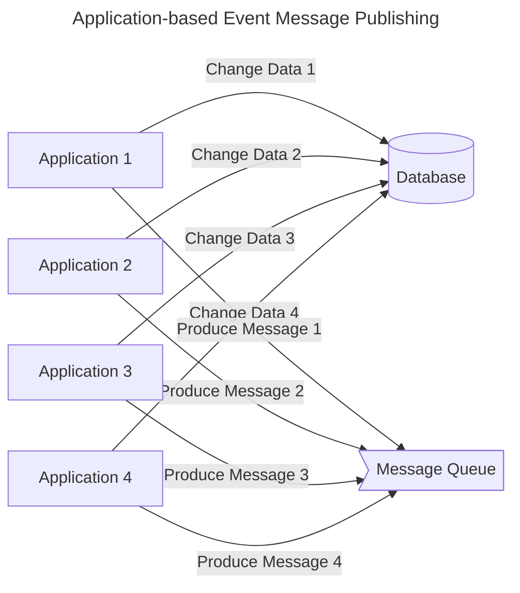
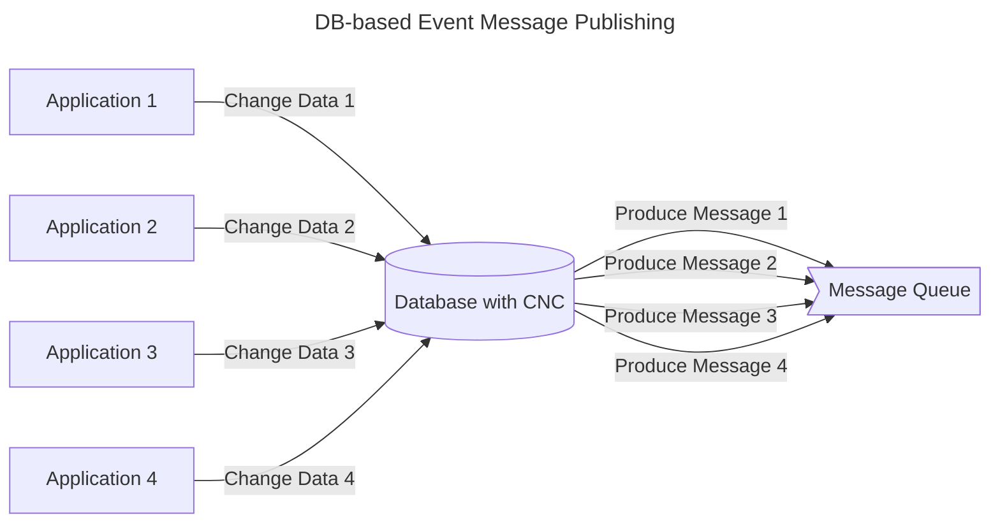

## Event 기반 Architecture에서 CDC를 사용하는 이유

- data 변경에 대한 event message는 **application 기반으로 발행**할 수도 있고, **DB 기반으로 발행**할 수도 있습니다.
    - CDC는 DB 기반으로 message를 발행하는 쪽에 속합니다.

- CDC는 DB 기반으로 message를 발행하기 때문에, **data 변경에 의해 발행되는 모든 event의 관리 지점을 data로 모을 수 있다는 장점**이 있습니다.
    - CUD(Create, Update, Delete)에 의해 data가 수정되면 자동으로 event가 발행되기 때문입니다.

- **application 기반 message 발행 방식은 병렬 형태로 data를 처리**합니다.
    - event가 발생했을 때, application이 DB에 변경 사항도 반영하고 message queue에 message도 등록합니다.
        - DB CUD와 message를 등록하는 두 가지 작업을 application이 주체가 되어 모두 처리(dual write)합니다.
    - 해당 data를 변경하는 곳은 application상에 무수히 많이 존재하므로, event message를 발행하는 logic도 data를 변경하는 모든 곳에 추가해줘야 합니다.
        - DB에 CUD를 하는 logic이 API, batch, worker 등 여러가지가 있다면, 모든 logic에 event message 발행 과정을 추가해야 합니다.
        - 개발자가 어느 한 곳이라도 놓치면, message 발행이 누락됩니다.

- **DB 기반 message 발행 방식은 직렬 형태로 data를 처리**합니다.
    - event가 발생했을 때, **application은 DB에 변경 사항을 반영**하고, **message queue에 message 등록은 DB 변경 감지 도구(CDC solution)가** 합니다.
        - CDC solution이 DB 수준에서 data 변경을 감지하고, 변경된 data에 대한 message를 생성하여 queue에 등록합니다.
    - DB 수준에서는 **특정 data가 변경되는 지점을 하나로 관리**할 수 있으므로, **event message를 발행하는 곳도 단 한 곳**이 됩니다.

- event 기반 architecture에서 장애 조치, CS 건 처리 등의 이유로 **DB의 data를 수기로 변경(DDL 직접 실행)해야하는 경우**에도, CDC를 통한 event 발행 기능은 유용하게 사용됩니다.
    - 어떤 data를 수기로 수정하는 경우, 해당 data에 관련된 event를 application logic을 전부 점검하여, logic에 포함된 event를 모두 직접 발행해줘야 합니다.
        - 일반적으로 event는 application을 통해 발행되므로, 틀어지거나 수정된 data를 보정한 event 내역 또한 application logic에서 찾아, event trigger API를 호출하여 event를 직접 발행해야 합니다.
    - 그러나 만약 **data가 수정될 때 자동으로 관련 event가 발행**된다면, application logic을 모두 확인하지 않아도 누락 없이 처리가 가능하게 됩니다.
        - CDC가 data 변경을 감지하고, event를 자동으로 발행해주기 때문입니다.

---

## Event 기반 Architecture에 CDC를 적용하는 경우 생기는 단점

- DB 기반으로 event를 발행하면 관리해야 할 지점(management point)이 줄어든다는 장점이 있지만, application 기반으로 message가 발행하지 않기 때문에 생기는 단점도 있습니다.

1. **단일 table에 대한 변경 사항만 감지(capture) 가능**합니다.
    - table에 있는 row(또는 collection에 있는 document) level에서의 변경 사항을 capture하기 때문에, 여러 table(또는 collection)에 대한 변경 사항을 하나의 message(Kafka topic 등)에 담을 수 없습니다.
    - DB에 담기지 않는 data 변경 사항은 Kafka message에 포함할 수 없습니다.

2. 변경된 data를 담을 **message scheme의 customizing이 제한적**입니다.
    - message를 application level에서 직접 produce하는 것이 아니기 때문입니다.
    - 예를 들어, operation type 구분을 'CREATE', 'UPDATE', 'DELETE' 3개로만 할 수 있습니다.
    
3. **CDC 구축 및 관리에 비용**이 어느 정도 들 수 있습니다.
    - 경우에 따라 DB에 부하가 가중될 수도 있습니다.
      
- 따라서 event 기반 architecture를 사용한다고 해서 CDC를 맹목적으로 적용해서는 안 되며, 득과 실을 잘 따져보아야 합니다.

---

## Reference

- <https://tillog.netlify.app/posts/cdc>
- <https://sihyung92.oopy.io/architecture/cdc>
