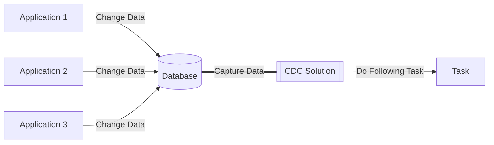

## CDC (Change Data Capture) : DB의 변경 감지하기

- CDC(Change Data Capture)는 **DB에 있는 data에 대한 변경을 감지해 필요한 후속 처리(data 전송/공유 등)를 자동화하는 기법**을 통칭합니다.
    - database 안에서 일어나는 모든 변화를 감지하고, 이를 각각의 event로 기록하며 event stream으로 전달합니다.

### CDC의 활용 사례

1. **Microservice 통합** : CDC를 통해 data 변경 사항을 legacy system에서 microservice 기반 application으로 원활하게 전송할 수 있습니다.
    - microservice를 기존의 monolithic application과 동기화하여, migration 시 발생할 수 있는 data 불일치 문제를 해결합니다.

2. **Data 복제** : database, data lake, data warehouse 등의 저장소에 data를 복제하여, 각 resource가 최신 version data를 보유하도록 할 수 있습니다.
    - data가 분산되어 있거나 data silo 문제가 있는 경우에도, 여러 부서가 동일한 최신 data에 접근하도록 지원할 수 있습니다.
        - data silo : data가 격리되어 특정 조직/부서/단위에서만 정보 접근 및 공유가 가능하여 다른 조직/부서/단위에서는 data가 격리되는 현상.
        - data silo는 부서 간의 단절을 유발하는 등, 기업에 부정적인 영향을 끼칩니다.

3. **분석 Dashboard** : CDC는 BI(Business Intelligence)와 같은 목적으로 data 변경 사항을 분석 dashboard에 제공하여, 의사결정을 도울 수 있습니다.

4. **감사 및 Compliance** : 감사 또는 보관 요건에 따라 특정 data의 변경 이력을 저장할 수 있습니다.
    - 엄격한 data compliance 요건을 준수하고 규정 미준수에 대한 엄격한 처벌을 피하려면 data 변경 이력을 저장하는 것이 중요합니다.

5. **Cache 무효화** : cache에서 오래된 항목을 교체하거나 제거하여 최신 version을 표시할 수 있습니다.

6. **CQRS Model Update** : CQRS(Command Query Responsibility Separation) 읽기 model을 기본 model과 동기화할 수 있습니다.

7. **전체 Text 검색** : 전체 text 검색 index를 database와 자동으로 동기화할 수 있습니다.
    - 이 경우, 일반적으로 Elasticsearch에 indexing하기 위해 CDC를 사용합니다.

---

## CDC가 "Change Data Detection"이 아닌 "Change Data Capture"인 이유

- CDC에서는 단순한 변경 감지(detection)를 넘어서, 변경 data의 완전한 포착(capture)과 보존이 핵심이기 때문에 'capture'라는 용어를 사용합니다.

- **Capture(포착)의 의미** : data 변경 사항을 단순히 감지하는 것을 넘어서, 해당 변경 내용을 "붙잡아서 보관"합니다.
    - 변경된 data의 전체 상태를 저장하고 유지합니다.
    - 변경 이전 값과 이후 값을 모두 포착하여 보존합니다.
    - 변경이 발생한 정확한 시점과 순서를 포착합니다.

- **Detection(감지)의 의미** : 단순히 "변경이 있었다"는 사실만을 인지하는 개념입니다.
    - 반면 Capture는 변경 내용 전체를 포착하여 보관하고 추적합니다.

- Table의 record가 변경되었을 때, **Detection과 Capture는 다른 의미를 가지고 동작**합니다.
    - Detection : "이 record가 변경되었다"는 사실만 감지.
    - Capture : 변경 전 값, 변경 후 값, 변경 시점, transaction ID 등 모든 정보를 포착하여 저장.

- 따라서 **실제 CDC 동작에서는 Detection이 아닌 Capture가 필요**합니다.
    - database log를 읽어서 변경 사항을 **포착**합니다.
    - 포착한 변경 data를 다른 system으로 전달할 수 있도록 **보관**합니다.
    - **변경 이력**을 시간 순서대로 추적할 수 있게 합니다.
    - 필요한 경우 특정 시점으로 **rollback**하거나 변경 이력을 **restore**(복원)할 수 있습니다.

| 비교 항목 | Capture (포착) | Detection (감지) |
| --- | --- | --- |
| **기본 의미** | 대상을 붙잡아서 보관, 발생한 일을 모두 저장, 완전한 상태를 유지 | 발생/존재 여부만 확인, "있다/없다" check, 상태 변화 인지 |
| **처리 방식** | 전체 data를 포착하여 저장, 이전/이후 상태를 모두 보관, 시점과 내용을 완전히 보존 | 변화 발생 여부만 감지, 현재 상태만 확인, 발생 시점만 기록 |
| **Data 범위** | 변경된 모든 정보, 변경 전후 상태, 시점과 순서 정보, 관련 metadata | 변경 발생 여부, 현재 상태, 발생 시점 |
| **활용성** | data 복원 가능, 다른 곳으로 전달 가능, 이력 추적 가능, 상세 분석 가능 | 상태 확인만 가능, 단순 알림만 가능, 이력 추적 불가, 상세 분석 불가 |

---

## 여러 가지 CDC 작동 방식

- CDC는 DB data의 변경 사항을 감지하는 기법을 통칭하는 용어일 뿐이며, 이를 **실제로 구현할 때는 여러가지 방식을 사용**할 수 있습니다.
    - 보통은 직접 구현하여 사용하지는 않고, **Debezium, Apache NiFi, Oracle GoldenGate, Maxwell 등**의 CDC Solution 제품을 사용합니다.

- 상황에 따라 여러 방식을 조합하여 사용하는 hybrid 방식도 존재합니다.
    - log 기반 방식과 trigger 기반 방식을 함께 사용하여 장점을 취하는 경우도 있습니다.
    - system 요구 사항과 성능 특성에 따라 적절한 방식을 선택해야 합니다.

### Log 기반 CDC (Log-based Change Data Capture)

- log 기반 CDC는 **database의 transaction log를 읽어서 data 변경 사항을 capture하는 방식**을 사용합니다.
    - 가장 널리 사용되는 방식입니다.
    - database는 모든 transaction 변경 사항(삽입, 수정, 삭제)을 transaction log에 순차적으로 기록합니다.
    - log 기반 CDC는 이 transaction log를 직접 읽어 변경 data를 capture합니다.
    - 이는 database table을 직접 조회하지 않고도 변경 사항을 파악할 수 있게 해줍니다.

- log 기반 CDC는 database의 transaction log를 직접 읽어 실시간으로 변경 사항을 추적하므로, database 성능 저하 없이 정확한 data 동기화가 가능합니다.
    1. **database 성능에 미치는 영향을 최소화**할 수 있습니다.
        - transaction log를 읽는 방식이므로 database table에 직접적인 query를 실행하지 않습니다.
    2. **실시간에 가까운 data 동기화가 가능**합니다.
        - 변경 사항이 발생하는 즉시 transaction log에 기록되므로, 이를 실시간으로 capture하여 처리할 수 있습니다.
    3. **data 정확성이 보장**됩니다.
        - transaction log는 모든 변경 사항을 정확한 순서로 기록하므로, data의 일관성과 무결성을 유지할 수 있습니다.

- 모든 환경에서 log 기반 CDC를 사용할 수 있는 것은 아닙니다.
    - 특히 cloud 기반 database나 hosting된 database solution에서는 transaction log에 대한 접근이 제한될 수 있으며, 이런 경우에는 다른 CDC 방식을 고려해야 합니다.

- log 기반 CDC는 **대규모 transaction이 발생하는 mission critical system에서 유용**합니다.
    - 예를 들어, 실시간 data 복제, data warehouse 동기화, microservice 간 data 동기화 등에 활용될 수 있습니다.
    - 또는 금융 system(은행, 증권 등), 대규모 전자 상거래 platform, 실시간 data 분석 system, 대규모 transaction이 발생하는 enterprise system 등의 **고성능이 요구되는 중요 system**에서 사용됩니다.

### Trigger 기반 CDC (Trigger-based Change Data Capture)

- trigger 기반 CDC는 **database의 변경 사항을 실시간으로 감지하고 기록(logging)하는 방식**입니다.
    - database에 변경이 발생할 때마다 **trigger가 자동으로 실행되어 해당 변경 내용을 별도의 table에 저장**합니다.

- trigger 기반 CDC는 실시간 data 추적이 필요하지만 system 성능에 큰 제약이 없는 환경에서 효과적입니다.
    - **실시간 Data 동기화**가 필요한 경우 : database의 변경 사항을 즉시 다른 system이나 application에 반영해야 하는 상황에서 적합합니다.
        - 예를 들어, 실시간 data warehouse 동기화나 microservice 간 data 일관성 유지에 활용됩니다.
    - System이 **충분한 처리 용량을 보유**한 경우 : trigger로 인한 추가적인 processing overhead를 처리할 수 있는 충분한 CPU, Memory, storage 용량이 확보된 환경을 의미합니다.
    - Data의 **완전한 감사 추적**이 필요한 경우 : 규제 준수나 보안 요구 사항으로 인해 모든 data 변경 사항의 이력을 상세하게 추적해야 하는 상황에 적합합니다.
        - 금융 거래나 중요 business data의 변경 이력 관리에 특히 유용합니다.

- trigger 기반 CDC는 고성능 transaction과 대용량 data 처리가 필요하거나 system resource가 제한적인 환경에서는 적합하지 않습니다.
    - 고성능의 Transaction 처리가 필요한 경우 : 초당 수천 건 이상의 transaction이 발생하는 환경에서는 **trigger로 인한 지연**이 system 전반의 응답 시간에 부정적인 영향을 미칩니다.
        - 예를 들어, 실시간 결제 system이나 고빈도 거래 system에서는 적합하지 않습니다.
    - System Resource가 제한적인 경우 : system의 CPU, Memory, Disk I/O 등의 resource의 사용률이 이미 높은 상황에서는 **trigger로 인한 추가적인 resource 소비**가 system 안정성을 떨어뜨립니다.
        - 특히 cloud 환경에서 비용 효율성을 고려해야 하는 경우 부담이 될 수 있습니다.
    - 대용량 Data 처리가 필요한 환경 : 대규모 data migration이나 batch 처리 작업이 빈번한 환경에서는 trigger가 **병목 현상**(bottleneck)을 일으킬 수 있습니다.
        - 수백만 건 이상의 record를 처리해야 하는 경우, 각 변경마다 실행되는 trigger는 전체 처리 시간을 크게 증가시킵니다.
    - 기존 Application에 Trigger 추가가 제한되는 경우 : legacy system이나 보안 정책상 database 수정이 제한된 환경, 또는 database 관리자 권한이 제한된 상황에서는 trigger 구현 자체가 불가능합니다.
        - 이런 경우 log 기반 CDC와 같은 대안을 고려해야 합니다.

#### Trigger 기반 CDC의 두 가지 구현 방법

1. **전체 변경 기록 방식** : 모든 변경 사항의 완전한 기록을 유지하기 위해, 변경된 data의 이전 상태와 새로운 상태를 모두 저장합니다.
    - 변경의 전체 기록에 access할 수 있지만, 원본 transaction에 대한 data 양이 두 배로 증가합니다.
    - data 조회가 간단하고 직관적입니다.
        - 모든 변경 data가 별도의 table에 저장되므로 검색이 간단합니다.

2. **최소 Logging 방식** : 변경된 행의 식별 key와 수행된 작업 유형(Create, Update, Delete)만을 기록합니다.
    - 저장 공간 사용이 효율적이고, system 부하가 상대적으로 낮습니다.
        - 원본 transaction에 미치는 영향을 최소화할 수 있습니다.
   - data를 추출할 때는 변경 table과 기본 table 간의 join이 필요하므로 추가 resource를 사용합니다.
        - key와 작업 유형만으로는 전체 변경 기록을 재구성하는 데 충분하지 않기 때문에, 전체 변경 내용을 확인하기 위해서는 원본 table과의 join이 필요합니다.

### Timestamp 기반 CDC (Timestamp-based Change Data Capture)

- timestamp 기반 CDC는 **database의 각 record에 마지막 수정 시간을 기록하여 변경 사항을 추적하는 방식**입니다.
    - database의 각 table에는 `LAST_MODIFIED`와 같은 timestamp 열이 포함되어 있으며, record가 생성되거나 수정될 때마다 이 값이 자동으로 update됩니다.
    - CDC process는 이전 추출 시점 이후의 timestamp를 가진 record들을 주기적으로 조회하여 변경 사항을 식별합니다.

- timestamp 기반 CDC는 **구현이 단순**하고 **기존 database 구조에 최소한의 변경만으로 적용**할 수 있습니다.
    - 소규모 system이나 변경 빈도가 낮은 환경에서 효과적입니다.

- timestamp 기반 CDC에는 중요한 **한계점**들이 존재하기 때문에, 신중히 사용해야 합니다.
    1. 삭제된 data를 감지할 수 없습니다.
        - record가 삭제되면 해당 timestamp도 함께 사라지기 때문에, 삭제 작업을 추적할 방법이 없습니다.
    2. transaction의 정확한 순서를 보장할 수 없습니다.
        - 동시에 여러 변경이 발생하는 경우, timestamp만으로는 정확한 transaction 순서를 파악하기 어렵습니다.
    3. system 시간 동기화 문제가 발생할 수 있습니다.
        - 여러 server나 node가 관련된 경우, 시간 차이로 인해 data 불일치가 발생할 수 있습니다.

- timestamp 기반 CDC는 소규모 system의 간단한 data 변경 추적에 적합합니다.
    - **단순한 감사 추적**이 필요한 경우 : 기본적인 data 변경 이력 추적이 필요한 system에서 효과적입니다.
        - 사용자 profile 변경 이력이나 일반적인 문서 수정 이력을 추적하는 경우에 적합합니다.
    - **삭제 작업 추적이 중요하지 않은 환경** : 주로 data 추가와 수정이 중심이 되는 system에 적합합니다.
        - log data 수집이나 sensor data 기록과 같이 삭제가 거의 발생하지 않는 system에서 효과적입니다.
    - 실시간성보다는 **주기적인 Data 동기화**가 필요한 경우 : 일별 또는 주별 data 동기화가 충분한 환경에서 유용합니다.
        - 분석용 data warehouse update나 정기적인 리포트 생성 system에 적합합니다.
    - System Resource가 제한적이어서 **경량화된 Solution**이 필요한 경우 : embeded system이나 소규모 application과 같이 resource가 제한된 환경에서 효율적으로 작동합니다.
        - 단순한 timestamp column만으로 구현이 가능하기 때문입니다.

- timestamp 기반 CDC는 정확한 순서와 실시간성이 중요하거나 data 삭제 추적이 필요한 대규모 system에는 부적합합니다.
    - 정확한 Transaction 순서가 중요한 경우 : 금융 거래나 재고 관리 system과 같이 정확한 순서가 중요한 환경에서는 **timestamp만으로는 정확한 순서를 보장할 수 없어** 부적합합니다.
        - millisecond 단위의 동시 transaction이 발생할 경우 순서가 뒤바뀔 수 있습니다.
    - 삭제된 Data의 추적이 필수적인 경우 : 규제 준수나 법적 요구 사항으로 **data 삭제 이력을 반드시 추적해야 하는 system에서는 사용할 수 없습니다.**
        - 의료 기록 system이나 금융 거래 system에서는 부적합합니다.
    - 실시간 Data 동기화가 필요한 경우 : 실시간 알림 system이나 즉각적인 data 복제가 필요한 환경에서는 timestamp 기반 방식이 가진 **지연 시간**이 허용되지 않습니다.
        - 실시간 monitoring system이나 즉각적인 장애 감지가 필요한 system에는 적합하지 않습니다.
    - 고가용성이 요구되는 Mission Critical System : 24/7 운영되는 핵심 business system이나 대규모 transaction 처리가 필요한 환경에서는 timestamp 기반 CDC의 한계로 인해 **신뢰성 있는 data 동기화를 보장할 수 없습니다.**
        - 대규모 전자 상거래 platform이나 global 배송 추적 system에는 부적합합니다.

### 차이 기반 CDC (Difference-based Change Data Capture)

- 차이 기반 CDC는 **database의 두 시점 간 snapshot을 비교하여 변경 사항을 식별하는 방식**입니다.
    - **가장 단순한 형태의 CDC**로, 두 snapshot 간의 차이를 전체적으로 비교하여 어떤 data가 추가, 수정, 또는 삭제되었는지 파악합니다.

- 차이 기반 CDC는 **구현이 매우 직관적**입니다.
    - source data의 현재 상태와 이전 상태를 비교하여 변경 사항을 감지하므로, 특별한 database 기능이나 복잡한 설정이 필요하지 않습니다.
    - 그러나 이러한 단순성 때문에 여러 제약 사항이 있습니다.

- 차이 기반 CDC는 **data volume이 작고 변경 빈도가 낮은 환경에서만 실용적**입니다.
    - 모든 data를 scan해야 하므로 **상당한 system resource를 소비**합니다.
        - 각 비교 시점마다 전체 dataset을 읽어야 하기 때문에, 대규모 database에서는 성능 저하가 발생합니다.
    - 또한 snapshot 간의 간격 동안 발생한 중간 변경 사항을 포착할 수 없어, 세밀한 변경 이력 추적이 어렵습니다.
    - 따라서 소규모 구성 database나 참조 data의 변경 사항을 추적하는 경우에 적합합니다.
    - 그러나 transaction의 정확성이 중요하거나 실시간 변경 감지가 필요한 system에서는 사용해선 안 됩니다.
    

---

## CDC Solution 비교 : Debezium, Apache NiFi, Oracle GoldenGate, Maxwell

- **Oracle GoldenGate**는 **enterprise 수준의 CDC solution**으로, 대규모 기업 환경에서 가장 큰 강점을 보입니다.
    - 특히 **Oracle database를 주력**으로 사용하는 금융권이나 대기업에 적합합니다.
    - **실시간 data 복제**가 중요하고, **고가용성이 필수적인 mission critical system**에서 탁월한 성능을 발휘합니다.
    - 다만 **높은 license 비용**과 **복잡한 구축 과정**이 필요하므로, 충분한 예산과 전문 인력이 확보된 조직에서 채택하는 것이 바람직합니다.

- **Debezium**은 **open-source 진영의 표준**으로, 현대적인 cloud native 환경에 가장 적합합니다.
    - **Kafka 생태계와의 뛰어난 통합성**을 바탕으로, **microservice architecture**를 채택한 조직이나 **실시간 data pipeline**을 구축하려는 기업에 이상적입니다.
        - Kafka를 기반으로 하여 event 기반 architecture를 자연스럽게 지원하며, 각 microservice가 필요한 data 변경 사항을 실시간으로 구독할 수 있습니다.
    - 특히 다양한 database를 사용하는 **hybrid 환경**에서 강점을 보이며, **container 기반 infra를 운영하는 조직에 추천**됩니다.
        - Kafka 자체가 Kubernetes 환경에 최적화되어 있기 때문입니다.
            - Kafka의 분산 messaging system은 Kubernetes의 동적 확장성과 자연스럽게 조화를 이룹니다.
            - 예를 들어, traffic이 증가하면 Kubernetes는 자동으로 Debezium connector의 복제본을 추가하게 되고, Kafka는 이러한 변화를 자연스럽게 수용할 수 있습니다.
    - 무료로 사용할 수 있지만, **Kafka infra 구축과 운영에 대한 전문성이 필요**합니다.

- **Apache NiFi**는 CDC만을 위한 도구가 아닌, **종합적인 data 통합 platform**입니다.
    - 따라서 **단순한 CDC 구현보다는 복잡한 data 흐름을 관리해야 하는 환경에 적합**합니다.
    - 다양한 data source로부터 정보를 수집하고 변환해야 하는 **data lake** 구축 project나, ETL process가 복잡한 기업에 적합합니다.
    - **시각적 관리 도구**를 제공하여 data pipeline을 직관적으로 구성할 수 있다는 장점이 있지만, **구축과 운영의 복잡도**가 높습니다.

- **Maxwell**은 **가장 단순한 CDC solution**으로, **MySQL 환경에 특화**되어 있습니다.
    - 스타트업이나 소규모 project에서 빠르게 CDC를 구현해야 할 때 적합합니다.
    - 특히 MySQL을 주 database로 사용하는 작은 규모의 application이나 prototype 개발 시 유용합니다.
    - 구축이 매우 간단하고 빠르지만, **확장성과 기능이 제한적**이므로 대규모 system에는 적합하지 않습니다.

|  | Debezium | Apache NiFi | Oracle GoldenGate | Maxwell |
| --- | --- | --- | --- | --- |
| **주요 특징** | Kafka 생태계와 강력한 통합, 다양한 DB 지원, 대규모 분산 환경에 적합 | 광범위한 Data Source 지원, 시각적 관리 도구, 복잡한 Data Pipeline 구성 가능 | Enterprise 수준의 안정성과 성능, Oracle 환경에서 특히 강력 | MySQL 특화, 간단한 구조, 소규모 Project에 적합 |
| **CDC 방식** | Log 기반 CDC (Binary log 직접 읽음), 실시간 변경 감지 | Polling 방식과 Agent 기반 CDC, 다양한 구현 방식 선택 가능 | Log 기반, Trigger 기반, XStream 등 다양한 CDC 옵션 제공 | 단순 Log 기반 CDC (MySQL Binary Log만 지원) |
| **성능** | 초당 수만 건 이상 처리, 수평적 확장 가능, Kafka 기반 분산 처리 | 유연한 처리량 조절, Back pressure 지원, Memory 기반 처리 | 대용량 Transaction 처리, 초고속 Data 복제, Global 규모 확장 | 소규모 Data 처리, 제한된 처리량, 수직적 확장만 가능 |
| **DB 지원** | MySQL, PostgreSQL, Oracle, SQL Server, MongoDB 등 다양한 DB 지원 | 대부분의 RDBMS, NoSQL, File System 등 200여 개 Data Source 연결 | Oracle, SQL Server, DB2, MySQL, PostgreSQL, Cloud DB 등 | MySQL, MariaDB만 지원 |
| **확장성** | 높음 (Kafka 기반 분산 Architecture, Container 배포 용이) | 높음 (Cluster 기반, 동적 Workload 조정) | 매우 높음 (Enterprise 수준, Global 규모 확장) | 제한적 (단일 Process 구조, 수직적 확장만 가능) |
| **가용성** | 높음 (자동 장애 감지/복구, 무중단 운영) | 매우 높음 (Zero master cluster, 자동 장애 조치) | 매우 높음 (Enterprise 수준 고가용성, 자동화된 장애 관리) | 제한적 (단일 장애점 존재, 수동 개입 필요) |
| **License** | Apache License 2.0 (무료 상업적 이용 가능) | Apache License 2.0 (무료 상업적 이용 가능) | 상용 License (Oracle 계약 조건) | MIT License (무료 상업적 이용 가능) |
| **구축 복잡도** | 중간 (Kafka infra 필수, 1-2주 소요) | 높음 (Cluster 환경 구성, 2-3주 소요) | 매우 높음 (Oracle 환경에 최적화, 3-4주 소요) | 낮음 (기본 MySQL 설정만 필요, 1-3일 소요) |
| **Monitoring** | Kafka Connect Monitoring, JMX metrics, Web 기반 관리 | 실시간 Web UI Dashbaord, 세부 metrics 시각화, 중앙 집중식 관리 | 전용 관리 Console, 상세 성능 metrics, 자동화된 운영 | 기본 logging 기능, 제한된 상태 정보, 수동 관리 |
| **Community** | 대규모 활성 Community, Red Hat 공식 지원 | 대규모 활성 Community, Apache 재단 공식 지원 | 전문가 중심 Community, Oracle 공식 기술 지원 | 소규모 Community, 제한적 문서화 |

- 조직의 규모, 기술 stack, 예산, 운영 역량을 종합적으로 고려했을 때, **대기업이나 금융권은 Oracle GoldenGate**를, **현대적인 cloud 환경의 중대형 기업은 Debezium**을, **복잡한 data 통합이 필요한 조직은 Apache NiFi**를, 그리고 **소규모 MySQL project는 Maxwell**을 선택하는 것이 바람직합니다.

---

## Reference

- <https://ko.wikipedia.org/wiki/%EB%B3%80%EA%B2%BD_%EB%8D%B0%EC%9D%B4%ED%84%B0_%EC%BA%A1%EC%B2%98>
- <https://sanggi-jayg.tistory.com/entry/CDC-Change-Data-Capture>
