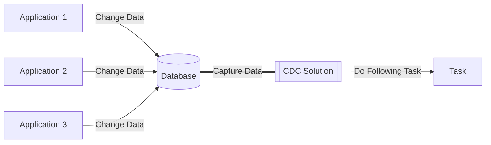

## CDC (Change Data Capture) : DB의 변경 감지하기

- CDC(Change Data Capture)는 **DB에 있는 data에 대한 변경을 감지해 필요한 후속 처리(data 전송/공유 등)를 자동화하는 기법**을 통칭합니다.
    - database 안에서 일어나는 모든 변화를 감지하고, 이를 각각의 event로 기록하며 event stream으로 전달합니다.

### CDC의 활용 사례

1. **Microservice 통합** : CDC를 통해 data 변경 사항을 legacy system에서 microservice 기반 application으로 원활하게 전송할 수 있습니다.
    - microservice를 기존의 monolithic application과 동기화하여, migration 시 발생할 수 있는 data 불일치 문제를 해결합니다.

2. **Data 복제** : database, data lake, data warehouse 등의 저장소에 data를 복제하여, 각 resource가 최신 version data를 보유하도록 할 수 있습니다.
    - data가 분산되어 있거나 data silo 문제가 있는 경우에도, 여러 부서가 동일한 최신 data에 접근하도록 지원할 수 있습니다.
        - data silo : data가 격리되어 특정 조직/부서/단위에서만 정보 접근 및 공유가 가능하여 다른 조직/부서/단위에서는 data가 격리되는 현상.
        - data silo는 부서 간의 단절을 유발하는 등, 기업에 부정적인 영향을 끼칩니다.

3. **분석 Dashboard** : CDC는 BI(Business Intelligence)와 같은 목적으로 data 변경 사항을 분석 dashboard에 제공하여, 의사결정을 도울 수 있습니다.

4. **감사 및 Compliance** : 감사 또는 보관 요건에 따라 특정 data의 변경 이력을 저장할 수 있습니다.
    - 엄격한 data compliance 요건을 준수하고 규정 미준수에 대한 엄격한 처벌을 피하려면 data 변경 이력을 저장하는 것이 중요합니다.

5. **Cache 무효화** : cache에서 오래된 항목을 교체하거나 제거하여 최신 version을 표시할 수 있습니다.

6. **CQRS Model Update** : CQRS(Command Query Responsibility Separation) 읽기 model을 기본 model과 동기화할 수 있습니다.

7. **전체 Text 검색** : 전체 text 검색 index를 database와 자동으로 동기화할 수 있습니다.
    - 이 경우, 일반적으로 Elasticsearch에 indexing하기 위해 CDC를 사용합니다.

