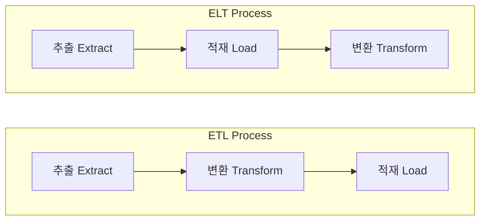

## ETL과 ELT

- **Extract** (추출) : 원본 database 또는 data source에서 data를 가져오는 과정입니다.
- **Transform** (변환) : data의 구조를 변경하는 과정입니다.
    - 용도에 맞는 filtering, reshaping, 정제 등의 단계를 통해 필요한 형태로 변환합니다.
- **Load** (적재) : data를 storage에 저장하는 과정입니다.

|  | ETL | ELT |
| 