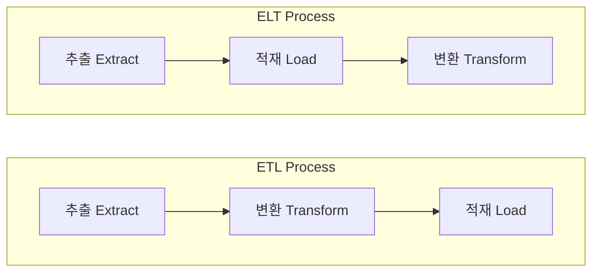

## ETL과 ELT

- **Extract** (추출) : 원본 database 또는 data source에서 data를 가져오는 과정입니다.
- **Transform** (변환) : data의 구조를 변경하는 과정입니다.
    - 용도에 맞는 filtering, reshaping, 정제 등의 단계를 통해 필요한 형태로 변환합니다.
- **Load** (적재) : data를 storage에 저장하는 과정입니다.

|  | ETL | ELT |
| --- | --- | --- |
| **Process** | 추출 -> 변환 -> 적재 | 추출 -> 적재 -> 변환 |
| **Process 설명** | data 변환을 적재 전에 수행하여 정제된 data만 저장 | 모든 data를 우선 저장한 후 필요에 따라 변환 작업을 수행 |
| **비교 장점** | 일단 data가 load되면 정보 분석을 ELT보다 더 빠르게 할 수 있음 | 변환을 기다릴 필요가 없고 data가 대상 data system에 한 번만 load되기 때문에 data를 빠르게 처리 할 수 있음 |
| **비교 단점** | 적재 후 data 변환에 다소 시간이 걸리며, ELT보다 느림 | 정보 분석 자체는 ETL보다 느림 |
| **Data 지원** | 관계형 SQL 기반 구조 | 정형, 비정형 등 모든 data 유형을 수집 |
| **Data 크기** | 정교한 소량의 data에 사용 | 대용량 data에 사용 |
| **Data 자료 구조** | 전처리된 data, data warehouse 지원 | 원천 data(raw data), data lake 지원 |
| **Data 활용 목적** | 명확함 (현재 사용 중인 data에 초점을 맞춤) | 미결정 상태 (미래 활용 가능성이 있는 모든 data를 보관) |
| **Data 접근성** | data를 변경하기 쉽지 않고 비용도 많이 소요됨 | data 접근성이 높고 신속한 update 가능 |
| **Data 가용성** | data warehouse 및 ETL process를 생성할 때 필요하다고 결정한 data만 변환하고 load함 | 모든 data를 즉시 load할 수 있으며, 사용자는 변환 및 분석할 data를 나중에 결정할 수 있음 |
| **유지 보수** | process의 지속적인 유지 관리가 필요함 | cloud 기반이며 자동화된 solution을 통합하므로 유지 관리가 거의 필요가 없음 |
| **민감 정보 규정** | 민감한 정보를 data warehouse에 넣기 전에 수정하고 제거하기 때문에, GDPR, HIPAA 및 CCPA 규정 준수 표준을 더 쉽게 충족할 수 있으며, hacking 및 부주의한 노출로부터 data를 보호함 | 민감한 정보를 수정/제거하기 전에 data를 upload하므로, GDPR, HIPAA 및 CCPA 표준을 위반할 수 있어 주의가 필요함 |
| **전문가 채용** | 21년 이상 사용된 잘 개발된 process이기 때문에, ETL 전문가를 쉽게 사용할 수 있음 | 현대에 등장한 새로운 기술로, ETL pipeline에 비해 전문가를 찾기가 어려움 |
| **주 사용자** | business 현업 전문가 | data scientist |

- ETL에서 발전된 형태인 **ELT는 digital 시대의 새로운 data 처리 요구 사항에 대응하기 위해 등장**했습니다.
    - data 처리 환경이 진화하면서 기존 방식을 개선한 ELT가 도입되었습니다.
    1. big data 시대에 들어서면서, **대용량 data 처리에 대한 필요성**이 생겼습니다.
        - ETL은 대규모 data에 대해서 처리 시간이 오래 걸린다는 한계점이 있습니다.
        - 다양한 형태의 data 수용이 필요해졌습니다.
    2. **cloud 환경이 발전**하면서, 비용 효율성이 높아졌습니다.
        - 저렴한 storage 비용으로 대규모 data 저장이 가능해졌습니다.
        - 자동화된 관리로 유지 보수 비용이 절감되었습니다.

- **ETL는 소규모의 정형화된 data 처리가 필요한 경우에 적합**합니다.
    - data 품질과 보안이 최우선인 경우에 사용합니다.
    
- **ELT는 대규모의 다양한 형태 data 처리가 필요한 경우에 적합**합니다.
    - 빠른 data 수집과 유연한 분석이 중요한 경우에 사용합니다.

- 미래에도 ETL과 ELT 두 방식은 공존할 것이며, 각각의 장단점을 고려한 선택적 활용이 중요합니다.
    - business 목표와 data 특성에 따른 최적화된 선택이 필요합니다.

### ETL (Extract, Transform, Load)

- ETL은 **data를 추출(Extract), 변환(Transform), 적재(Load)하는 순서로 처리하는 data 통합 process**입니다.

- **관계형 SQL 기반의 data 구조**만을 지원하며, **20년 이상 사용된 전통적인 data 처리 방식**입니다.

#### ETL의 장점

- data를 적재하기 전에 변환 작업을 수행하여, 높은 data 품질을 보장합니다.
    - 이는 보다 효율적이고 안정적인 data 분석을 가능하게 합니다.

- 원천 data를 관계형 SQL 기반 data로 변환하는 과정이 있기 때문에, GDPR, HIPAA 및 CCPA와 같은 data 개인 정보 보호 및 보호 규정을 준수하기 더 용이합니다.

- 사전에 정의한 변환 규칙으로 정교한 data 변환을 수행할 수 있습니다.

- ETL은 20년 이상 사용된 process이기 때문에, 더 안정적이고 쉽게 구축할 수 있습니다. 
    - 참고 자료와 전문가의 수가 더 많습니다.

#### ETL의 단점

- 정교한 data 변환이 가능하나, 처리 시간이 상대적으로 길어질 수 있습니다.

- 초기 설정 비용이 높고 지속적인 유지 보수가 필요합니다.
    - project에 필요한 process와 변환을 사전에 정의해야 하므로, ETL process를 설정하는 초기 비용이 더 높을 수 있습니다.
    - 개발 이후에 다른 data 유형이 요구되는 경우, 입력 source 유형을 ETL process에 맞추어 다시 변경해야 합니다.
        - 이는 지속적인 유지 보수 비용을 발생시킵니다.

### ELT (Extract, Load, Transform)

- ELT는 **data를 추출(Extract), 적재(Load), 변환(Transform) 순서로 처리하는 현대적인 data 통합 방식**입니다.
    - ETL의 Transform와 Load의 위치가 바뀐 개념입니다.

- **cloud 기반으로 운영**되며, data load한 후 변환하기 때문에 **별도의 staging server가 필요하지 않습니다.**

#### ELT의 장점

- cloud 기반으로 schema 변경과 같은 작업이 자동화되어 있으므로, 유지 관리가 최소화됩니다.

- 정형, 비정형, 반정형(semi-structured) 등, 모든 유형의 data를 수용하고 활용할 수 있습니다.

- cloud 환경에서 storage의 빠른 확장이 가능하여 대규모 data 처리에 적합합니다.

- data를 적재한 후에 변환하므로, 초기 data load 시간이 짧습니다.

#### ELT의 단점

- storage에 대량의 원시 data를 그대로 load하기 때문에, 개인 정보 보호 규정 준수에 문제가 될 수 있습니다.

- 모든 data를 저장하기 때문에, 다양한 사용자와 application이 access할 수 있도록 하면 보안 위험이 발생합니다.
    - 따라서 기업이 ELT process를 사용한다면, 항상 data를 masking하고 암호화하여 system에 대한 보안 조치를 취해야 합니다.

---

## Reference

- <https://blog.bizspring.co.kr/%ED%85%8C%ED%81%AC/etl-vs-elt>

